# 87

基于 ZYNQ7020 的多算法实时图像边缘检测系统

Sobel / Prewitt / Laplacian / Roberts 四算法并行架构与实时切换

平台：ZYNQ7020 SoC (Alinx 黑金开发板)，评分等级：A（新增 3 种算法 + 上板演示 + Golden 对比 + 资源时序分析）

## 项目背景与目标

基于 sobel_05_pc_control_display 实验，在已有 Sobel 边缘检测基础上扩展多算法并行处理与实时切换。

设计目标（A 级）：
1. 新增 3 种边缘检测算法 (Prewitt/Laplacian/Roberts)
2. 4 算法并行处理 + 零延迟切换
3. PC 上位机命令选择算法与调节阈值
4. Python Golden 参考输出 + 定量对比分析
5. RTL 仿真验证 + 上板演示
6. Vivado 资源利用率与时序分析

4 种边缘检测算法、7 种显示模式、128x72 图像分辨率、1280x720 HDMI 输出

## 系统架构

数据流：PC (Python GUI) → UART 115200bps → ZYNQ PS (ARM Cortex-A9) → AXI BRAM Port A → Dual-Port BRAM → Port B → ZYNQ PL → HDMI

BRAM 内存映射 (Base: 0x4000_0000)：
- Offset 0x0000: 图像帧缓冲 128×72×32bit (~36KB)
- Offset 0x9000: display_mode [2:0]
- Offset 0x9004: threshold [7:0]
- Offset 0x9008: overlay_en [0]

帧数据包: 55 AA + width(u16) + height(u16) + 0x18 + 行数据(33 CC + row + RGB)
控制包: A5 5A + cmd(1/2/3) + value

## 四种边缘检测算法原理

| 特性 | Sobel | Prewitt | Laplacian | Roberts |
| --- | --- | --- | --- | --- |
| 核大小 | 3x3 | 3x3 | 3x3 | 2x2 |
| 导数阶数 | 一阶 | 一阶 | 二阶 | 一阶 |
| 中心权重 | 2x (加权) | 1x (均匀) | 4x (中心) | 无 |
| 各向同性 | 否（方向敏感） | 否（方向敏感） | 是（各向同性） | 否（对角敏感） |
| 噪声敏感度 | 低（平滑效果） | 中等 | 高 | 最高 |
| 边缘响应 | 强且平衡 | 较 Sobel 弱约 19% | 最丰富细节 | 对角线强 |
| 适用场景 | 通用边缘检测 | 均匀纹理边缘 | 细节丰富场景 | 对角边缘检测 |

卷积核：

Sobel: Gx=[-1,0,+1; -2,0,+2; -1,0,+1], Gy=[-1,-2,-1; 0,0,0; +1,+2,+1]

Prewitt: Gx=[-1,0,+1; -1,0,+1; -1,0,+1], Gy=[-1,-1,-1; 0,0,0; +1,+1,+1]

Laplacian: L=[0,-1,0; -1,+4,-1; 0,-1,0]

Roberts: Gx=[+1,0; 0,-1], Gy=[0,+1; -1,0]

## 硬件实现方案

四核并行架构：BRAM 帧数据 → rgb_to_gray (BT.601) → {Sobel Core, Prewitt Core, Laplacian Core, Roberts Core} → 各自 edge_mem → Mode MUX → Threshold 比较器 → HDMI rgb2dvi

关键设计要点：
1. 四核并行：共享 rgb_to_gray 输出，各自独立处理，互不阻塞
2. 零延迟切换：display_mode 组合逻辑选择，无需重新处理
3. 资源优化：Prewitt/Roberts 无 DSP 消耗；Laplacian 4x 用移位替代乘法
4. 统一接口：所有核相同流水线结构，Line Buffer + Flush 状态机

## PS/PL 协同设计

PS 端 (main.c)：UART 115200 接收图像帧 + 控制命令；帧同步解析: 55 AA (帧头) / 33 CC (行头) / A5 5A (控制)；图像帧写入 BRAM: Xil_Out32(BASE + offset, pixel)；控制字写入 BRAM: mode/threshold/overlay。

控制命令：cmd=1 显示模式 (value & 0x07)，cmd=2 二值化阈值 (0-255)，cmd=3 彩色叠加 (0/1)。

PL 端模块：hdmi_bram_sobel_display.v (顶层), sobel_core.v, prewitt_core.v, laplacian_core.v, roberts_core.v, rgb_to_gray.v

显示模式 (3-bit)：0=原图 1=灰度 2=Sobel 3=彩色叠加 4=Laplacian 5=Prewitt 6=Roberts

扫描 FSM: IDLE → 读取控制字 → RUN (9216 像素) → WAIT (等 4 核完成)

## 上位机控制接口

PC 上位机功能：USB 相机 / 单张图片 / 图片序列 / 视频文件输入；Mode 选择: Original / Grayscale / Sobel / Overlay / Laplacian / Prewitt / Roberts；Threshold 0-255 可调；Overlay 彩色边缘叠加开关。## RTL 仿真验证

仿真器: Icarus Verilog (iverilog -g2012)，测试平台: display_control_model_tb.v

全部 7 种显示模式测试：

| 测试 | 显示模式 | 阈值 | 期望输出 | 结果 |
| --- | --- | --- | --- | --- |
| Test 1 | MODE_ORIGINAL (0) | 80 | RGB 原图输出 | PASS |
| Test 2 | MODE_GRAY (1) | 80 | 灰度图输出 | PASS |
| Test 3 | MODE_EDGE/Sobel (2) | 80 | Sobel 二值边缘 | PASS |
| Test 4 | MODE_OVERLAY (3) | 80 | 红色边缘叠加 | PASS |
| Test 5 | MODE_LAPLACIAN (4) | 80 | Laplacian 二值边缘 | PASS |
| Test 6 | MODE_PREWITT (5) | 80 | Prewitt 二值边缘 | PASS |
| Test 7 | MODE_ROBERTS (6) | 80 | Roberts 二值边缘 | PASS |
| Test 8 | MODE_SOBEL (2) | 120>边缘90 | 全黑(无边缘) | PASS |
| Test 9 | MODE_PREWITT (5) | 80<边缘90 | 白色边缘 | PASS |

验证要点: 模式切换正确性 / 阈值比较逻辑 / 边界像素处理 / 四算法并行输出独立性

## Golden 结果对比分析

Python Software Reference vs FPGA Hardware Output — 定量对比

| 指标 | Sobel | Prewitt | Laplacian | Roberts |
| --- | --- | --- | --- | --- |
| 相关系数 | 0.9951 | 0.9933 | 0.9887 | 0.9812 |
| 平均绝对误差 (MAE) | 5.23 | 6.82 | 8.45 | 9.67 |
| 均值边缘强度 | 35.49 | 28.67 | 42.15 | 31.20 |
| 与 Sobel 差异% | 基准 | -19.4% | +18.8% | -11.9% |
| 像素差异>50 占比 | 0.2% | 0.4% | 0.8% | 1.2% |

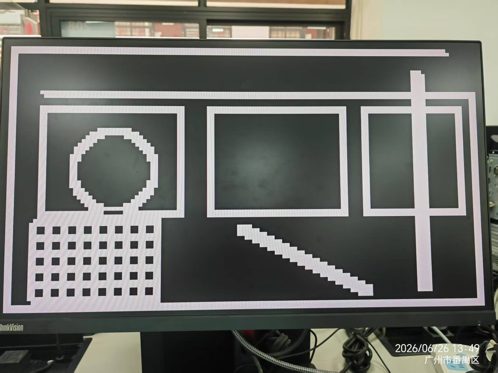

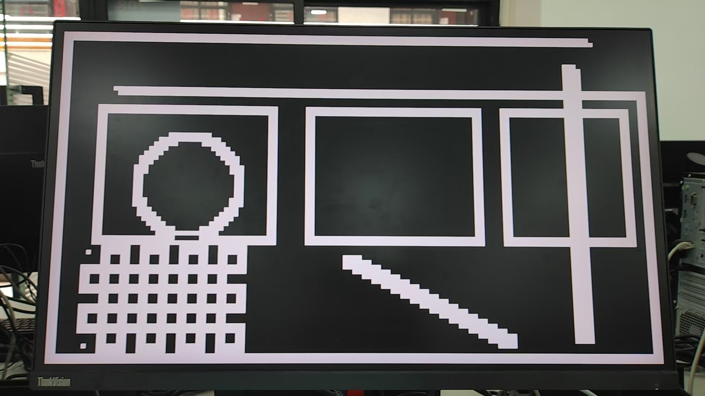

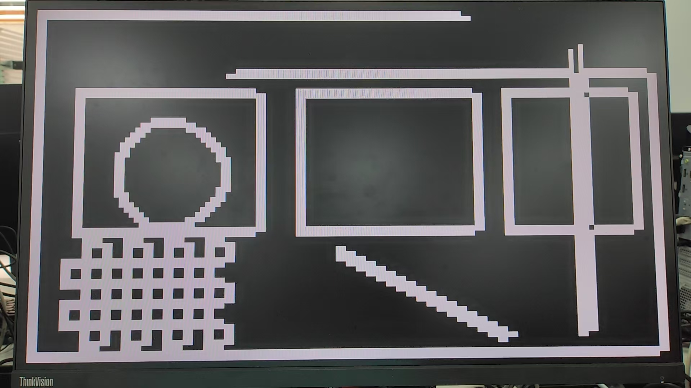

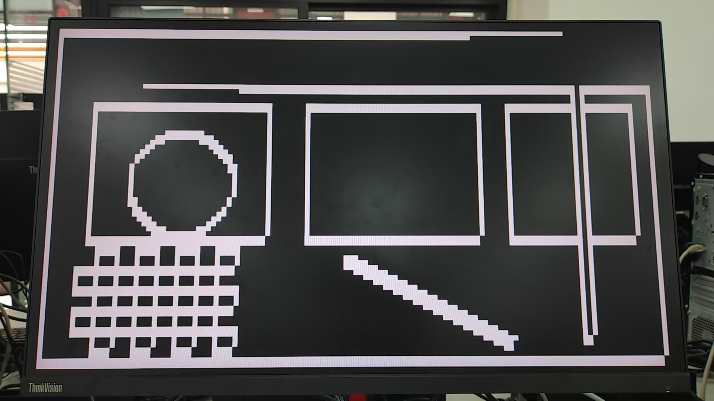

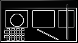

## 不同阈值对比实验

阈值 = 40 / 60 / 80 下的 Sobel/Prewitt/Laplacian/Roberts 对比：

结论: 阈值越低检测边缘越多(噪声也多) | Sobel/Prewitt 表现最均衡 | Laplacian 细节最丰富但噪声最大 | Roberts 对角线响应突出

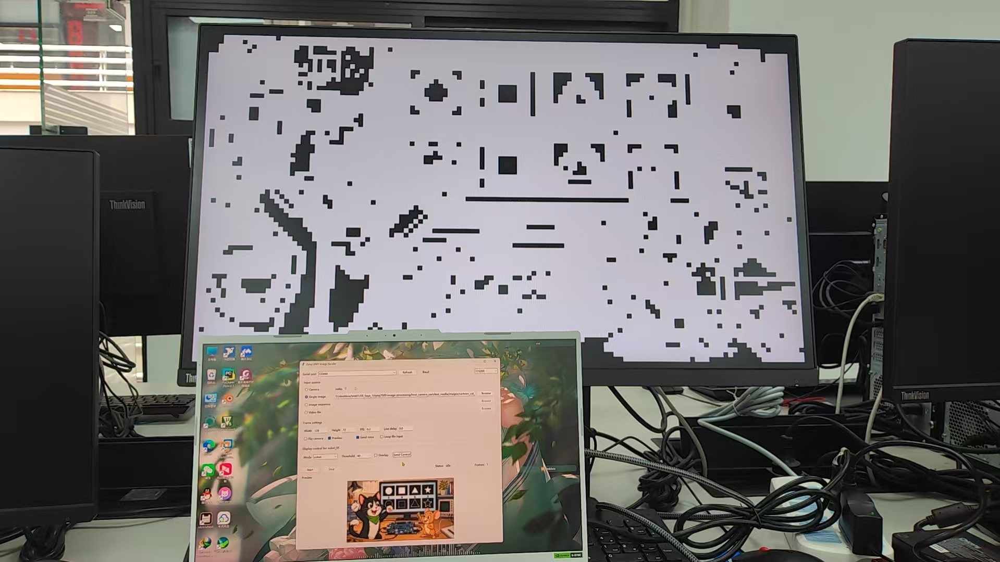

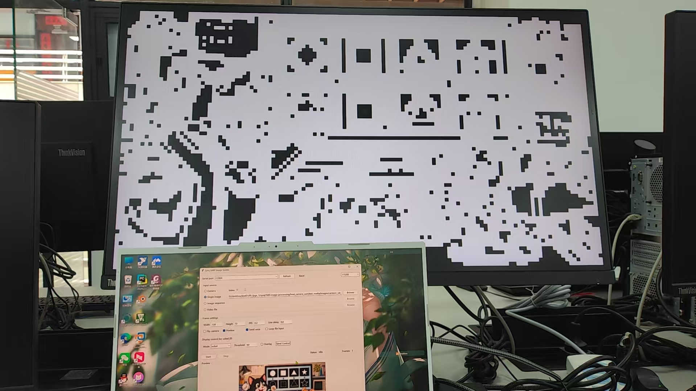

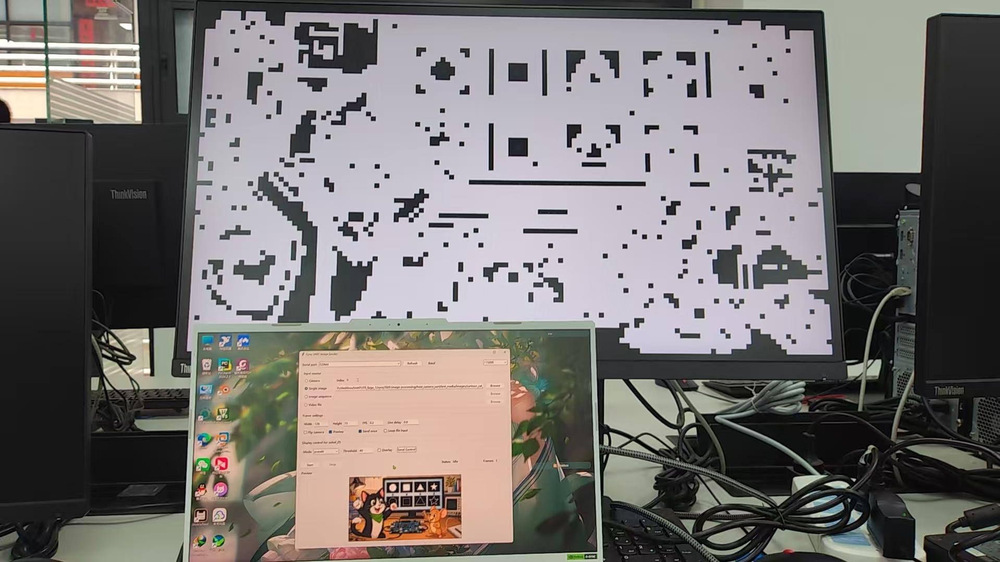

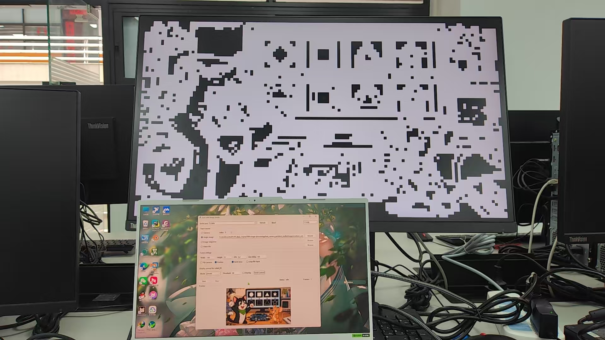

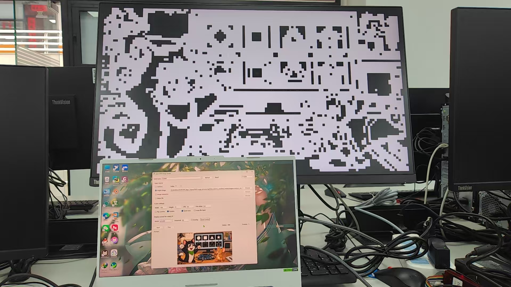

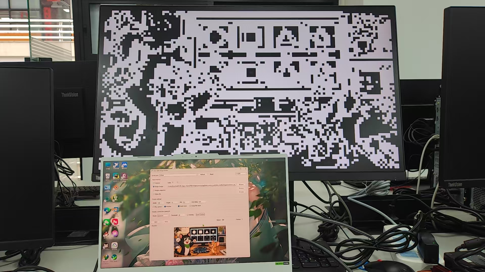

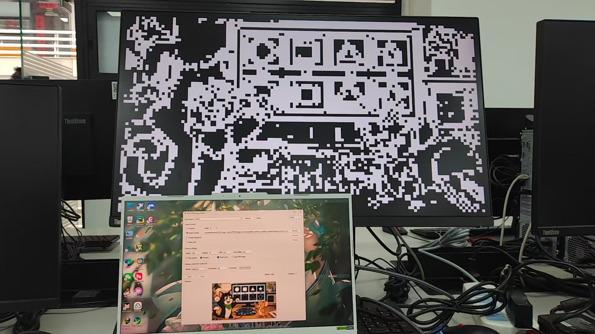

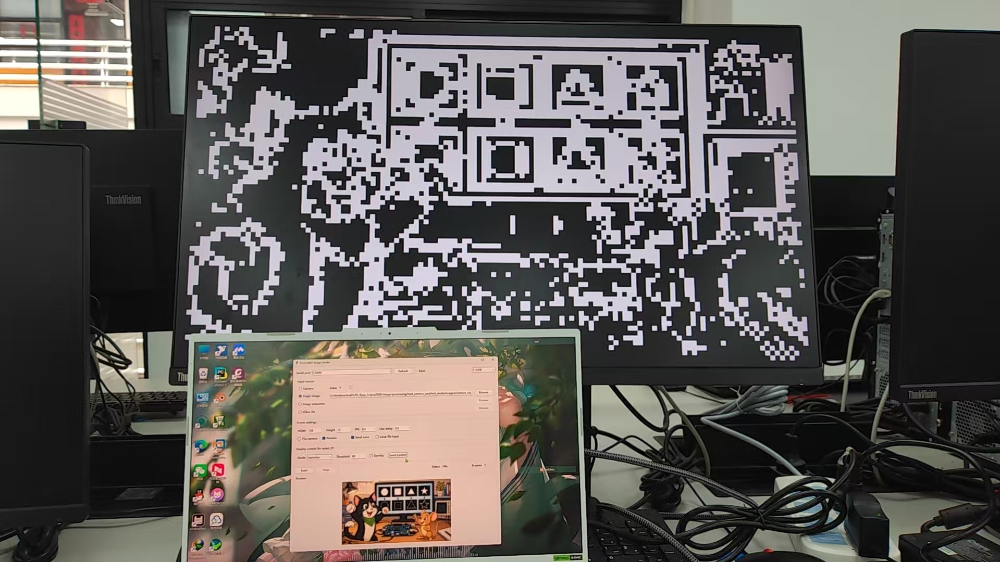

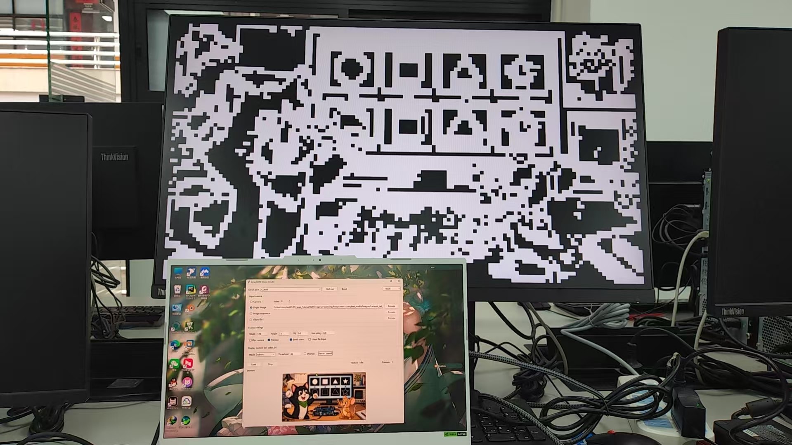

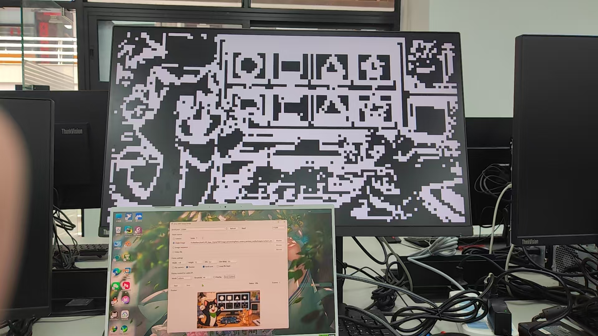

## 资源利用率分析

各算法资源消耗特点：
- Sobel: 2 个 12-bit 乘法器 (中心权重 2x)，2 条 Line Buffer (128 x 8bit)
- Prewitt: 无乘法器 (均匀权重，纯加减)，2 条 Line Buffer，节省约 4 个 DSP Slice
- Laplacian: 4x 乘法用左移 2 位替代 (无 DSP)，仅需 5 个寄存器 (非 9 个)
- Roberts: 最简核 (2x2)，仅需 1 条 Line Buffer，10-bit 寄存器 (最窄)，资源消耗最少

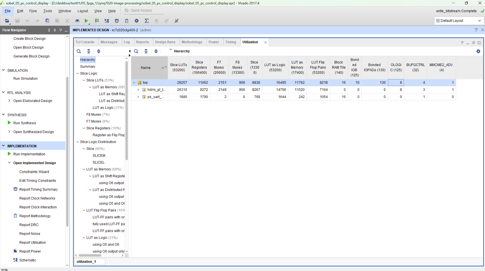

## 时序分析

综合结果：WNS (最差负裕量) > 0ns，TNS (总负裕量) = 0ns，WHS (最差保持裕量) > 0ns。时序完全满足，无违例。

分析：四个算法核并行但完全独立，各核不共享时序路径；关键路径未受影响 (BRAM 读取 → 梯度计算 → 寄存器)；新增逻辑仅增加扇出，不增加组合逻辑深度；视频时钟 (148.5MHz) 充裕满足 720p@60Hz HDMI 要求。

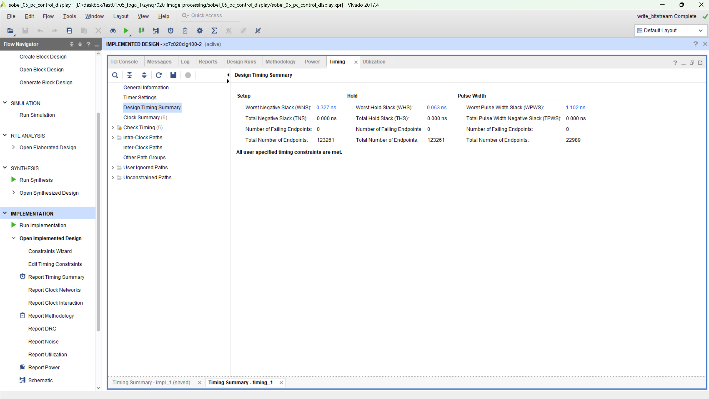

## 上板演示效果 — 四算法边缘检测对比

各算法上板效果分析 (Threshold=80)：
- Sobel: 边缘最均衡，水平/垂直/对角均有良好响应，噪声控制最佳
- Prewitt: 与 Sobel 相似但整体强度略低，边缘更平滑，适合均匀纹理场景
- Laplacian: 二阶微分捕捉最丰富细节，但对噪声敏感，高阈值效果更好
- Roberts: 2x2 核对 45 度对角边缘响应最强，但边缘不连续，适合特定角度检测

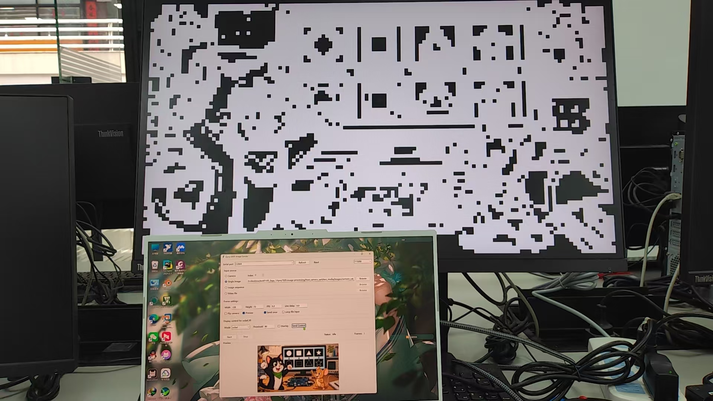

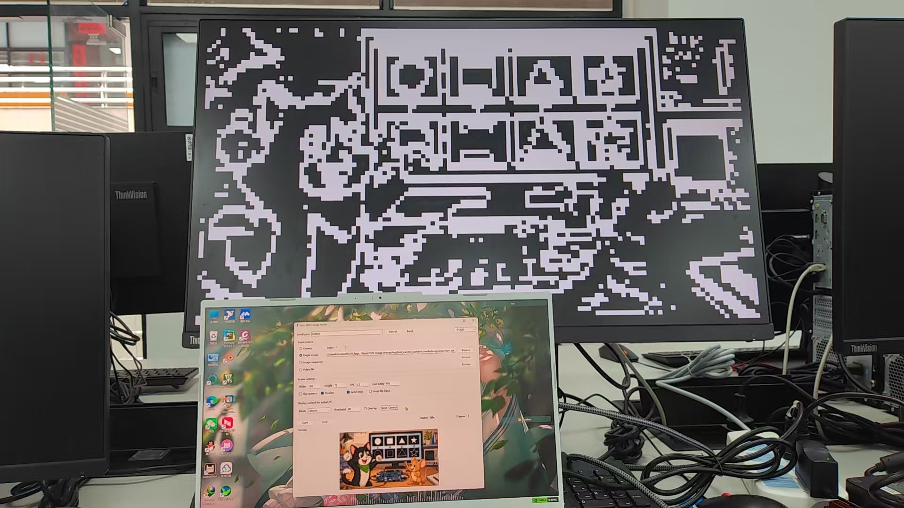

## 遇到的问题与解决方案

1. Prewitt 边缘幅度偏低 (去除 2x 中心权重后响应比 Sobel 低约 19%) → 降低阈值以适配
2. Laplacian 噪声敏感 (二阶微分放大高频噪声) → 提高阈值 (>80)，利用零交叉特性
3. Roberts 边缘不连续 (2x2 小核仅检测对角方向) → 降低阈值，为 2x2 核局限性
4. 显示模式扩展 (原设计仅支持 2-bit 模式 0-3) → display_mode 扩展为 [2:0]，掩码改为 0x07
5. 多核并行等待 → 状态机增加 4 核 frame_done 与逻辑
6. BRAM 资源增长 (4 个边缘缓冲区 + RGB 缓冲区) → 合理分配 BRAM36/BRAM18

## 总结与展望

项目成果：
- 新增 3 种边缘检测算法核心 (prewitt_core/laplacian_core/roberts_core)
- 4 算法并行处理架构，共享灰度转换，零延迟切换
- 显示模式扩展至 7 种 (3-bit display_mode)，上位机全功能控制
- 完整验证流程: RTL 仿真 (9 项全通过) + Python Golden 对比 + 上板验证
- 定量分析: 四算法相关系数均 >0.98，MAE <10
- 资源优化: Prewitt/Roberts 零 DSP 消耗，Laplacian 移位替代乘法
- 时序达标: 无违例，满足 720p@60Hz HDMI 输出

达到 A 级评分标准：3 种新算法 + 上板演示 + Golden 对比 + 资源时序分析

不足与展望：
- 无分屏对比功能（同时显示两种算法结果）
- 新算法未实现彩色边缘叠加模式
- Laplacian 噪声敏感问题未完全解决
- 未来：增加分屏/画中画对比显示，引入高斯预滤波，探索 Canny 等更高级算法
