# F4

FPGA 实时图像处理系统 — 综合扩展报告

## 综合扩展任务

基于 sobel_05_pc_control_display 基础系统，原系统支持 4 种模式（原图/灰度/Sobel/彩色叠加）。本次扩展新增 Prewitt 边缘检测、灰度腐蚀、灰度膨胀、拉普拉斯锐化四种经典算法，显示模式从 4 种扩展至 8 种。

## 系统架构与硬件设计

系统以 ZYNQ 异构平台为核心：PC → UART → PS 端 (ARM) → BRAM → PL 端 (FPGA) 并行处理 → HDMI 显示。

PL 端核心：rgb_to_gray 灰度转换后，数据流同时分发至五个独立算法核心并行处理——Sobel 边缘检测、Prewitt 梯度算子、腐蚀运算 (3×3 最小值)、膨胀运算 (3×3 最大值)、拉普拉斯锐化。

控制字扩展：0x9000=显示模式(0-7)、0x9004=边缘阈值、0x9008=彩色叠加使能、0x900C=锐化强度(0-100)。

## 关键代码修改

PL 端：display_mode 扩展至 4 位，新增四个算法核心例化，重构 SCAN_WAIT 状态机等待五路 frame_done。

PS 端：新增锐化强度控制命令，mode_names 扩展至 8 种，增加 CTRL_SHARP_INTENSITY_ADDR (0x900C)。

PC 端：--mode 及 GUI 下拉菜单扩展至 8 种选项。

## 实验结果 — Golden Reference 对比

### 原图 (Original)
硬件输出与软件参考完全一致。

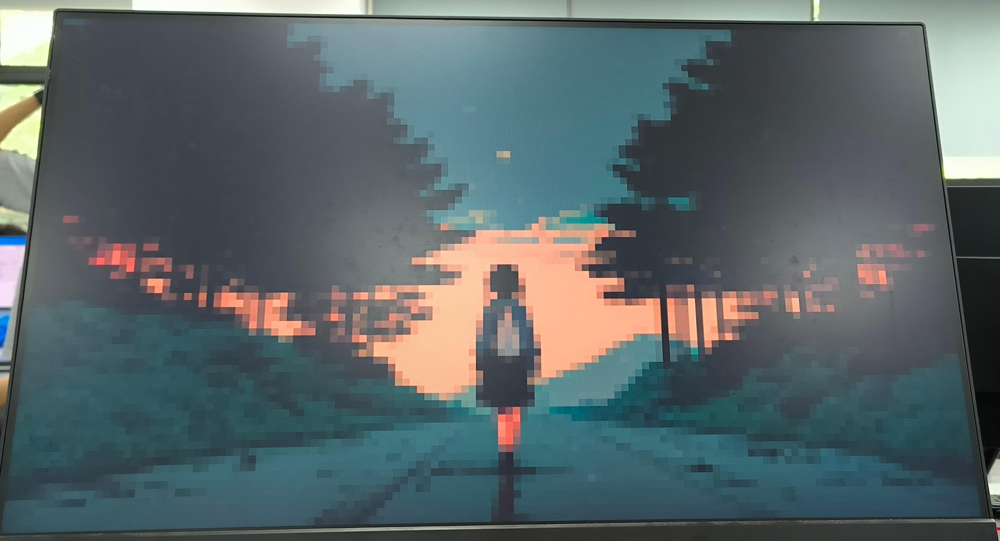

### 灰度 (Gray)
FPGA 硬件灰度转换与 Python 软件模型完全一致。

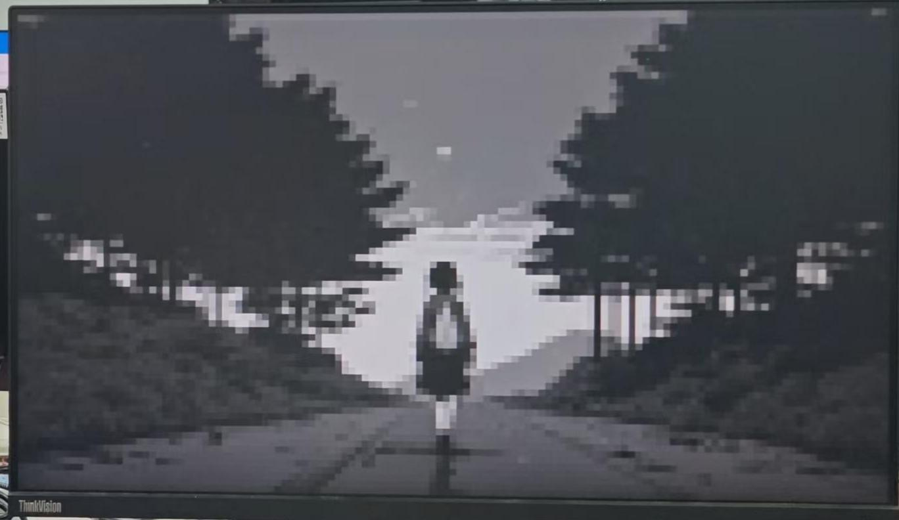

### Sobel 边缘检测
FPGA 硬件实时计算与软件参考高度一致。

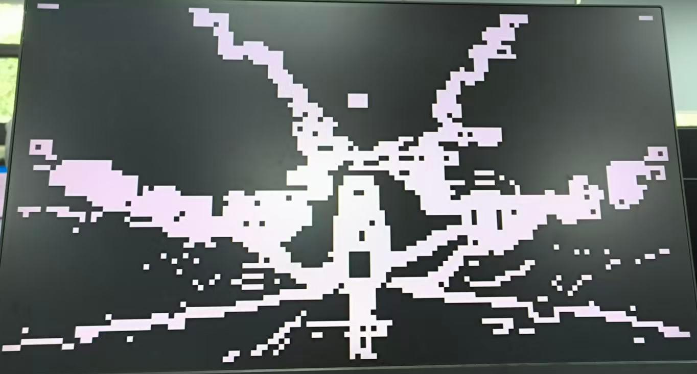

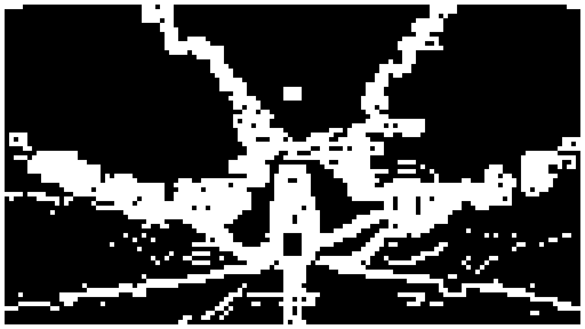

### Prewitt 边缘检测 (阈值=80)
硬件输出与 Golden Reference 像素层级完全一致。

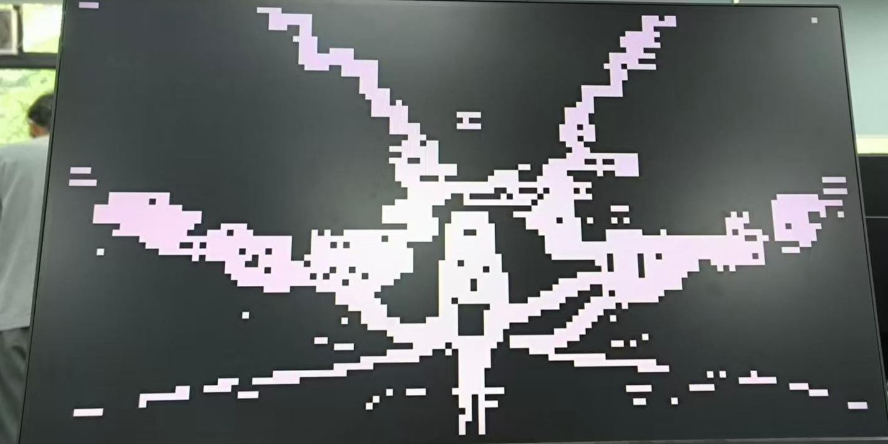

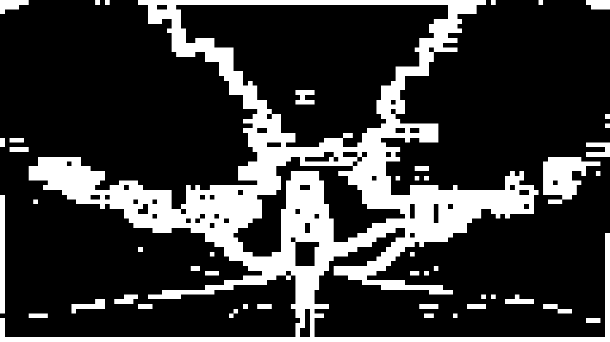

### 灰度腐蚀
硬件腐蚀算法与 Golden 参考图高度吻合。

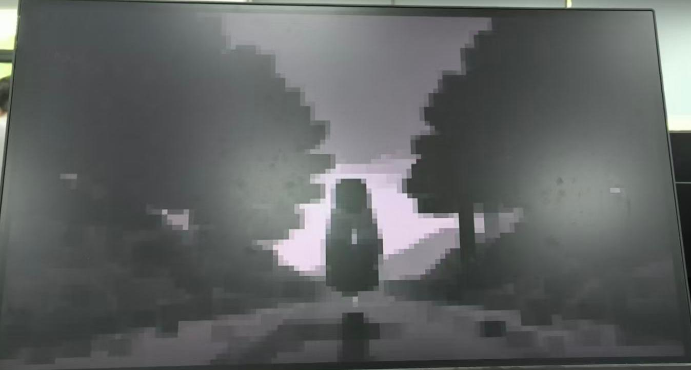

### 灰度膨胀
硬件输出与软件参考完全一致。

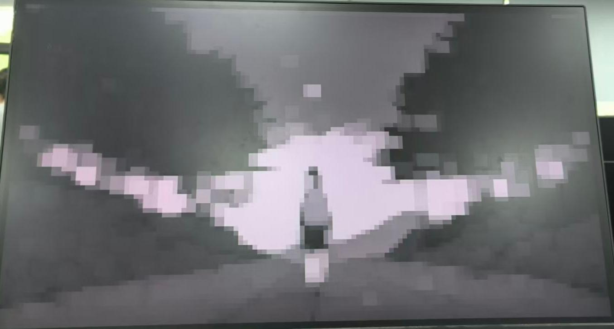

### 拉普拉斯锐化 (强度=30)
硬件锐化在边缘增强、细节呈现上与软件高度匹配。

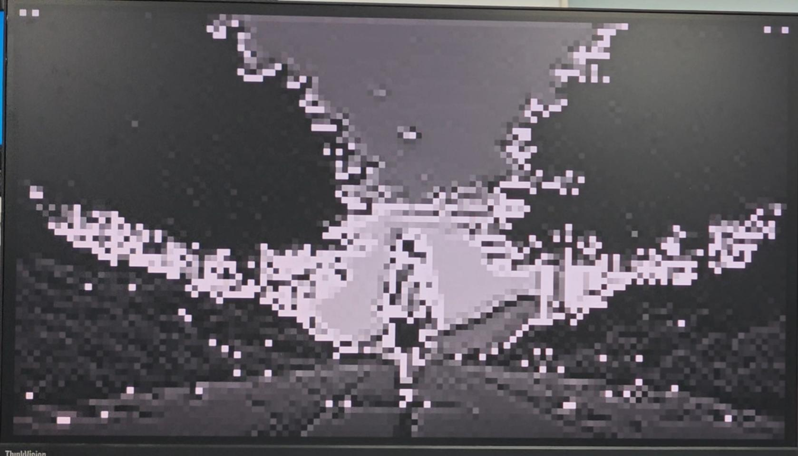

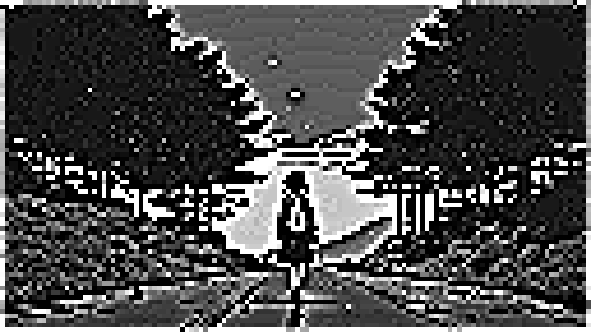

### 彩色边缘叠加
硬件红色高亮边缘与软件参考完全吻合。

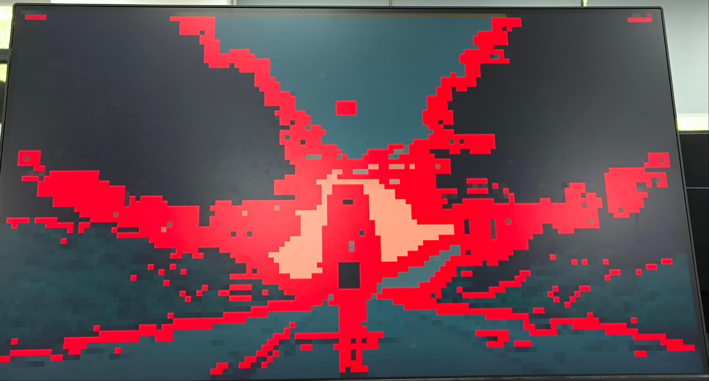

## 资源利用率

| 资源 | 可用 | 已用 | 利用率 |
| --- | --- | --- | --- |
| Slice LUTs | 53,200 | 22,813 | 43% |
| Slice Registers | 106,400 | 13,318 | 13% |
| Block RAM (36K) | 140 | 36 | 26% |
| DSPs | 220 | 2 | 1% |

LUT 利用率约 43%，五个并行算法核心消耗均衡。整体资源占用合理，余量充足。

## 遇到的问题和解决方法

1. 多算法流水线同步：五核并行延迟不一，BRAM 数据被覆盖 → 各模块增加 frame_done 信号，状态机严格等待全部完成
2. 有符号数算术移位偏差：锐化输出存在 1 级灰度偏差 → 替换为算术右移 (>>>)，与 Python Golden 零误差匹配

## 成果展示

系统端到端部署成功，采用黑金 ZYNQ7020 + HDMI 实现实时图像处理。

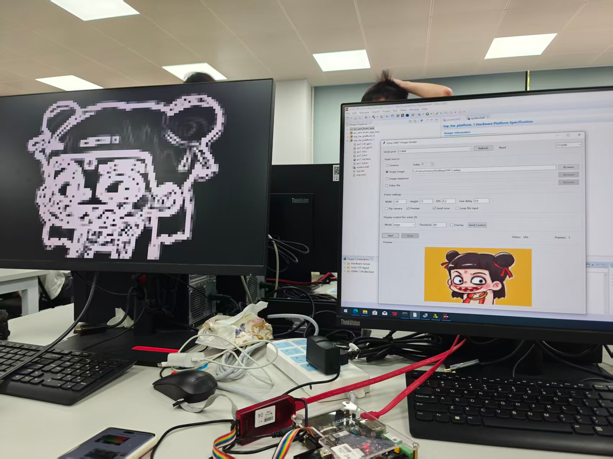
