# MFGA

FPGA 图像处理模块更新详解

本次更新内容：新增 Prewitt 算法、新增锐化算法、上位机 UI 优化。

## Prewitt 算法 — 与 Sobel 对比

Prewitt 与 Sobel 原理类似，核心区别在于卷积核的权重：Prewitt 采用均匀权重，Sobel 引入距离加权（中心像素权重更高），使得 Sobel 算子相当于在 Prewitt 基础上增加了平滑步骤，对噪声有更好的抑制效果。

采用临界值 (二值度 200) 的灰度梯度图进行对比：

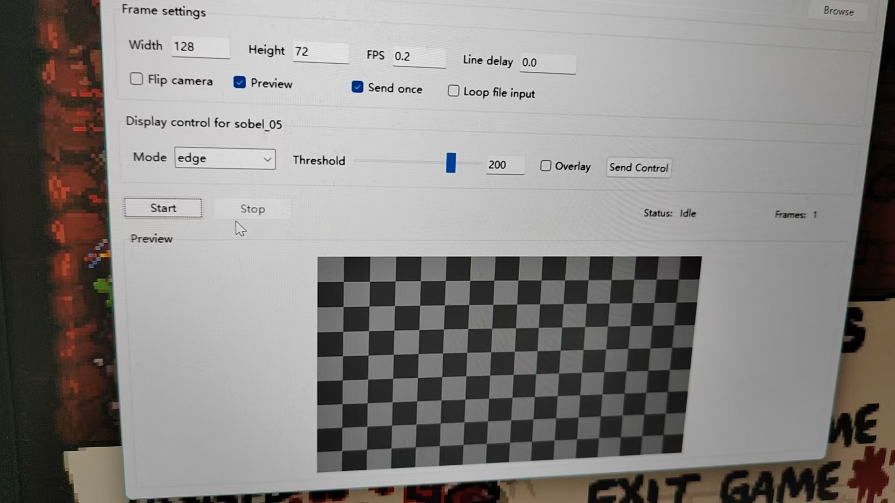

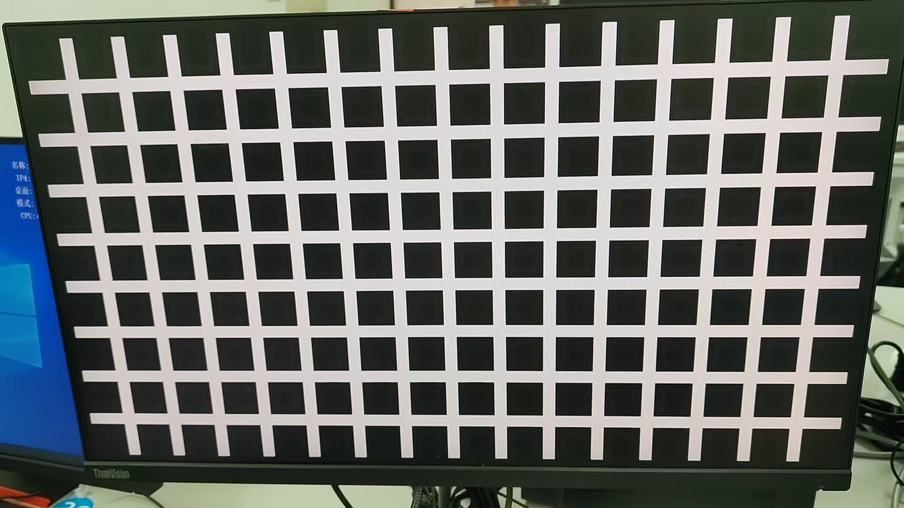

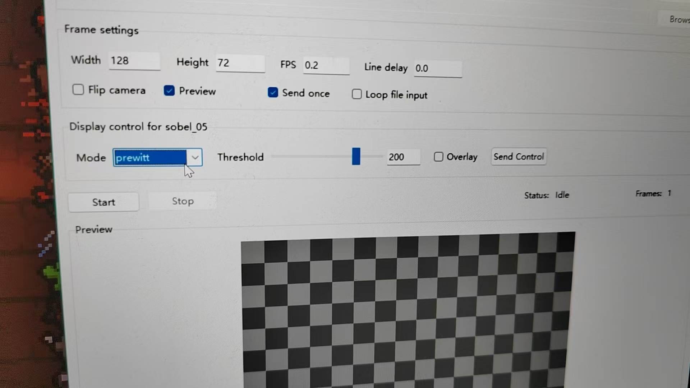

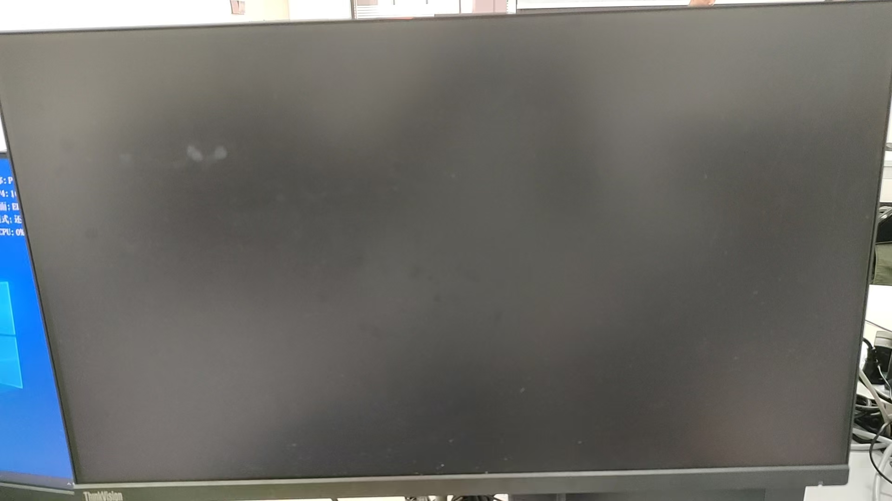

## 锐化算法展示

锐化强度 0.0 / 80 / 255 的图像对比：

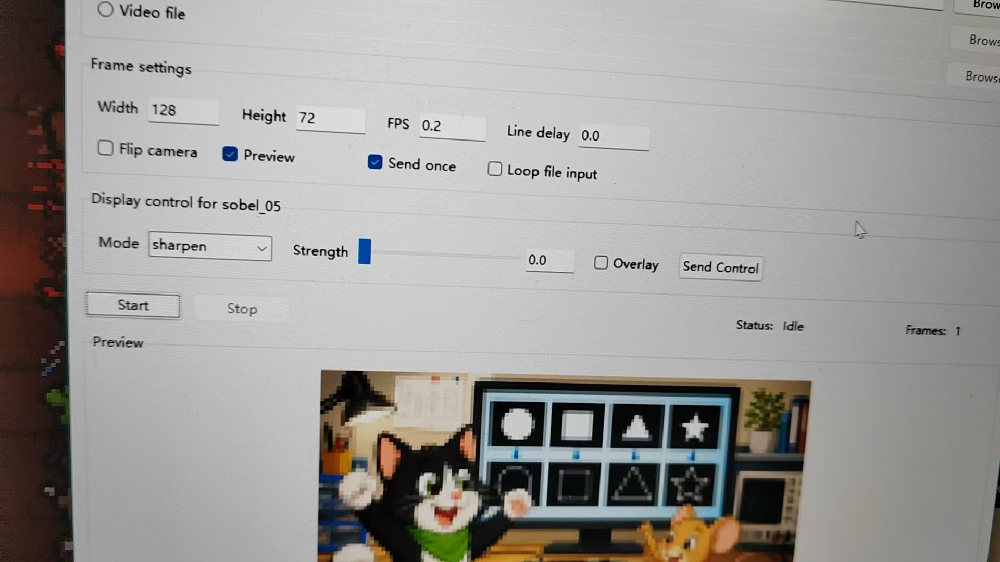

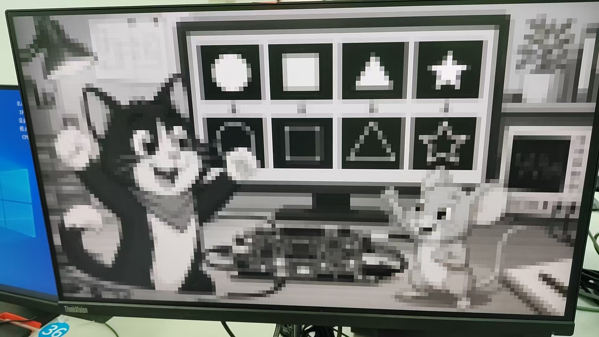

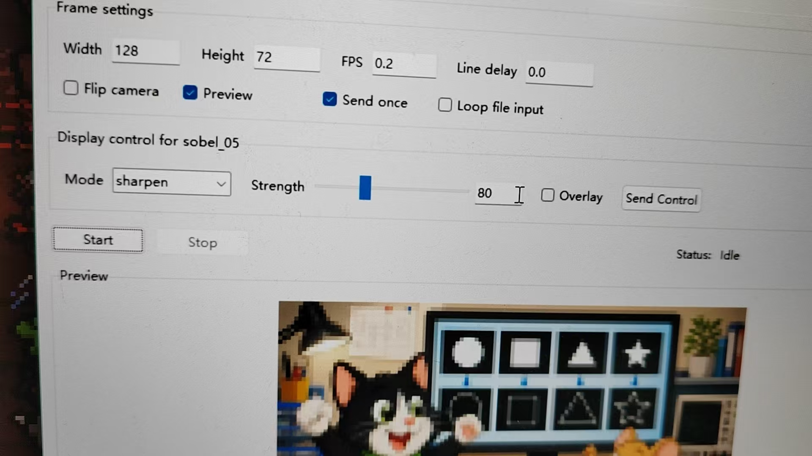

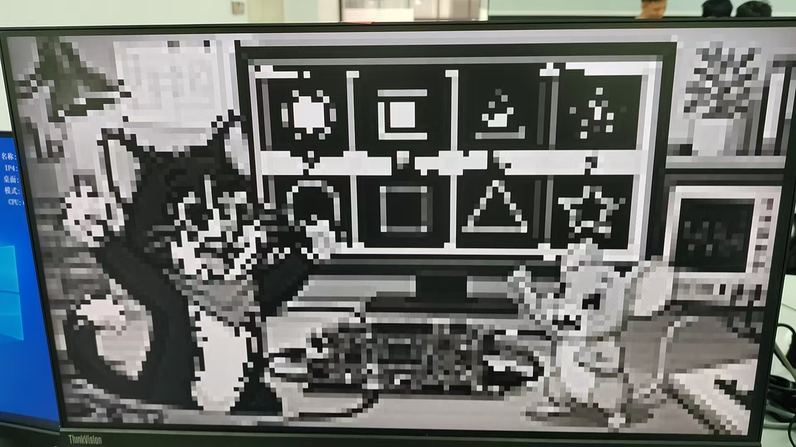

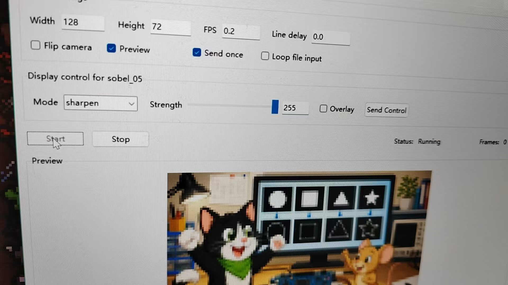

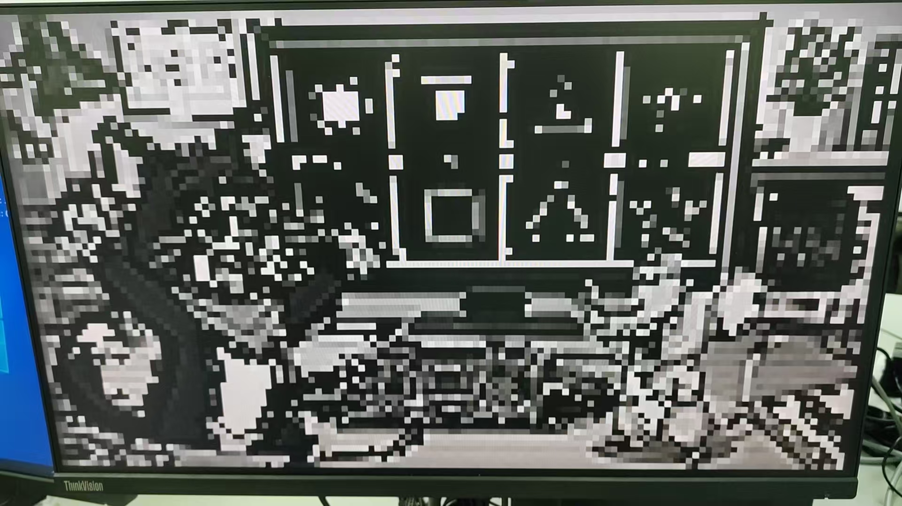

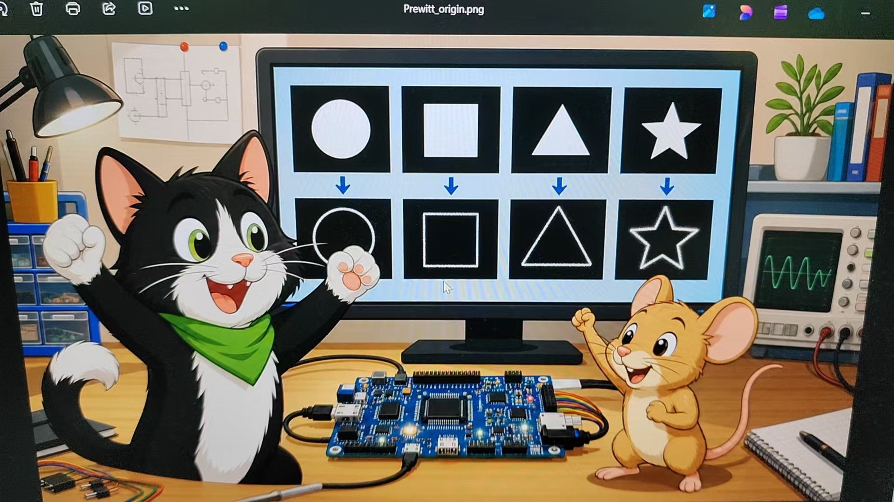

## 上位机 UI 优化

新增两个 Mode 选项 (Sharpen 和 Prewitt)，新增手动数值输入框解决拖动条无法准确调节参数的问题。
