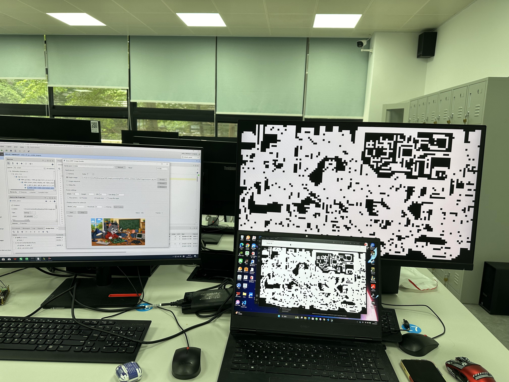
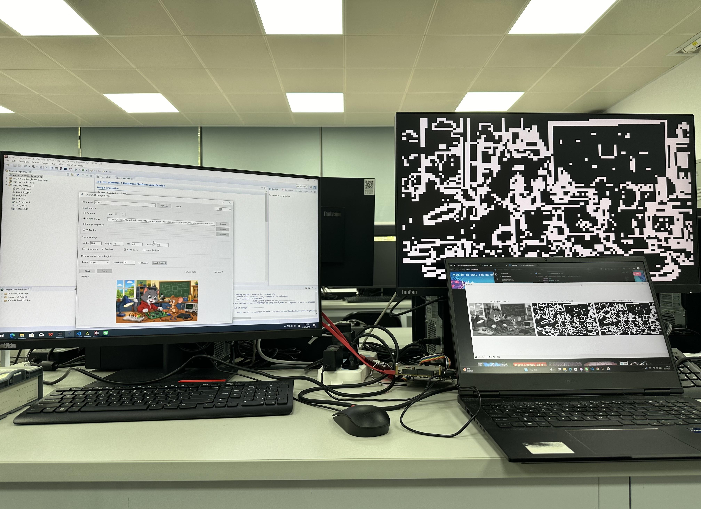
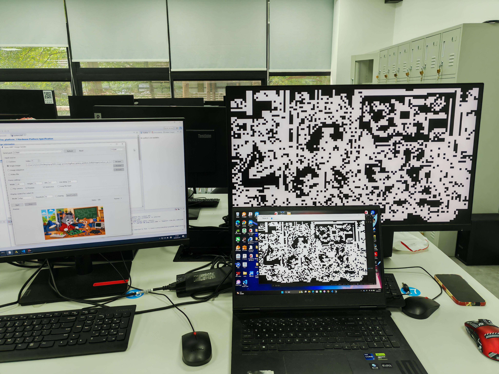

# SSR

基于 ZYNQ 的多算法边缘检测系统扩展

## 项目背景与扩展目标

依托 ZYNQ 异构平台，在原有 Sobel 边缘检测基础上，扩展构建支持多种经典边缘检测算法的统一框架（Prewitt、Laplacian、Roberts），通过 PC 端上位机交互实现算法参数的动态配置与处理结果的实时切换。

## 系统实现原理

信号流：PC 选择算法 → UART 发送指令 → PS 解析与控制 → FPGA 动态切换 (Sobel/Prewitt/Laplacian/Roberts) → HDMI 实时显示。全流程无需重新配置硬件，实现"即选即显"。

FPGA 硬件层：三个算法模块统一接口，通过 MUX 实现四种算法硬件级实时切换 (2-bit algo_sel)：2'b00=Sobel, 2'b01=Prewitt, 2'b10=Laplacian, 2'b11=Roberts。

PS 端：扩展 UART 通信协议，新增 Algorithm 控制命令。

## 实验结果

阈值 50 下 FPGA 实现结果与 Python Golden Reference 标准结果对比。

实验结果表明 FPGA 硬件加速实现的边缘检测效果与软件标准结果高度一致。

## 总结

- 集成四种经典边缘检测算法于单一硬件平台
- 模块化设计：统一接口 + 独立封装
- 软硬件协同控制，PC-FPGA 低延迟交互
