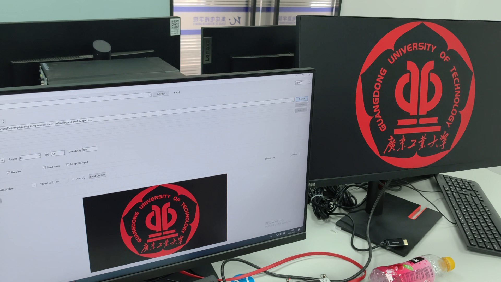
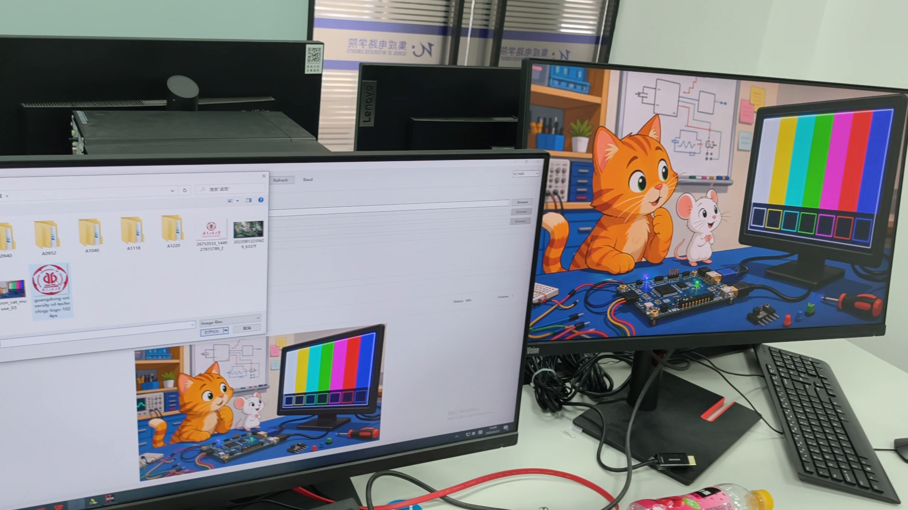
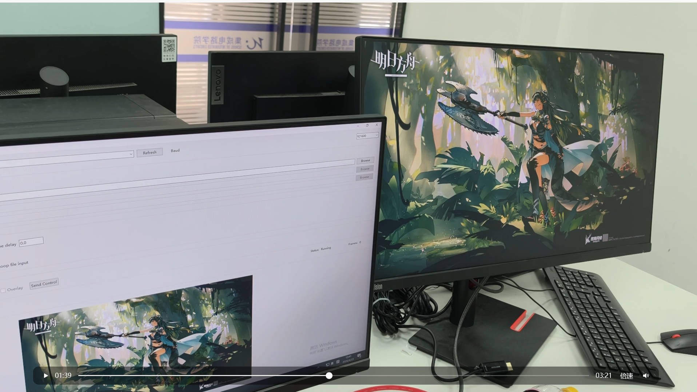
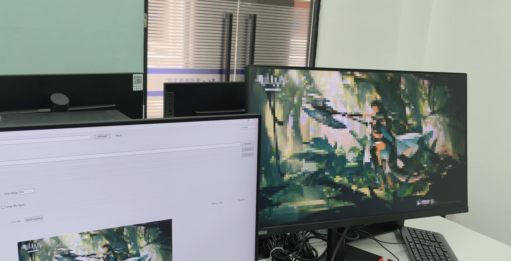
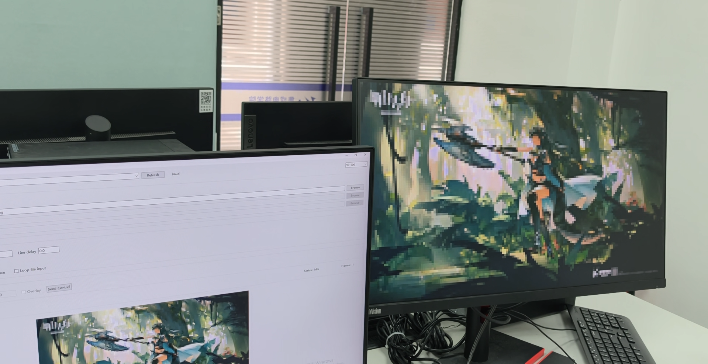
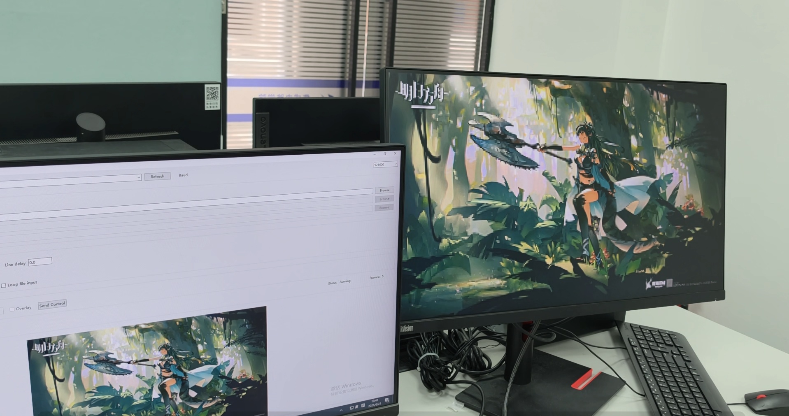
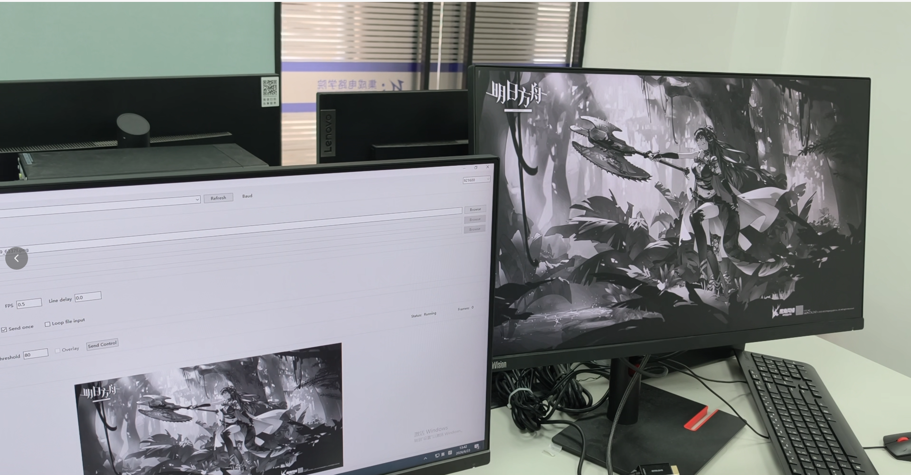
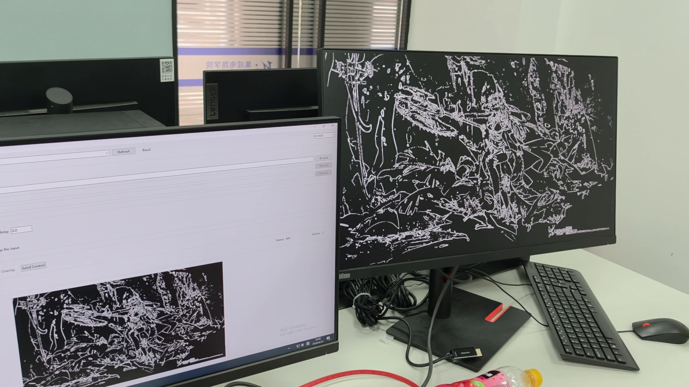
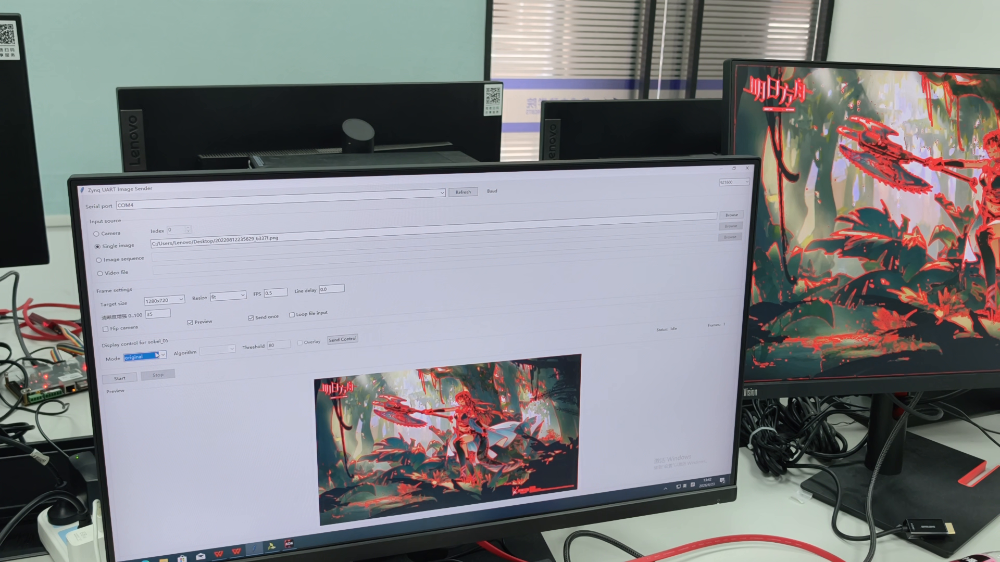

# Sweet&Steve

ZYNQ7020 图像处理综合扩展 — 拓展 1 与拓展 3

多图片与多像素规格传输 | 多算子图像处理

## 整体链路

PC 输入 → 帧封装 (缩放 + RGB565) → UART → PS/BRAM → PL 算子 (窗口复用 + MUX) → HDMI

拓展 1 (输入侧)：不同图像内容和像素规格统一为固定协议数据帧。
拓展 3 (算法侧)：PL 端对同一图像执行不同算子处理，通过 ALGO 与 MODE 控制输出。

## 拓展 1：多图片与多规格传输

实现原理：OpenCV 读取 → 尺寸归一 → BGR→RGB → RGB565 → UART 发送。像素格式 RGB565 (16 bit/像素)。

### 换图片示例

输入 A (校徽 Logo)、输入 B (测试彩色图)、输入 C (高分辨率图像)：链路过保持不变。

### 换像素规格示例

160/256/320 规格验证传输与放大显示；1280×720 写入 DDR，VDMA 读取输出。

## 分级实现

低分辨率 (UART + BRAM)：128×72~320×180，上位机缩放→UART→PS→BRAM→PL→HDMI。
高清 (UART + DDR + VDMA)：1280×720 RGB565 约 1.84 MB，DDR 帧缓存 + VDMA 连续读出。

## 控制协议

0xA5 0x5A cmd value，命令：MODE/RES/THR/ALGO (Sobel/Prewitt/Laplacian/Mean/Sharpen/Binary/Erosion)。

## 拓展 3：多算子并行

共享 3x3 像素窗口，各算子复用同一窗口数据。优势：新增算子只增加计算逻辑，不重复建立行缓存。

### 算子输出效果

## 总结

拓展 1 + 拓展 3 协同，控制协议统一连接，实现图像传输与算子处理的完整闭环。
