# 你跑不过我，你信不信

Zynq7020 PL 图像处理扩展 — 基于 Sobel 框架的增量扩展

## 项目背景

基于 Sobel 灰度图像处理工程，在不重构 PS-PL 协议的前提下，最大化 PL 端并行计算潜力。新增四类算法：Prewitt 边缘检测、固定阈值二值化、3×3 形态学腐蚀、3×3 形态学膨胀。

## PL 底层子模块

| 模块 | 功能 | 设计要点 |
| --- | --- | --- |
| dilate_core | 3×3 取最大值膨胀 | 双行缓存滑动窗口，边界补0 |
| erosion_core | 3×3 取最小值腐蚀 | 与膨胀对称设计 |
| binary_threshold_core | 固定阈值二值化 | 单像素并行运算，一级寄存器 |
| prewitt_core | Prewitt 边缘检测 | 三级行缓存，并行 Gx/Gy |

统一接口：clk/rst_n/frame_start/gray_valid/gray/x/y → valid/data/x/y/frame_done

Prewitt 流水线：行缓存→移位→双方向梯度→绝对值求和(mag=|Gx|+|Gy|)→钳位(0-255)→frame_done

PL 顶层：新增 MODE_PREWITT=3'd7 + 4核并行 + SCAN_WAIT 等全部完成 + HDMI MUX 扩展

PS 端：mode_names 新增 Prewitt，CMD 合法范围 0→3 扩展至 0→7，完全向下兼容

## 实验结果

### 基础模式

原始图像 → 灰度图像 → Sobel 边缘检测 → 边缘叠加

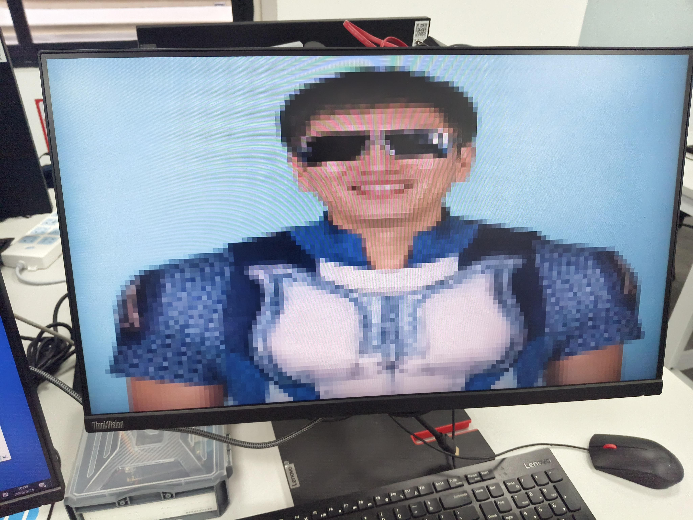

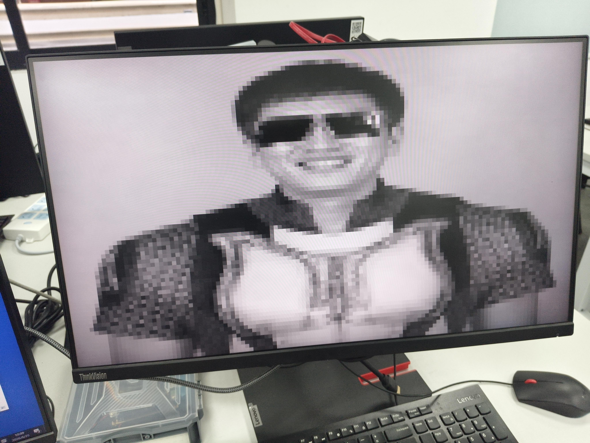

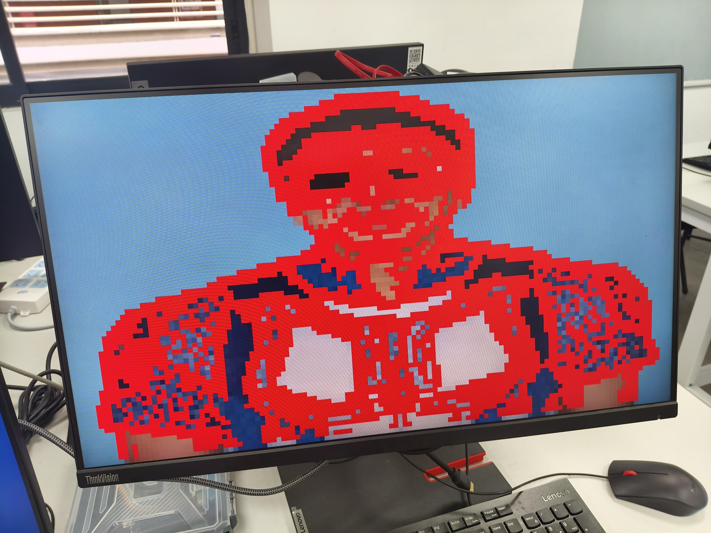

### 新增模式

膨胀 (亮部扩张) → 腐蚀 (亮部收缩) → 二值化 (黑白分割) → Prewitt 边缘检测

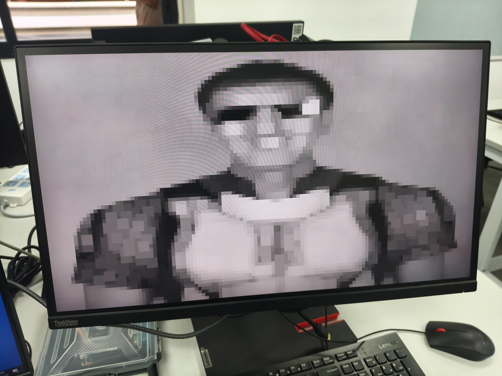

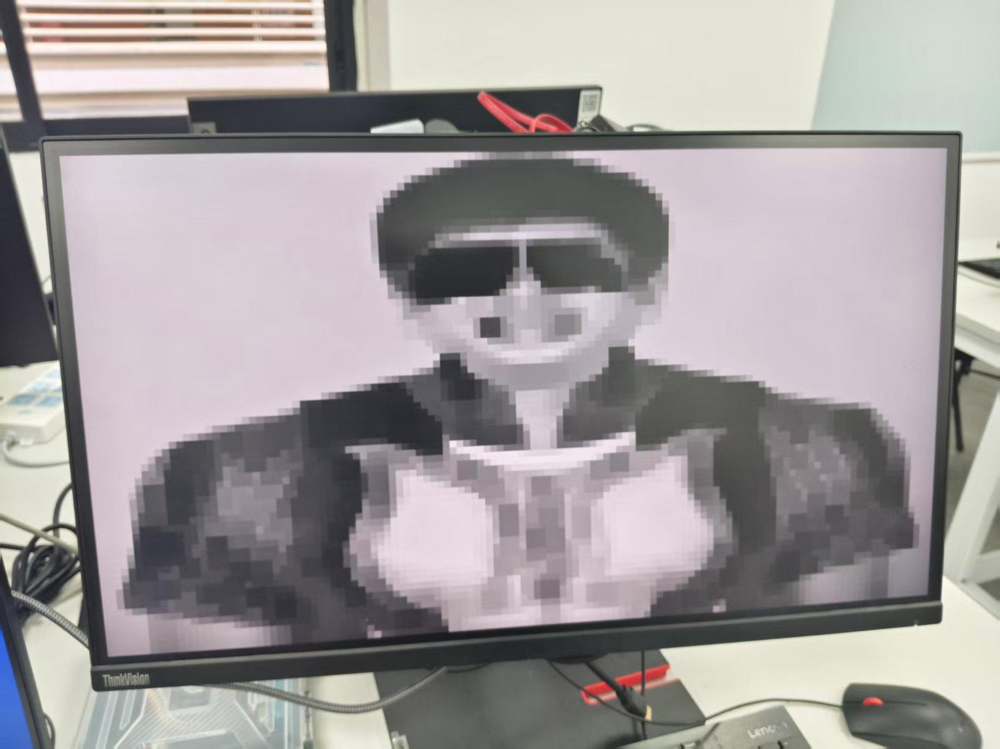

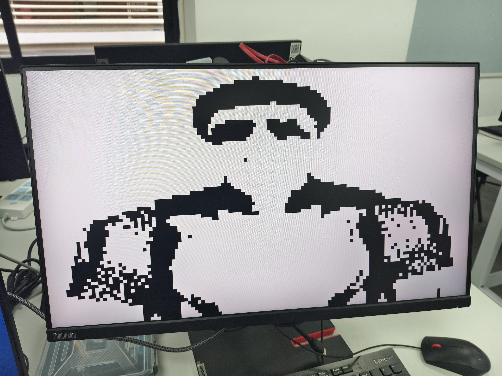

## Golden 仿真 vs. FPGA 实测

FPGA 实现与 Golden 仿真在边缘轮廓、形态学变化等关键特征上高度一致。

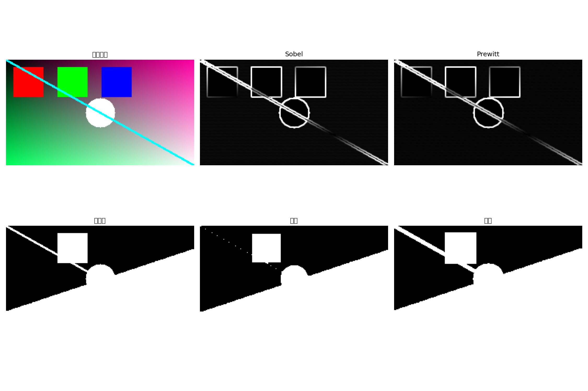

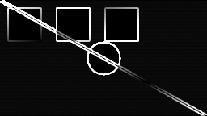

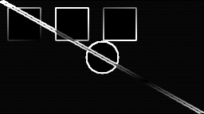

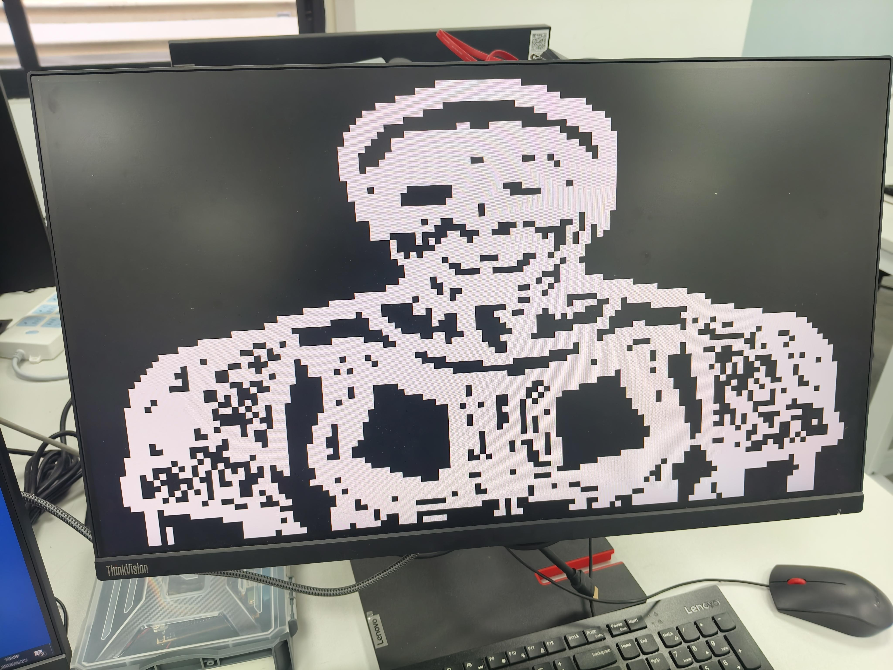

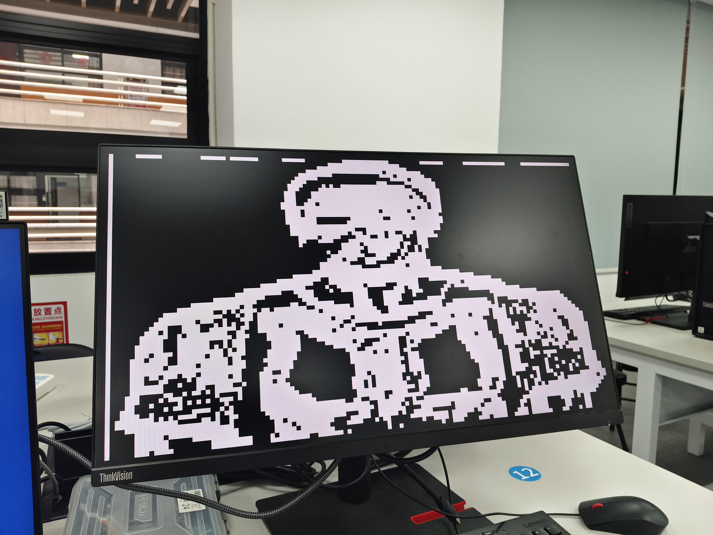

## 总结

新增 4 套 PL 硬件加速模块，顶层系统级整合，PS 端完全向下兼容。增量式扩展，最大化复用原有资源。
