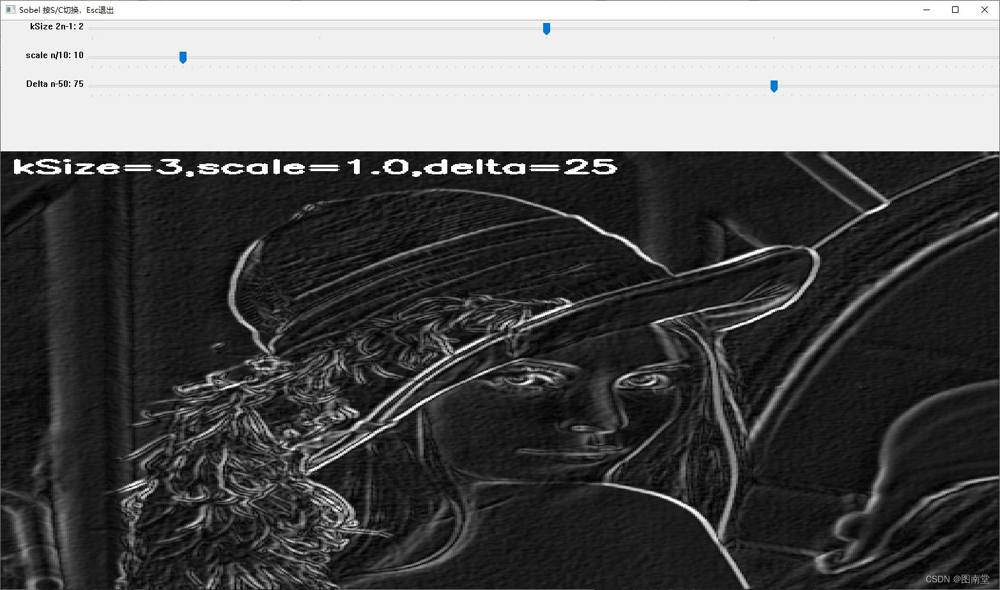
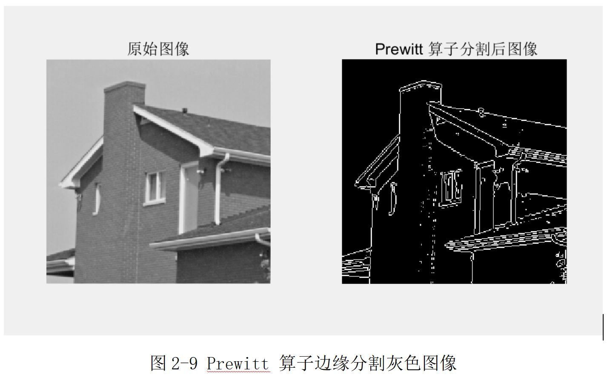
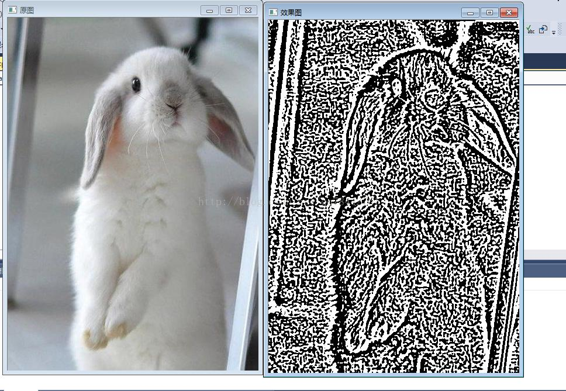
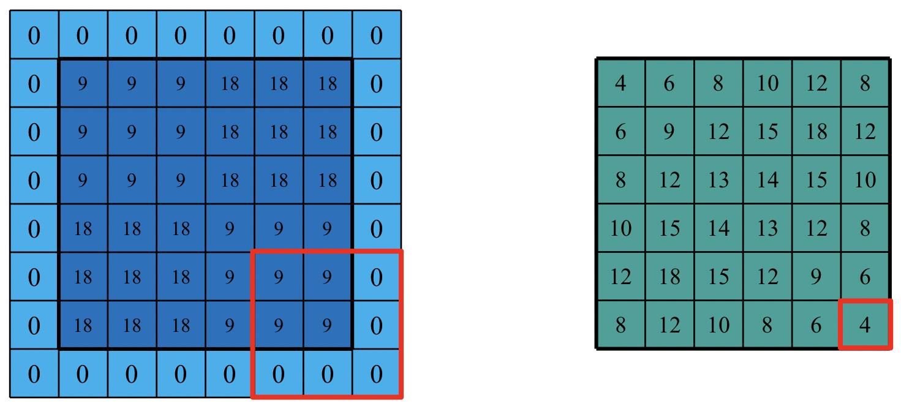
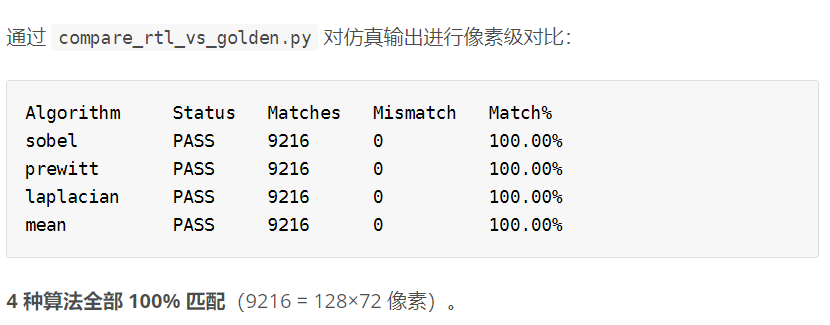

# 哈基米

基于 Zynq-7020 的多算法实时图像处理系统设计

原系统仅支持 Sobel 边缘检测。扩展任务：新增 Prewitt、Laplacian 边缘检测及 Mean Filter 均值滤波，开发 PC 端上位机 GUI 实现四种算法的实时切换。

## 系统架构

PC(GUI) → Zynq PS → BRAM(含控制) → PL(多算法并行) → HDMI 720p@60Hz

PL 端流水线：RGB 输入 → 灰度化 → 四算法核并行 (Sobel/Prewitt/Laplacian/Mean Filter) → MUX 选通输出

## 新增算法

| 算法 | 边缘强度 | 抗噪能力 | 特性 |
| --- | --- | --- | --- |
| Sobel | ★★★★☆ | ★★★★☆ | 中心加权，边缘检测基准 |
| Prewitt | ★★★☆☆ | ★★★☆☆ | 简化版一阶梯度，计算复杂度更低 |
| Laplacian | ★★☆☆☆ | ★★☆☆☆ | 二阶导数，对细微边缘敏感 |
| Mean Filter | — (平滑) | ★★★★★ | 平滑滤波去噪 |

## 关键代码修改

PL 端：新增 Prewitt/Laplacian/Mean Filter 三个核实例化，状态机从 8 扩展到 16 个状态。

PS 端：CTRL_ALGORITHM_ADDR = 0x900C，CMD_ALGORITHM (0x04) 命令解析。

PC 端：新增 Algorithm 下拉选择框。

## 实验验证

三级验证体系：Python 软件验证 → RTL 仿真 → 上板验证。compare_rtl_vs_golden.py 像素级逐点对比。

## 实验结果

四种算法处理效果对比：

## RTL 与 Golden 验证结果

| 算法 | 状态 | 匹配像素 | 匹配率 |
| --- | --- | --- | --- |
| Sobel | PASS | 9216 / 9216 | 100.00% |
| Prewitt | PASS | 9216 / 9216 | 100.00% |
| Laplacian | PASS | 9216 / 9216 | 100.00% |
| Mean | PASS | 9216 / 9216 | 100.00% |

所有算法的 RTL 仿真结果与 Python 参考模型实现 100% 像素级匹配。

## 遇到的问题

| 问题 | 解决方案 |
| --- | --- |
| JTAG 连接失败 (15MHz 过高) | 降低至 500kHz |
| 显示模式切换无响应 | 所有分支加入 algorithm 判断 |
| PC 端 GUI 缺少控件 | 扩展 Python 代码 |

## 项目成果

- 新增 3 种核心算子，4 核并行流水线
- PC GUI 动态交互控制，HDMI 720p@60Hz 输出
- 100% 像素级匹配验证通过

## 展望

AXI DMA 替代逐像素 BRAM 写入；集成高斯/中值/Canny；参数化寄存器动态配置。
