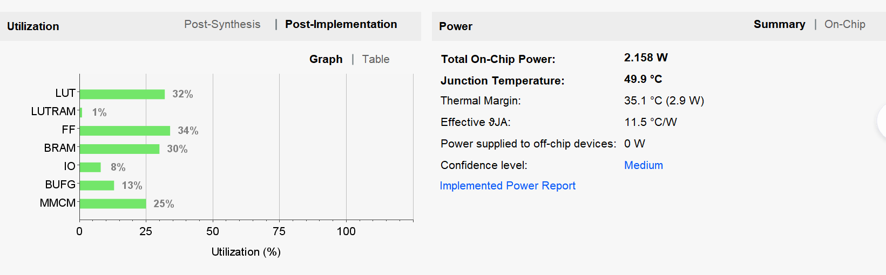
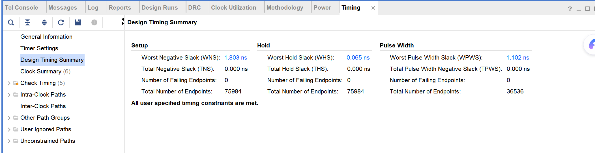

# 快跑通

ZYNQ7020 多模式图像处理系统

## 系统总体结构

数据流：PC → UART → ZYNQ PS → AXI BRAM → PL → HDMI。PC 发送 128×72 RGB888，控制命令写入 BRAM，PL 按 display_mode 选择输出。

## 显示模式扩展

从 4 种基础模式扩展为 10 种：original / gray / gauss / mid_filter / sobel / edge_overlay_red / binary / red / green / blue

新增模式：高斯滤波、中值滤波、二值化、单色红/绿/蓝显示。

关键修改：PS 端 display_mode_names[10] 映射；PL 端新增算法模块实例化及多路选择器。

## 资源利用率与时序

| 资源 | 占用率 |
| --- | --- |
| LUT | 32% |
| FF | 34% |
| BRAM | 30% |

WNS = 1.803 ns, TNS = 0.000 ns, 失败端点 = 0，时序完全收敛。总片上功耗 2.158 W，结温 49.9°C。

