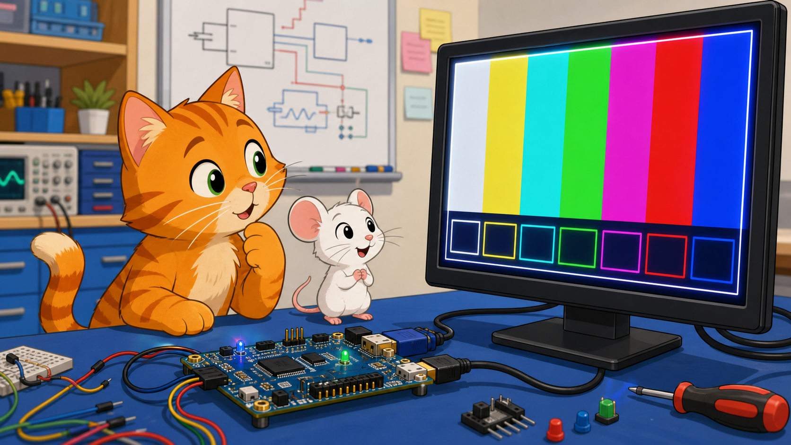
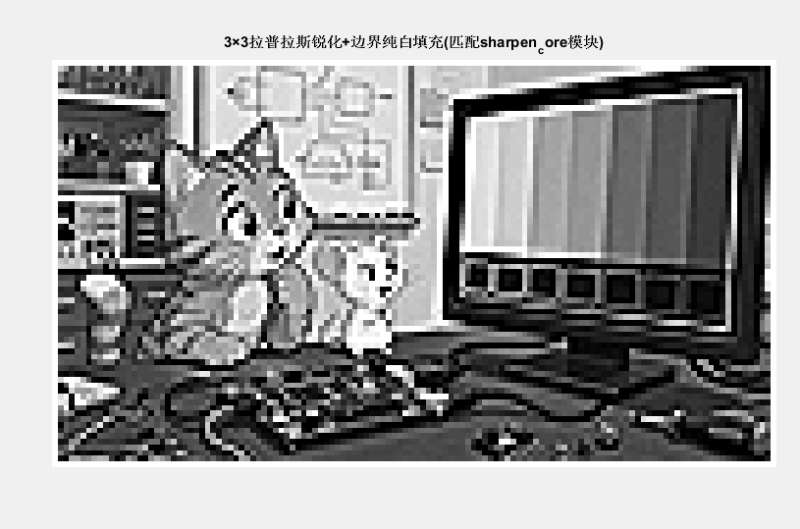
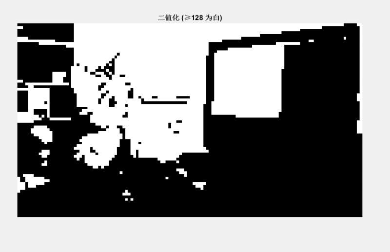
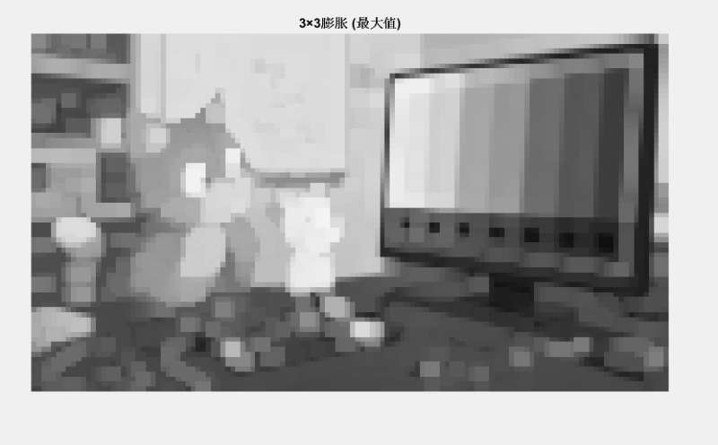
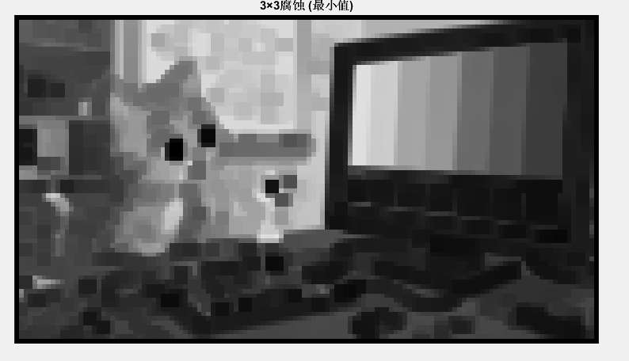

# 我草莓没招了

Sobel 边缘检测与上位机控制显示

## 实验概述与目标

基于 sobel_04 进阶，新增上位机远程控制能力，构建软硬件协同闭环：PC → PS 解析 → PL 执行。核心目标：控制流与数据流分离、模式切换/阈值控制/叠加功能、先仿真后上板的开发流程。

## 系统设计

Zynq-7000 三层架构：PC 上位机发送图像与控制命令 → PS 端接收解析写入 BRAM → PL 端实时处理 HDMI 输出。BRAM 分离为图像区和控制字区，采用 A5 5A cmd value 统一帧格式协议。

## 实验结果

多模式自由切换：原图、灰度图、边缘图、叠加图四种模式。边缘灵敏度动态调控：40/80/120 多档阈值可调。PS 端实时回显系统状态。

## 综合扩展任务：图像形态学操作

新增锐化、二值化、腐蚀、膨胀四种算法。PL 端新增 line_buffer_3x3、img_sharpen、img_dilate、img_binary、img_erode 五个模块，display_mode 扩展支持 MUX 切换。

### 实验结果

### 遇到的问题

1. 锐化后图像大面积过白 → 增加 0-255 范围限制并二次截断
2. 腐蚀/膨胀效果与预期相反 → 修正 min/max 滤波逻辑
3. 新模式切换不生效 → char 溢出改为 unsigned char

## 总结

成功实现 Zynq 软硬件协同控制系统，掌握控制流与数据流分离机制，积累了 FPGA 可配置逻辑实现的工程经验。
