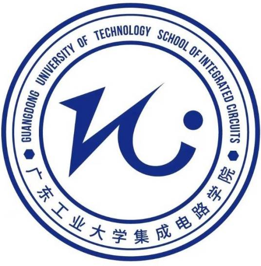

# 爱吃牛肉组

基于 FPGA 的多模式图像处理与显示系统设计 — 综合扩展任务3

## 设计方案

基于 sobel_05 新增三种算法：Mode 4=二值化(阈值128)、Mode 5=Prewitt 一阶边缘(阈值80)、Mode 6=Laplacian 二阶边缘(阈值80)。

三核心并行架构：灰度输出同时送入 sobel/prewitt/laplacian 三个核，frame_done 全部拉高后 HDMI 按 display_mode 选择输出。二值化不占独立核，直接在显示分支通过灰度比较实现。

## 算法核心

Prewitt (199行)：去掉 Sobel 的 ×2 权重，纯加减运算，`gx=-top0+top2-mid0+mid2-bot0+bot2`。零 DSP 消耗。

Laplacian (190行)：4邻域核 [0,-1,0;-1,4,-1;0,-1,0]，`laplace <= (mid1<<2)-top1-mid0-mid2-bot1`，signed [12:0] 防溢出。

二值化：直接内嵌比较逻辑，`if(display_gray>=128) white else black`。

## 代码修改

PC 端 mode_values 新增 binary/prewitt/laplacian。PL 端新增 MODE_BINARY=4/5/6，prewitt_mem/laplacian_mem 各 9216 字节，三核并行 + SCAN_WAIT 等待全部完成。

## 实验结果

## 资源分析

| 资源 | 实现 | 总量 | 利用率 |
| --- | --- | --- | --- |
| Slice LUTs | 15,779 | 53,200 | 29.7% |
| Slice Registers | 8,919 | 106,400 | 8.4% |
| Block RAM (36Kb) | 24 | 140 | 17.1% |
| DSP48 | 0 | 220 | 0% |

## 创新点

- DSP 零使用：所有卷积由 LUT 纯逻辑实现
- Block RAM 仅 17.1%，余量超 80%
- 分布式 RAM 被 Vivado 优化合并，从 480 降至 162 (缩减 66%)

问题：BRAM 从 8 增至 24 → ZYNQ7020 有 140 个 BRAM，余量充足；SDK 未启动导致黑屏。

## 完成情况

新增 2 个 Verilog 文件 (~390行) + 修改 3 个文件，7 种显示模式，全部完成 RTL 仿真 + 上板验证。

