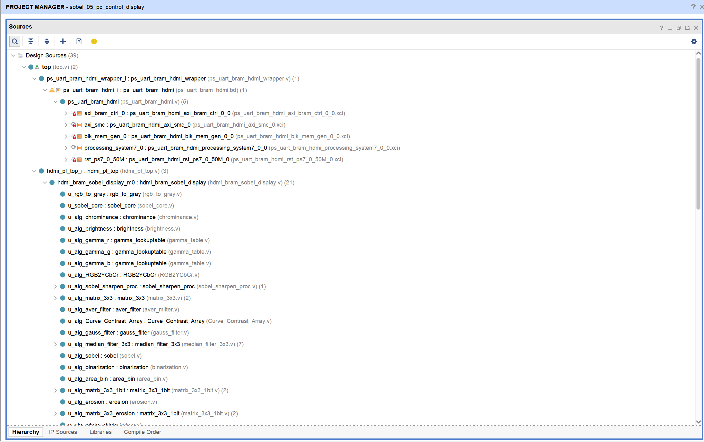
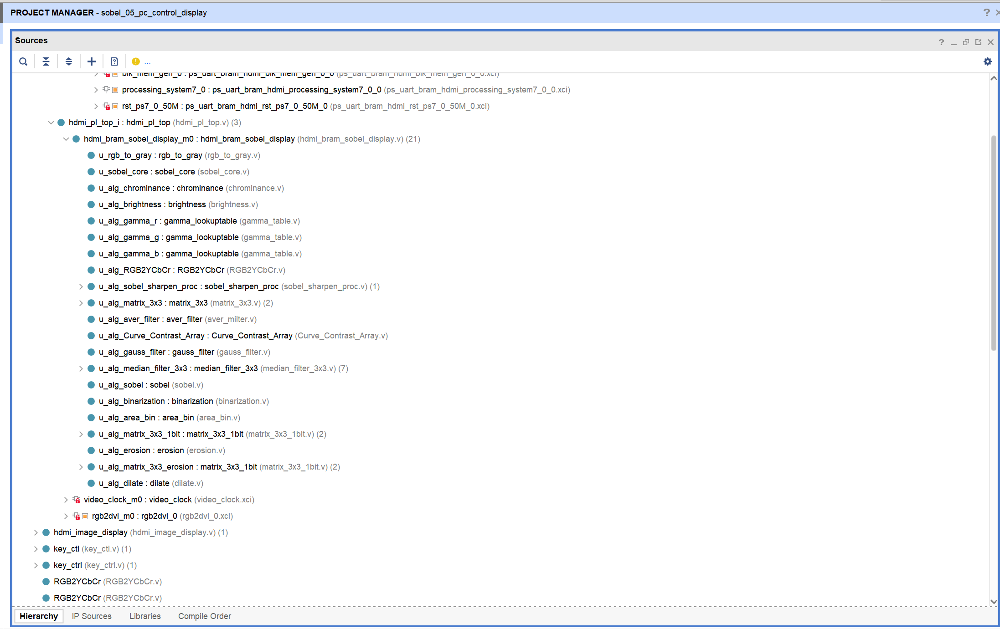
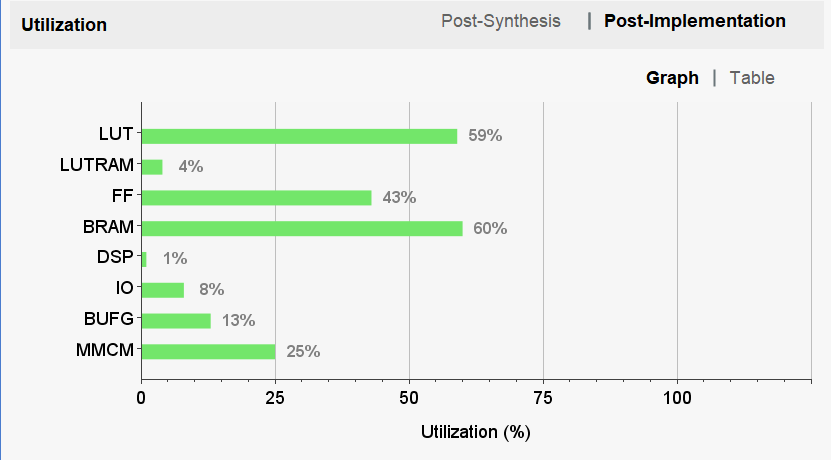
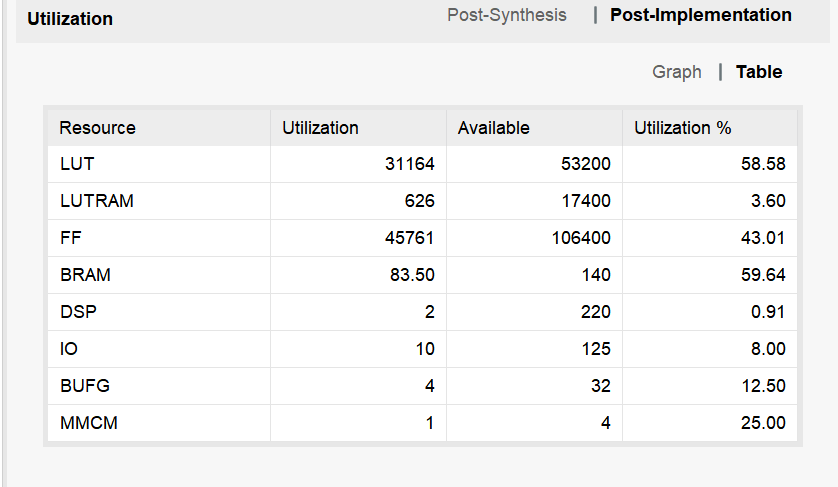

# 电平搭档

基于 ZYNQ7020 的 15 模式可切换图像处理系统

在 sobel_05 控制显示平台上完成 15 种图像处理模式扩展

PC / PS / PL 协同 · AXI BRAM · HDMI 输出 · imgprocess 算法库

15 种显示模式：原图 / 色度 / Gamma / 亮度 / 灰度 / 均值 / 对比度 / 高斯 / 中值 / Sobel / 叠加 / 二值 / 区域二值 / 腐蚀 / 膨胀

## 选题与目标

选择扩展 3：增加图像处理算法。在 sobel_05 的控制显示平台上，将原有少量模式扩展为 16 种可切换算法。核心围绕三条主线：imgprocess 算法库接入、display_mode 统一切换、16 种算法输出验证。

## 系统总体结构

PC 图像/控制 → UART (图像帧 + 命令) → ZYNQ PS (写图像/控制字) → AXI BRAM (共享缓存) → PL 15 模式处理 → HDMI 输出

集成逻辑：读控制字 → 扫 BRAM 图像 → 进入 imgprocess (颜色/滤波/边缘/二值/形态学) → 写结果缓存 → HDMI 显示选择

## 核心改动：display_mode 扩展为 4 bit

从 2 bit 扩展到 4 bit (0~15)，三端 (GUI/PS/PL) mode 编号保持严格一致，默认进入 Sobel 模式：

| 值 | 模式 | 值 | 模式 |
| --- | --- | --- | --- |
| 0 | 原图 | 8 | 高斯滤波 |
| 1 | 色度调节 | 9 | 中值滤波 |
| 2 | Gamma | 10 | Sobel |
| 3 | 亮度 | 11 | 红边叠加 |
| 4 | 灰度 | 12 | 二值化 |
| 5 | 锐化 | 13 | 区域二值 |
| 6 | 均值滤波 | 14 | 腐蚀 |
| 7 | 对比度 | 15 | 膨胀 |

## imgprocess 算法核心模块库

颜色与亮度：chrominance.v (色度)、brightness.v (亮度)、gamma_table.v (Gamma 表)、RGB2YCbCr.v (灰度转换)

增强与滤波：aver_milter.v (均值)、Curve_Contrast_Array.v (对比度)、gauss_filter.v (高斯)、median_filter_3x3.v (中值)

边缘与分割：sobel.v (边缘检测)、binarization.v (全局二值)、area_bin.v (区域二值)

窗口生成：matrix_3x3.v (灰度窗口)、matrix_3x3_1bit.v (二值窗口)

形态学：erosion.v (腐蚀)、dilate.v (膨胀)

## 算法分类

单点算法（颜色/亮度/灰度）：不依赖邻域窗口，主要对当前像素或 LUT 映射，延迟低。

3×3 窗口算法（滤波/统计/边缘）：matrix_3x3 输出 9 个邻域像素，均值滤波 9 像素求和近似 ÷9，高斯滤波 1-2-1 加权模板，中值滤波排序取中值，Sobel 计算 Gx/Gy 后 |Gx|+|Gy| 结合阈值。

二值化与形态学：全局二值化 (高于阈值→白)、区域二值化 (结合局部均值)、腐蚀 (3×3 全白才输出白)、膨胀 (任一白则输出白)。

## 模式选择与输出 MUX

核心输出选择逻辑：case(display_mode) 从各结果缓存读取并输出到 HDMI RGB。overlay_enable 控制红色边缘叠加。

## 资源利用率与时序

| 资源 | 用量 | 利用率 |
| --- | --- | --- |
| Slice LUTs | 31,164 | 58.58% |
| Slice Registers | 45,761 | 43.01% |
| Block RAM Tile | 83.5 | 59.64% |
| DSPs | 2 | 0.91% |

WNS = 1.759 ns, TNS = 0.000 ns, Failing Endpoints = 0，时序约束全部满足。

LUT/BRAM 占用高原因：多算法并行计算、多组结果缓存、多路复用。DSP 仅用 2 个，大多数是加法/比较/移位/查表，非乘法密集型。

## 04 与 05 对比

| 对比项 | 04 实验 | 05 扩展 |
| --- | --- | --- |
| 算法数量 | 主要 Sobel 一条链路 | 16 种模式 |
| 核心处理 | 灰度 + Sobel | 颜色/Gamma/滤波/边缘/二值/形态学 |
| 缓存结构 | 原图/边缘为主 | 原图 + 多算法结果缓存 |
| 控制方式 | 少量模式/固定链路 | display_mode 统一选择 0~15 |
| 资源变化 | 预期较低 | LUT/BRAM 明显上升，DSP 仍低 |

## 总结

在 sobel_05 控制显示平台上完成 16 种图像处理模式扩展。imgprocess 覆盖颜色、滤波、边缘、分割和形态学处理。实现后资源利用率可接受，时序约束满足。
