# 祈愿落雪江南组

FPGA 图像处理综合扩展任务 — 二值化、腐蚀与膨胀算法实现

## 扩展题目

项目背景：基于经典 Sobel 边缘检测工程展开，针对其对噪声敏感、易产生断裂不连续边缘的缺陷，对算法体系进行扩展与优化。

任务目标：
1. 算法扩展：新增二值化、腐蚀、膨胀等形态学算法
2. 功能集成：上位机支持多算法实时处理结果切换显示
3. 验证对标：完成硬件仿真、上板演示，并与软件参考结果像素级比对

## 创新点

| 算法 | 实现原理 | 效果 |
| --- | --- | --- |
| 图像二值化 | 对灰度图像进行全局阈值分割 | 快速黑白前后景分离 |
| 腐蚀 | 3×3 邻域全"与"运算 | 收缩边缘线条，消除微小噪声点和毛刺 |
| 膨胀 | 3×3 邻域全"或"运算 | 加粗轮廓线条，填充细小空洞，连接断裂边缘 |


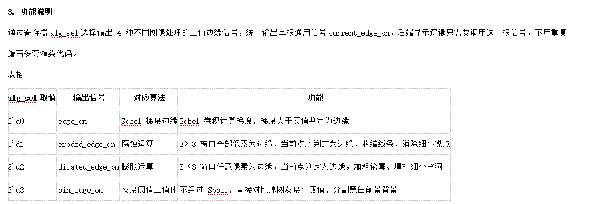

## 核心逻辑

四选一多路选择器：
```
wire current_edge_on = (alg_sel == 2'd0) ? edge_on :       // Sobel
                       (alg_sel == 2'd1) ? eroded_edge_on : // 腐蚀
                       (alg_sel == 2'd2) ? dilated_edge_on : // 膨胀
                       (alg_sel == 2'd3) ? bin_edge_on :     // 二值化
                       edge_on;
```

腐蚀运算：`wire eroded_edge_on = p11 & p12 & p13 & p21 & p22 & p23 & p31 & p32 & p33;` — 9 个二值像素全"与"，仅当窗口内所有像素均为边缘时才输出 1。

膨胀运算：`wire dilated_edge_on = p11 | p12 | p13 | p21 | p22 | p23 | p31 | p32 | p33;` — 9 个二值像素全"或"，窗口内任意边缘点即输出 1。

灰度二值化：`wire bin_edge_on = (display_gray >= threshold);` — 灰度值与全局阈值比较，无需 3×3 邻域窗口。

## 软件参考结果 (Golden Output)

采用 Python + OpenCV 对标准测试图像执行完整处理流程，生成 Golden Output 作为硬件验证参照标准。

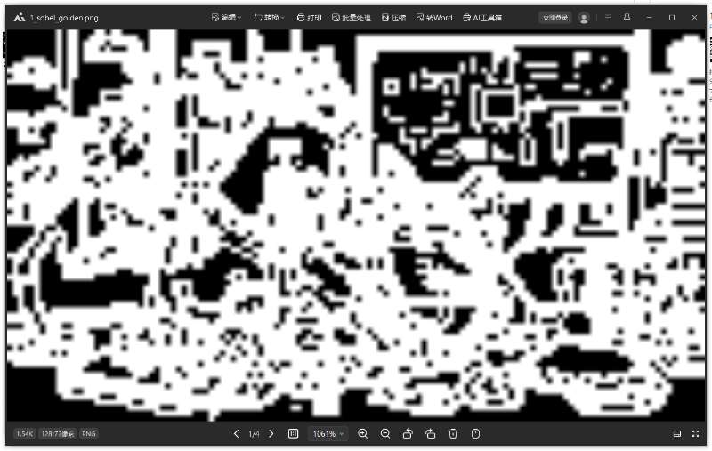

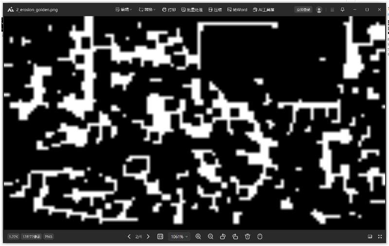

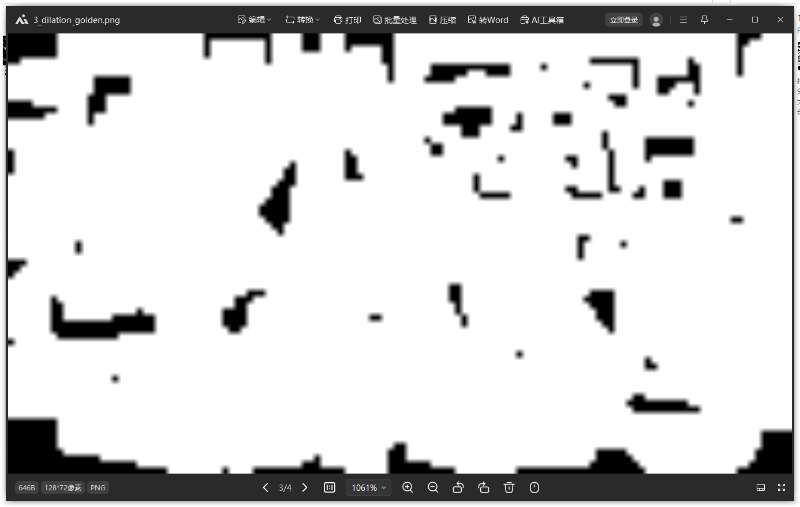

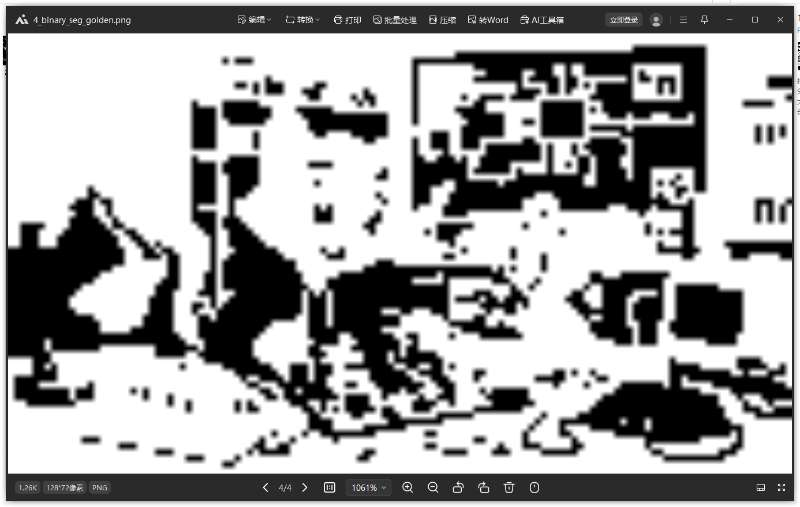

## 实验结果

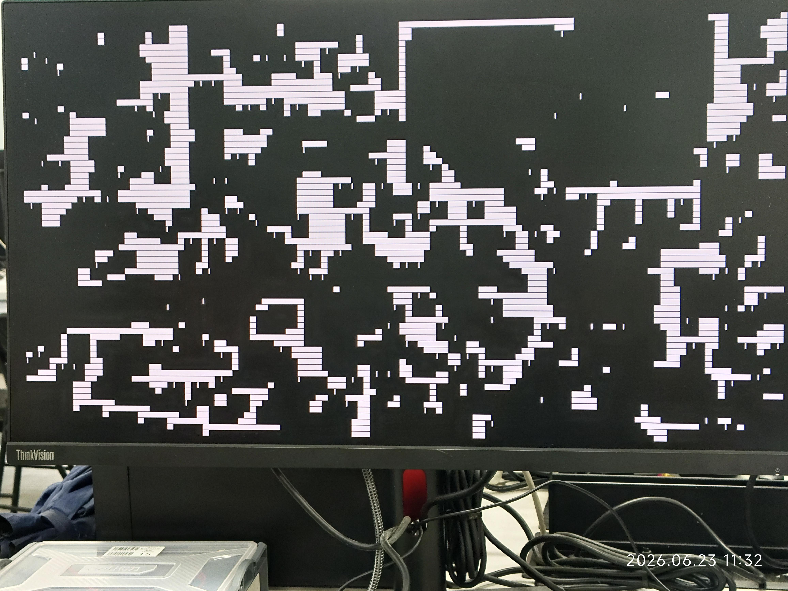

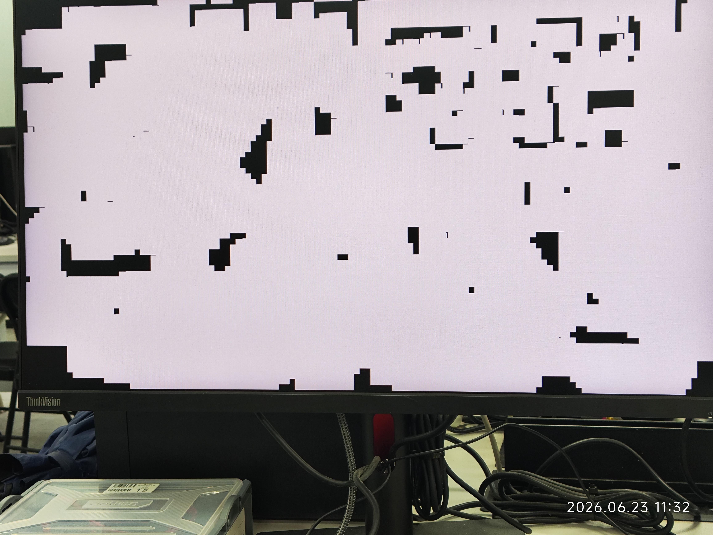

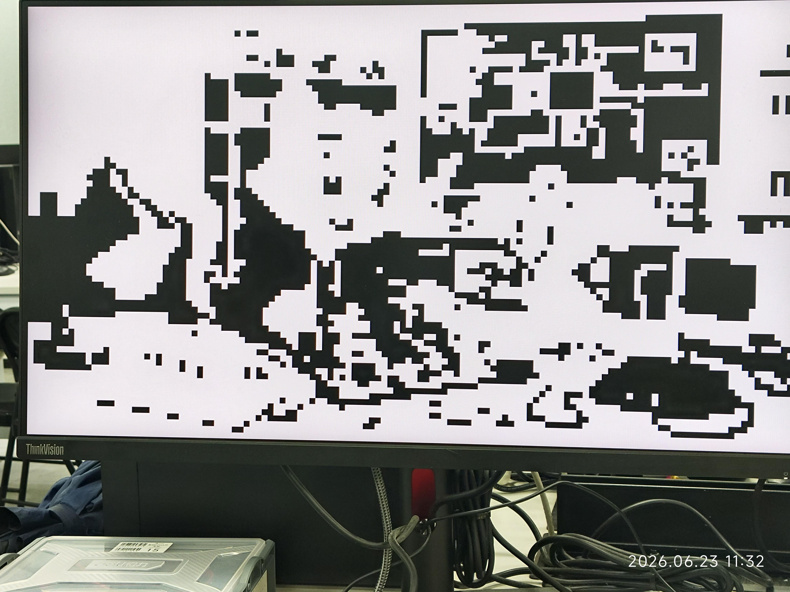

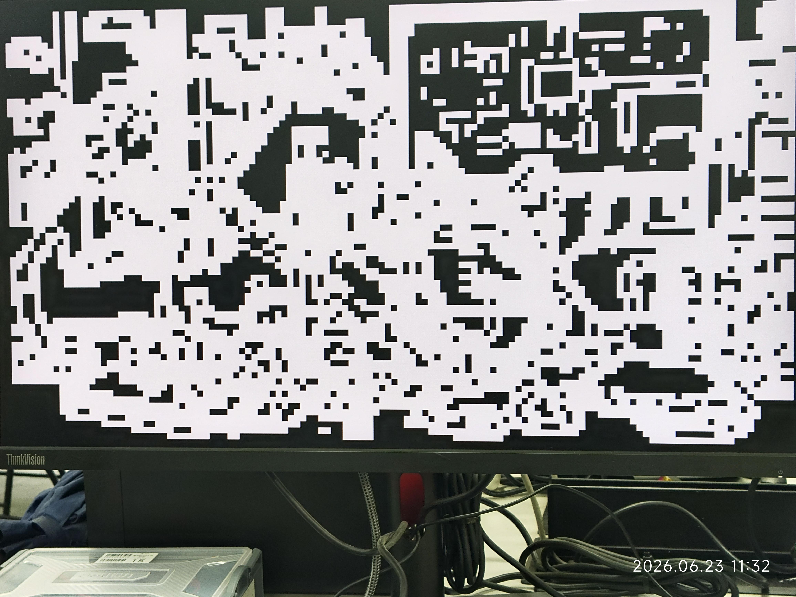

## 资源利用率分析

LUT 约 17K（组合逻辑），FF 约 11K（流水线寄存器+行缓存），BRAM 为 0（LUT+FF 构建分布式 RAM）。整体资源占用合理，为后续功能迭代预留充足空间。

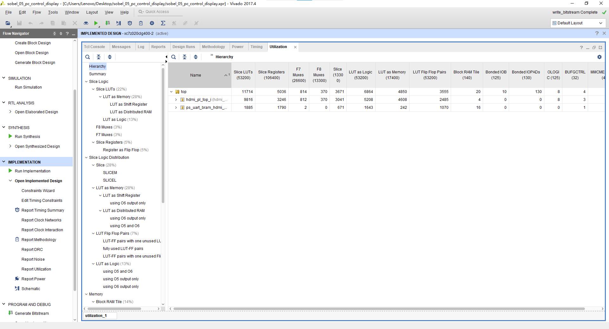

## 时序分析

WNS = 0.898 ns (正值，所有路径满足建立时间要求)。Setup Time 无违规 (Pass)。最终结论：时序收敛，设计验证通过。

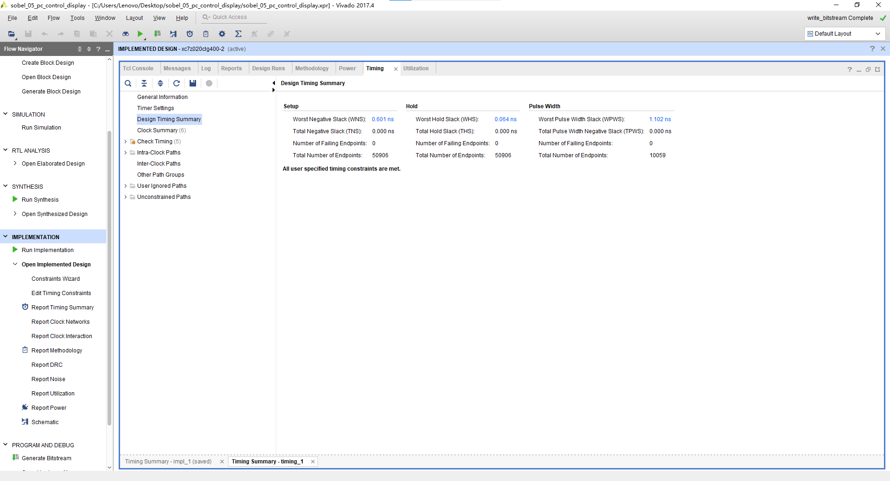
