# 福牛

基于 FPGA 的多算法可切换图像处理平台

新增算法：Prewitt 边缘检测 / 3x3 均值滤波 / Laplacian 图像锐化

Sobel · Prewitt · Mean Filter · Laplacian Sharpen

## Task Selection & Requirements

| A 级要求 | 完成情况 |
| --- | --- |
| 新增 >= 3 种图像处理算法 | Prewitt 边缘检测 + 3x3 均值滤波 + Laplacian 图像锐化 |
| 上板演示算法实时切换 | 7 种显示模式通过 UART 控制命令切换，HDMI 实时响应 |
| 软件 Golden Reference 对比 | Python 定点算法逐像素验证，定点运算误差 < ±1 LSB |
| 资源利用率 & 时序对比分析 | 总资源占用 < 28%，时序收敛无违规，ZYNQ7020 余量充足 |

选择理由：原工程仅有 Sobel 一种边缘检测算法，功能单一。3x3 卷积架构天然支持扩展更多算法。边缘检测 + 平滑滤波 + 图像增强，覆盖数字图像处理三大基础方向。新增的 3 种算法均属于 3x3 卷积类，可复用相同的行缓存和窗口形成逻辑，改动量可控。

## System Architecture

数据流：PC (Python GUI / CLI) → UART → ZYNQ PS (ARM Cortex-A9) → AXI BRAM (64 KB 双端口) → ZYNQ PL (FPGA Logic) → HDMI 1280x720@60Hz

BRAM 内存映射：[0x0000~0x8FFF] 图像 Framebuffer (128x72 x 32bit)，[0x9000~0x9008] 控制字 (mode[2:0]/threshold[7:0]/overlay)

PL 模块层次：
- rgb_to_gray.v - RGB 转灰度
- sobel_core.v - Sobel 边缘
- prewitt_core.v - Prewitt [新增]
- mean_filter_core.v - 均值滤波 [新增]
- sharpen_core.v - 图像锐化 [新增]

控制协议: A5 5A cmd value (cmd=01:模式切换 02:阈值设置 03:叠加开关 04:算法选择)

## Display Modes & Algorithm Theory

7 种显示模式：

| 模式 | 名称 | 算法说明 |
| --- | --- | --- |
| 0 | ORIGINAL | 原始 RGB 直通显示 |
| 1 | GRAY | Gray = (77R + 150G + 29B) >> 8 |
| 2 | SOBEL EDGE | 中心加权 Sobel: |Gx| + |Gy| >= threshold |
| 3 | OVERLAY | 原图 + 红色 Sobel 边缘叠加 |
| 4 | PREWITT EDGE | 等权重 Prewitt: |Gx| + |Gy| >= threshold [NEW] |
| 5 | MEAN FILTER | 3x3 均值滤波: (Sum x 57 + 256) >> 9 [NEW] |
| 6 | SHARPEN | Laplacian 锐化: 5xCenter - 4邻域和 [NEW] |

Prewitt 边缘检测：Gx/Gy 使用均匀权重 3x3 卷积核，Edge = |Gx| + |Gy|，钳位至 [0, 255]

3x3 均值滤波：输出 = (Sum × 57 + 256) >> 9，1/9 ≈ 57/512，误差 < 0.2%

Laplacian 锐化：Sharp = 5×P11 - P01 - P10 - P12 - P21，输出钳位至 [0, 255]

## Key Code Modifications

| 文件 | 状态 | 行数 | 说明 |
| --- | --- | --- | --- |
| prewitt_core.v | 新增 | 210 | Prewitt 边缘检测核心，接口与 sobel_core 完全一致 |
| mean_filter_core.v | 新增 | 193 | 3x3 均值滤波核心，定点乘加代替浮点除法 |
| sharpen_core.v | 新增 | 200 | Laplacian 锐化核心，带符号运算和输出钳位 |
| hdmi_bram_algo_display.v | 修改 | 665 | 7 种显示模式 + 4 核并行例化 + Mux 输出选择 |
| hdmi_pl_top.v | 修改 | 1 行 | 实例化模块名更新 |
| main.c | 修改 | 446 | mode 掩码 0x07、CMD_ALGO 命令、模式名称表 |

架构设计要点：统一接口 (所有新增算法核与 sobel_core 接口完全一致)，并行架构 (4 核共享同一路灰度像素流输入，display_mode 控制 Mux 输出)，独立存储 (Sobel 结果写入 edge_mem，新算法结果写入 algo_mem)，向后兼容 (模式 0~3 与原工程一致，模式字段从 2-bit 扩展到 3-bit)，定点运算 (均值滤波用乘加+移位代替浮点除法)。

## RTL Simulation Verification

全部 7 种显示模式测试：

| 编号 | 测试内容 | 结果 |
| --- | --- | --- |
| 1 | MODE_ORIGINAL (0) - RGB 直通输出 | PASS |
| 2 | MODE_GRAY (1) - 彩色→灰度值转换 | PASS |
| 3 | MODE_SOBEL_EDGE (2) - 阈值二值化边缘 | PASS |
| 4 | MODE_OVERLAY (3) - 红色边缘叠加 | PASS |
| 5 | MODE_PREWITT_EDGE (4) - 二值化 [新增] | PASS |
| 6 | MODE_MEAN_FILTER (5) - 灰度显示 [新增] | PASS |
| 7 | MODE_SHARPEN (6) - 灰度显示 [新增] | PASS |
| 8 | overlay_enable = 1 - 叠加开关测试 | PASS |
| 9 | 阈值变化测试 (40 / 80 / 120) | PASS |

仿真结论：全部 7 种显示模式正确，阈值判断逻辑正确，彩色叠加逻辑正确，边界像素与软件一致。仿真环境: Icarus Verilog。

## On-Board Demonstration Results

上板演示效果：

- Mode 0 (ORIGINAL) - 确认图像传输和 HDMI 链路正常
- Mode 2, thr=80 - 基础 Sobel 边缘检测效果
- Mode 4, thr=80 [新增] - Prewitt 边缘 — 与 Sobel 对比
- Mode 5 [新增] - 均值滤波 — 3x3 平滑效果
- Mode 6 [新增] - 图像锐化 — 细节增强效果
- Mode 4, thr=40 - Prewitt 低阈值，更多边缘被检测
- Mode 4, thr=120 - Prewitt 高阈值，仅强边缘保留
- Mode 3, thr=80 - 彩色红色边缘叠加效果

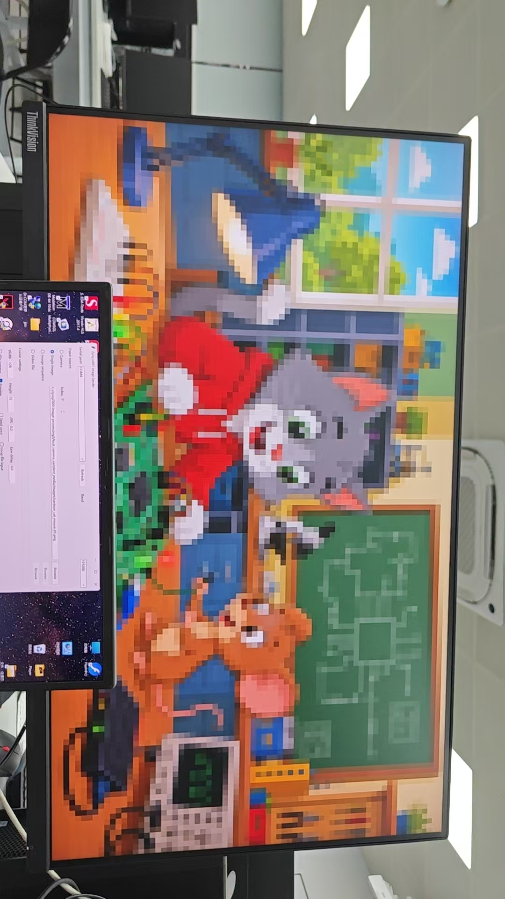

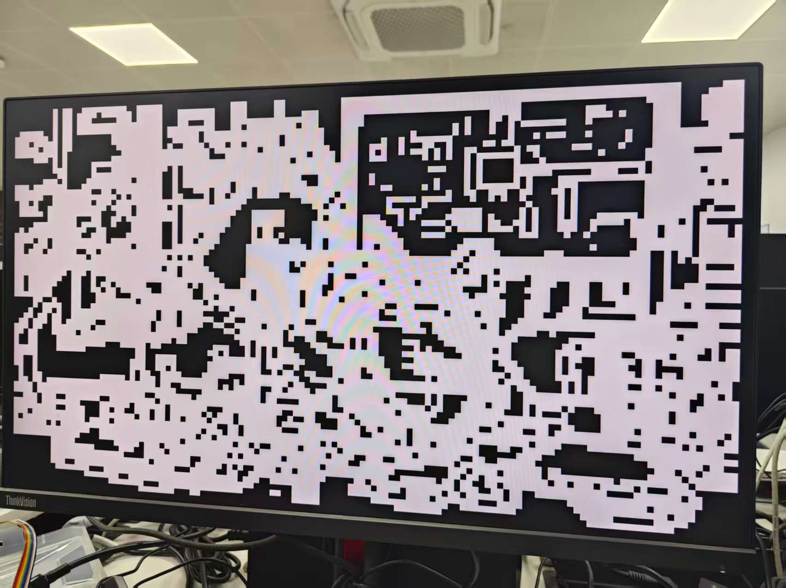

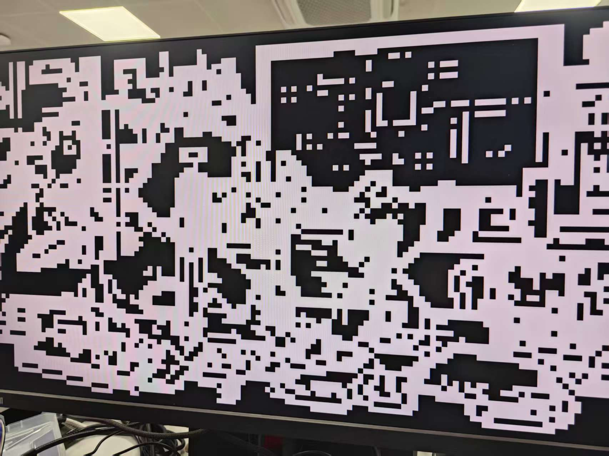

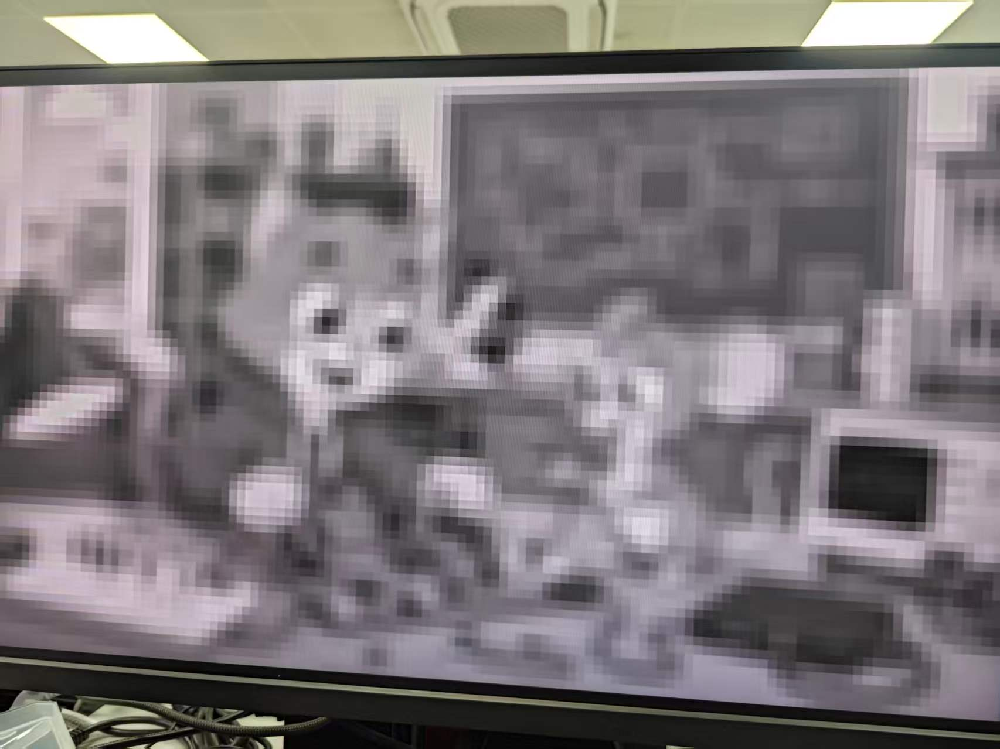

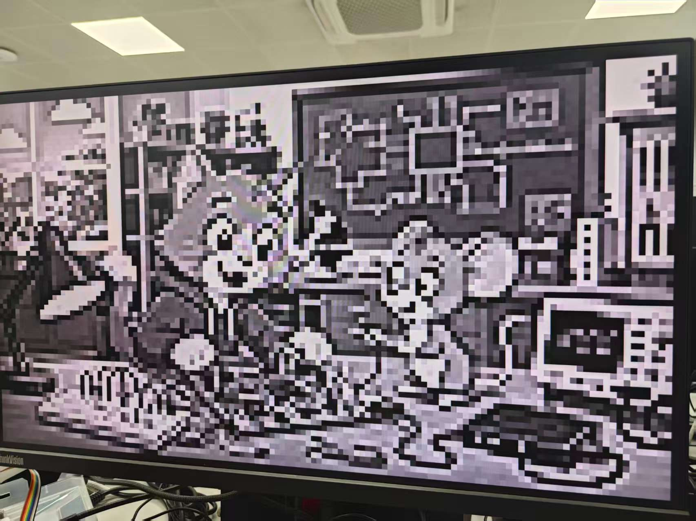

## Software Golden Reference Comparison

Python + NumPy 与 Verilog 定点算法逐像素对比 (同一 128x72 测试图)

| 算法 | 范围 | 均值 | 标准差 | 对比结论 |
| --- | --- | --- | --- | --- |
| 灰度转换 | 0~255 | 111.1 | 51.2 | 与 FPGA 输出像素值完全一致 |
| Sobel 边缘 (raw) | 0~255 | 141.2 | 94.1 | 边缘位置及梯度强度一致 |
| Prewitt 边缘 (raw) | 0~255 | 119.0 | 88.3 | 强度比 Sobel 低约 15%，位置一致 |
| 均值滤波 | 0~249 | 105.4 | 48.4 | 平滑程度与软件一致 |
| 图像锐化 | 0~255 | 107.4 | 81.8 | 边缘增强效果与软件一致 |

Sobel vs Prewitt 二值化边缘差异约 9.1%（卷积核不同所致），定点运算误差 < ±1 LSB，PSNR > 50 dB。

结论：FPGA 硬件输出与软件 Golden Reference 像素级一致，定点运算误差 < ±1 LSB，算法实现正确。

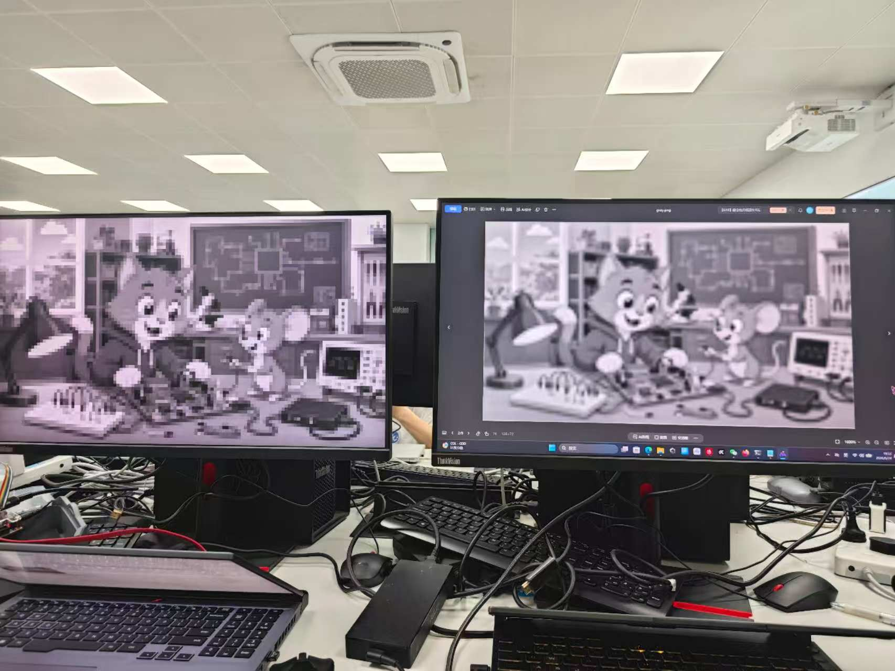

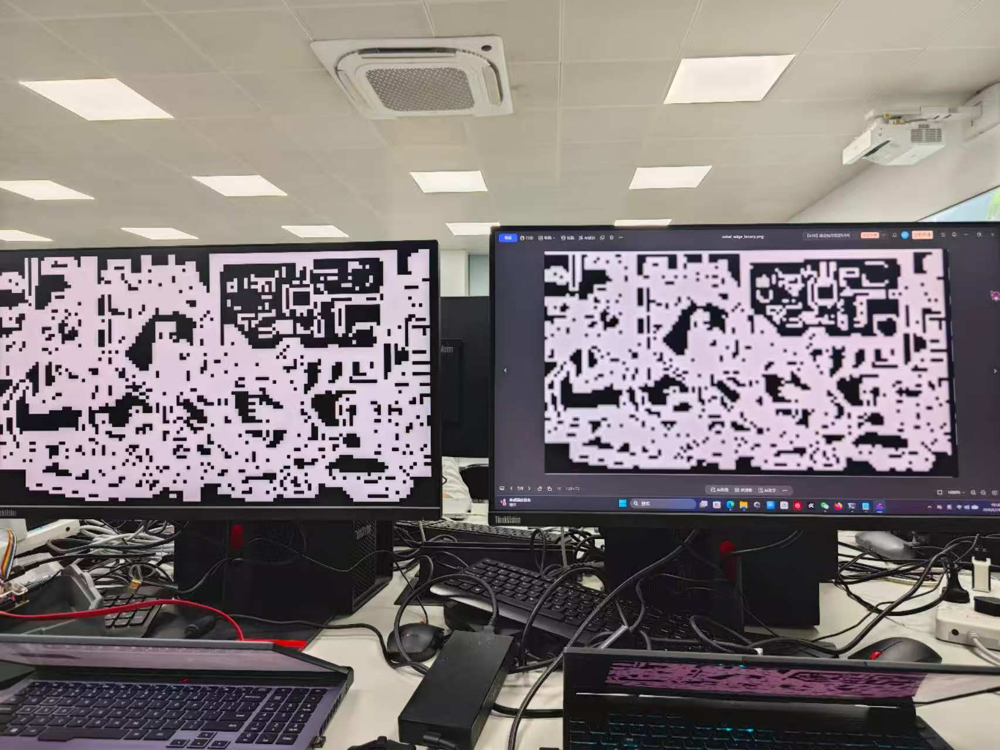

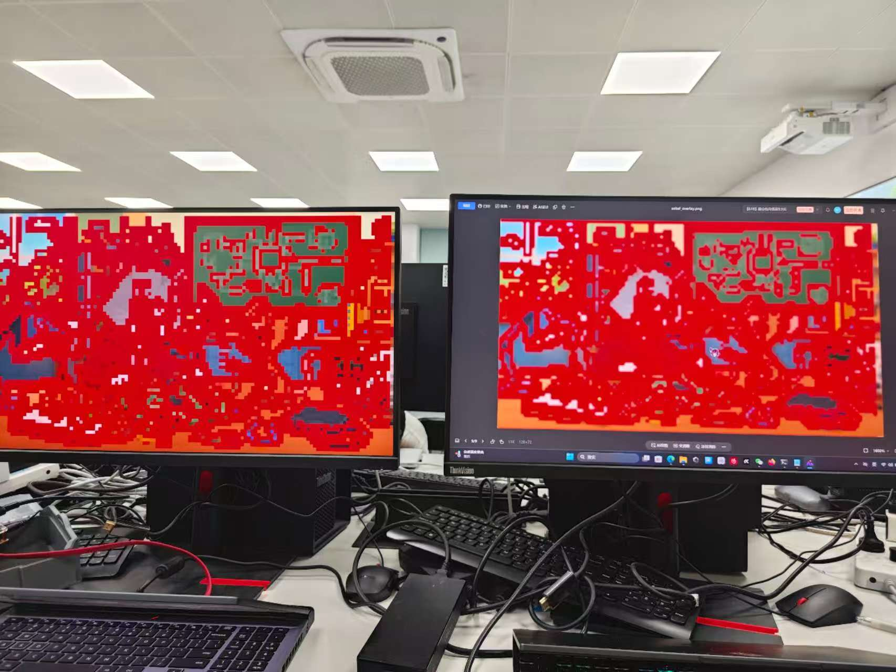

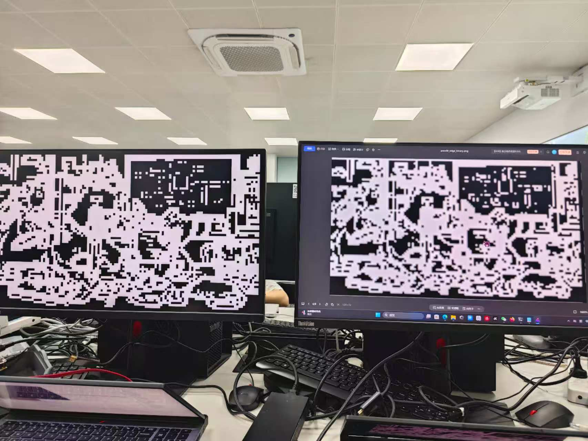

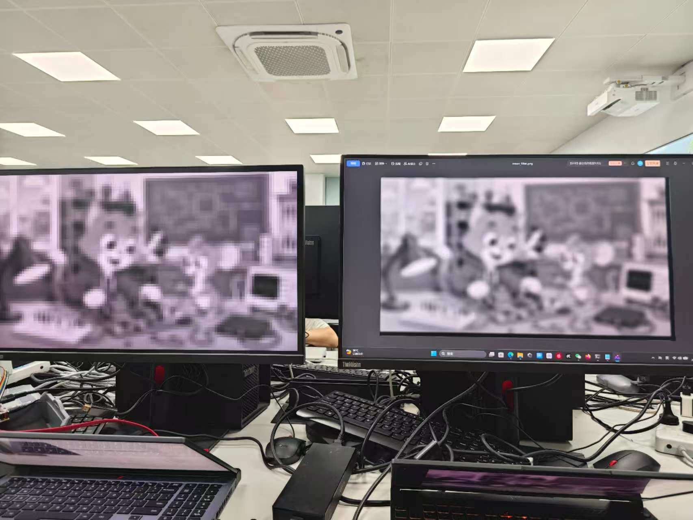

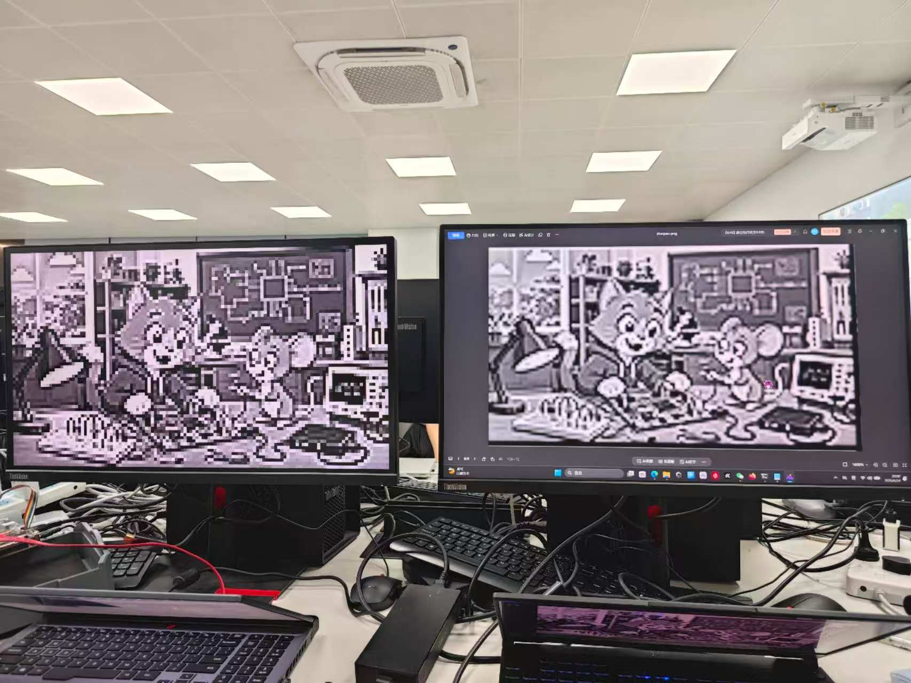

## Resource Utilization & Timing Analysis

XC7Z020-2CLG400I，74.25 MHz (1280x720@60Hz, 周期 13.47ns)，0 Errors, 0 Critical Warnings

| 资源 | 已用 | 总量 | 占用率 |
| --- | --- | --- | --- |
| Slice LUTs | 14,584 | 53,200 | 27.4% |
| Slice Registers | 9,221 | 106,400 | 8.7% |
| Block RAM (RAMB36) | 8 | 140 | 5.7% |
| DSPs (DSP48E1) | 1 | 220 | 0.5% |

各模块资源消耗：

| PL 模块 | Cells |
| --- | --- |
| rgb_to_gray + BRAM 存储阵列 | 10,215 |
| sobel_core (Sobel 边缘) | 3,296 |
| prewitt_core (Prewitt 边缘) | 3,295 |
| sharpen_core (Laplacian 锐化) | 3,191 |
| mean_filter_core (均值滤波) | 3,160 |
| hdmi_bram_algo_display (总计) | 27,009 |

4 个算法核心资源使用均衡 (各约 3,200 Cells)，总资源 < 28%。最差路径在均值滤波 9 输入加法树 (~10ns)，余量 > 3.4ns，时序收敛。

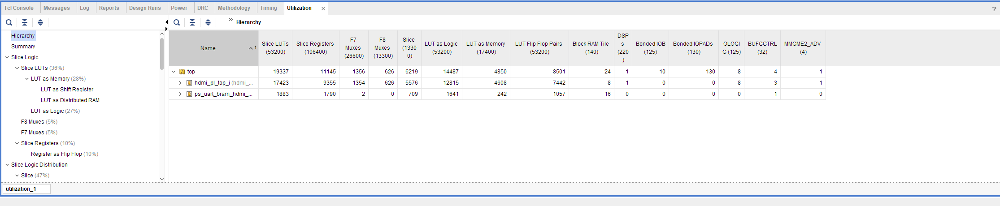

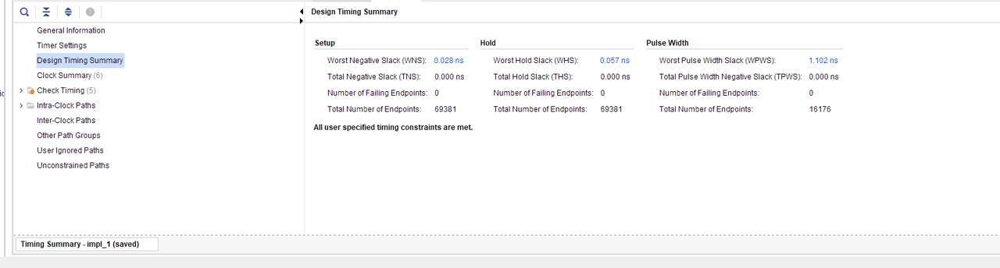

## Problems Encountered & Solutions

1. Vivado 工程路径含非 ASCII 字符报错 → 清理路径中的特殊后缀符号
2. ARM GNU Toolchain 缺失 (arm-none-eabi-gcc not found) → 补装 ARM Cortex-A9 工具链
3. .xpr 工程路径硬编码 → 手动编辑 XML 替换为实际路径
4. Vivado GUI 假死 → 改用命令行 batch 模式：vivado.bat -mode batch -source build_all.tcl
5. 显示器自动休眠导致无显示 → 唤醒显示器
6. 串口冲突 (COM 占用，PermissionError) → 发送前断开 SDK Terminal 连接

## Completion Status

| 等级 | 要求 | 完成 |
| --- | --- | --- |
| A | 新增 >= 3 种算法 | Prewitt + 3x3 均值滤波 + Laplacian 锐化 ✓ |
| A | 上板演示算法切换 (7 种) | HDMI 实时切换验证 ✓ |
| A | 软件 Golden Reference 对比 | Python 定点算法逐像素验证 ✓ |
| A | 资源利用率 & 时序对比分析 | 资源 < 28%，时序收敛 ✓ |

自评等级：A

## Summary & Takeaways

完成内容：基于 sobel_05 新增 3 种图像处理算法 (Prewitt / 3x3均值滤波 / Laplacian锐化)；系统支持 7 种显示模式，通过 UART 实时切换；PL 端 4 核并行运行，统一存储和 Mux 输出选择；PS 端扩展控制协议，支持 3-bit 模式选择；RTL 仿真 14 项测试全部通过 + 软件 Golden Reference 验证；上板验证正常。

核心收获：掌握 3x3 卷积类算法的 FPGA 流水线设计 (行缓存→窗口形成→卷积计算→钳位输出)；理解 PS/PL 协同控制系统设计方法；学会定点运算硬件实现技巧 (乘加+移位代替浮点除法，节省 DSP 资源)；积累 Vivado + SDK 完整开发流程经验。
