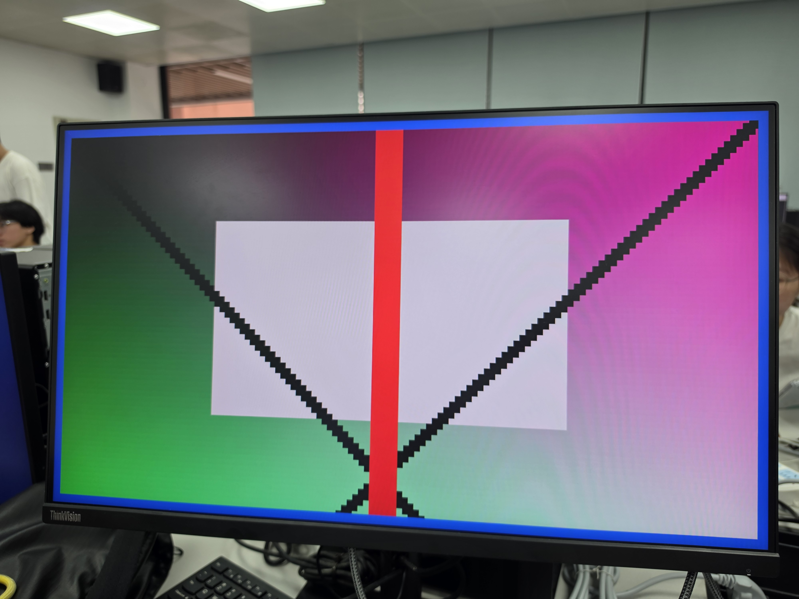
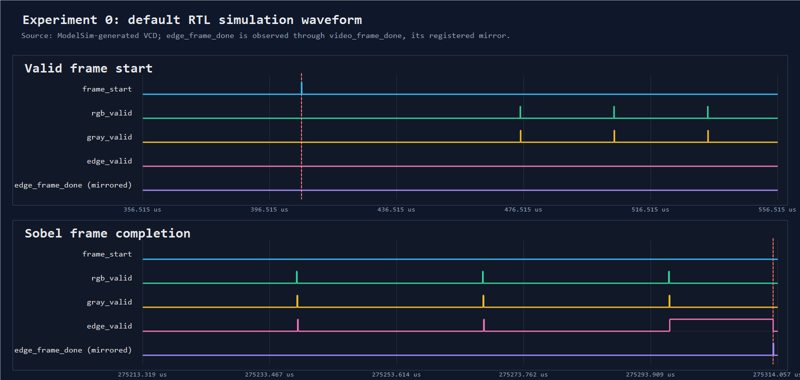
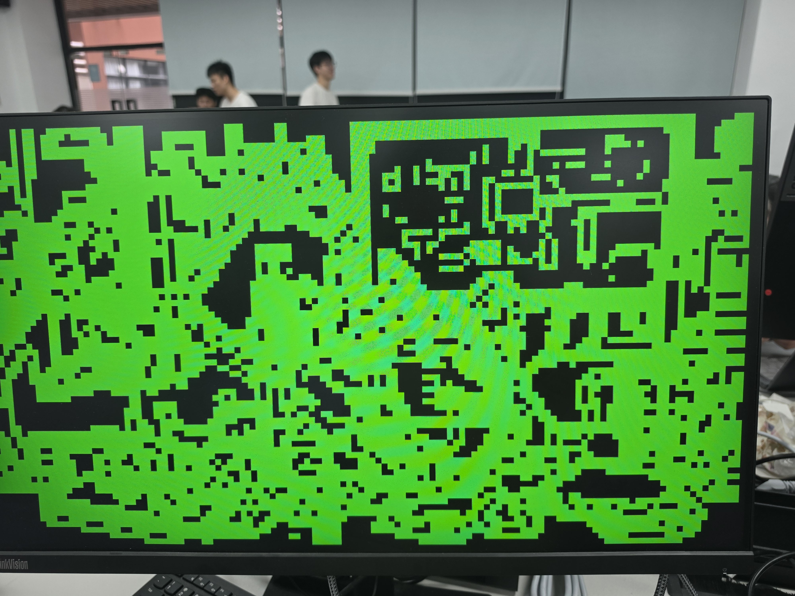
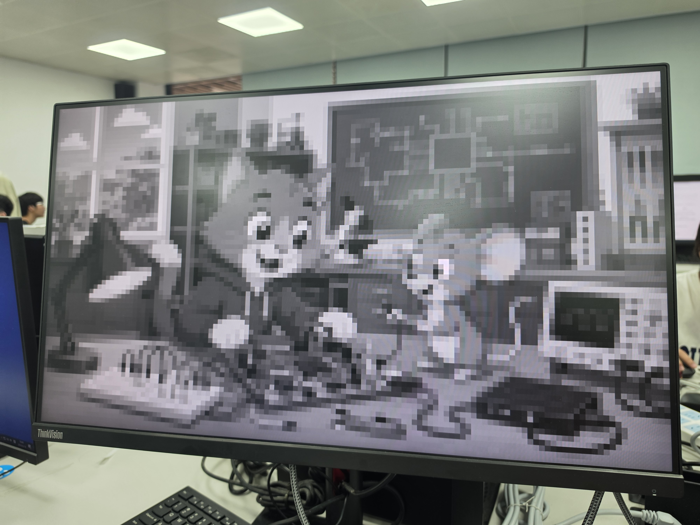

# 组名是必须组

基于 Sobel 的 UART 图像传输、HDMI 显示与两个综合扩展

上位机输入规格扩展（C档） + PL 图像锐化算法（B档）

平台：黑金 ZYNQ7020 开发板，日期：2026.6.24

## 课程任务与完成范围

已完成项目（8 项）：
- sobel_00：RTL 仿真（输入图、Sobel 输出、关键波形）
- sobel_01：HDMI 固定图显示（蓝色边框扩展）
- sobel_02：固定图 Sobel 边缘检测（阈值对比）
- sobel_03：PC 串口传图 → PS 写 BRAM → HDMI 原图
- sobel_04：UART 图像 + PL Sobel 绿色边缘
- sobel_05：PC 控制 原图/灰度/边缘/叠加/阈值
- ★ 综合扩展一：上位机与输入规格扩展（任务1，C档）
- ★ 综合扩展二：PL 图像锐化算法（任务3，B档）

## 系统总体结构与数据流

PC 上位机 (缩放+锐化控制) → UART 115200 baud (图像帧+控制帧) → ZYNQ PS (协议解析，控制字 0x9000/04/08/0C) → AXI BRAM (图像区 + 控制字) → PL 处理 (灰度/Sobel/锐化/显示) → HDMI 720p 实时显示

任务1（C档）— 输入侧：任意尺寸 → PC端 prepare_frame → 固定 128×72 RGB888，三种 fit 策略，硬件契约不变。

任务2（B档）— 算法侧：PL 新增锐化核，复用 Sobel 3×3 窗口，控制字 0x900C，拖滑块 HDMI 实时变锐。

## 基础实验复现结果

| 实验 | 目标 | 结果 |
| --- | --- | --- |
| Exp 0 | RTL Sobel 仿真 | ✓ 输出图/波形正常 |
| Exp 1 | HDMI 固定图显示 | ✓ 稳定，带蓝色边框 |
| Exp 2 | 固定图 Sobel 边缘检测 | ✓ 黑白边缘正常 |
| Exp 3 | UART 传图 → HDMI 原图 | ✓ PC→PS/BRAM→HDMI |
| Exp 4 | UART 图像 + PL Sobel | ✓ 绿色边缘正常 |
| Exp 5 | PC 控制多模式显示 | ✓ 原图/灰度/边缘/叠加/阈值 |









## 第二周综合扩展总览

| 维度 | 大拓展一（任务1） | 大拓展二（任务3） |
| --- | --- | --- |
| 方向 | 输入侧：规格适配 | 算法侧：新增 PL 算法 |
| 内容 | 任意尺寸 → 128×72 (fit/proc) | 图像锐化 (Laplacian / unsharp) |
| 改动 | 仅 PC（不改硬件） | PL + PS（零回归附加） |
| 档位 | C 档 | B 档 |
| 实时控制 | — | 0x900C 拖滑块即变锐 |
| 验证 | 12/12 + 36 矩阵 | 11 配置逐像素 match + golden 等价 + OOC |

共用同一上位机工具 · 同一 UART 协议 · 同一 bitstream

## 大拓展一：上位机与输入规格扩展（任务1，C档）

创新点：
- 硬件契约不变：帧头/包长/PS/BRAM/PL/HDMI 全部复用
- 输入适配前移到 PC，避免多模块联动改硬件
- 三种 fit：stretch / letterbox / center-crop
- 处理尺寸 128×72 / 160×90 / 144×108 对应 C 档参考尺寸，64×36 作低尺寸对比

C 档尺寸验收：128×72 ✓，160×90 ✓，144×108 ✓

实现原理：任意尺寸 BGR → prepare_frame(fit_mode, proc_size) → 固定 128×72 RGB888 → build_frame_packet (27943B，帧头 55 aa 80 00 48 00 18) → UART → 原 sobel_05 链路（完全不变）

离线验证矩阵：3 种原始尺寸 × 3 种 fit 策略 × 4 种处理尺寸 = 36 组矩阵，12/12 通过。

协议不变量：分辨率 128×72，帧长 27943B，帧头 55 aa 80 00 48 00 18，控制帧 A5 5A cmd value。

## 大拓展二：PL 图像锐化算法（任务3，B档）

设计取向：最低风险地改 PL
- 复用 Sobel 已验证的 3×3 窗口 (中心=mid1)，只附加拉普拉斯输出，Sobel 通路逐位不变
- 不改 BRAM 容量/时序/BD
- 强度经控制字 0x900C 每帧读取，拖滑块 HDMI 实时变锐，无需重发帧

B 档验收要件：新增 1 种算法（锐化）✓，上板演示 ✓，与软件参考对比 (numpy golden 逐位一致) ✓

### 锐化算法与定点实现

```
gray = (77*R + 150*G + 29*B) >> 8    // 与 rgb_to_gray.v 一致
lap = 4*center - up - down - left - right  // 4邻域拉普拉斯
delta = floor(strength * lap / 256)    // RTL: >>>8
out_c = clamp(c + delta, 0, 255)      // 逐通道 R/G/B
lap = 4*mid1 - top1 - bot1 - mid0 - mid2  // 复用 Sobel 3×3 窗口
```

strength=0 → 输出=原图，越大越锐，过大时饱和。

### PL 数据通路与实时控制

扫描期：BRAM 图像 → rgb_to_gray → sobel_core → edge_mem（原 Sobel，不变）+ lap_data → lap_mem（新增）。每帧起始 FSM 依次读 0x9000/04/08/0C。

显示期：MODE_SHARPEN → clamp(rgb + (strength*lap)>>>8) → HDMI

控制：A5 5A 04 k → PS 写 0x900C → PL 每帧读取

修改文件：sobel_core.v (+lap_data 输出)，hdmi_bram_sobel_display.v (+MODE_SHARPEN/lap_mem/0x900C FSM)，main.c (+cmd 0x04 解析)，上位机 (+锐化强度滑块 + golden 预览)

### 无板验证与资源时序分析

协同仿真验证结果：
- 11 配置逐像素对比：全部 =match ✓
- 真实 main.c 端到端：A5 5A 04 96 → 0x900C=96 ✓
- 原 Sobel 四模式自检：EXP05_SELFCHECK_TB=passed ✓
- numpy == golden == RTL 逐位一致 ✓

PL OOC 综合结果 (xc7z020clg400-2, 74.25 MHz)：
- WNS: +2.452 ns，0 失败端点，时序裕量约 18%
- LUT: 9229 (4.3%)，FF: 2725 (0.6%)，BRAM: 10.5/140，DSP: 4/220

核心结论：RTL == 软件 golden，逐像素一致。lap_mem 占少量 BRAM，k·lap 占 1 个 DSP，OOC 时序达标。

## 资源利用率、时序与性能分析

| 实验/扩展 | LUT | FF | BRAM | DSP | WNS(ns) |
| --- | --- | --- | --- | --- | --- |
| Exp 1 | 232 | 179 | 12 | 0 | +7.772 |
| Exp 2 | 2842 | 2353 | 14 | 0 | +1.578 |
| Exp 3 | 1775 | 1504 | 16 | 0 | +8.173 |
| Exp 4 | 4446 | 3662 | 18 | 0 | +13.453 |
| Exp 5 | 10795 | 4113 | 20 | 0 | +0.325 |
| 任务1 | 同Exp5 | 同Exp5 | 同Exp5 | 同Exp5 | +0.325 |
| 任务2(OOC) | 9229 | 2725 | 10.5 | 4 | +2.452 |

UART 瓶颈：帧长 27943B，115200 baud ≈ 2.43 秒/帧。结论：任务1 不增 FPGA 资源；任务2 OOC 时序达标，裕量 ~18%。

## 问题与总结

问题记录：VCD 大 → 取关键波形截图；UART 慢 (2.43s/帧)；Exp5 时序裕量小 → 任务1 选不改 PL；不同尺寸拉伸会变形 → 三种 fit；锐化硬边振铃 → 演示用真实照片。

总结：完成基础链路 + 两个互补综合扩展。任务1: 12/12 + 36 矩阵；任务2: 逐像素 cosim + golden 等价 + OOC。后续：UART→网络传输 / 凑齐≥3种算法升A档。
