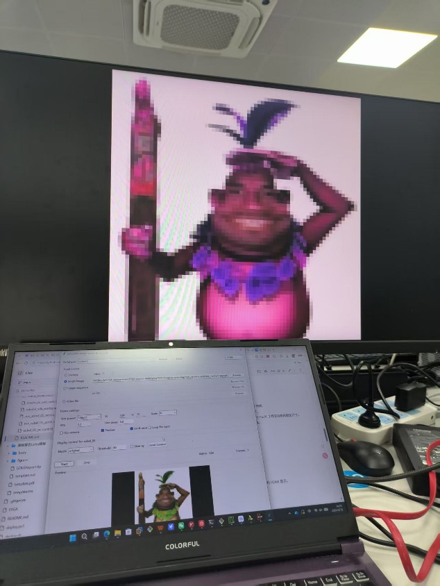
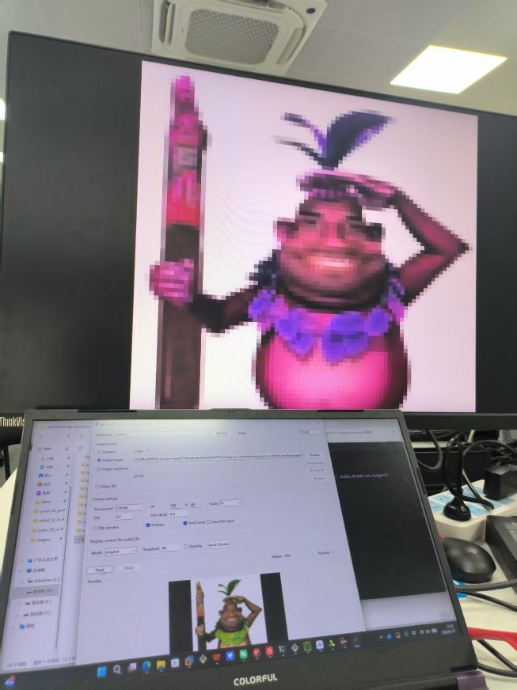
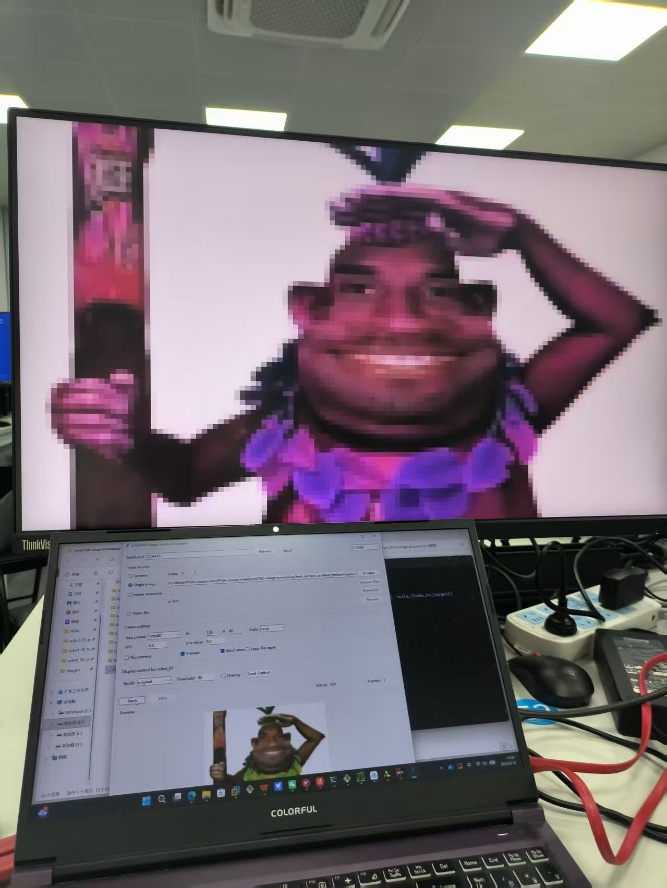
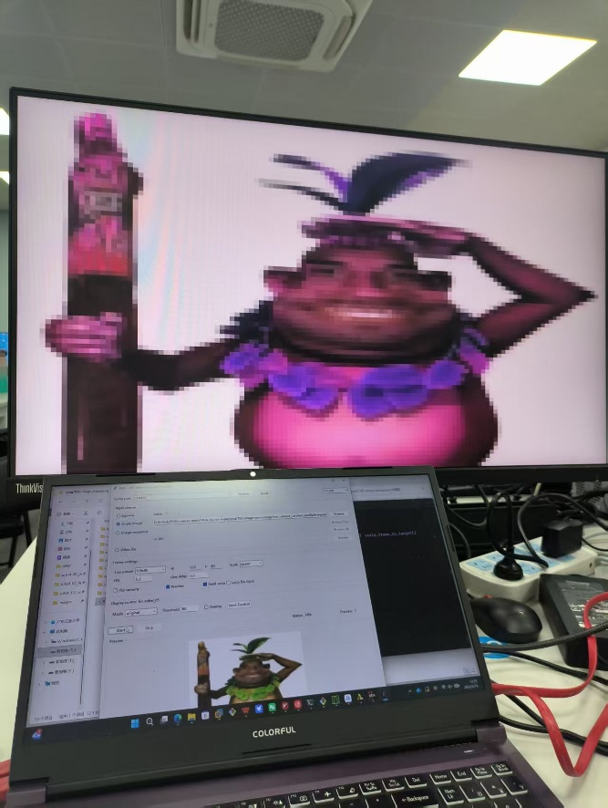
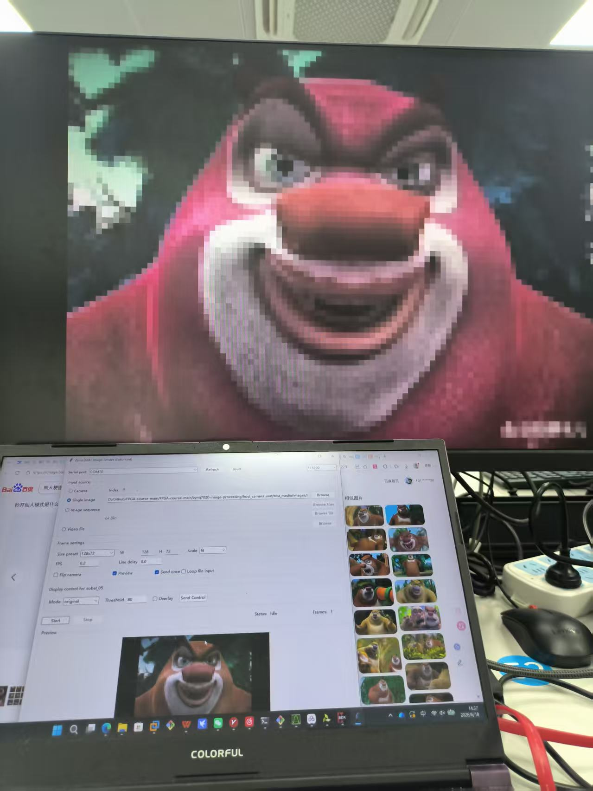
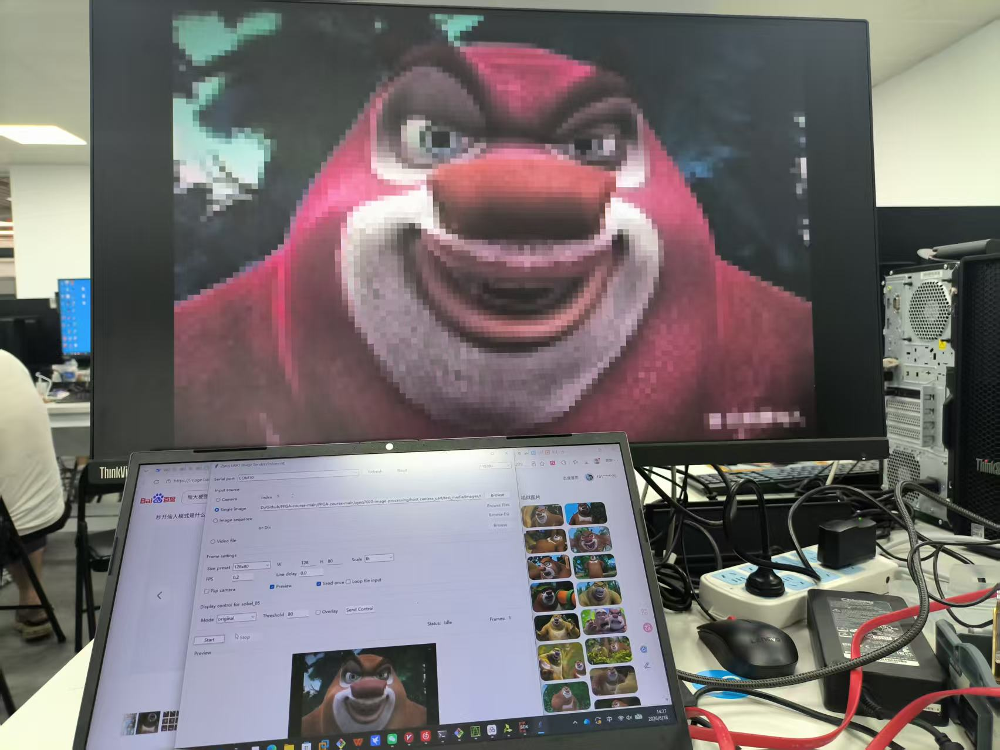
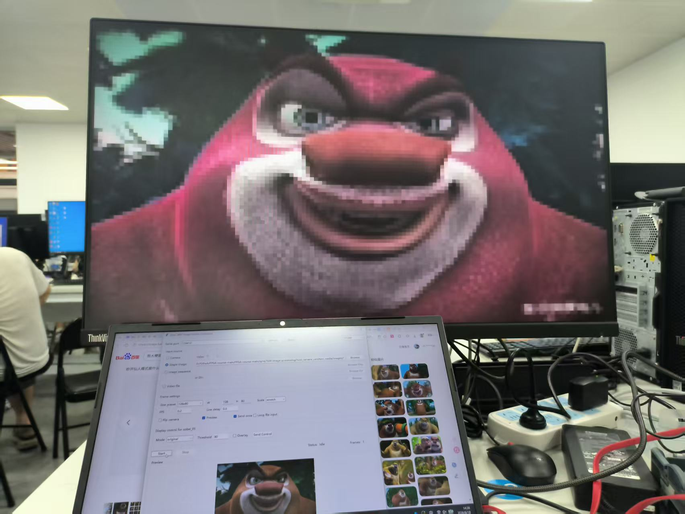
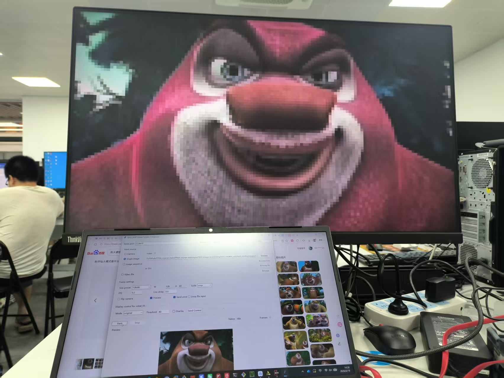

# 菲菲公组

综合拓展任务一：上位机与输入规格扩展 — 支持多分辨率及多种输入来源的图像处理系统

## 扩展题目与背景

基于 sobel_05_pc_control_display，修改 host_camera_uart 支持更多输入来源，支持选择目标输入尺寸（128×72 及至少 1 种新处理尺寸），保持 sobel_05 原有显示控制命令可用。

方案：新增 128×80 处理尺寸，形成双尺寸支持；扩展上位机输入来源至全部五种类型；采用"上位机统一缩放 + FPGA 硬件自适应"的混合方案。

## 总体设计方案

核心思想：上位机统一缩放 + FPGA 硬件自适应

任意分辨率输入 → PC 上位机 scale_frame_to_target() → UART → ZYNQ PS 接收+解析 → AXI BRAM 图像区 0x0000~0xEFFF / 控制字 0xF000~0xF00C → PL 端处理+HDMI 输出

PS 端接收到帧后自动识别尺寸，写入 image_cfg 控制字 (0xF00C) 通知 PL 端。PL 端每帧开始前读取 image_cfg，动态设置 img_height 和 scale_y。两种尺寸共用同一套逻辑。

## 上位机代码

SIZE_PRESETS 定义两种目标尺寸：128×72 和 128×80。

scale_frame_to_target() 实现三种缩放模式：
- fit：保持比例填黑边（信箱模式）
- stretch：直接变形拉伸
- crop：放大后中心裁剪

## PS 端代码

多尺寸支持：IMG_WIDTH_72/80、IMG_HEIGHT_72/80、IMG_WIDTH_MAX=128、IMG_HEIGHT_MAX=80、IMG_PIXELS_MAX=10240

控制字地址迁移 (0x9000→0xF000)：128×80 需 40,960 字节，原 0x0000~0x8FFF 空间不足，控制字移至 0xF000，图像区扩至 0x0000~0xEFFF (60KB)。

新增 CTRL_IMAGE_CFG_ADDR (0xF00C)：IMAGE_CFG_128x72=0, IMAGE_CFG_128x80=1

## PL 端代码

将固定常量改为运行时变量：img_height (72/80)、scale_y (10/9)。每帧从 BRAM 0xF00C 读取 image_cfg 后动态切换。

HDMI 坐标映射：`assign disp_y = active_y / scale_y`
扫描边界判断：`assign scan_last = (scan_x==127) && (scan_y==img_height-1)`

## BRAM 地址布局

修改前：图像区 0x0000~0x8FFF (36KB)，控制字在 0x9000~0x9008

修改后：图像区 0x0000~0xEFFF (60KB)，控制字在 0xF000~0xF00C

| 参数 | 128×72 | 128×80 |
| --- | --- | --- |
| SCALE_Y | 720/72=10 | 720/80=9 |
| 像素总数 | 9,216 | 10,240 |
| BRAM 占用 | 36,864 字节 | 40,960 字节 |

## 仿真验证

仿真模型：display_control_model.v (行为级) + display_control_model_tb.v (12 个自动化用例)

验证项：image_cfg 尺寸切换 (72↔80)、像素坐标映射、四种显示模式、阈值控制、叠加开关、128×80 全链路。结果：ALL 12 TESTS PASSED。

## 实验结果

分辨率对比 (128×72 vs 128×80)：

缩放策略对比 (Crop vs Stretch)：

第二张图片分辨率对比：

第二张图片缩放策略对比：

## 修改文件汇总

| 领域 | 文件 | 核心改动 |
| --- | --- | --- |
| PC | camera_uart_sender.py | SIZE_PRESETS, scale_frame_to_target(), parse_custom_size() |
| PC | camera_uart_gui.py | 尺寸预设 UI, 缩放模式选择, 图像目录浏览 |
| PS | main.c | 多尺寸支持, 控制字地址移至 0xF000, image_cfg 写入 |
| PL | hdmi_bram_sobel_display.v | image_cfg 读取, img_height/scale_y 动态切换, mem 扩容 |
| PL | sobel_core.v | img_height 输入端口 |
| PL | display_control_model.v | 控制逻辑行为模型 |
| PL | display_control_model_tb.v | 12 个自动化验证用例 |

## 总结

核心设计思想：上位机统一缩放 + FPGA 硬件自适应。上位机处理复杂度集中在缩放算法（fit/stretch/crop 三种策略），FPGA 只需根据一个控制字切换两个预定义参数组合，不需要运行时动态重配置整个流水线。两种尺寸共用同一套逻辑，资源开销仅增加额外内存空间和几个多路选择器。
