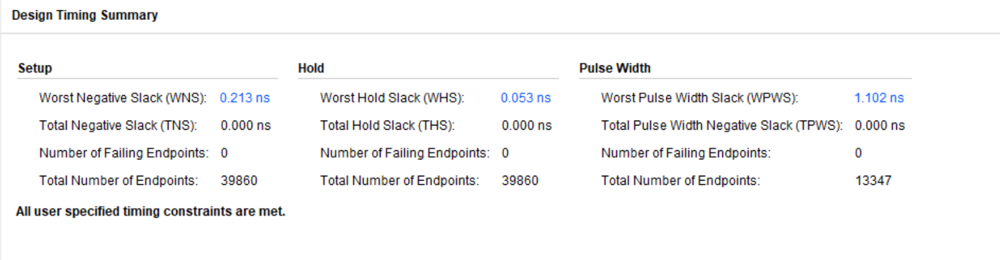
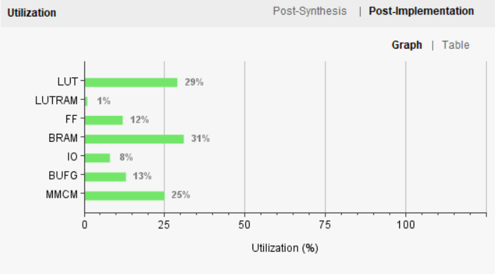
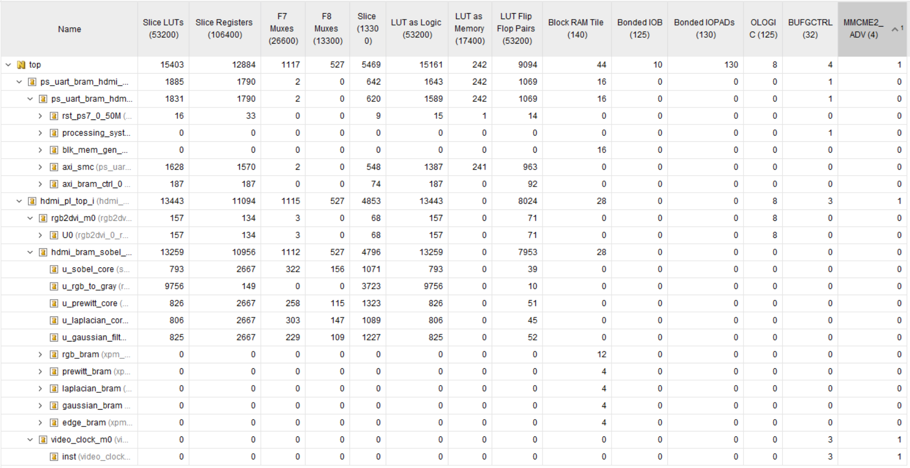
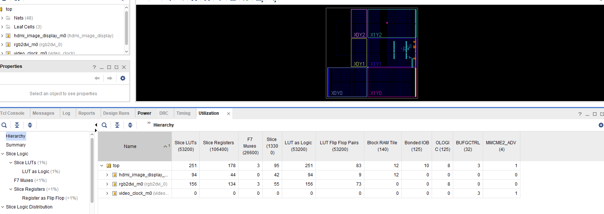

# 重案六组

## 幻灯片 1

FPGA实验验收汇报

重案六组

## 幻灯片 2

CONTENTS

目录

拓展内容概览

01/PART ONE

任务实现方法

02/PART TWO

实验结果展示

03/PART THREE

## 幻灯片 3

拓展内容概览

上位机分辨率下拉框提供128×72和160×90两种选项，FPGA端适配其中一种尺寸的帧接收与显示，且HDMI缩放因子自动对应配置（128模式为10×10，160模式为8×8）。

上位机与输入规格扩展

增高斯滤波、Prewitt、Laplacian三种RTL算法核，采用四核并行处理与独立BRAM存储，上位机命令可切换8种显示模式，且上位机内置软件参考实现，预览窗实时显示处理后效果。

增加图像处理算法

全中文界面、悬浮提示、预览即FPGA结果，支持跳帧。

上位机GUI修改

FPGA

EXPERIMENT

我们小组在sobel_05_pc_control_display 实验中选择了实现拓展一和拓展三两个大目标，拓展一实现图像的分辨率上升，拓展三新增了三种图像处理算法，最后对上位机的GUI进行了一些修改。

## 幻灯片 4

任务实现方法

图片分辨率修改

为什么是 160×90

1280/160 = 8（整数缩放，无畸变）

720/90 = 8（整数缩放，无畸变）

160×90×4 = 57600 字节 < 65536（64KB BRAM 上限）

无需扩容 BRAM，改动代价最小

固定输出尺寸改为160×90，HDMI缩放倍数由10×10调整为8×8；BRAM容量从9216像素（128×72）扩大到14400像素（160×90）；地址计算全部改用 y*160+x，x坐标位宽扩展为8位；三个控制字地址统一迁移至0xF000、0xF004、0xF008

硬件端（FPGA代码）

IMG_WIDTH和IMG_HEIGHT同步改为160和90，控制字地址与硬件保持一致（0xF000等）；增加调试打印功能，当接收到的图像尺寸或格式不匹配时，串口会输出实际宽高和格式，便于定位问题

软件端（PS的C代码）

camera_uart_sender.py默认输出尺寸改为160×90，非该尺寸时提示；camera_uart_gui.py界面默认宽高也改为160×90，非该尺寸提示；支持浏览单张图、多图序列、视频时自动切换输入模式，运行中切换单张图会提示需重启发送线程。

上位机（Python脚本）

## 幻灯片 5

任务实现方法

新增三个图像处理算法

9 个数按权重加权平均。中心像素权重最高（×4），上下左右次之（×2），角落最低（×1），然后除以 16

效果相当于把图像变模糊一点，噪点被周围像素"平均"掉了。代码量：就一个乘加运算 + 一个右移 4 位（÷16）

高斯滤波 — "磨皮"

和 Sobel 一模一样——算横向梯度 Gx 和纵向梯度 Gy，加起来取绝对值。唯一区别是权重全是 1，Sobel 中间那两个权重是 2

所以 Prewitt 就是拿 Sobel 的代码，把 <<< 1（左移一位=×2）去掉就行。对弱边缘更敏感，但抗噪能力差一点

Prewitt — "找边缘"

前面两个是一阶导数（看"变化快不快"），Laplacian 是二阶导数（看"变化率有没有突变"）

把周围 8 个数全加起来，用中心的 8 倍去减，差的绝对值就是边缘强度。对孤立噪点和细线特别敏感，和 Sobel/Prewitt的输出是互补风格。代码量：8 个数相加 + 中心 × 8（左移 3 位）+ 减法 + 取绝对值

Laplacian — "找边缘"

图像处理

FPGA 里没法像 Python 一样随意取 img[y-1][x-1]，像素是一个一个流进来的，即用两行"行缓存"（line buffer）存上一行和当前行的像素数据。当第 3 行的像素进来时，就凑齐了 3×3 窗口的 9 个数：

这 9 个数就是一次卷积的输入

## 幻灯片 6

任务实现方法

上位机GUI优化

模式增加

参数列表 + 数字映射

尺寸选择

一个下拉框 + 选完自动改 width/height

处理后预览

Python 端写了硬件算法的等价代码，预览时跑一遍

命令发图共存

队列排队，不打断正在传的帧

## 幻灯片 7

实验结果展示

时序结果

## 幻灯片 8

实验结果展示

资源利用率

## 幻灯片 9

实验结果展示

详细资源利用率

## 幻灯片 10

实验结果展示

详细资源利用率

## 幻灯片 11

实验结果展示

实物展示
