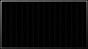
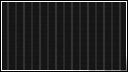
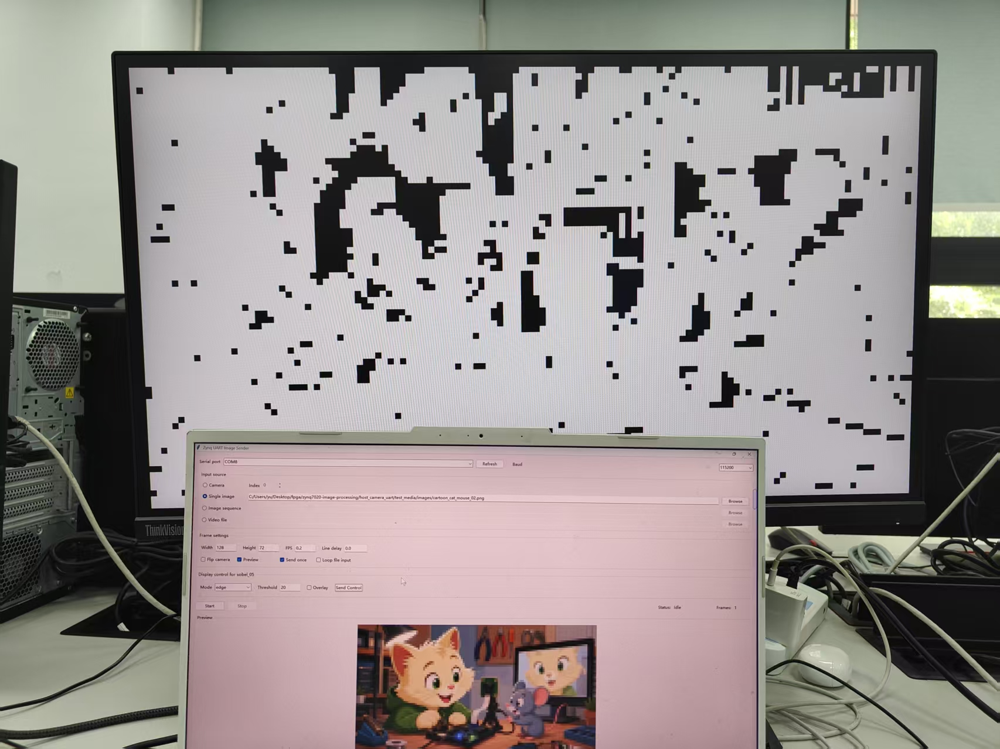
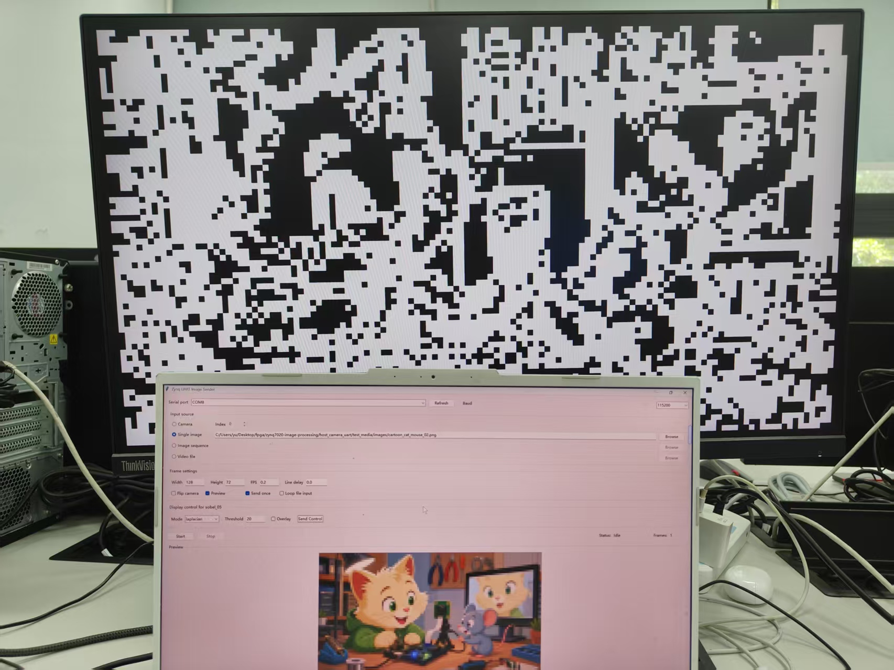
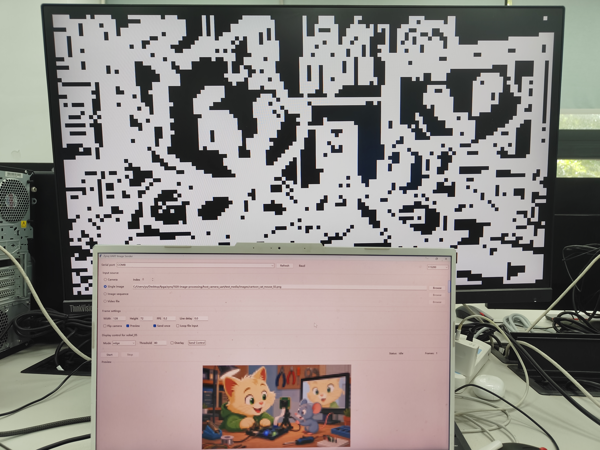
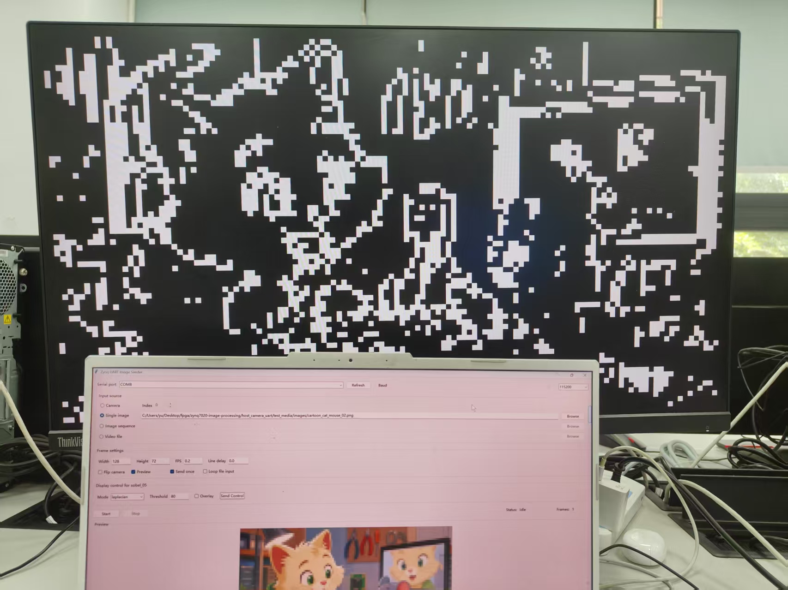

# 鞋拖组

## 幻灯片 1

基于 ZYNQ-7020 的可动态配置边缘检测图像显示系统的软硬件协同设计

时间：2026/06/25

主要软件工具：vivado 2017.4, Icarus Verilog, Anaconda,GTKwave,串口调试助手

主要硬件工具：ZYNQ-7020,显示屏,HDMI线,摄像头

## 幻灯片 2

一、综合扩展任务选择与理由

选择方案：Laplacian（拉普拉斯）边缘检测 (mode=4)

📌 选择理由：

① 与 Sobel 形成互补——Sobel 是一阶导数，Laplacian 是二阶导数

② 结构高度复用——共享 rgb_to_gray 灰度转换 + 行缓冲流水线

③ 硬件开销可控——无需 DSP 乘法器，仅组合逻辑加法

④ 对比性强——同一张图可实时切换 Sobel / Laplacian 观察差异

| 特性 | Sobel (原版) | Laplacian (新增) |

| --- | --- | --- |

| 导数阶 | 一阶 (梯度) | 二阶 (散度) |

| 卷积核 | [-1 0 1;-2 0 2;-1 0 1] | [0 -1 0;-1 4 -1;0 -1 0] |

| 检测特点 | 方向性 (Gx, Gy 分离) | 无方向性 (各向同性) |

| 边缘类型 | 阶跃边缘响应强 | 点、线、线端点响应强 |

| 硬件开销 | 4 次移位 (<< 1) | 1 次移位 (<< 2) |

| 输出范围 | 0~1020 (Sobel) | 0~1020 (Laplacian) |

| 噪声敏感 | 较低 (含高斯平滑) | 较高 (二阶离散差分) |

## 幻灯片 3

二、设计方案与系统框图

## 幻灯片 4

## 幻灯片 5

三、代码架构与时钟树

Hdmi_image_display:内置image_rom_128x72 的内部模块，模块存储了一张128x72分辨率的图片。整个模块通过生成HDMI 的 1280x720 扫描时序和压缩图片地址，去查这个内部 ROM 的表，把读出来的彩色像素直接输出HDMI 引脚，从而实现图像的静态显示，可用于验证物理接口和时序代码的正确性

HDMI_bram_display:当 HDMI 扫描到有效显示区域时（video_active 拉高），它直接把当前屏幕坐标换算成物理地址送给 BRAM：bram_addr_reg <= video_active ? {16‘d0, image_word_addr, 2’b00} : 32‘d0;，然后在下一拍把 BRAM 吐出来的数据直接送到屏幕：pixel_reg <= bram_dout[23:0];可用于验证PS端双口RAM的异步读写

Top顶层：例化Zynq PS 端的软核ps_uart_bram_hdmi_wrapper_i和PL端的顶层hdmi_pl_top

ps_uart_bram_hdmi_wrapper_i:

ZYNQ7 处理系统硬核 (processing_system7_0)：运行 C 语言程序，负责监听串口。

处理器系统复位管理器 (rst_ps7_0_50M):接收来自 PS 端的原始时钟 (FCLK_CLK0) 和底层复位,输出干净、安全的异步复位、同步释放信号

AXI 总线互联矩阵 (ps7_0_axi_periph)：

AXI BRAM 控制器(axi_bram_ctrl_0) : AXI to BRAM interface

双口块 RAM 生成器 (blk_mem_gen_0):双口 RAM，A端口接axi_bram_ctrl_0,B端口外接PL端供其读取

## 幻灯片 6

hdmi_pl_top.v (PL 端逻辑总顶层)

hdmi_bram_sobel_display_m0 (核心算法与控制大脑)

U_rgb_to_gray:RGB转灰度模块

sobel_core：实现SOBEL边缘检测

laplacian_core：实现Laplacian 边缘检测（拓展）

video_clock_m0 (时钟生成网络)

rgb2dvi_m0 (HDMI 物理层发送器 PHY)

时钟树

sys_clk:50MHZ,外部晶振提供

video_clk：74.25MHZ。适配1280x720@60Hz而计算出来的像素时钟，由sys_clk经过video_clk IP 分频提供

video_clk 5x：371.25MHZ。像素时钟的五倍，HDMI 协议物理层的硬性要求，rgb2dvi 模块需要在此时钟下工作，将 24 位并行 RGB 数据转化为高速串行差分流，由sys_clk经过video_clk IP 分频提供

## 幻灯片 7

Laplacian 边缘检测算法原理

1. 边缘检测的数学本质

图像边缘 = 灰度值发生剧烈变化的位置。

数学上，这对应灰度函数 f(x,y) 的导数极值点。

一阶导数：检测变化率最大的位置（梯度方向）

Sobel 属于此类 → 输出单侧粗线

二阶导数：检测变化率为零的位置（过零点）

Laplacian 属于此类 → 输出双侧细线

一维类比：

原信号:    0  0  0  100 100 100  (阶跃边缘)

一阶导数:   0  0 100  0   0   0   (单峰, 宽)

二阶导数:   0 100 -100 0   0   0   (正负双峰, 过零点即边缘)

→ 二阶导数定位更精准，但宽度仅 1-2 像素

2. Laplacian 4-邻域离散模板

连续形式: ∇²f = ∂²f/∂x² + ∂²f/∂y²

离散近似 (4-邻域):

0  -1   0

-1  +4  -1         ← 中心权重 = +4

0  -1   0           邻域权重 = -1

4. Sobel vs Laplacian 数学对比

Sobel (一阶)              Laplacian (二阶)

公式:      |Gx|+|Gy|                  |4*mid-sum(neighbors)|

卷积次数:  2次 (Gx, Gy)              1次

窗口像素:  9个                        5个

边缘大小:  均值 35.5，粗线 3-5px      均值 8.5，细线 1-2px

方向性:    水平/垂直 响应更强         各方向 均匀

DSP 消耗:  4 个 (2x 移位)             0 个 (4x = <<2)

3. 硬件计算公式

L = 4*mid1 - top1 - mid0 - mid2 - bot1

其中 mid1=当前像素, top1=上方, bot1=下方,

mid0=左方, mid2=右方

输出: edge = |L|, 钳位到 0~255

4*mid1 = mid1 << 2  (移位替代乘法, 零 DSP)

## 幻灯片 8

四. 关键代码修改 (1/3) — 新增laplacian_core.v

//   参照 sobel_core.v 架构，将 Sobel 双核卷积 (Gx+Gy, 2x权重) 替换为Laplacian 单核卷积 (4-邻域模板, 1x权重)。// 相同部分：行缓冲、flush状态机、边界处理 — 完全复用 sobel_core 结构// 关键差异：Laplacian 仅需5个窗口寄存器(vs 9个), 1次卷积(vs 2次)

// Sobel: 两次卷积 (Gx + Gy), 12-bit 有符号, 2x权重//gx = -top0 + top2 - (mid0 <<< 1) + (mid2 <<< 1) - bot0 + bot2;//gy = -top0 - (top1 <<< 1) - top2 + bot0 + (bot1 <<< 1) + bot2;//mag = |gx| + |gy|;   // 13-bit// Laplacian: 一次卷积, 11-bit 有符号, 移位替代乘法laplace = (mid1 <<< 2) - top1 - mid0 - mid2 - bot1;edge_data = |laplace|;   // 钳位到 255

## 幻灯片 9

四. 关键代码修改 (2/3) — hdmi_bram_sobel_display.v

【修改效果】5 种显示模式: 0=原图 1=灰度 2=Sobel边缘 3=彩色叠加 4=Laplacian边缘

// 1. 新增 mode=4, 扩展 display_mode 为 3-bitlocalparam MODE_ORIGINAL=3'd0, MODE_GRAY=3'd1, MODE_EDGE=3'd2,           MODE_OVERLAY=3'd3, MODE_LAPLACIAN=3'd4;  // 新增reg [2:0] display_mode;  // 原 [1:0] → [2:0]// 2. 新增 Laplacian 边缘缓冲区和模块例化(* ram_style = "block" *) reg [7:0] edge_mem_laplace [0:9215];

laplacian_core #(.WIDTH(128), .HEIGHT(72)) u_laplacian_core (

.clk(clk), .rst_n(~rst),

.frame_start(scan_frame_start),

.gray_valid(gray_valid), .gray(gray), ...

);// 3. 显示时根据模式选择边缘来源edge_pixel <= (display_mode == MODE_LAPLACIAN)              ? edge_mem_laplace[display_rd_addr] : edge_mem[display_rd_addr];// 4. SCAN_WAIT 等待双核完成if (edge_frame_done && laplace_frame_done) begin    scan_state <= SCAN_IDLE;

frame_ready <= 1'b1;

end// 5. 模式读取扩展display_mode <= bram_dout[2:0];  // 原 [1:0] → [2:0]

## 幻灯片 10

四. 关键代码修改 (3/3) — PS 和上位机

// 【修改内容】

//   1. 显示模式掩码: value & 0x03U → value & 0x07U（支持 3-bit mode 0-4）

//   2. 启动信息: "4=prewitt" → "4=laplacian"（Prewitt 替换为 Laplacian）

// 【效果】发送 A5 5A 01 04 后串口回显 "control: mode=4"（不再被截断为 0）

// main.c — 模式掩码扩展display_mode = value & 0x07U;   // 原 0x03 → 0x07, 支持 3-bit (0-4)xil_printf("control frame: a5 5a cmd value, cmd 1(0-3,4=laplacian)...");// camera_uart_sender.py — 新增 laplacian 模式选项choices=("original", "gray", "edge", "overlay", "laplacian")mode_values = {"original":0, "gray":1, "edge":2, "overlay":3, "laplacian":4}// camera_uart_gui.py — GUI 下拉框新增选项values=("original", "gray", "edge", "overlay", "laplacian")

## 幻灯片 11

五、实验结果 — 显示模式效果对比

| Mode | 显示效果 | 算法/卷积核 | 阈值相关 | 边缘来源 |

| --- | --- | --- | --- | --- |

| 0 | 原始 RGB 图像 | BT.601 → 直接输出 | 否 | — |

| 1 | 灰度图 | Y = 0.299R + 0.587G + 0.114B | 否 | — |

| 2 | Sobel 二值化边缘 (白/黑) | Gx:[-1 0 1;-2 0 2;-1 0 1] Gy:[-1 -2 -1;0 0 0;1 2 1] | 是 | sobel_core |

| 3 | 原图 + 红色边缘叠加 | Sobel 边缘 ≥ 阈值 → 红色 (0xFF2020) 叠加 | 是 | sobel_core |

| 4 | Laplacian 二值化边缘 (白/黑) | L:[0 -1 0;-1 4 -1;0 -1 0] | 是 | laplacian_core |

🔧 阈值控制 (所有模式共用):

• threshold = 20  → 低阈值，更多像素被判定为边缘，边缘图稠密

• threshold = 80  → 默认阈值，平衡边缘密度与噪声抑制

• threshold = 120 → 高阈值，仅强烈边缘被保留，边缘图稀疏

• 同一阈值下 Laplacian 边缘比 Sobel 更稀疏 (因幅度整体偏低 ~19%)

🔧 叠加控制 (overlay_enable):

• overlay=0 → 正常模式输出

• overlay=1 或 mode=3 → 原图上叠加红色 (0xFF2020) 边缘标记

• Laplacian 模式下也可开启 overlay，将 Sobel 检测的边缘叠加到 Laplacian 显示图上

## 幻灯片 12

Sobel     mean=35.5  std=45.7  max=255

Laplacian mean= 8.5  std=31.4  max=255

均值差 = 27.0 (差 76%),  相关性 = 0.8916

FPGA 上板实测:

阈值 20: 两种算法边缘量接近, 但 Sobel 粗线 vs Laplacian 细线

阈值 80: Sobel 仅强边缘保留, Laplacian 仅最强边缘

结论: Laplacian 边缘极细(1-2px) vs Sobel 粗线(3-5px), 肉眼一目了然

Laplacian edge

sobel edge

## 幻灯片 13

五. 实验结果 — FPGA 上板对比 (阈值=20)

Sobel 阈值=20

Laplacian 阈值=20

阈值=20：Sobel 满屏粗白线，弱边缘大量检出；Laplacian 细线为主，线宽明显更窄 → 肉眼一目了然

## 幻灯片 14

五. 实验结果 — FPGA 上板对比 (阈值=80)

Sobel 阈值=80

Laplacian 阈值=80

阈值=80：Sobel 仅强边缘保留，粗壮清晰；Laplacian 仅最强边缘显示，极简钢笔素描 — 差异巨大

量化数据：Sobel mean=35.5  Laplacian mean=8.5 (差76%)  相关性=0.8916

## 幻灯片 15

七、难点与解决方案

| 难点 | 挑战描述 | 解决方案 |

| --- | --- | --- |

| mode 位宽扩展兼容性 | 原 2-bit 模式扩展到 3-bit 后，需确保
所有层级 (PS/PL/SIM) 同步更新 | 系统性搜索所有 display_mode 引用，统一改为 3-bit；
仿真验证 5 种模式的边界条件 |

| 双核并行时序 | Sobel 和 Laplacian 共享 gray_valid，
需保证两个 core 的输出时序对齐 | 共用同一 gray_valid/xy 握手信号，扫描状态机等待
双核 edge_frame_done 同时断言后才输出 frame_ready |

| Laplacian 输出幅度偏低 | 二阶导数对均匀梯度区域响应弱，
同一阈值下边缘明显少于 Sobel | 通过 golden_edge.py 量化确定 ~19% 幅度差异；
建议 Laplacian 模式使用更低阈值 (如 50~60) |

| BRAM 空间分配 | 新增 edge_mem_laplace 缓冲区，
需确保不超出 AXI BRAM 容量 | 控制字从 0x9000 开始，图像区 0x0000~0x8FFF；
edge buffer 映射到 BRAM 内置 Block RAM 而非 AXI 地址空间 |

| 仿真模型与 RTL 一致性 | 仿真模型需与硬件 RTL 行为完全一致，
否则上板结果与仿真不符 | display_control_model.v 直接复用 RTL 的组合逻辑写法，
保证 always @(*) case 分支与硬件同步更新 |

## 幻灯片 16

总结

✅ 任务完成：在 sobel_05_pc_control_display 基础上成功集成 Laplacian 边缘检测

✅ 新增 laplacian_core.v (177行) + golden_edge.py (94行) + 修改 4 个文件

✅ display_mode 从 2-bit (0~3) 扩展为 3-bit (0~4)，上位机命令 A5 5A 01 04 切换

✅ Sobel 和 Laplacian 共享灰度输入，并行运行，独立 edge buffer，实时切换无延迟

✅ 仿真 8/8 全部通过，Python Golden Output 量化对比：相关系数 0.9933

✅ FPGA 资源增量可控：+750 LUT, +2 BRAM, DSP 零增量，时序满足要求
