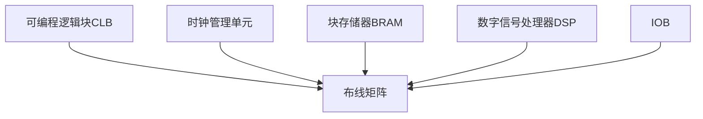

# 第1讲：FPGA架构基础

## 教学目标
1. 理解FPGA基本架构组成
2. 掌握可编程逻辑单元结构
3. 熟悉布线资源类型与特点
4. 了解现代FPGA的硬核资源

## 1.1 FPGA架构组成
### 核心组件框图


### 资源分布特征
| 资源类型       | 典型密度(Xilinx UltraScale+) | 布局特点          |
|----------------|-----------------------------|-------------------|
| CLB            | 1.5M LUTs                   | 均匀分布          |
| BRAM           | 4320个(36Kb)                | 列式分布          |
| DSP Slice      | 7680个                      | 模块化集群        |
| 时钟管理单元    | 32个CMT                     | 四角+中心分布     |

## 1.2 可编程逻辑单元
### LUT结构演进
```verilog
// 4输入LUT实现示例
module LUT4 (
    input [3:0] addr,
    output reg out
);
always @(*) begin
    case(addr)
        4'b0000: out = INIT[0];
        4'b0001: out = INIT[1];
        // ... 15个case分支
        4'b1111: out = INIT[15];
    endcase
end
endmodule
```

### 进位链结构
┌───────────┐    ┌───────────┐
│  LUT/REG  │───▶│ Carry Logic│───▶
└───────────┘    └───────────┘
    ▲                |
    └────────────────┘

## 1.3 布线资源
### 布线类型对比
| 类型          | 延迟(ps/mm) | 适用场景          | 可编程性        |
|---------------|-------------|-------------------|-----------------|
| 局部布线       | 50-100      | CLB内部连接       | 有限            |
| 双线互联       | 120-180     | 相邻CLB连接       | 中等            |
| 长线资源       | 80-150      | 全局信号传输      | 高              |
| 时钟树         | 40-60       | 时钟分布          | 固定            |

## 1.4 硬核模块
### PCIe Gen4控制器参数
```json
{
    "lane_rate": "16 Gb/s",
    "protocol": "PCIe 4.0",
    "lanes": 8,
    "features": [
        "DMA引擎",
        "MSI-X中断",
        "SR-IOV支持",
        "低延迟模式"
    ]
}
