本章主要围绕可编程逻辑器件的体系结构展开讨论。在上一讲中，已经从总体上介绍了可编程逻辑器件与专用集成电路之间的关系，本章则进一步聚焦于 FPGA 与 CPLD 本身，系统说明其发展脉络、典型编程工艺、基本结构、代表性产品架构以及工程应用特点。通过本章学习，读者应当能够从器件工艺、逻辑组织方式和系统应用三个层面理解 FPGA 与 CPLD 的差异，并为后续学习硬件描述语言、逻辑综合、时序约束和系统实现奠定必要的器件基础。全章内容大体按照“发展历史—编程工艺—器件结构—应用特点—工程选型”的逻辑展开。

## 学习目标

通过本章学习，读者应达到以下目标。首先，应能够准确理解 FPGA、CPLD、SPLD、PAL、PLA 等基本术语，并掌握可编程逻辑器件的发展历程。其次，应能够从编程工艺角度认识反熔丝、EPROM、EEPROM、Flash 和 SRAM 等技术的基本特点，理解这些工艺对器件易失性、可重编程性、功耗和可靠性的影响。再次，应能够从体系结构层面把握 CPLD 与 FPGA 的资源组织方式、逻辑实现机制和时序特征。最后，应能够结合实际工程需求，对 FPGA 与 CPLD 的适用场景进行初步分析，并形成基本的器件选型意识。

## 引例：为什么同样是可编程逻辑器件，FPGA 与 CPLD 的定位却并不相同

在数字系统设计实践中，设计者经常会面对这样的问题：某一功能究竟应当采用 CPLD 实现，还是应当直接采用 FPGA？例如，在一个嵌入式控制系统中，如果设计目标仅是完成电源时序控制、若干接口桥接以及少量状态机逻辑，那么选用大容量 FPGA 往往会造成资源浪费，并增加开发和成本负担；但如果系统需要完成高速数据采集、缓存管理、复杂协议处理或图像预处理等任务，则 CPLD 的逻辑容量和资源类型又往往难以满足需求。由此可见，虽然 FPGA 与 CPLD 同属可编程逻辑器件，但它们在内部结构和应用定位上并不相同。

要理解这种差异，不能仅仅停留在“容量大小不同”的表层结论上，而应当从可编程逻辑器件的发展历史、底层编程工艺以及资源组织方式出发，分析它们为何形成今天这样的结构形态。正是在这一意义上，本章不仅讨论“什么是 FPGA、什么是 CPLD”，更强调“为什么它们会形成这样的结构”，以及“这些结构差异将如何影响数字系统设计的方法、性能和适用场景”。

## 基本概念

现场可编程门阵列（Field-Programmable Gate Array，FPGA）是一类以查找表、触发器和可编程互连为核心资源构成的可编程逻辑器件。其主要特点在于逻辑容量较大、资源类型丰富、并行处理能力强，适合实现复杂的组合逻辑、时序逻辑、算术电路以及片上系统功能。现代 FPGA 通常还集成块存储器、DSP 单元、时钟管理模块以及高速接口等专用资源，因此已经不仅是一种逻辑替代器件，而是一种具有系统级实现能力的可重构硬件平台。

复杂可编程逻辑器件（Complex Programmable Logic Device，CPLD）则通常以乘积项逻辑和宏单元为基础，通过较规则的全局互连将多个逻辑块组织在同一芯片中。与 FPGA 相比，CPLD 的逻辑容量通常较小，但路径结构更规整、时序可预测性较好、上电行为明确，因此更适合完成接口转换、地址译码、电源管理、启动控制以及中小规模状态机设计等任务。

从体系结构角度看，FPGA 更接近一种细粒度的可重构逻辑阵列，其基本实现单元通常是 LUT 和寄存器；CPLD 则更接近由多个粗粒度逻辑块组成的结构，其基本实现单元通常围绕乘积项阵列和宏单元展开。正是这种结构层次上的差异，决定了二者在逻辑映射方式、时序特性和工程应用中的显著不同。

## 可编程逻辑器件发展历史

### 可编程逻辑器件的发展背景

可编程逻辑器件的发展，与数字系统规模持续扩大和设计复杂度不断提升密切相关。早期数字系统主要依赖中小规模标准逻辑器件进行搭接实现，这种方法在系统规模较小时较为直观，但随着电路复杂度增加，布线繁琐、调试困难、可靠性不足以及维护不便等问题逐渐显现。为提高设计灵活性和系统集成度，可编程逻辑器件逐步进入工程应用，并经历了从简单逻辑函数实现到复杂系统可重构实现的演进过程。

### 早期器件：PROM、PLA 与 PAL

最早期具有可编程逻辑实现意义的器件之一是 PROM。PROM 本质上是一种可编程只读存储器，其地址线可以视为逻辑输入，数据线可以视为逻辑输出。由于任意组合逻辑函数都可以表示为真值表，因此理论上 PROM 可以用于实现逻辑电路。然而，PROM 内部通常包含完整译码结构，当用于一般逻辑实现时，资源利用率往往较低，因此更适合作为存储器，而不是通用逻辑平台。

随后出现的 PLA（Programmable Logic Array）是专门面向逻辑函数实现而设计的器件。PLA 由可编程与阵列和可编程或阵列构成，能够较灵活地实现积之和形式的逻辑函数。它在逻辑表达能力方面优于 PROM，但由于两级可编程平面都会引入实现开销和传播延迟，因此其制造复杂度和速度性能受到一定限制。

为了在灵活性和实现代价之间取得平衡，PAL（Programmable Array Logic）被提出。PAL 仅保留可编程与阵列，而将或阵列固定化，从而降低了复杂度并改善了速度特性。PAL 及其衍生器件在较长时期内成为数字控制逻辑的重要实现平台，并对后续 CPLD 的架构思想产生了深远影响。

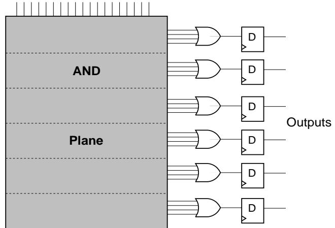  
**图：PAL（可编程阵列逻辑）结构示意图**

### 从 SPLD 到 CPLD，再到 FPGA

PLA、PAL 以及与其结构相近的器件通常被归入简单可编程逻辑器件（SPLD）范畴。此类器件具有成本较低、引脚到引脚速度较快等特点，适合实现规模较小的逻辑功能。然而，随着系统规模进一步扩大，单个 SPLD 的容量很快成为限制因素。于是，设计者开始将多个类似 SPLD 的逻辑块集成到一颗芯片中，并通过可编程互连将其连接起来，这便形成了 CPLD 的基本思想。

再进一步，随着半导体工艺和可编程互连技术的发展，另一条演进路线逐渐成熟，即以查找表和细粒度可编程布线为核心的 FPGA 架构。与 CPLD 相比，FPGA 的逻辑粒度更细，资源种类更丰富，更适合复杂逻辑、大规模并行运算和系统级设计，因此逐步成为高容量可编程逻辑器件的主流形态。

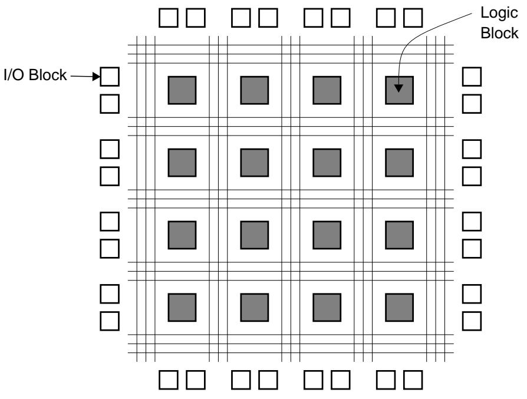  
**图：FPGA 结构示意图**

从发展脉络看，可编程逻辑器件的演进可以概括为：从实现少量逻辑函数的可编程器件，逐步发展为能够承担复杂控制、数据通路和片上系统功能的可重构硬件平台。这一演进过程也说明，FPGA 与 CPLD 并非简单的容量差异，而是两种不同的体系结构路线。

## 可编程逻辑器件的典型工艺

可编程逻辑器件之所以能够在制造完成后仍由用户定义逻辑功能，关键在于其内部具有可编程连接或可编程存储机制。不同器件所采用的编程工艺，直接影响其是否可重复编程、是否易失、上电方式、功耗特征以及可靠性。

### 反熔丝工艺

反熔丝（Antifuse）是一类典型的一次性可编程技术。其基本思想是在未编程状态下保持开路，而在施加编程电压后击穿绝缘层，从而形成永久性导电通路。由于连接一旦形成便不可逆，因此反熔丝器件具有非易失性、配置稳定、抗干扰能力强以及保密性较好的特点，在航天、国防和高可靠场景中具有特殊意义。

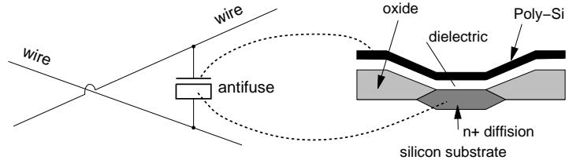  
**图：Actel 反熔丝结构示意图**

以 Actel 公司提出的 PLICE 结构为例，反熔丝位于两条互连导线之间，由导体层和绝缘层组成。未编程时绝缘层将上下导体隔离；编程后绝缘层局部击穿并形成低电阻连接。反熔丝尺寸较小、寄生效应较低，因此有利于提供较密集的布线资源和较精细的逻辑结构。但其缺点同样明显，即器件不能反复修改，一旦设计错误或编程失败，往往只能更换器件。

### PROM、EPROM 与 EEPROM 工艺

浮栅晶体管技术在可编程逻辑器件中也得到广泛应用。EPROM 和 EEPROM 都利用浮栅存储电荷，通过改变晶体管阈值来表示编程状态。EPROM 需要借助紫外线擦除，使用不够方便，因此主要具有历史意义。EEPROM 支持电擦写，在早期 SPLD 和部分 CPLD 中应用较多。此类工艺的突出特点是非易失性，即断电后配置信息仍可保留。

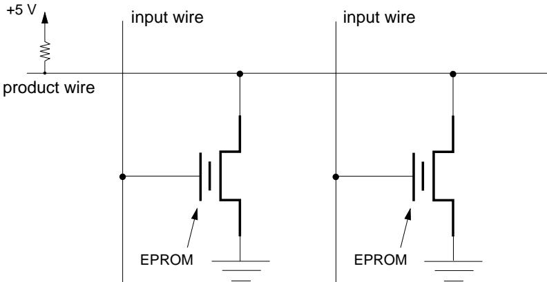  
**图：EPROM 可编程开关结构图**

在 CPLD 或类似 PAL 的结构中，浮栅晶体管常被放置在与阵列或互连路径中，用作可编程开关。当某输入参与乘积项实现时，相应开关导通；若不参与，则通过编程将其永久关闭。EEPROM 器件的工作机理与此类似，只是在擦写方式和可用性方面更适合工程应用。

### SRAM 工艺

现代主流 FPGA 最常采用的配置技术是 SRAM。SRAM 型器件利用静态存储单元保存配置信息，这些配置信息既可以控制可编程开关，也可以作为 LUT 的真值表内容。由于 SRAM 单元读写速度快、可反复配置，并且易于结合先进 CMOS 工艺，因此特别适合实现高密度、细粒度和可重构的 FPGA 架构。

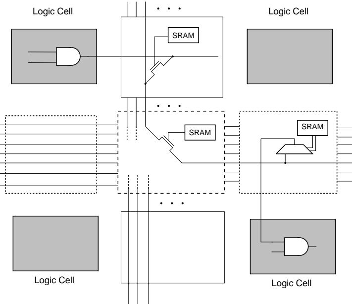  
**图：SRAM 控制的可编程开关**

在采用 SRAM 工艺的 FPGA 中，SRAM 单元通常承担三类任务：其一，用作 LUT 的内容存储，以实现组合逻辑；其二，用于控制布线开关和多路选择器；其三，用作片上嵌入式存储资源的一部分。SRAM 工艺的最大优点在于灵活性强，设计者可以多次下载配置文件反复修改设计，部分器件还支持在线重配置或局部重配置。然而，SRAM 属于易失性存储，一旦断电，配置数据会丢失，因此通常需要借助外部配置存储器或片上非易失性存储机制完成上电加载。

需要说明的是，SRAM 的“高速、高耐久性、便于反复配置”等优势主要体现在其作为配置存储和高速存储单元的属性上；而其“易失性、静态功耗较高”等问题，也正是 SRAM 型 FPGA 在系统设计中需要特别考虑的方面。因此，SRAM 工艺是否适合某类器件，并不取决于单一指标，而取决于对容量、性能、重配置能力和启动方式的综合权衡。

### Flash 工艺

Flash 工艺同样基于浮栅存储原理，但通常具有更高的集成密度和更低的静态功耗。真正的 Flash 型 FPGA 或 PLD 是以 Flash 单元作为主要配置存储资源，而不仅仅是在器件内部增加一块 Flash 用于上电时向 SRAM 加载配置数据。Flash 型器件具有非易失性、上电即用、待机功耗低等优点，在低功耗系统、控制系统和部分高可靠场景中具有明显优势。

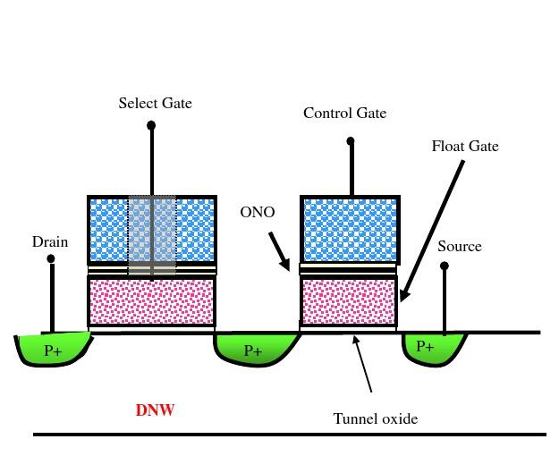  
**图：Flash 器件结构图**

从器件特性上看，Flash 工艺通常支持多次擦写，断电后配置信息仍可保留，且对某些辐射环境具有较好的适应性。但与 SRAM 相比，Flash 的擦写速度和擦写寿命通常有限，在高密度细粒度逻辑重构方面不如 SRAM 灵活。因此，Flash 更常见于非易失性可编程逻辑器件，而 SRAM 则依然是高容量主流 FPGA 的核心配置技术。

### 编程工艺对比分析

从工程视角看，不同工艺并无绝对优劣，而是面向不同设计目标。反熔丝强调一次性固化、高可靠和高安全性；EPROM、EEPROM 与 Flash 强调非易失性和可重复编程；SRAM 则强调高密度、可反复下载和复杂重构能力。正因如此，在分析器件时，不应仅根据“是否先进”来评价某种工艺，而应结合器件用途、启动方式、功耗预算、可靠性要求和开发流程进行理解。

| 工艺 | 可重复编程 | 易失性 | 主要特点 | 典型适用场景 |
| --- | --- | --- | --- | --- |
| 熔丝/反熔丝 | 否 | 否 | 一次性编程，稳定性高，保密性好 | 航天、高可靠、安全敏感场景 |
| EPROM | 是，但擦除不便 | 否 | 需紫外擦除，具有历史意义 | 早期可编程器件 |
| EEPROM | 是 | 否 | 电擦写，适合中小规模非易失配置 | 早期 PLD、参数存储 |
| Flash | 是 | 否 | 非易失、功耗低、上电即用 | 低功耗 PLD、控制型器件 |
| SRAM | 是 | 是 | 高密度、可重复配置、适合细粒度重构 | 主流 FPGA |

## CPLD 原理及结构

CPLD 的核心思想，是将多个类似 SPLD 的逻辑块集成在同一芯片上，并通过规则化的全局互连实现中等规模逻辑设计。其基本逻辑块通常围绕与阵列、乘积项、或逻辑以及寄存器构成，这种结构直接继承了 PAL 类器件的设计思路，因此在实现控制逻辑、译码逻辑和状态机时具有较高效率。

与 FPGA 相比，CPLD 的结构更规整、路径更固定。也正因为如此，CPLD 在很多情况下具有较好的时序可预测性。对于接口控制、系统上电管理和状态机实现而言，这种确定性往往比单纯的逻辑容量更为重要。CPLD 的工程价值，正是在于它以较低复杂度提供了较高的控制逻辑实现效率。

### Altera CPLD 架构

Altera 的 MAX 系列是经典的 CPLD 产品，其中 MAX 7000 系列在教学与工程文献中具有较强代表性。该系列通常由若干逻辑阵列块（LAB）和可编程互连阵列（PIA）构成，输入输出既可以连接到逻辑块，也可以接入全局互连。每个 LAB 又包含多个宏单元，宏单元内部以乘积项逻辑、或逻辑和寄存器为核心，实现组合逻辑或时序逻辑功能。

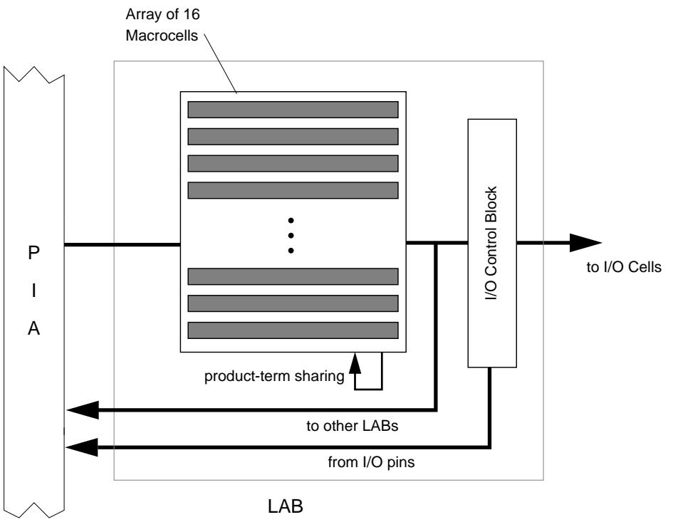  
**图：Altera MAX7000 的逻辑阵列块（LAB）**

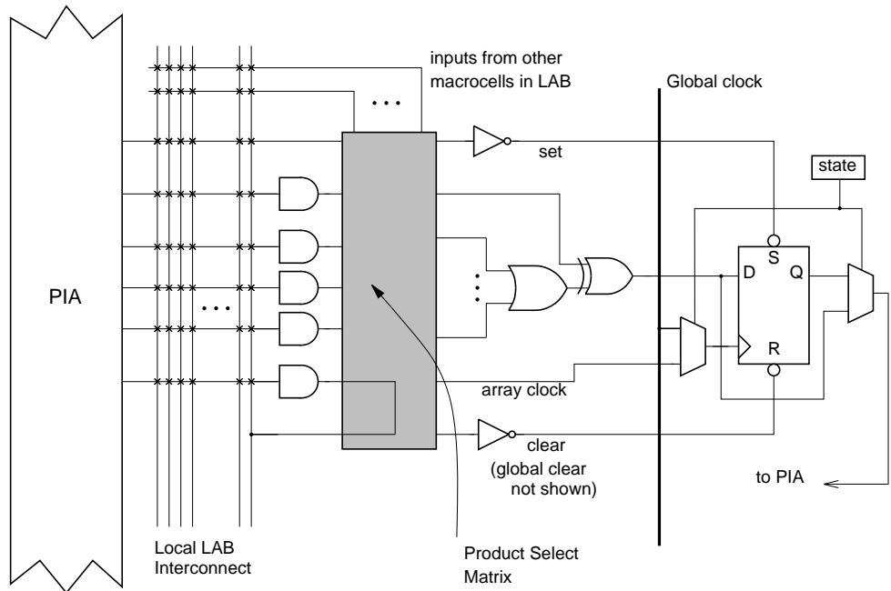  
**图：MAX7000 宏单元结构**

MAX 7000 系列的一个重要特点在于宏单元之间可以共享乘积项，从而提高芯片面积利用率，并增强复杂控制逻辑的表达能力。这种结构体现了典型 CPLD 的设计哲学，即通过较强的块内逻辑能力和较规则的块间互连，实现中等规模控制逻辑的高效映射。

### AMD Mach 系列 CPLD

AMD（历史上与 PAL 技术关系密切）推出的 Mach 系列也是典型 CPLD 架构代表。以 Mach 4 为例，该器件由多个类似 PAL 的逻辑块组成，并通过中央交换矩阵进行互连。由于不同块之间的连接都经过统一的中心路径，因此其路径延迟相对可预测，这对于确定性时序设计具有重要意义。

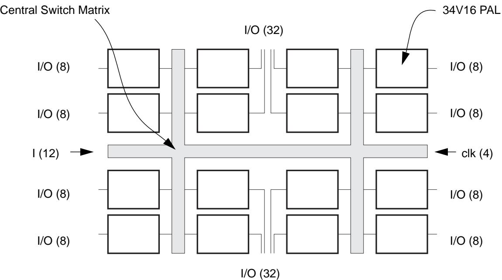  
**图：AMD Mach 4 CPLD 结构示意图**

Mach 4 的逻辑块中引入了乘积项分配器和输出交换矩阵，使得乘积项共享和引脚分配具有更高灵活性。与传统 PAL 相比，这种结构明显增强了器件的表达能力与可用性，也说明 CPLD 并不是简单地“把多个 PAL 拼接起来”，而是在系统层面对逻辑块和互连进行了进一步优化。

### Lattice CPLD

Lattice 的 pLSI 和 ispLSI 系列同样具有代表性。其整体结构通常由若干通用逻辑块（GLB）和全局路由池（GRP）构成。逻辑块承担类似 PAL 的逻辑实现任务，而全局路由池负责连接各逻辑块及 I/O。由于互连结构较规则，其时序特性也具有较高可预测性。

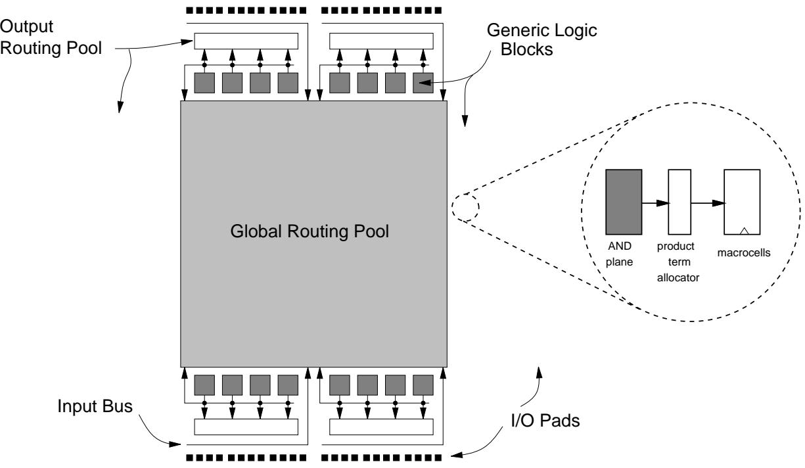  
**图：Lattice (i)PLSI 架构图**

Lattice CPLD 的工程定位与前述产品相似，主要面向控制逻辑、接口逻辑和中等规模数字系统。其价值不在于提供尽可能大的逻辑容量，而在于提供结构清晰、时序明确且易于使用的控制型平台。

### Cypress CPLD

Cypress 的 FLASH370 系列采用 Flash EEPROM 技术，体现了另一种典型 CPLD 实现路径。其内部仍然采用多逻辑块与可编程互连矩阵的典型 CPLD 架构，但在非易失配置和 I/O 资源组织方面具有自身特点。

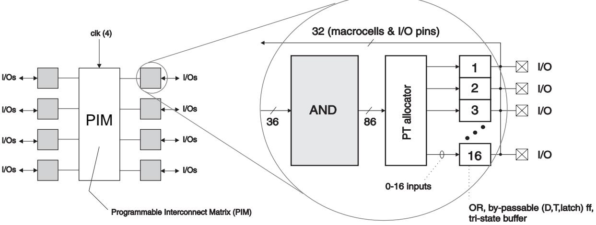  
**图：Cypress FLASH370 CPLD 架构图**

该类器件通常具有较多 I/O 资源，适合接口密集型应用。其结构说明，CPLD 的设计重点始终围绕三个关键词展开，即控制逻辑、确定性时序和较高的 I/O 组织效率。

### Xilinx XC7000 与 XC9500 系列

Xilinx 虽然以 FPGA 著称，但同样推出过 XC7000 和 XC9500 等 CPLD 系列。XC9500 作为较成熟的一代产品，在系统内编程、速度和逻辑容量方面较早形成较完整的 CPLD 产品特征。该类器件再次说明，CPLD 与 FPGA 并不是厂商维度上的简单区分，而是两类不同的架构路线。

### CPLD 的应用特点

CPLD 由于采用较规整的乘积项逻辑和全局互连结构，特别适合实现宽组合逻辑、接口译码、电源时序控制和中小规模状态机。在工业控制、电源管理、嵌入式外围控制和通信接口逻辑中，CPLD 长期具有稳定应用。其最显著的优势在于速度性能较可预测、设计修改方便，并且在许多场合能够以较低成本替代多个离散逻辑器件。

## FPGA 原理及结构

与 CPLD 的乘积项结构不同，FPGA 的基本逻辑思想是利用查找表实现组合逻辑，再通过触发器和可编程互连构成复杂数字系统。一个 K 输入 LUT 可以看作一个 `2^K × 1` 的小型存储结构，其输入变量作为地址，存储内容作为逻辑输出。只要将目标逻辑函数的真值表写入 LUT，就可以实现任意 K 输入组合逻辑。这种结构具有很强的通用性，也是 FPGA 能够支持复杂可重构逻辑的根本原因。

### Xilinx 基于 SRAM 的 FPGA：XC4000 系列

Xilinx 的 XC4000 系列是经典 SRAM 型 FPGA 架构代表。该系列采用二维逻辑块阵列结构，逻辑块之间通过水平和垂直布线通道互连。其核心逻辑块 CLB 内部包含多个 LUT、触发器和算术优化资源，可用于实现较复杂的组合逻辑和时序逻辑。

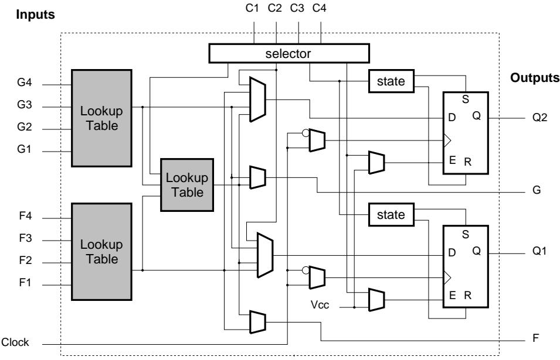  
**图：Xilinx XC4000 可配置逻辑块（CLB）**

XC4000 架构说明，FPGA 的基本能力不仅在于实现一般逻辑，还在于通过快速进位链、可配置 RAM 等方式提升特定逻辑类型的实现效率。事实上，从这一代产品开始，FPGA 已经明显超越了“简单逻辑替代器件”的范畴。

与逻辑块同样重要的是互连结构。FPGA 的可编程互连网络通常由不同长度的线段和开关矩阵构成，信号从一个逻辑块传输到另一个逻辑块时，需要经过一定数量的可编程开关。因此，电路最终的速度性能不仅取决于逻辑功能本身，也取决于布局布线工具如何分配线段和优化路径。

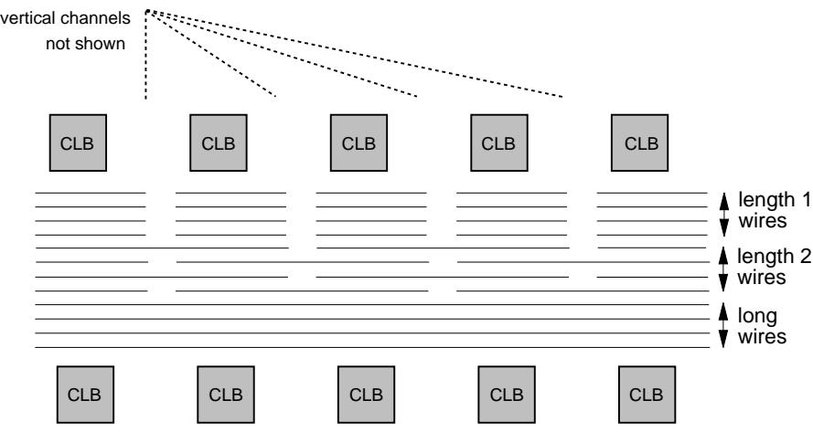  
**图：Xilinx XC4000 线段示意图**

这也是 FPGA 与 CPLD 之间的重要差别之一。CPLD 往往依赖较固定的全局路径，因此时序更容易预测；而 FPGA 由于互连结构高度灵活，其最终性能更强，但也更依赖工具和约束。

### 现代 FPGA 架构案例：以 Artix-7 相关器件为例

为了便于理解现代 FPGA 的资源构成，可以以 7 系列 FPGA 的教学型器件为例进行说明。现代 FPGA 的主体仍由输入输出模块、可配置逻辑块、互连资源构成，但在此基础上通常还集成块 RAM、DSP 切片、时钟管理模块、模数转换模块以及高速接口资源等。需要注意的是，不同家族、不同型号和不同封装的资源配置存在差异，因此教材中的结构介绍更强调架构思想，而不应将某一具体型号的全部资源视为所有器件的共同特征。

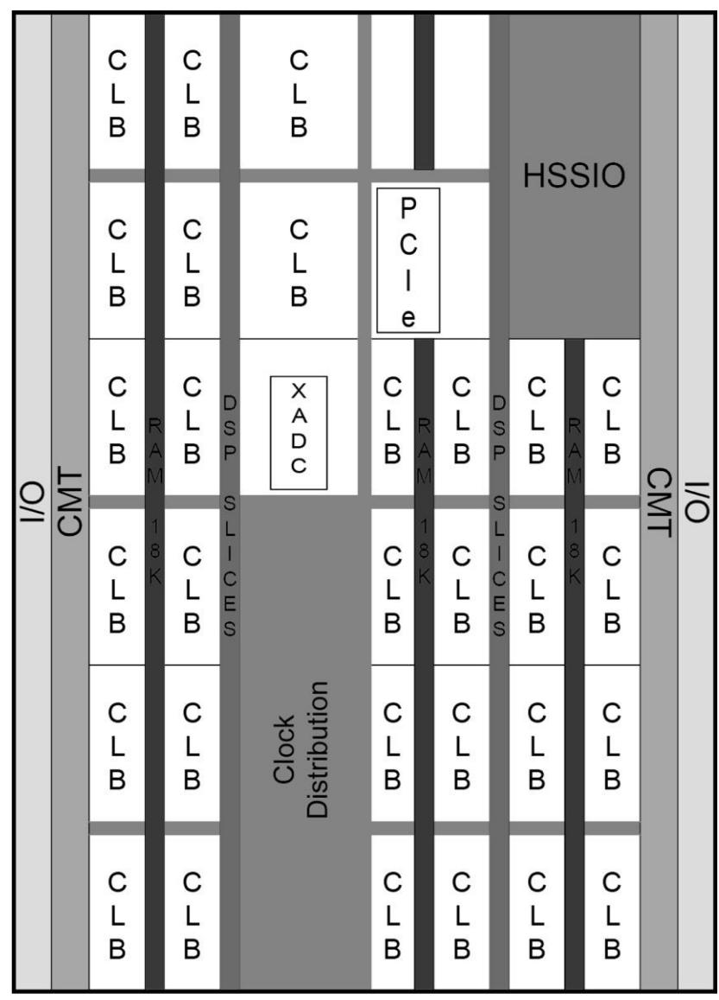  
**图：Artix-7 相关器件的基本组成示意图**

#### 输入/输出块

数字系统通过输入输出引脚与外部世界交互，FPGA 也不例外。输入输出块负责完成电平标准适配、输入采样、输出驱动以及双向通信控制等任务。现代 FPGA 的 I/O 通常按 Bank 组织，以支持不同的电压标准和接口模式。在工程实践中，I/O 的正确理解不仅关系到逻辑功能实现，还关系到引脚约束、电气兼容性以及系统级接口设计。

#### 可配置逻辑块（CLB）

可配置逻辑块是 FPGA 中实现数字逻辑的基本资源单元。其核心通常包括 LUT、触发器、进位链和多路选择资源。为了帮助初学者理解逻辑资源的基本构成，可以先从多路复用器和触发器的抽象概念出发，再理解 LUT 的本质。

多路复用器是一类典型的选择电路，其核心功能是在多个输入中选择一路送往输出。它不仅是组合逻辑中的基础模块，也是 FPGA 内部实现可编程连接的重要结构之一。

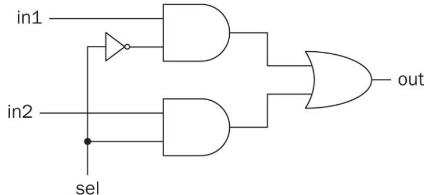  
**图：二选一多路复用器电路图**

触发器则是 FPGA 中最基本的时序存储单元之一，用于在时钟控制下保存一位数据。寄存器、计数器、状态机等时序电路，本质上都依赖触发器构成。

  
**图：触发器的抽象表示**

需要特别说明的是，LUT 并不是“由触发器构成的查找表”。更准确地说，LUT 是由配置存储单元与多路选择网络共同构成的组合逻辑实现结构，其功能是用存储内容表示真值表，再通过输入变量选择对应输出。图中的示意可帮助理解 LUT 的抽象工作方式，但在器件物理实现上，LUT 与普通触发器并不是同一种资源。

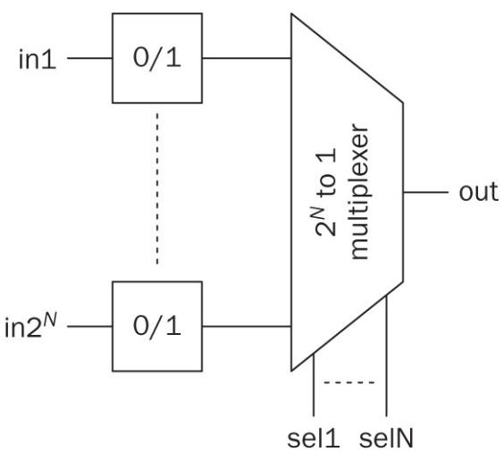  
**图：N 输入 LUT 的抽象表示**

现代 FPGA 中，多个 LUT 和触发器可以组合实现更宽输入的组合逻辑函数，也可以构成寄存器阵列、状态机和算术逻辑结构。由此可见，FPGA 的逻辑资源并非围绕某一种固定电路搭建，而是围绕“通用可配置逻辑单元”组织。

#### 互连资源

互连资源由导线和可编程开关组成，负责连接 FPGA 中的逻辑块、存储块、DSP 单元以及 I/O 资源。虽然初学者在使用开发工具时通常不直接操控这些互连，但互连始终是影响性能的关键因素之一。一个功能正确的设计，若布局布线后关键路径过长，仍然可能无法满足工作频率要求。因此，理解互连的重要性，是 FPGA 学习中的关键环节。

#### 块 RAM

除分布式逻辑资源外，现代 FPGA 还集成块 RAM，用于实现较大容量的片上存储。块 RAM 可构成 FIFO、缓冲区、查找表扩展、双口存储器等结构，在数据采集、协议处理和图像缓存中具有重要作用。它的引入使 FPGA 从“纯逻辑实现平台”进一步发展为“逻辑与存储协同平台”。

#### DSP 切片

现代 FPGA 中常集成专用数字信号处理单元，如乘法器、乘加器、累加器和逻辑运算单元等。与用普通 LUT 和寄存器拼接算术电路相比，DSP 切片在速度、面积和功耗方面通常更具优势，因此在数字滤波、控制算法、图像处理和机器学习推理等应用中被广泛采用。

#### 时钟管理

时钟是同步数字系统的基础。FPGA 一般通过专用时钟输入和片上时钟管理资源，对外部时钟进行缓冲、倍频、分频、相位调整和全局分配。现代 FPGA 的时钟网络通常具有较强的专用性和层次性，其设计质量直接决定整个系统的同步性与稳定性。

#### 模拟接口与高速接口资源

部分 FPGA 家族或具体型号还集成模数转换模块、高速串行收发器以及 PCIe 等专用接口资源。这些资源使 FPGA 可以更方便地进入数据采集、高速通信和异构计算等领域。需要强调的是，此类资源并非所有 FPGA 型号都具备，因此在具体设计时必须以对应器件的数据手册为准。

### Altera FLEX 8000 与 FLEX 10K

Altera 的 FLEX 8000 系列具有一定层次化特征，其底层逻辑资源采用 LUT，而非 CPLD 中常见的乘积项结构，因此通常归入 FPGA 范畴。FLEX 8000 的基本逻辑单元为逻辑元素（LE），其中包含 4 输入 LUT、触发器以及用于算术运算的快速进位资源。

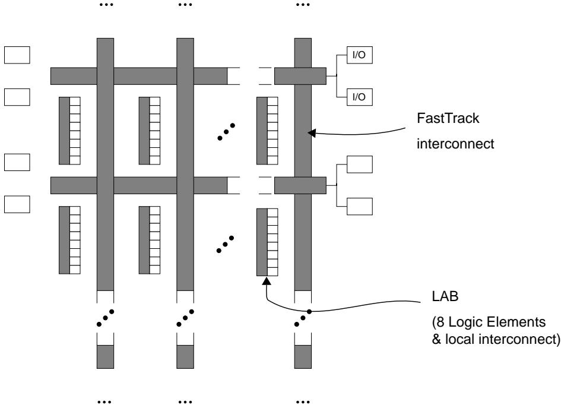  
**图：Altera FLEX 8000 FPGA 架构**

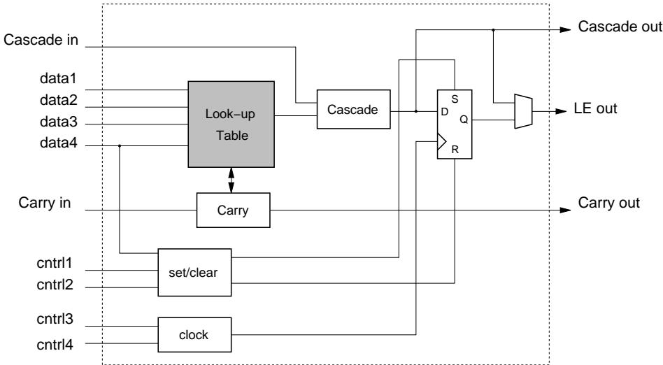  
**图：Altera FLEX 8000 逻辑单元（LE）**

多个 LE 被组织为逻辑阵列块（LAB），LAB 内部具有本地互连，同时与全局互连资源相连。这种结构既保留了 FPGA 的可重构逻辑优势，也借鉴了 CPLD 中分层组织的思想。

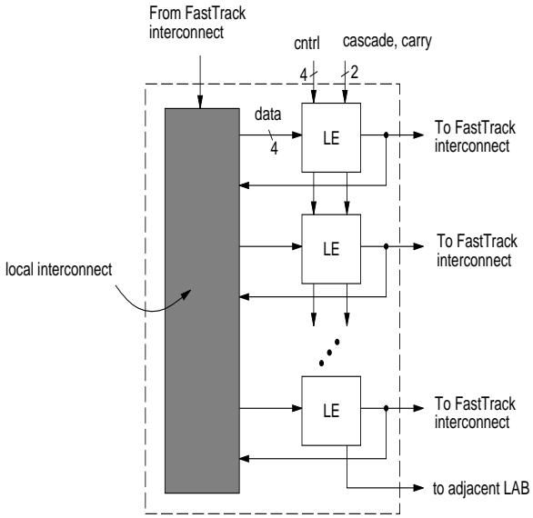  
**图：Altera FLEX 8000 逻辑阵列块（LAB）**

在 FLEX 10K 中，又进一步引入了嵌入式阵列块（EAB），用于实现片上 SRAM 或更复杂的逻辑结构。这说明 FPGA 的演进方向并不只是增加逻辑单元数量，更在于不断引入新的专用资源，使器件逐步具备系统级实现能力。

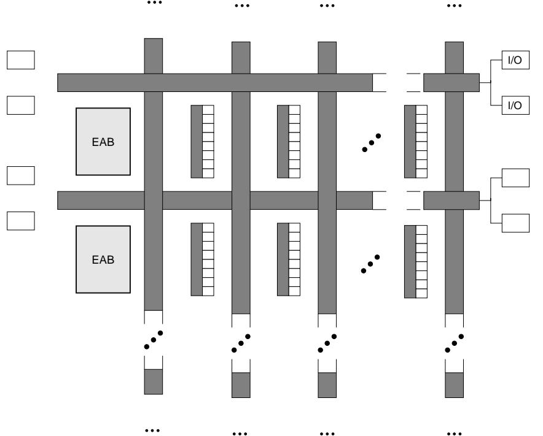  
**图：Altera FLEX 10K FPGA 架构**

## FPGA 的应用与设计特点

FPGA 之所以在现代数字系统中占据重要地位，并不仅仅因为它“可以编程”，更重要的是它能够在硬件层面实现真正的并行结构。与软件编程的顺序执行方式不同，硬件描述语言所描述的是一组并行工作的逻辑结构，因此 FPGA 特别适合数据通路密集、并行性强、实时性要求高的场景。

在应用层面，FPGA 广泛用于通信基带处理、工业控制、图像与视频处理、嵌入式系统加速、人工智能推理、网络协议卸载以及 ASIC 原型验证等领域。其价值主要体现在三个方面：其一，具有较强的并行处理能力，适合高吞吐实时系统；其二，具有较高的灵活性，便于快速迭代和原型开发；其三，能够通过片上专用资源实现较高的系统集成度。

当然，FPGA 设计也并非没有挑战。与 CPLD 相比，FPGA 更依赖综合与布局布线工具，时序收敛问题更突出；与软件开发相比，FPGA 对设计者的同步时序思维、资源映射意识和硬件结构理解提出了更高要求。因此，学习 FPGA 并不仅仅是在学习一种芯片，而是在学习一种面向并行硬件结构的系统设计方法。

## 基于 FPGA 的数字系统设计思维

在基于 FPGA 的数字系统设计中，设计者不应简单沿用软件编程的串行思维，而应建立面向并行硬件结构的设计观念。硬件描述语言的本质，不是编写一段按顺序执行的程序，而是描述一个能够在时钟驱动下并行工作的数字系统。因此，设计者需要从时钟域划分、寄存器边界、数据通路、控制通路、流水线深度和资源复用方式等角度进行建模。

与离散逻辑器件设计相比，FPGA 具有更高集成度和可重构性；与 ASIC 相比，FPGA 在原型开发和设计迭代方面具有更高效率；与微控制器相比，FPGA 能够在硬件层面实现真正的并行处理，并在固定功能场景下获得更高吞吐率。正因如此，FPGA 设计不仅是一种器件使用方法，更是一种强调结构优化、时序组织和资源平衡的系统设计思想。

## FPGA 与 CPLD 的主要区别

从体系结构上看，FPGA 采用以 LUT 与寄存器为核心的细粒度结构，逻辑规模大，资源类型丰富，适合复杂数据通路、大规模并行处理和系统级实现；CPLD 则采用以乘积项和宏单元为核心的粗粒度结构，路径相对规则，时序可预测性较好，更适合控制逻辑和接口逻辑。

从资源角度看，FPGA 通常集成块 RAM、DSP、时钟管理和多种专用接口资源，而 CPLD 更强调控制逻辑能力和上电可用性。就应用场景而言，若系统重点在于复杂算法、高速处理、协议栈实现和硬件加速，则 FPGA 更为合适；若系统重点在于上电控制、接口桥接、低复杂度状态机和确定性控制，则 CPLD 往往更经济有效。

## 选型建议

在实际工程中，器件选型不应仅根据“逻辑容量”这一单一指标做出，而应综合考虑功能复杂度、启动方式、时序确定性、功耗预算、开发周期和成本约束。若系统需要快速启动、逻辑规模适中且以控制功能为主，CPLD 通常是更合适的选择。若系统需要复杂算法、较大逻辑容量、丰富片上资源或高速并行处理能力，则 FPGA 更具优势。对于很多复杂产品而言，两类器件甚至可以协同使用，由 CPLD 负责上电与外围管理，由 FPGA 负责主数据通路和核心算法实现。

## 本章小结

本章围绕 FPGA 与 CPLD 的架构基础展开讨论。首先，从基本概念出发，说明了 FPGA 与 CPLD 同属可编程逻辑器件，但在底层结构和工程定位上存在显著差异。随后，结合 PROM、PLA、PAL、CPLD 和 FPGA 的发展脉络，梳理了可编程逻辑器件由简单逻辑实现平台向复杂系统实现平台演进的历史过程。

在此基础上，本章进一步介绍了反熔丝、EPROM、EEPROM、Flash 和 SRAM 等典型编程工艺，说明了不同工艺对器件可重编程能力、易失性、功耗和可靠性的影响。接着，从体系结构层面分析了 CPLD 的宏单元与全局互连结构，以及 FPGA 的 LUT、触发器、互连网络、块 RAM、DSP 和时钟管理资源，揭示了二者在逻辑实现机制上的本质差异。

最后，本章结合典型历史架构和现代器件案例，讨论了 FPGA 与 CPLD 的应用定位及选型依据。总体而言，CPLD 更适合控制类和接口类设计，FPGA 更适合复杂逻辑、大规模并行处理和系统级实现。理解这些内容，将为后续学习硬件描述语言、逻辑综合与时序分析奠定必要的器件基础。

## 术语表

| 术语 | 英文全称 | 含义说明 |
| --- | --- | --- |
| PLD | Programmable Logic Device | 可编程逻辑器件的总称。 |
| SPLD | Simple Programmable Logic Device | 简单可编程逻辑器件，如 PLA、PAL、GAL 等。 |
| CPLD | Complex Programmable Logic Device | 复杂可编程逻辑器件，通常采用宏单元和全局互连结构。 |
| FPGA | Field-Programmable Gate Array | 现场可编程门阵列，通常采用 LUT 与可编程互连结构。 |
| PLA | Programmable Logic Array | 可编程逻辑阵列，包含可编程与阵列和可编程或阵列。 |
| PAL | Programmable Array Logic | 可编程阵列逻辑，通常仅与阵列可编程。 |
| LUT | Look-Up Table | 查找表，用于实现组合逻辑函数。 |
| CLB | Configurable Logic Block | 可配置逻辑块，是 FPGA 的基本逻辑资源之一。 |
| LAB | Logic Array Block | 逻辑阵列块，是某些 CPLD/FPGA 架构中的逻辑组织单元。 |
| Macrocell | 宏单元 | CPLD 中的基本逻辑实现单元，通常包含乘积项逻辑和寄存器。 |
| BRAM | Block RAM | FPGA 内部块存储器资源。 |
| DSP Slice | DSP 切片 | FPGA 中用于算术和信号处理的专用硬件单元。 |
| Antifuse | 反熔丝 | 一次性可编程连接技术，编程后形成永久导通路径。 |
| EEPROM | Electrically Erasable Programmable Read-Only Memory | 电可擦除可编程只读存储器。 |
| Flash | Flash Memory | 一类非易失性浮栅存储技术，可用于器件配置。 |
| SRAM | Static Random Access Memory | 静态随机存取存储器，现代 FPGA 常用配置技术。 |

## 习题与思考

1. 试结合 PROM、PLA、PAL、CPLD 与 FPGA 的发展过程，说明可编程逻辑器件的演进反映了数字系统设计需求的哪些变化。  
2. 为什么说 FPGA 与 CPLD 的差异不仅是逻辑容量不同，而是体系结构层面的差异？  
3. 请比较反熔丝、Flash 和 SRAM 三类编程工艺的优缺点，并分析它们分别适合哪些应用场景。  
4. 为什么 CPLD 通常具有较好的时序可预测性？这一特点在工程实践中有哪些价值？  
5. 试说明 LUT、触发器和可编程互连在 FPGA 中分别承担什么作用。  
6. 若某系统需要完成电源时序控制、接口桥接和少量状态机逻辑，应优先考虑 FPGA 还是 CPLD？请说明理由。  
7. 若某系统需要完成高速数据采集、滤波、缓存和复杂协议处理，应优先考虑 FPGA 还是 CPLD？请说明理由。  
8. 查阅一种当前主流 FPGA 或 CPLD 器件的数据手册，概括其主要资源构成，并分析其适合的应用领域。  

## 课程作业：器件架构比较与选型分析

请围绕“某一具体数字系统应选择 FPGA 还是 CPLD”完成一份器件选型作业。作业要求如下：

1. 自拟一个应用场景，例如电源时序控制板、接口桥接模块、简易逻辑控制器、高速数据采集系统或图像预处理系统；
2. 明确系统功能需求，包括逻辑复杂度、启动时间、实时性、接口数量、资源规模和后续可扩展性；
3. 选择至少一款 FPGA 和一款 CPLD 器件作为候选方案，整理其逻辑资源、配置方式、时钟资源、存储资源和典型应用定位；
4. 从体系结构、编程工艺、时序可预测性、功耗、成本和开发便利性六个方面比较两类器件；
5. 给出最终选型结论，并说明为什么另一类器件不作为当前方案首选；
6. 若认为两类器件可以协同使用，可进一步给出一个“CPLD 负责管理、FPGA 负责计算”的系统分工建议。

## 作业报告要求

本章作业报告应至少包含以下内容：

1. 应用场景与功能需求描述；
2. 候选 FPGA 与 CPLD 器件简介；
3. 两类器件的资源与架构对比表；
4. 选型分析过程与判断依据；
5. 最终推荐方案与个人结论。

## 阅读建议

建议读者在学习本章后，进一步查阅典型 FPGA 与 CPLD 器件的数据手册和用户指南，重点关注逻辑资源、存储资源、时钟资源以及配置方式的说明。对于初学者而言，理解器件手册中关于架构框图、资源规模和配置流程的表述，比单纯记忆型号参数更为重要。若后续希望深入芯片设计或高性能数字系统设计，还可进一步阅读关于 LUT 映射、时序驱动布局布线和片上互连优化的相关资料。

