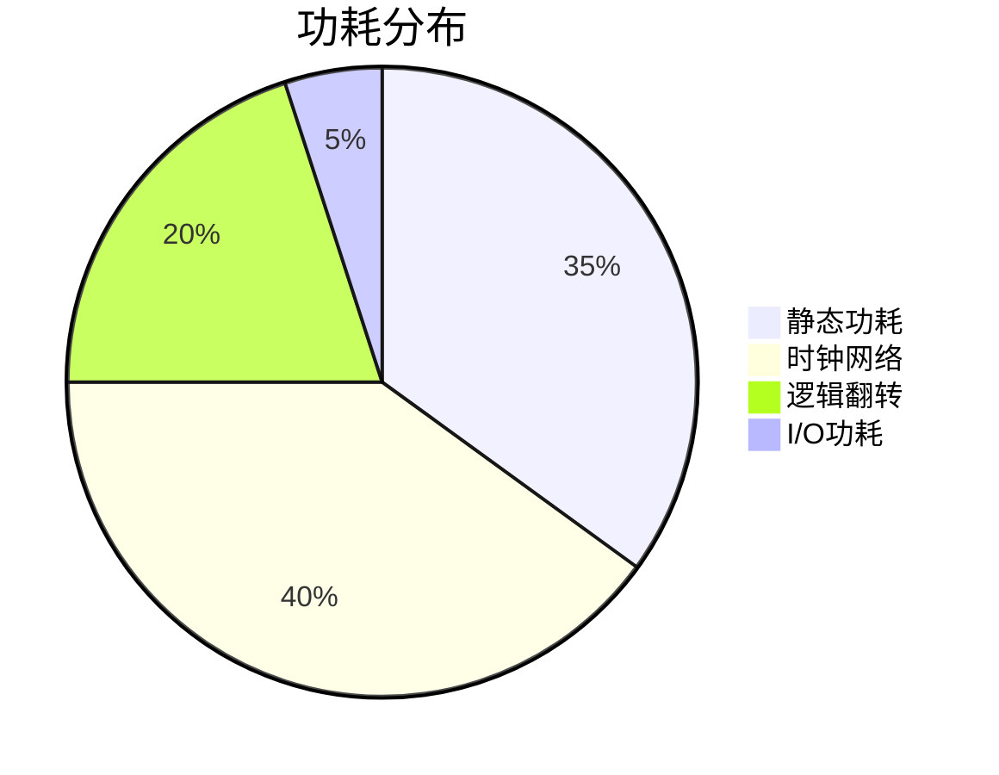

# 第3讲：数字系统设计方法学

## 3.1 同步设计黄金准则
### 基本设计原则
1. 单时钟域内使用同一时钟边沿
2. 所有寄存器必须由复位信号初始化
3. 避免使用组合逻辑反馈环路
4. 时钟使能信号必须同步处理

### 时钟质量要求
| 参数          | 推荐值       | 测量方法               |
|---------------|-------------|-----------------------|
| 时钟抖动       | < 50ps      | 周期到周期测量         |
| 占空比失真     | < 5%        | 高电平持续时间测量     |
| 时钟偏斜       | < 100ps     | 时钟树末端差异测量     |

## 3.2 时序路径分析
### 建立/保持时间公式
```
建立时间裕量 = T周期 - (Tclk2q + Tcomb + Tsetup)
保持时间裕量 = Tclk2q + Tcomb - Thold
```

### 时序约束示例
```tcl
create_clock -name sys_clk -period 10 [get_ports clk]
set_input_delay -clock sys_clk 2 [all_inputs]
set_output_delay -clock sys_clk 3 [all_outputs]
```

## 3.3 跨时钟域同步
### 同步技术对比
| 方法         | 延迟周期 | 适用场景           | 可靠性       |
|--------------|---------|--------------------|-------------|
| 双锁存器     | 2       | 单bit信号          | 高          |
| 握手协议     | 4+      | 控制信号           | 极高        |
| 异步FIFO     | N+2     | 数据总线           | 最高        |
| 脉冲展宽     | 3       | 低频脉冲信号       | 中等        |

### 异步FIFO结构
┌───────────┐     ┌───────────┐
│ 写时钟域  │     │ 读时钟域  │
│ 写指针    │◀─格雷码─│ 读指针    │
│ 存储器    │     │ 空满判断  │
└───────────┘     └───────────┘

## 3.4 低功耗设计
### 功耗构成分析


### 时钟门控实现
```verilog
always @(posedge clk) begin
    if (enable) begin
        gated_clk <= ~gated_clk;
    end
end

assign clk_gated = gated_clk & clk;
