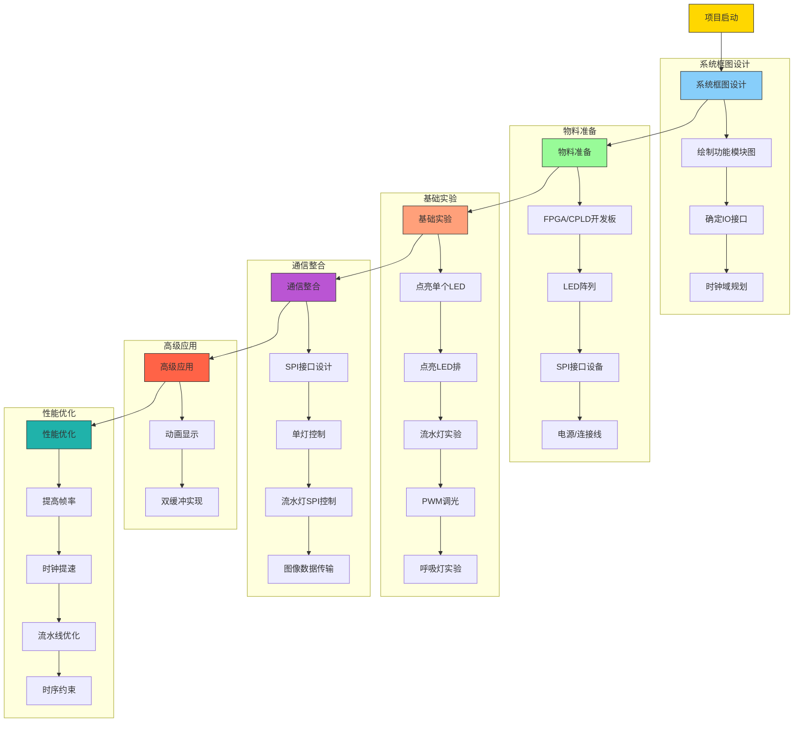
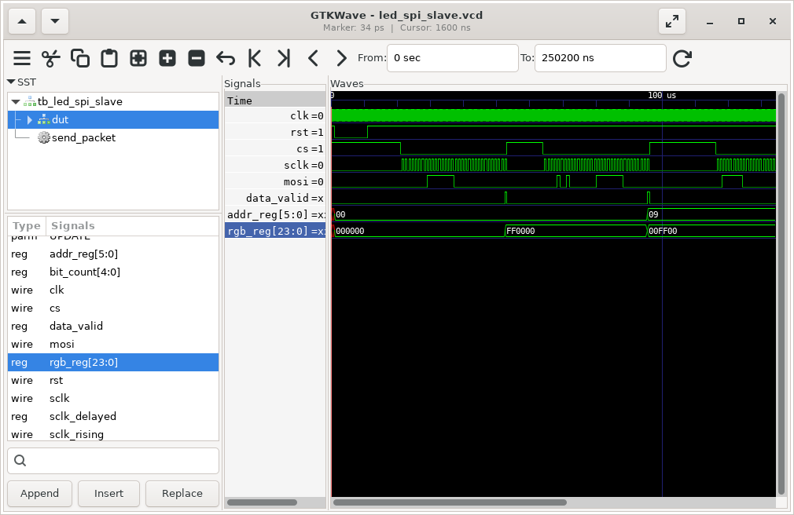

# 基于FPGA/CPLD的LED阵列显示 （2025年）

## BOM

1. FPGA/CPLD开发板
2. 杜邦线
3. 8*8阵列三色全彩共阳RGB LED点阵屏模块

## LED阵列介绍

### 产品特征

- 8 $\times$ 8 点阵模块
- 发光点直径：5mm
- 发光颜色：RGB
- 外观颜色：黑色表面、白色字节
- 共阳极
- 材料：磷化铝铟镓、氮化镓

### 管脚图


### 电路图


## 基于lattice CPLD开发板的LED阵列显示方案（参考）

### 管脚对应图

| LED阵列引脚 | CPLD引脚   | 备注（可选）        |
|------------|------------|--------------------|
| 1          |  16        |LED_col_b[0]|
| 2          |  18        |LED_col_b[1]|
| 3          |  20        |LED_col_b[2]|
| 4          |  24        |LED_col_b[3]|
| 5          |  27        |LED_col_b[4]|
| 6          |  29        |LED_col_b[5]|
| 7          |  31        |LED_col_b[6]|
| 8          |  34        |LED_col_b[7]|
| 9          |  36        |LED_col_r[0]|
| 10         |  38        |LED_col_r[1]|
| 11         |  40        |LED_col_r[2]|
| 12         |  42        |LED_col_r[3]|
| 13         |  45        |LED_col_r[4]|
| 14         |  48        |LED_col_r[5]|
| 15         |  51        |LED_col_r[6]|
| 16         |  53        |LED_col_r[7]|
| 17         |  52        |LED_row[0]|
| 18         |  49        |LED_row[1]|
| 19         |  47        |LED_row[2]|
| 20         |  43        |LED_row[3]|
| 21         |  41        |LED_col_g[7]|
| 22         |  39        |LED_col_g[6]|
| 23         |  37        |LED_col_g[5]|
| 24         |  35        |LED_col_g[4]|
| 25         |  32        |LED_col_g[3]|
| 26         |  30        |LED_col_g[2]|
| 27         |  28        |LED_col_g[1]|
| 28         |  25        |LED_col_g[0]|
| 29         |  21        |LED_row[4]|
| 30         |  19        |LED_row[5]|
| 31         |  17        |LED_row[6]|
| 32         |  15        |LED_row[7]|

## 设计流程



### 流水灯程序

#### 流水灯的verilog源码

```verilog
module Marquee (
    input clk,      // 50MHz时钟输入
    input rst, //复位功能     
    output led[1:0], //指示灯
    output reg [7:0] led_row,  // 行控制信号（高电平有效）
    output reg [7:0] led_col_r,   // 列控制信号（低电平有效）
    output reg [7:0] led_col_g,   // 列控制信号（低电平有效）
    output reg [7:0] led_col_b   // 列控制信号（低电平有效）

);

// 分频器参数（�Hz�
parameter DIVIDER = 25_000_000;
// 状态定义
parameter S0 = 3'd0, S1 = 3'd1, S2 = 3'd2, S3 = 3'd3,
          S4 = 3'd4, S5 = 3'd5, S6 = 3'd6, S7 = 3'd7;

// 消抖参数设置 (50MHz时钟对应20ms)
parameter DEBOUNCE_MS = 20;          // 消抖时间(ms)
parameter CLK_FREQ = 50_000_000;    // 时钟频率(Hz)
localparam DEBOUNCE_CYCLES = (DEBOUNCE_MS * CLK_FREQ) / 1000;

// 按钮同步逻辑
reg [1:0] btn_sync;
always @(posedge clk) btn_sync <= {btn_sync[0], ~rst}; // 注意这里取反

// 消抖计数器逻辑
reg [19:0] debounce_cnt;
reg btn_debounced;

always @(posedge clk) begin
    // 当检测到输入变化时启动计数器
    if(btn_sync[1] != btn_debounced) begin
        if(debounce_cnt == DEBOUNCE_CYCLES) begin
            btn_debounced <= btn_sync[1]; // 更新稳定值
            debounce_cnt <= 0;
        end else begin
            debounce_cnt <= debounce_cnt + 1;
        end
    end else begin
        debounce_cnt <= 0; // 状态未变化时保持清零
    end
end

// 边沿检测逻辑
reg [1:0] edge_detect;
always @(posedge clk) edge_detect <= {edge_detect[0], btn_debounced};
wire btn_pressed = (edge_detect == 2'b10); // 检测下降沿

// 状态转移逻辑
// 8x8 LED状态寄存器
reg [24:0] counter;
reg clk_1hz;
reg [2:0] led_state;
always @(posedge clk) begin
    if(btn_pressed) begin  // 有效按键
        counter <= 0;
        clk_1hz <= 0;
        led_row <= 8'b1111_1111;
        led_state <= (led_state == S7) ? S0 : led_state + 1;
        case (led_state)
            S0 : begin
                led_col_r <= 8'b1111_1111; 
                led_col_g <= 8'b1111_1111;
                led_col_b <= 8'b1111_1111;
            end
            S1 : begin
                led_col_r <= 8'b1111_1110; 
                led_col_g <= 8'b1111_1111;
                led_col_b <= 8'b1111_1111;
            end
            S2 : begin
                led_col_r <= 8'b1111_1111; 
                led_col_g <= 8'b1111_1110;
                led_col_b <= 8'b1111_1111;
            end
            S3 : begin
                led_col_r <= 8'b1111_1111; 
                led_col_g <= 8'b1111_1111;
                led_col_b <= 8'b1111_1110;
            end
            S4 : begin
                led_col_r <= 8'b1111_1110; 
                led_col_g <= 8'b1111_1110;
                led_col_b <= 8'b1111_1111;
            end
            S5 : begin
                led_col_r <= 8'b1111_1110; 
                led_col_g <= 8'b1111_1111;
                led_col_b <= 8'b1111_1110;
            end
            S6 : begin
                led_col_r <= 8'b1111_1111; 
                led_col_g <= 8'b1111_1110;
                led_col_b <= 8'b1111_1110;
            end
            S7 : begin
                led_col_r <= 8'b1111_1110; 
                led_col_g <= 8'b1111_1110;
                led_col_b <= 8'b1111_1110;
            end
        endcase
    end
    else if (counter == DIVIDER - 1) begin
        counter <= 0;
        clk_1hz <= ~clk_1hz;
        led_col_r <= {led_col_r[6:0], led_col_r[7]};  // 循环左移
        led_col_g <= {led_col_g[6:0], led_col_g[7]};  // 循环左移
        led_col_b <= {led_col_b[6:0], led_col_b[7]};  // 循环左移
    end 
    else begin
        counter <= counter + 1;
    end
end

assign led[0] = rst;
assign led[1] = clk_1hz;

endmodule
```

#### 流水灯的testbench

```verilog
`timescale 1us/1ns
module Marquee_tb;

// 定义仿真参数
reg clk;
reg rst;
wire [1:0] led;
wire [7:0] led_row;
wire [7:0] led_col_r;
wire [7:0] led_col_g;
wire [7:0] led_col_b;


defparam     uut.DIVIDER = 25_000 ;
// 实例化被测模块
Marquee uut (
    .clk(clk),
    .rst(rst),
    .led(led),
    .led_row(led_row),
    .led_col_r(led_col_r),
    .led_col_g(led_col_g),
    .led_col_b(led_col_b)
);

// 生成50kHz时钟
initial begin
    clk = 0;
    forever #10 clk = ~clk; // 20us周期 = 50kHz
end

// 测试序列
initial begin
    // 初始化
    rst = 1;
    #100; // 保持复位100us
    
    // 释放复位
    rst = 0;

    #100;
    rst = 1;

    #100_0; // 保持复位100us
    
    // 释放复位
    rst = 0;

    #100_000;
    rst = 1;
    
    // 运行10个完整周期（约10秒）
    #10_000_0; 
    
    // 结束仿真
    $finish;
end

// 监视输出变化
always @(posedge uut.clk_1hz) begin
    $display("Time: %0t us | LED_ROW: %08b", $time, led_row);
end

// 生成波形文件供查看
initial begin
    $dumpfile("marquee_tb.vcd");
    $dumpvars(0, Marquee_tb);
end

endmodule
```

### SPI接口程序

#### SPI slave的源码

```verilog
module spi_slave_rx_only (
    input wire clk,         // 系统时钟
    input wire sclk,        // SPI时钟（由主机提供）
    input wire cs,          // 片选（低电平有效）同时作为复位信号
    input wire mosi,        // 主机输出从机输入
    output reg [15:0] rx_data, // 接收到的16位数据
    output reg rx_done      // 接收完成标志（高电平脉冲）
);

// 内部寄存器
reg [15:0] rx_shift_reg = 16'h0000;   // 16位接收移位寄存器
reg [4:0] bit_cnt = 5'd0;             // 位计数器（0-15）
reg sclk_prev = 1'b0;                 // 用于检测边沿的SCLK上一个周期值
reg cs_sync = 1'b1;                   // 同步后的片选信号
reg sclk_rise;

// 同步cs信号以避免亚稳态
always @(posedge clk) begin
    cs_sync <= cs;
    sclk_prev <= sclk;
    sclk_rise = sclk && !sclk_prev;
end

// SPI接收逻辑
always @(posedge clk) begin
    rx_done <= 1'b0; // 默认清除完成标志
    
    // 当cs高电平（片选无效）时复位系统
    if (cs_sync) begin
        rx_shift_reg <= 16'h0000;
        bit_cnt <= 5'd0;
    end
    else if (sclk_rise) begin
        // 在SCLK上升沿采样MOSI
        rx_shift_reg <= {rx_shift_reg[14:0], mosi};
        
        if (bit_cnt == 5'd15) begin
            // 已接收16位数据
            rx_data <= {rx_shift_reg[14:0], mosi}; // 保存完整数据
            rx_done <= 1'b1;                      // 置位完成标志
            bit_cnt <= 5'd0;                      // 复位计数器
        end
        else begin
            bit_cnt <= bit_cnt + 1;               // 增加位计数器
        end
    end
end

endmodule
```

#### spi slave的testbench

```verilog
`timescale 1ns/1ps

module tb_spi_slave_rx_only();
    reg clk;
    reg sclk;
    reg cs;
    reg mosi;
    wire [15:0] rx_data;
    wire rx_done;
    
    // 实例化被测模块
    spi_slave_rx_only uut (
        .clk(clk),
        .sclk(sclk),
        .cs(cs),
        .mosi(mosi),
        .rx_data(rx_data),
        .rx_done(rx_done)
    );
    
    // 时钟生成
    always #5 clk = ~clk;  // 100MHz系统时钟
    
    // SPI时钟生成
    always #25 sclk = ~sclk;  // 20MHz SPI时钟
    
    // 测试向量生成
    initial begin
        // 初始化信号
        clk = 0;
        sclk = 0;
        cs = 1;  // 初始状态为复位（片选无效）
        mosi = 0;
        
        // 测试1：正常数据传输
        #100;
        cs = 0;  // 激活片选，开始传输
        // 发送数据 0xA55A (1010 0101 0101 1010)
        #10 mosi = 1; #50;  // bit15
        #10 mosi = 0; #50;  // bit14
        #10 mosi = 1; #50;  // bit13
        #10 mosi = 0; #50;  // bit12
        #10 mosi = 0; #50;  // bit11
        #10 mosi = 1; #50;  // bit10
        #10 mosi = 0; #50;  // bit9
        #10 mosi = 1; #50;  // bit8
        #10 mosi = 0; #50;  // bit7
        #10 mosi = 1; #50;  // bit6
        #10 mosi = 0; #50;  // bit5
        #10 mosi = 1; #50;  // bit4
        #10 mosi = 1; #50;  // bit3
        #10 mosi = 0; #50;  // bit2
        #10 mosi = 1; #50;  // bit1
        #10 mosi = 0; #50;  // bit0
        cs = 1;  // 取消片选，复位系统
        #100;
        
        // 测试2：传输中途复位
        #100;
        cs = 0;  // 激活片选，开始传输
        // 发送数据 0x1234 (0001 0010 0011 0100)
        #10 mosi = 0; #50;  // bit15
        #10 mosi = 0; #50;  // bit14
        #10 mosi = 0; #50;  // bit13
        #10 mosi = 1; #50;  // bit12
        #10 mosi = 0; #50;  // bit11
        #10 mosi = 0; #50;  // bit10
        #10 mosi = 1; #50;  // bit9
        #10 mosi = 0; #50;  // bit8
        // 中途复位
        cs = 1;  // 取消片选，复位系统
        #100;
        
        // 测试3：复位后继续传输
        #100;
        cs = 0;  // 重新激活片选
        // 重新发送完整数据 0x5678 (0101 0110 0111 1000)
        #10 mosi = 0; #50;  // bit15
        #10 mosi = 1; #50;  // bit14
        #10 mosi = 0; #50;  // bit13
        #10 mosi = 1; #50;  // bit12
        #10 mosi = 0; #50;  // bit11
        #10 mosi = 1; #50;  // bit10
        #10 mosi = 1; #50;  // bit9
        #10 mosi = 0; #50;  // bit8
        #10 mosi = 0; #50;  // bit7
        #10 mosi = 1; #50;  // bit6
        #10 mosi = 1; #50;  // bit5
        #10 mosi = 1; #50;  // bit4
        #10 mosi = 0; #50;  // bit3
        #10 mosi = 0; #50;  // bit2
        #10 mosi = 0; #50;  // bit1
        #10 mosi = 0; #50;  // bit0
        cs = 1;  // 取消片选，复位系统
        #200;
        
        $finish;
    end
    
    // 监控输出
    always @(posedge rx_done) begin
        $display("Time = %0t: Received data = 0x%h", $time, rx_data);
    end
    
    initial begin
        $dumpfile("spi_slave.vcd");
        $dumpvars(0, tb_spi_slave_rx_only);
    end
endmodule
```

#### spi slave的iverilog仿真波形



## 呼吸灯实验

为了可以让这个 $8 \times 8 \times 3$ 的LED阵列的亮度可以调节，我们需要定义一个缓存，把买个LED的亮度信息存储起来，在进行行扫描的时候，我们可以把每行的亮度信息都放到一个PWM控制器里面，为了让程序并行度更高，我们需要假设LED都有8位的亮度信息，我们这个缓存的大小为 $ 8 \times 8 \times 3 \times 8 $ 位大小。

### 呼吸灯源码

```verilog
module led_matrix_top (
    input clk,          // 系统时钟 (50MHz)
    input rst,        // 异步复位 (低有效)
    output [7:0] led_row,   // 行选择 (低有效)
    output [7:0] led_col_r,   // R列输出 (低有效)
    output [7:0] led_col_g, // G列输出 (低有效)
    output [7:0] led_col_b   // B列输出 (低有效)
);

// ================== 呼吸灯控制部分 ================== //
localparam BREATHE_PERIOD = 28'd5_000_000; // 2秒呼吸周期 (50MHz * 0.1s)
reg [27:0] breathe_counter;
reg breathe_dir;  // 0:递增, 1:递减
reg [7:0] global_brightness;

// 亮度数据阵列（二维数组：8行，每行64位存储8个LED的亮度）
reg [63:0] brightness_r [0:7]; // R亮度 [行][64位数据]
reg [63:0] brightness_g [0:7]; // G亮度 [行][64位数据]
reg [63:0] brightness_b [0:7]; // B亮度 [行][64位数据]

// 呼吸灯控制逻辑
always @(posedge clk or negedge rst) begin
    if (!rst) begin
        breathe_counter <= 28'd0;
        breathe_dir <= 0;
        global_brightness <= 8'd0;
    end else begin
        // 呼吸计数器
        breathe_counter <= (breathe_counter == BREATHE_PERIOD - 1) 
                          ? 28'd0 : breathe_counter + 1;
        
        // 亮度方向控制
        if (breathe_counter == BREATHE_PERIOD - 1) begin
            if (breathe_dir == 0) begin
                global_brightness <= (global_brightness == 255) 
                                    ? 254 : global_brightness + 1;
                breathe_dir <= (global_brightness == 254) ? 1 : 0;
            end else begin
                global_brightness <= (global_brightness == 0) 
                                    ? 1 : global_brightness - 1;
                breathe_dir <= (global_brightness == 1) ? 0 : 1;
            end
        end
    end
end

// 生成所有LED的亮度数据
genvar i, j;
generate
    for (i = 0; i < 8; i = i + 1) begin : row_gen
        for (j = 0; j < 8; j = j + 1) begin : col_gen
            always @(posedge clk or negedge rst) begin
                if (!rst) begin
                    brightness_r[i][j*8 +: 8] <= 8'd0;
                    brightness_g[i][j*8 +: 8] <= 8'd0;
                    brightness_b[i][j*8 +: 8] <= 8'd0;
                end else begin
                    brightness_r[i][j*8 +: 8] <= global_brightness;
                    brightness_g[i][j*8 +: 8] <= global_brightness;
                    brightness_b[i][j*8 +: 8] <= global_brightness;
                end
            end
        end
    end
endgenerate

// ================== LED驱动部分 ================== //
// 内部信号定义
reg [7:0] pwm_counter;         // PWM计数器 (0-255)
reg [2:0] row_counter;         // 行计数器 (0-7)
reg [63:0] current_row_r;      // 当前行R亮度数据（64位）
reg [63:0] current_row_g;      // 当前行G亮度数据（64位）
reg [63:0] current_row_b;      // 当前行B亮度数据（64位）

// PWM计数器 (8位 256级)
always @(posedge clk or negedge rst) begin
    if (!rst) 
        pwm_counter <= 8'd0;
    else 
        pwm_counter <= pwm_counter + 1;
end

// 行计数器 (每256个时钟周期切换一行)
always @(posedge clk or negedge rst) begin
    if (!rst) 
        row_counter <= 3'd0;
    else if (pwm_counter == 8'd255) // 在PWM周期结束时切换行
        row_counter <= row_counter + 1;
end

// 行选择译码器 (低有效)
assign led_row = ~(8'b1 << row_counter);

// 亮度数据锁存 (在行切换时更新)
always @(posedge clk or negedge rst) begin
    if (!rst) begin
        current_row_r <= 64'd0;
        current_row_g <= 64'd0;
        current_row_b <= 64'd0;
    end
    else if (pwm_counter == 8'd255) begin
        // 锁存新行的RGB数据
        current_row_r <= brightness_r[row_counter];
        current_row_g <= brightness_g[row_counter];
        current_row_b <= brightness_b[row_counter];
    end
end

// PWM输出生成
reg [7:0] col_r;
reg [7:0] col_g;
reg [7:0] col_b;
integer col;

always @(posedge clk or negedge rst) begin
    if (!rst) begin
        col_r <= 8'hFF;
        col_g <= 8'hFF;
        col_b <= 8'hFF;
    end
    else begin
        // 比较每个LED的亮度值与PWM计数器
        for (col = 0; col < 8; col = col + 1) begin
            // R列
            if (current_row_r[col*8 +: 8] > pwm_counter)
                col_r[col] <= 1'b0; // 点亮
            else
                col_r[col] <= 1'b1; // 熄灭
            
            // G列
            if (current_row_g[col*8 +: 8] > pwm_counter)
                col_g[col] <= 1'b0; // 点亮
            else
                col_g[col] <= 1'b1; // 熄灭
            
            // B列
            if (current_row_b[col*8 +: 8] > pwm_counter)
                col_b[col] <= 1'b0; // 点亮
            else
                col_b[col] <= 1'b1; // 熄灭
        end
    end
end

assign led_col_r = col_r;
assign led_col_g = col_g;
assign led_col_b = col_b;

endmodule
```

### 呼吸灯测试代码

```verilog
`timescale 1ns / 1ps

module tb_led_matrix();

reg clk;
reg rst;
wire [7:0] led_row;
wire [7:0] led_col_r;
wire [7:0] led_col_g;
wire [7:0] led_col_b;

// 实例化顶层模块
led_matrix_top uut (
    .clk(clk),
    .rst(rst),
    .led_row(led_row),
    .led_col_r(led_col_r),
    .led_col_g(led_col_g),
    .led_col_b(led_col_b)
);

// 时钟生成 (50MHz)
initial begin
    clk = 0;
    forever #10 clk = ~clk;  // 20ns周期 = 50MHz
end

// 复位信号
initial begin
    rst = 0;
    #100 rst = 1;         // 100ns后释放复位
end

// 设置波形文件输出
initial begin
    $dumpfile("led_matrix_driver_tb.vcd");  // 指定波形文件名
    $dumpvars(0, tb_led_matrix);       // 转储所有层次的信号
    $dumpvars(1, uut);                 // 详细转储顶层模块内部信号
end

// 减少display使用 - 只显示关键事件
reg [31:0] last_time;
initial last_time = 0;

// 使用合并后的模块信号路径
always @(posedge uut.row_counter) begin
    if ($time - last_time > 1_000_000) begin  // 每1ms显示一次
        $display("Time=%fms | Current Row=%d | Global Brightness=%d", 
                 $time/1_000_000.0, uut.row_counter, uut.global_brightness);
        last_time = $time;
    end
end

// 测试持续时间 - 延长到2秒呼吸周期
initial begin
    #20_000_000;  // 模拟2秒（测试完整呼吸周期）
    $display("Simulation completed successfully");
    $finish;
end

endmodule
```

### 仿真结果


