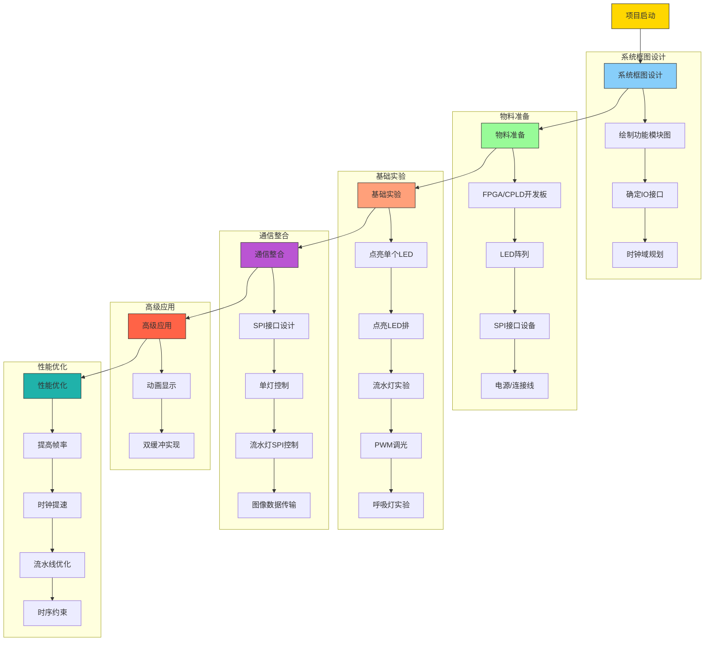
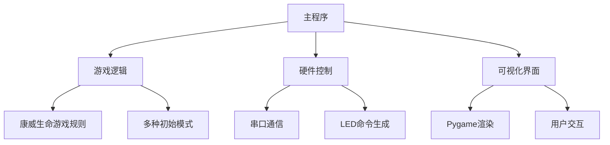
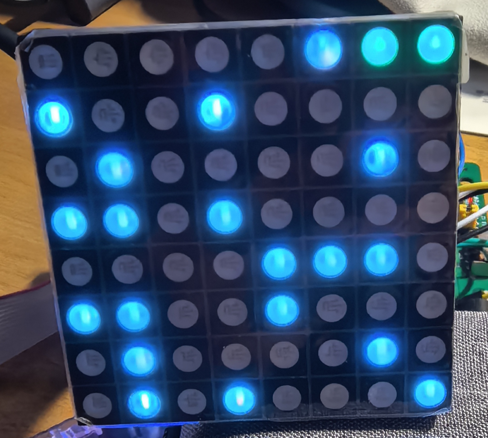

# 基于FPGA/CPLD的LED阵列显示 （2025年）

## BOM

1. FPGA/CPLD开发板
2. 杜邦线
3. 8*8阵列三色全彩共阳RGB LED点阵屏模块

## LED阵列介绍

### 产品特征

- 8 $\times$ 8 点阵模块
- 发光点直径：5mm
- 发光颜色：RGB
- 外观颜色：黑色表面、白色字节
- 共阳极
- 材料：磷化铝铟镓、氮化镓

### 管脚图


### 电路图


## 基于lattice CPLD开发板的LED阵列显示方案（参考）

### 管脚对应图

| LED阵列引脚 | CPLD引脚   | 备注（可选）        |
|------------|------------|--------------------|
| 1          |  16        |LED_col_b[0]|
| 2          |  18        |LED_col_b[1]|
| 3          |  20        |LED_col_b[2]|
| 4          |  24        |LED_col_b[3]|
| 5          |  27        |LED_col_b[4]|
| 6          |  29        |LED_col_b[5]|
| 7          |  31        |LED_col_b[6]|
| 8          |  34        |LED_col_b[7]|
| 9          |  36        |LED_col_r[0]|
| 10         |  38        |LED_col_r[1]|
| 11         |  40        |LED_col_r[2]|
| 12         |  42        |LED_col_r[3]|
| 13         |  45        |LED_col_r[4]|
| 14         |  48        |LED_col_r[5]|
| 15         |  51        |LED_col_r[6]|
| 16         |  53        |LED_col_r[7]|
| 17         |  52        |LED_row[0]|
| 18         |  49        |LED_row[1]|
| 19         |  47        |LED_row[2]|
| 20         |  43        |LED_row[3]|
| 21         |  41        |LED_col_g[7]|
| 22         |  39        |LED_col_g[6]|
| 23         |  37        |LED_col_g[5]|
| 24         |  35        |LED_col_g[4]|
| 25         |  32        |LED_col_g[3]|
| 26         |  30        |LED_col_g[2]|
| 27         |  28        |LED_col_g[1]|
| 28         |  25        |LED_col_g[0]|
| 29         |  21        |LED_row[4]|
| 30         |  19        |LED_row[5]|
| 31         |  17        |LED_row[6]|
| 32         |  15        |LED_row[7]|

## 设计流程



### 流水灯程序

#### 流水灯的verilog源码

```verilog
module Marquee (
    input clk,      // 50MHz时钟输入
    input rst, //复位功能     
    output led[1:0], //指示灯
    output reg [7:0] led_row,  // 行控制信号（高电平有效）
    output reg [7:0] led_col_r,   // 列控制信号（低电平有效）
    output reg [7:0] led_col_g,   // 列控制信号（低电平有效）
    output reg [7:0] led_col_b   // 列控制信号（低电平有效）

);

// 分频器参数（�Hz�
parameter DIVIDER = 25_000_000;
// 状态定义
parameter S0 = 3'd0, S1 = 3'd1, S2 = 3'd2, S3 = 3'd3,
          S4 = 3'd4, S5 = 3'd5, S6 = 3'd6, S7 = 3'd7;

// 消抖参数设置 (50MHz时钟对应20ms)
parameter DEBOUNCE_MS = 20;          // 消抖时间(ms)
parameter CLK_FREQ = 50_000_000;    // 时钟频率(Hz)
localparam DEBOUNCE_CYCLES = (DEBOUNCE_MS * CLK_FREQ) / 1000;

// 按钮同步逻辑
reg [1:0] btn_sync;
always @(posedge clk) btn_sync <= {btn_sync[0], ~rst}; // 注意这里取反

// 消抖计数器逻辑
reg [19:0] debounce_cnt;
reg btn_debounced;

always @(posedge clk) begin
    // 当检测到输入变化时启动计数器
    if(btn_sync[1] != btn_debounced) begin
        if(debounce_cnt == DEBOUNCE_CYCLES) begin
            btn_debounced <= btn_sync[1]; // 更新稳定值
            debounce_cnt <= 0;
        end else begin
            debounce_cnt <= debounce_cnt + 1;
        end
    end else begin
        debounce_cnt <= 0; // 状态未变化时保持清零
    end
end

// 边沿检测逻辑
reg [1:0] edge_detect;
always @(posedge clk) edge_detect <= {edge_detect[0], btn_debounced};
wire btn_pressed = (edge_detect == 2'b10); // 检测下降沿

// 状态转移逻辑
// 8x8 LED状态寄存器
reg [24:0] counter;
reg clk_1hz;
reg [2:0] led_state;
always @(posedge clk) begin
    if(btn_pressed) begin  // 有效按键
        counter <= 0;
        clk_1hz <= 0;
        led_row <= 8'b1111_1111;
        led_state <= (led_state == S7) ? S0 : led_state + 1;
        case (led_state)
            S0 : begin
                led_col_r <= 8'b1111_1111; 
                led_col_g <= 8'b1111_1111;
                led_col_b <= 8'b1111_1111;
            end
            S1 : begin
                led_col_r <= 8'b1111_1110; 
                led_col_g <= 8'b1111_1111;
                led_col_b <= 8'b1111_1111;
            end
            S2 : begin
                led_col_r <= 8'b1111_1111; 
                led_col_g <= 8'b1111_1110;
                led_col_b <= 8'b1111_1111;
            end
            S3 : begin
                led_col_r <= 8'b1111_1111; 
                led_col_g <= 8'b1111_1111;
                led_col_b <= 8'b1111_1110;
            end
            S4 : begin
                led_col_r <= 8'b1111_1110; 
                led_col_g <= 8'b1111_1110;
                led_col_b <= 8'b1111_1111;
            end
            S5 : begin
                led_col_r <= 8'b1111_1110; 
                led_col_g <= 8'b1111_1111;
                led_col_b <= 8'b1111_1110;
            end
            S6 : begin
                led_col_r <= 8'b1111_1111; 
                led_col_g <= 8'b1111_1110;
                led_col_b <= 8'b1111_1110;
            end
            S7 : begin
                led_col_r <= 8'b1111_1110; 
                led_col_g <= 8'b1111_1110;
                led_col_b <= 8'b1111_1110;
            end
        endcase
    end
    else if (counter == DIVIDER - 1) begin
        counter <= 0;
        clk_1hz <= ~clk_1hz;
        led_col_r <= {led_col_r[6:0], led_col_r[7]};  // 循环左移
        led_col_g <= {led_col_g[6:0], led_col_g[7]};  // 循环左移
        led_col_b <= {led_col_b[6:0], led_col_b[7]};  // 循环左移
    end 
    else begin
        counter <= counter + 1;
    end
end

assign led[0] = rst;
assign led[1] = clk_1hz;

endmodule
```

#### 流水灯的testbench

```verilog
`timescale 1us/1ns
module Marquee_tb;

// 定义仿真参数
reg clk;
reg rst;
wire [1:0] led;
wire [7:0] led_row;
wire [7:0] led_col_r;
wire [7:0] led_col_g;
wire [7:0] led_col_b;


defparam     uut.DIVIDER = 25_000 ;
// 实例化被测模块
Marquee uut (
    .clk(clk),
    .rst(rst),
    .led(led),
    .led_row(led_row),
    .led_col_r(led_col_r),
    .led_col_g(led_col_g),
    .led_col_b(led_col_b)
);

// 生成50kHz时钟
initial begin
    clk = 0;
    forever #10 clk = ~clk; // 20us周期 = 50kHz
end

// 测试序列
initial begin
    // 初始化
    rst = 1;
    #100; // 保持复位100us
    
    // 释放复位
    rst = 0;

    #100;
    rst = 1;

    #100_0; // 保持复位100us
    
    // 释放复位
    rst = 0;

    #100_000;
    rst = 1;
    
    // 运行10个完整周期（约10秒）
    #10_000_0; 
    
    // 结束仿真
    $finish;
end

// 监视输出变化
always @(posedge uut.clk_1hz) begin
    $display("Time: %0t us | LED_ROW: %08b", $time, led_row);
end

// 生成波形文件供查看
initial begin
    $dumpfile("marquee_tb.vcd");
    $dumpvars(0, Marquee_tb);
end

endmodule
```


## 呼吸灯实验

为了可以让这个 $8 \times 8 \times 3$ 的LED阵列的亮度可以调节，我们需要定义一个缓存，把买个LED的亮度信息存储起来，在进行行扫描的时候，我们可以把每行的亮度信息都放到一个PWM控制器里面，为了让程序并行度更高，我们需要假设LED都有8位的亮度信息，我们这个缓存的大小为 $ 8 \times 8 \times 3 \times 8 $ 位大小。

### 呼吸灯源码

```verilog
module led_matrix_top (
    input clk,          // 系统时钟 (50MHz)
    input rst,        // 异步复位 (低有效)
    output [7:0] led_row,   // 行选择 (低有效)
    output [7:0] led_col_r,   // R列输出 (低有效)
    output [7:0] led_col_g, // G列输出 (低有效)
    output [7:0] led_col_b   // B列输出 (低有效)
);

// ================== 呼吸灯控制部分 ================== //
localparam BREATHE_PERIOD = 28'd5_000_000; // 2秒呼吸周期 (50MHz * 0.1s)
reg [27:0] breathe_counter;
reg breathe_dir;  // 0:递增, 1:递减
reg [7:0] global_brightness;

// 亮度数据阵列（二维数组：8行，每行64位存储8个LED的亮度）
reg [63:0] brightness_r [0:7]; // R亮度 [行][64位数据]
reg [63:0] brightness_g [0:7]; // G亮度 [行][64位数据]
reg [63:0] brightness_b [0:7]; // B亮度 [行][64位数据]

// 呼吸灯控制逻辑
always @(posedge clk or negedge rst) begin
    if (!rst) begin
        breathe_counter <= 28'd0;
        breathe_dir <= 0;
        global_brightness <= 8'd0;
    end else begin
        // 呼吸计数器
        breathe_counter <= (breathe_counter == BREATHE_PERIOD - 1) 
                          ? 28'd0 : breathe_counter + 1;
        
        // 亮度方向控制
        if (breathe_counter == BREATHE_PERIOD - 1) begin
            if (breathe_dir == 0) begin
                global_brightness <= (global_brightness == 255) 
                                    ? 254 : global_brightness + 1;
                breathe_dir <= (global_brightness == 254) ? 1 : 0;
            end else begin
                global_brightness <= (global_brightness == 0) 
                                    ? 1 : global_brightness - 1;
                breathe_dir <= (global_brightness == 1) ? 0 : 1;
            end
        end
    end
end

// 生成所有LED的亮度数据
genvar i, j;
generate
    for (i = 0; i < 8; i = i + 1) begin : row_gen
        for (j = 0; j < 8; j = j + 1) begin : col_gen
            always @(posedge clk or negedge rst) begin
                if (!rst) begin
                    brightness_r[i][j*8 +: 8] <= 8'd0;
                    brightness_g[i][j*8 +: 8] <= 8'd0;
                    brightness_b[i][j*8 +: 8] <= 8'd0;
                end else begin
                    brightness_r[i][j*8 +: 8] <= global_brightness;
                    brightness_g[i][j*8 +: 8] <= global_brightness;
                    brightness_b[i][j*8 +: 8] <= global_brightness;
                end
            end
        end
    end
endgenerate

// ================== LED驱动部分 ================== //
// 内部信号定义
reg [7:0] pwm_counter;         // PWM计数器 (0-255)
reg [2:0] row_counter;         // 行计数器 (0-7)
reg [63:0] current_row_r;      // 当前行R亮度数据（64位）
reg [63:0] current_row_g;      // 当前行G亮度数据（64位）
reg [63:0] current_row_b;      // 当前行B亮度数据（64位）

// PWM计数器 (8位 256级)
always @(posedge clk or negedge rst) begin
    if (!rst) 
        pwm_counter <= 8'd0;
    else 
        pwm_counter <= pwm_counter + 1;
end

// 行计数器 (每256个时钟周期切换一行)
always @(posedge clk or negedge rst) begin
    if (!rst) 
        row_counter <= 3'd0;
    else if (pwm_counter == 8'd255) // 在PWM周期结束时切换行
        row_counter <= row_counter + 1;
end

// 行选择译码器 (低有效)
assign led_row = ~(8'b1 << row_counter);

// 亮度数据锁存 (在行切换时更新)
always @(posedge clk or negedge rst) begin
    if (!rst) begin
        current_row_r <= 64'd0;
        current_row_g <= 64'd0;
        current_row_b <= 64'd0;
    end
    else if (pwm_counter == 8'd255) begin
        // 锁存新行的RGB数据
        current_row_r <= brightness_r[row_counter];
        current_row_g <= brightness_g[row_counter];
        current_row_b <= brightness_b[row_counter];
    end
end

// PWM输出生成
reg [7:0] col_r;
reg [7:0] col_g;
reg [7:0] col_b;
integer col;

always @(posedge clk or negedge rst) begin
    if (!rst) begin
        col_r <= 8'hFF;
        col_g <= 8'hFF;
        col_b <= 8'hFF;
    end
    else begin
        // 比较每个LED的亮度值与PWM计数器
        for (col = 0; col < 8; col = col + 1) begin
            // R列
            if (current_row_r[col*8 +: 8] > pwm_counter)
                col_r[col] <= 1'b0; // 点亮
            else
                col_r[col] <= 1'b1; // 熄灭
            
            // G列
            if (current_row_g[col*8 +: 8] > pwm_counter)
                col_g[col] <= 1'b0; // 点亮
            else
                col_g[col] <= 1'b1; // 熄灭
            
            // B列
            if (current_row_b[col*8 +: 8] > pwm_counter)
                col_b[col] <= 1'b0; // 点亮
            else
                col_b[col] <= 1'b1; // 熄灭
        end
    end
end

assign led_col_r = col_r;
assign led_col_g = col_g;
assign led_col_b = col_b;

endmodule
```

### 呼吸灯测试代码

```verilog
`timescale 1ns / 1ps

module tb_led_matrix();

reg clk;
reg rst;
wire [7:0] led_row;
wire [7:0] led_col_r;
wire [7:0] led_col_g;
wire [7:0] led_col_b;

// 实例化顶层模块
led_matrix_top uut (
    .clk(clk),
    .rst(rst),
    .led_row(led_row),
    .led_col_r(led_col_r),
    .led_col_g(led_col_g),
    .led_col_b(led_col_b)
);

// 时钟生成 (50MHz)
initial begin
    clk = 0;
    forever #10 clk = ~clk;  // 20ns周期 = 50MHz
end

// 复位信号
initial begin
    rst = 0;
    #100 rst = 1;         // 100ns后释放复位
end

// 设置波形文件输出
initial begin
    $dumpfile("led_matrix_driver_tb.vcd");  // 指定波形文件名
    $dumpvars(0, tb_led_matrix);       // 转储所有层次的信号
    $dumpvars(1, uut);                 // 详细转储顶层模块内部信号
end

// 减少display使用 - 只显示关键事件
reg [31:0] last_time;
initial last_time = 0;

// 使用合并后的模块信号路径
always @(posedge uut.row_counter) begin
    if ($time - last_time > 1_000_000) begin  // 每1ms显示一次
        $display("Time=%fms | Current Row=%d | Global Brightness=%d", 
                 $time/1_000_000.0, uut.row_counter, uut.global_brightness);
        last_time = $time;
    end
end

// 测试持续时间 - 延长到2秒呼吸周期
initial begin
    #20_000_000;  // 模拟2秒（测试完整呼吸周期）
    $display("Simulation completed successfully");
    $finish;
end

endmodule
```

### 仿真结果


### SPI接口程序

#### SPI slave的源码

```verilog
module led_spi_slave (
    input clk,           // 系统时钟 (e.g., 50MHz)
    input rst,           // 异步复位(低电平有效)
    input sclk,          // SPI时钟 (从主设备)
    input mosi,          // SPI主出从入
    input cs,            // 片选 (低有效)
    output reg [7:0] red [0:63],   // 红色分量存储(一维64元素)
    output reg [7:0] green [0:63], // 绿色分量存储(一维64元素)
    output reg [7:0] blue [0:63],  // 蓝色分量存储(一维64元素)
    output reg data_valid          // 数据有效信号
);

// 内部寄存器和状态定义
reg [31:0] shift_reg;   // 32位移位寄存器
reg [4:0] bit_count;    // 位计数器 (0-31)
reg sclk_delayed;       // 用于边沿检测的延迟sclk
reg [5:0] addr_reg;     // 地址寄存器(直接用作一维索引)
reg [23:0] rgb_reg;     // RGB数据寄存器
reg [1:0] state;        // 状态机

// SPI模式0参数
localparam IDLE = 2'b00;
localparam RECEIVE = 2'b01;
localparam UPDATE = 2'b10;
localparam FINISHED = 2'b11;

// 边沿检测：检测sclk上升沿
wire sclk_rising = (sclk && !sclk_delayed);

// 使用generate初始化存储器
genvar i;
generate
    for (i = 0; i < 64; i = i + 1) begin : INIT_MEM
        always @(posedge clk or negedge rst) begin
            if (!rst) begin
                // 初始化单个LED
                red[i] <= 8'h00;
                green[i] <= 8'h00;
                blue[i] <= 8'h00;
            end
            else if (state == FINISHED && addr_reg == i) begin
                // 更新单个LED
                red[i] <= rgb_reg[23:16];   // R分量
                green[i] <= rgb_reg[15:8];  // G分量
                blue[i] <= rgb_reg[7:0];    // B分量
            end
        end
    end
endgenerate

// 主状态机
always @(posedge clk or negedge rst) begin
    if (!rst) begin
        state <= IDLE;
        shift_reg <= 32'b0;
        bit_count <= 0;
        data_valid <= 0;
        sclk_delayed <= 0;
        addr_reg <= 6'b0;
        rgb_reg <= 24'b0;
    end else begin
        sclk_delayed <= sclk;  // 延迟sclk用于边沿检测
        data_valid <= 0;        // 默认数据有效信号为低
        
        case (state)
            IDLE: begin
                bit_count <= 0;
                if (!cs) begin  // 片选激活
                    state <= RECEIVE;
                end
            end
            
            RECEIVE: begin
                if (sclk_rising) begin  // SPI时钟上升沿采样数据
                    shift_reg <= {shift_reg[30:0], mosi};  // 左移并捕获新位
                    bit_count <= bit_count + 1;
                    
                    if (bit_count == 31) begin
                        // 完整32位接收完毕
                        state <= UPDATE;
                    end
                end
                
                if (cs) begin  // 片选失效，中断接收
                    state <= IDLE;
                end
            end
            
            UPDATE: begin
                addr_reg <= shift_reg[29:24]; // 提取地址位[29:24]
                rgb_reg <= shift_reg[23:0];   // 提取RGB数据[23:0]
                state <= FINISHED;           // 转至更新状态
            end

            FINISHED: begin
                // LED更新现在由generate块处理
                data_valid <= 1;        // 置位数据有效信号
                
                if (cs) begin
                    state <= IDLE;
                end
            end
        endcase
    end
end

endmodule
```

#### spi slave的testbench

```verilog
`timescale 1ns / 1ps

module tb_led_spi_slave();

// 测试信号
reg clk = 0;
reg rst = 1;
reg spi_clk = 0;
wire sclk;
reg mosi = 0;
reg cs = 1; // 初始片选无效
wire [7:0] red [0:63];   // 修改为一维数组
wire [7:0] green [0:63]; // 修改为一维数组
wire [7:0] blue [0:63];  // 修改为一维数组
wire data_valid;

// 实例化SPI接收器
led_spi_slave dut (
    .clk(clk),
    .rst(rst),
    .sclk(sclk),
    .mosi(mosi),
    .cs(cs),
    .red(red),
    .green(green),
    .blue(blue),
    .data_valid(data_valid)
);

// 50MHz系统时钟生成
always #10 clk = ~clk;

// SPI时钟生成 (1MHz)
always #500 spi_clk = ~spi_clk;
assign sclk = !cs & spi_clk;

// 发送单个32位数据包的任务
task send_packet;
    input [5:0] address;
    input [23:0] rgb;
    reg [31:0] data;
    integer i;
begin
    data = {2'b00, address, rgb}; // 组合32位数据
    
    cs = 0; // 激活片选
    #50;   // 等待片选稳定
    
    // 发送32位数据 (MSB优先)
    for (i = 31; i >= 0; i = i - 1) begin
        mosi = data[i]; // 输出当前位
        #1000;           // 等待SPI时钟周期
    end
    
    cs = 1; // 关闭片选
    #10000;   // 完成传输
end
endtask

// 设置波形文件输出
initial begin
    $dumpfile("led_spi_slave.vcd");  // 指定波形文件名
    $dumpvars(0, tb_led_spi_slave);  // 转储所有层次的信号
    $dumpvars(1, dut);               // 详细转储顶层模块内部信号
end

// 测试序列
initial begin
    // 初始化
    #1000;
    rst = 0;
    #10000;
    rst = 1;
    #10000;
    
    // 测试1: 发送地址0x00 (索引0) 红色LED
    send_packet(6'h00, {8'hFF, 8'h00, 8'h00});
    #1000;
    
    // 验证数据 (使用一维索引)
    if (red[0] !== 8'hFF || green[0] !== 8'h00 || blue[0] !== 8'h00) begin
        $display("Test 1 FAILED! Got R:%h G:%h B:%h", red[0], green[0], blue[0]);
        $finish;
    end
    
    // 测试2: 发送地址0x09 (索引9) 绿色LED
    send_packet(6'h09, {8'h00, 8'hFF, 8'h00});
    #10000;
    
    // 验证数据 (使用一维索引)
    if (red[9] !== 8'h00 || green[9] !== 8'hFF || blue[9] !== 8'h00) begin
        $display("Test 2 FAILED! Got R:%h G:%h B:%h", red[9], green[9], blue[9]);
        $finish;
    end
    
    // 测试3: 发送地址0x3F (索引63) 蓝色LED
    send_packet(6'h3F, {8'h00, 8'h00, 8'hFF});
    #10000;
    
    // 验证数据 (使用一维索引)
    if (red[63] !== 8'h00 || green[63] !== 8'h00 || blue[63] !== 8'hFF) begin
        $display("Test 3 FAILED! Got R:%h G:%h B:%h", red[63], green[63], blue[63]);
        $finish;
    end
    
    // 测试4: 发送有效和无效地址
    send_packet(6'h38, {8'hFF, 8'hFF, 8'hFF}); // 有效地址(56)
    #10000;

    // 验证有效地址更新，无效地址不更新
    if (red[56] !== 8'hFF) begin
        $display("Test 4 FAILED! Valid address not updated");
        $finish;
    end

    // 测试5: 部分传输中断
    cs = 0; // 激活片选
    #10000;
    mosi = 1; // 发送1位
    #10000;
    cs = 1; // 中断传输
    #10000;
    
    // 验证未完成传输未更新数据
    if (data_valid !== 0) begin
        $display("Test 5 FAILED! Partial transmission set data_valid");
        $finish;
    end
    
    $display("All tests PASSED!");
    $finish;
end

endmodule
```

#### spi slave的iverilog仿真波形


## 完成的驱动程序

### verilog源码

```verilog
module led_matrix_top (
    input clk,          // 系统时钟 (50MHz)
    input rst,          // 异步复位 (低有效)
    output [7:0] led_row,   // 行选择 (高有效)
    output [7:0] led_col_r, // R列输出 (低有效)
    output [7:0] led_col_g, // G列输出 (低有效)
    output [7:0] led_col_b, // B列输出 (低有效)
    input sclk,         // SPI时钟 (从主设备)
    input mosi,         // SPI主出从入
    input cs,            // 片选 (低有效)
    output [1:0] led
);

assign led[1] = rst;

// =====================================================
// 时钟分频逻辑
// =====================================================
// parameter N = 32'd24_414;  // 50,000,000 / 2,048 ≈ 24,414
// parameter N = 32'd31_250; //50,000,000 / 16 / 10 = 32,250
parameter N = 32'd3_000; //60FPS
// parameter N = 8; //仿真的时候，选用N=8加快仿真速度
reg [31:0] clkgen_counter;      // 分频计数器
reg clk_out_reg;            // 输出寄存器
wire clk_2048;

always @(posedge clk or negedge rst) begin
    if (!rst) begin
        clkgen_counter <= 0;
        clk_out_reg <= 0;
    end else begin
        if (clkgen_counter == N - 1) begin
            clkgen_counter <= 0;
            clk_out_reg <= ~clk_out_reg;
        end else begin
            clkgen_counter <= clkgen_counter + 1;
        end
    end
end
assign clk_2048 = clk_out_reg;

// =====================================================
// SPI接收逻辑
// =====================================================
reg [31:0] spi_shift_reg;   // 32位移位寄存器
reg [4:0] spi_bit_count;    // 位计数器 (0-31)
reg [5:0] spi_addr_reg;     // 地址寄存器
reg [23:0] spi_rgb_reg;     // RGB数据寄存器
reg [1:0] spi_state;        // 状态机

// 颜色存储阵列 (修改为4位宽度)
reg [3:0] red [0:63];   // 红色分量 (4位)
reg [3:0] green [0:63]; // 绿色分量 (4位)
reg [3:0] blue [0:63];  // 蓝色分量 (4位)
reg spi_data_valid;      // 数据有效信号

// 状态定义
localparam SPI_IDLE = 2'b00;
localparam SPI_RECEIVE = 2'b01;
localparam SPI_UPDATE = 2'b10;
localparam SPI_FINISHED = 2'b11;

// 边沿检测：检测sclk上升沿
// 两级同步寄存器避免亚稳态
reg [1:0] sync_reg;

// 同步化SPI时钟信号
always @(posedge clk or negedge rst) begin
    if (!rst) begin
        sync_reg <= 2'b00;
    end else begin
        sync_reg <= {sync_reg[0], sclk};
    end
end

// 延迟一拍的同步信号
reg sclk_delayed;
always @(posedge clk or negedge rst) begin
    if (!rst) begin
        sclk_delayed <= 1'b0;
    end else begin
        sclk_delayed <= sync_reg[1];
    end
end

wire sclk_rising = (sync_reg[1] && !sclk_delayed);

// 初始化存储器
integer i;
// 主状态机
always @(posedge clk or negedge rst) begin
    if (!rst) begin
        spi_state <= SPI_IDLE;
        spi_shift_reg <= 32'b0;
        spi_bit_count <= 0;
        spi_data_valid <= 0;
        spi_addr_reg <= 6'b0;
        spi_rgb_reg <= 24'b0;
        for (i = 0; i < 64; i = i + 1) begin
            red[i] <= 4'h0;
            green[i] <= 4'h0;
            blue[i] <= 4'h0;
        end
    end else begin
        case (spi_state)
            SPI_IDLE: begin
                spi_bit_count <= 0;
                spi_data_valid <= 0;        // 默认数据有效信号为低
                if (!cs) begin  // 片选激活
                    spi_state <= SPI_RECEIVE;
                end
            end
            
            SPI_RECEIVE: begin
                if (sclk_rising) begin  // SPI时钟上升沿采样数据
                    spi_shift_reg <= {spi_shift_reg[30:0], mosi};  // 左移并捕获新位
                    spi_bit_count <= spi_bit_count + 1;
                    
                    if (spi_bit_count == 31) begin
                        spi_state <= SPI_UPDATE;
                    end
                end
                
                if (cs) begin  // 片选失效，中断接收
                    spi_state <= SPI_IDLE;
                end
            end
            
            SPI_UPDATE: begin
                spi_addr_reg <= spi_shift_reg[29:24]; // 提取地址位[29:24]
                spi_rgb_reg <= spi_shift_reg[23:0];   // 提取RGB数据[23:0]
                spi_state <= SPI_FINISHED;
            end

            SPI_FINISHED: begin
                // 更新LED颜色 (仅存储高4位)
                red[spi_addr_reg] <= spi_rgb_reg[23:20];   // R高4位
                green[spi_addr_reg] <= spi_rgb_reg[15:12]; // G高4位
                blue[spi_addr_reg] <= spi_rgb_reg[7:4];    // B高4位
                spi_data_valid <= 1;  // 置位数据有效信号
                
                if (cs) begin
                    spi_state <= SPI_IDLE;
                end
            end
        endcase
    end
end

assign led[0] = spi_data_valid;

// LED驱动内部信号
reg [3:0] driver_pwm_counter;    // PWM计数器 (0-15)
reg [2:0] driver_row_counter;    // 行计数器 (0-7)
reg [3:0] current_row_r[7:0];        // 当前行R亮度数据 (32位)
reg [3:0] current_row_g[7:0];        // 当前行G亮度数据
reg [3:0] current_row_b[7:0];        // 当前行B亮度数据
reg [7:0] driver_col_r;          // R列输出
reg [7:0] driver_col_g;          // G列输出
reg [7:0] driver_col_b;          // B列输出

// PWM计数器 (4位 16级)
always @(posedge clk_2048 or negedge rst) begin
    if (!rst) 
        driver_pwm_counter <= 4'd0;
    else 
        driver_pwm_counter <= driver_pwm_counter + 1;
end

// 行计数器
// 行选择译码器 (高有效)
reg [7:0] current_row;

// 亮度数据锁存 (行切换时更新)
integer col;
always @(posedge clk_2048 or negedge rst) begin
    if (!rst) begin
        for (col = 0; col < 8; col = col + 1) begin
            current_row_r[col] <= 0;  
            current_row_r[col] <= 0;
            current_row_r[col] <= 0;
        end
        current_row <= 8'h00;
        driver_row_counter <= 3'd0;
    end
    else if (driver_pwm_counter == 4'hF) begin
        current_row <= 8'h01 << driver_row_counter;
        driver_row_counter <= driver_row_counter + 1;
        case(driver_row_counter)
        0: begin
            for (col = 0; col < 8; col = col + 1) begin
                current_row_r[col] <= red[col];  
                current_row_g[col] <= green[col];
                current_row_b[col] <= blue[col];
            end
        end
        1: begin
            for (col = 0; col < 8; col = col + 1) begin
                current_row_r[col] <= red[col+8];  
                current_row_g[col] <= green[col+8];
                current_row_b[col] <= blue[col+8];
            end
        end
        2: begin
            for (col = 0; col < 8; col = col + 1) begin
                current_row_r[col] <= red[col+16];  
                current_row_g[col] <= green[col+16];
                current_row_b[col] <= blue[col+16];
            end
        end
        3: begin
            for (col = 0; col < 8; col = col + 1) begin
                current_row_r[col] <= red[col+24];  
                current_row_g[col] <= green[col+24];
                current_row_b[col] <= blue[col+24];
            end
        end
        4: begin
            for (col = 0; col < 8; col = col + 1) begin
                current_row_r[col] <= red[col+32];  
                current_row_g[col] <= green[col+32];
                current_row_b[col] <= blue[col+32];
            end
        end
        5: begin
            for (col = 0; col < 8; col = col + 1) begin
                current_row_r[col] <= red[col+40];  
                current_row_g[col] <= green[col+40];
                current_row_b[col] <= blue[col+40];
            end
        end
        6: begin
            for (col = 0; col < 8; col = col + 1) begin
                current_row_r[col] <= red[col+48];  
                current_row_g[col] <= green[col+48];
                current_row_b[col] <= blue[col+48];
            end
        end
        7: begin
            for (col = 0; col < 8; col = col + 1) begin
                current_row_r[col] <= red[col+56];  
                current_row_g[col] <= green[col+56];
                current_row_b[col] <= blue[col+56];
            end
        end
        default: begin
            for (col = 0; col < 8; col = col + 1) begin
                current_row_r[col] <= 0;  
                current_row_g[col] <= 0;
                current_row_b[col] <= 0;
            end
        end
        endcase
    end
end

// PWM输出生成 (修改为4位比较)
integer driver_col;
always @(posedge clk_2048 or negedge rst) begin
    if (!rst) begin
        driver_col_r <= 8'hFF;
        driver_col_g <= 8'hFF;
        driver_col_b <= 8'hFF;
    end
    else begin
        for (driver_col = 0; driver_col < 8; driver_col = driver_col + 1) begin
            // 使用PWM计数器的高4位进行比较
            // 列比较 (低有效: 当颜色值 > PWM)
            driver_col_r[driver_col] <= (current_row_r[driver_col] > driver_pwm_counter) ? 1'b0 : 1'b1;  
            driver_col_g[driver_col] <= (current_row_g[driver_col] > driver_pwm_counter) ? 1'b0 : 1'b1;
            driver_col_b[driver_col] <= (current_row_b[driver_col] > driver_pwm_counter) ? 1'b0 : 1'b1;
        end
    end
end

// 输出列信号
assign led_col_r = driver_col_r;
assign led_col_g = driver_col_g;
assign led_col_b = driver_col_b;
assign led_row = current_row;

endmodule
```

###  测试代码

```verilog
`timescale 1ns / 1ps

module tb_led_matrix_top();
    reg clk;          // 系统时钟 (50MHz)
    reg rst;          // 异步复位 (低有效)
    wire [7:0] led_row;
    wire [7:0] led_col_r;
    wire [7:0] led_col_g;
    wire [7:0] led_col_b;
    reg sclk;         // SPI时钟
    reg mosi;         // SPI数据线
    reg cs;           // 片选
    
    // 实例化待测设计
    led_matrix_top dut (
        .clk(clk),
        .rst(rst),
        .led_row(led_row),
        .led_col_r(led_col_r),
        .led_col_g(led_col_g),
        .led_col_b(led_col_b),
        .sclk(sclk),
        .mosi(mosi),
        .cs(cs)
    );
    
    // 时钟生成 (50MHz)
    always #10 clk = ~clk;  // 20ns周期 = 50MHz
    
    // SPI发送任务
    task spi_send;
        input [31:0] data;
        integer i;
        begin
            cs = 0;            // 选中设备
            #100;              // 建立时间
            
            // 发送32位数据 (MSB first)
            for (i = 0; i < 32; i = i + 1) begin
                sclk = 0;
                mosi = data[31-i];  // 发送高位先
                #50;
                sclk = 1;
                #50;
            end
            
            cs = 1;            // 取消选中
            sclk = 0;
            #100_000;              // 完成时间
        end
    endtask
    
    // 修改：将4位颜色值左移4位（高4位有效）
    function [23:0] get_led_color;
        input [5:0] addr;
        begin
            get_led_color = {
                dut.red[addr], 4'b0,   // R: 高4位有效
                dut.green[addr], 4'b0, // G: 高4位有效
                dut.blue[addr], 4'b0   // B: 高4位有效
            };
        end
    endfunction
    
    // 循环变量声明
    integer i, row;
    integer on_count, total_count;
    
    // 主测试流程
    initial begin
        // 初始化信号
        clk = 0;
        rst = 1;    // 复位有效
        sclk = 0;
        mosi = 0;
        cs = 1;     // SPI未选中
        #100;
        
        // 测试1: 复位状态测试
        rst = 0;    // 保持复位
        #200;
        // 验证所有输出应为默认值（LED关闭）
        if (led_col_r !== 8'hFF || 
            led_col_g !== 8'hFF || led_col_b !== 8'hFF) begin
            $display("错误：复位状态输出不正确");
            $stop;
        end
        $display("测试1: 复位状态验证通过");
        
        // 释放复位
        rst = 1;
        #1000;
        
        // 测试2: SPI数据传输测试
        spi_send(32'h00FF0000);  // LED0: 红色全亮 -> 高4位取0xF
        spi_send(32'h0100FF00);  // LED1: 绿色全亮 -> 高4位取0xF
        spi_send(32'h020000FF);  // LED2: 蓝色全亮 -> 高4位取0xF
        spi_send(32'h03FFFFFF);  // LED3: 白色全亮 -> 高4位取0xF
        spi_send(32'h04888888);  // 修改：LED4: 50%亮度灰色 (0x8 -> 0x80)
        
        // 验证存储器内容 (高4位有效)
        if (get_led_color(0) !== 24'hF00000) begin  // 修改：预期值高4位有效
            $display("错误：LED0数据错误，预期24'hF00000，实际%h", get_led_color(0));
            $stop;
        end
        if (get_led_color(1) !== 24'h00F000) begin  // 修改：预期值高4位有效
            $display("错误：LED1数据错误，预期24'h00F000，实际%h", get_led_color(1));
            $stop;
        end
        if (get_led_color(3) !== 24'hF0F0F0) begin  // 修改：预期值高4位有效
            $display("错误：LED3数据错误，预期24'hF0F0F0，实际%h", get_led_color(3));
            $stop;
        end
        if (get_led_color(4) !== 24'h808080) begin  // 修改：预期50%亮度
            $display("错误：LED4数据错误，预期24'h808080，实际%h", get_led_color(4));
            $stop;
        end
        $display("测试2: SPI数据传输验证通过");
        
        // 测试3: LED驱动功能测试
        #10000;  // 等待驱动开始工作
        
        // 验证行扫描功能
        $display("开始观察行扫描序列...");
        for (row = 0; row < 8; row = row + 1) begin
            // 等待行切换
            wait (led_row === ~(1 << row));
            $display("时间%t: 行%d选中", $time, row);
            
            // 验证列输出
            if (row == 0) begin
                if (led_col_r[0] !== 1'b0 ||   // LED0红色
                    led_col_g[1] !== 1'b0 ||   // LED1绿色
                    led_col_b[2] !== 1'b0 ||   // LED2蓝色
                    (led_col_r[3] !== 1'b0 ||  // LED3白色
                     led_col_g[3] !== 1'b0 || 
                     led_col_b[3] !== 1'b0)) begin
                    $display("错误：第0行列输出不正确");
                    $display("R列: %b, G列: %b, B列: %b", led_col_r, led_col_g, led_col_b);
                    $stop;
                end
            end
            #10000;  // 等待部分PWM周期
        end
        
        // 测试4: PWM亮度控制测试
        $display("观察PWM亮度控制...");
        // 等待LED4（50%亮度）所在行
        wait (dut.driver_row_counter == 3'd4);  // LED4在第4行
        #1000;
        
        // 统计LED4的亮灭时间（应为约50%占空比）
        on_count = 0;
        total_count = 0;
        for (i = 0; i < 1000; i = i + 1) begin
            // 修改：同时检查RGB三通道
            if (led_col_r[4] === 1'b0 || 
                led_col_g[4] === 1'b0 || 
                led_col_b[4] === 1'b0) begin
                on_count = on_count + 1;
            end
            total_count = total_count + 1;
            #100;
        end
        
        // 计算并显示点亮率
        $display("LED4亮度统计: 点亮率%0.1f%%", (on_count*100.0)/total_count);
        
        // 验证占空比是否接近50%（±5%容差）
        if ((on_count*100)/total_count < 45 || (on_count*100)/total_count > 55) begin
            $display("错误：LED4亮度异常，预期50%%，实际%0.1f%%", 
                    (on_count*100.0)/total_count);
            $stop;
        end
        
        $display("所有测试通过!");
        $finish;
    end
    
    // 波形记录
    initial begin
        $dumpfile("tb_led_matrix_top.vcd");
        $dumpvars(0, tb_led_matrix_top);
        #1_000_000 $finish;  // 设置最大仿真时间
    end
endmodule
```

### 仿真结果


## 上位机程序
利用CH340作为USB转SPI接口

### 呼吸灯程序

```python
import serial
import time
import math

# 配置串口参数
PORT = 'COM9'        # Windows系统示例（如：COM3），Linux/macOS示例：'/dev/ttyUSB0'
BAUDRATE = 460800    # 波特率（根据设备要求调整）
TIMEOUT = 1          # 超时时间（秒）

# 创建命令的函数
def create_led_command(addr, red, green, blue):
    red = int(red/3)
    green = int(green/2)
    blue = int(blue)
    header = bytes.fromhex('55 AA 0C 00 04 04')
    addr_byte = addr.to_bytes(1, 'big')
    # 颜色值：每个1字节
    red_byte = red.to_bytes(1, 'big')
    green_byte = green.to_bytes(1, 'big')
    blue_byte = blue.to_bytes(1, 'big')
    tail = bytes.fromhex('00 5A')
    return header + addr_byte + red_byte + green_byte + blue_byte + tail

try:
    # 打开串口
    with serial.Serial(port=PORT, baudrate=BAUDRATE, 
                      bytesize=serial.EIGHTBITS,
                      parity=serial.PARITY_NONE,
                      stopbits=serial.STOPBITS_ONE,
                      timeout=TIMEOUT) as ser:
        
        print(f"已连接串口: {ser.name}")
        
        # 呼吸灯参数
        brightness = 0
        step = 1  # 亮度变化步长
        duration = 0.02  # 每帧持续时间（秒）
        
        while True:
            # 计算当前亮度值（使用正弦函数实现平滑变化）
            # 将亮度范围映射到0-255，使用正弦函数实现平滑呼吸效果
            brightness = int(127 + 127 * math.sin(time.time() * 1.5))
            
            # 为所有64个LED设置相同的亮度
            for addr in range(64):  # 8x8阵列共有64个LED
                # 创建RGB命令 - 白色呼吸灯（所有颜色通道相同）
                tx_data = bytes.fromhex('55 AA 09 00 03 00 00 00 5A')  # 主模式下 N SS 引脚高低电平控制控制
                ser.write(tx_data)
                cmd = create_led_command(addr, brightness, brightness, brightness)
                ser.write(cmd)
                tx_data = bytes.fromhex('55 AA 09 00 03 00 01 00 5A')  # 主模式下 N SS 引脚高低电平控制控制
                ser.write(tx_data)
            
            # 控制刷新率
            time.sleep(duration)

except serial.SerialException as e:
    print(f"串口错误: {e}")
except KeyboardInterrupt:
    print("程序被用户中断")
except Exception as e:
    print(f"发生错误: {e}")
```


### LED控制程序

```python
import serial
import time
import numpy as np
import tkinter as tk
from tkinter import ttk, messagebox
from threading import Thread, Event

class LEDControlApp:
    def __init__(self, root):
        self.root = root
        self.root.title("8x8 LED阵列控制程序")
        self.root.geometry("900x700")
        self.root.resizable(True, True)
        
        # 初始化变量
        self.serial_port = None
        self.running = Event()
        self.animation_speed = 0.1  # 默认动画速度（秒）
        
        # 创建UI
        self.create_widgets()
        
        # 自动查找可用串口
        self.find_serial_ports()
        
        # 创建LED矩阵显示
        self.create_led_matrix()
    
    def create_widgets(self):
        # 串口控制面板
        port_frame = ttk.LabelFrame(self.root, text="串口设置")
        port_frame.pack(fill=tk.X, padx=10, pady=5)
        
        ttk.Label(port_frame, text="选择串口:").grid(row=0, column=0, padx=5, pady=5)
        self.port_combo = ttk.Combobox(port_frame, width=15)
        self.port_combo.grid(row=0, column=1, padx=5, pady=5)
        
        ttk.Label(port_frame, text="波特率:").grid(row=0, column=2, padx=5, pady=5)
        self.baud_combo = ttk.Combobox(port_frame, width=10, values=["9600", "19200", "38400", "57600", "115200", "460800"])
        self.baud_combo.set("460800")
        self.baud_combo.grid(row=0, column=3, padx=5, pady=5)
        
        self.connect_btn = ttk.Button(port_frame, text="连接", command=self.toggle_connection)
        self.connect_btn.grid(row=0, column=4, padx=5, pady=5)
        
        # 控制面板
        control_frame = ttk.LabelFrame(self.root, text="LED控制")
        control_frame.pack(fill=tk.X, padx=10, pady=5)
        
        ttk.Label(control_frame, text="动画速度 (秒):").grid(row=0, column=0, padx=5, pady=5)
        self.speed_scale = ttk.Scale(control_frame, from_=0.01, to=1.0, length=200, 
                                    command=lambda v: setattr(self, 'animation_speed', float(v)))
        self.speed_scale.set(0.1)
        self.speed_scale.grid(row=0, column=1, padx=5, pady=5)
        
        self.speed_label = ttk.Label(control_frame, text=f"当前速度: {self.animation_speed:.2f}s")
        self.speed_label.grid(row=0, column=2, padx=5, pady=5)
        
        ttk.Button(control_frame, text="逐一点亮", command=self.start_sequential).grid(row=0, column=3, padx=5, pady=5)
        ttk.Button(control_frame, text="全部点亮", command=self.all_on).grid(row=0, column=4, padx=5, pady=5)
        ttk.Button(control_frame, text="全部关闭", command=self.all_off).grid(row=0, column=5, padx=5, pady=5)
        
        # 颜色控制
        color_frame = ttk.LabelFrame(self.root, text="LED颜色控制")
        color_frame.pack(fill=tk.X, padx=10, pady=5)
        
        ttk.Label(color_frame, text="红色 (R):").grid(row=0, column=0, padx=5, pady=5)
        self.r_slider = ttk.Scale(color_frame, from_=0, to=255, length=200, 
                                 command=lambda v: self.update_color_preview())
        self.r_slider.set(255)
        self.r_slider.grid(row=0, column=1, padx=5, pady=5)
        
        ttk.Label(color_frame, text="绿色 (G):").grid(row=1, column=0, padx=5, pady=5)
        self.g_slider = ttk.Scale(color_frame, from_=0, to=255, length=200, 
                                 command=lambda v: self.update_color_preview())
        self.g_slider.set(255)
        self.g_slider.grid(row=1, column=1, padx=5, pady=5)
        
        ttk.Label(color_frame, text="蓝色 (B):").grid(row=2, column=0, padx=5, pady=5)
        self.b_slider = ttk.Scale(color_frame, from_=0, to=255, length=200, 
                                 command=lambda v: self.update_color_preview())
        self.b_slider.set(255)
        self.b_slider.grid(row=2, column=1, padx=5, pady=5)
        
        self.color_preview = tk.Canvas(color_frame, width=50, height=50, bg="#FFFFFF")
        self.color_preview.grid(row=0, column=2, rowspan=3, padx=10, pady=5)
        
        # 状态栏
        self.status_var = tk.StringVar(value="就绪")
        status_bar = ttk.Label(self.root, textvariable=self.status_var, relief=tk.SUNKEN, anchor=tk.W)
        status_bar.pack(side=tk.BOTTOM, fill=tk.X)
    
    def create_led_matrix(self):
        # 创建LED矩阵显示
        matrix_frame = ttk.LabelFrame(self.root, text="8x8 LED阵列")
        matrix_frame.pack(fill=tk.BOTH, expand=True, padx=10, pady=5)
        
        self.led_canvas = tk.Canvas(matrix_frame, width=600, height=600, bg="#222222")
        self.led_canvas.pack(fill=tk.BOTH, expand=True, padx=10, pady=10)
        
        # 创建64个LED的表示
        self.leds = []
        led_size = 60
        spacing = 70
        start_x = 30
        start_y = 30
        
        for i in range(8):
            for j in range(8):
                x1 = start_x + j * spacing
                y1 = start_y + i * spacing
                x2 = x1 + led_size
                y2 = y1 + led_size
                
                led_id = self.led_canvas.create_oval(x1, y1, x2, y2, fill="#333333", outline="#555555", width=2)
                self.leds.append({
                    'id': led_id,
                    'state': 0,
                    'color': (0, 0, 0)
                })
                
                # 添加LED编号标签
                self.led_canvas.create_text(x1 + led_size/2, y1 + led_size/2, 
                                           text=str(i*8 + j), fill="white", font=("Arial", 10))
    
    def find_serial_ports(self):
        """查找可用的串口"""
        ports = []
        for i in range(1, 21):
            port_name = f"COM{i}"  # Windows
            ports.append(port_name)
            
        # 对于Linux/Mac，可以添加类似 '/dev/ttyUSB0' 等
        self.port_combo['values'] = ports
        if ports:
            self.port_combo.current(0)
    
    def toggle_connection(self):
        """连接或断开串口"""
        if self.serial_port and self.serial_port.is_open:
            self.disconnect_serial()
            self.connect_btn.config(text="连接")
            self.status_var.set("已断开连接")
        else:
            self.connect_serial()
    
    def connect_serial(self):
        """连接串口"""
        port = self.port_combo.get()
        baud = int(self.baud_combo.get())
        
        if not port:
            messagebox.showerror("错误", "请选择串口")
            return
        
        try:
            self.serial_port = serial.Serial(
                port=port,
                baudrate=baud,
                bytesize=serial.EIGHTBITS,
                parity=serial.PARITY_NONE,
                stopbits=serial.STOPBITS_ONE,
                timeout=1
            )
            self.connect_btn.config(text="断开连接")
            self.status_var.set(f"已连接到 {port} @ {baud} bps")
        except Exception as e:
            messagebox.showerror("连接错误", f"无法连接到串口: {str(e)}")
    
    def disconnect_serial(self):
        """断开串口连接"""
        if self.serial_port and self.serial_port.is_open:
            self.running.clear()  # 停止任何正在运行的动画
            try:
                self.serial_port.close()
            except:
                pass
            self.serial_port = None
    
    def send_led_data(self, led_address, r, g, b):
        """
        发送单个LED数据包（4个字节）
        格式: [地址(8位) | R(8位) | G(8位) | B(8位)]
        """
        if self.serial_port and self.serial_port.is_open:
            try:
                # 构造数据包
                packet = bytes([
                    led_address & 0xFF,  # 地址字节 (0-63)
                    int(r*0.5) & 0xFF,       # 红色分量
                    int(g*0.75) & 0xFF,       # 绿色分量
                    int(b) & 0xFF        # 蓝色分量
                ])
                
                # 发送数据
                # self.serial_port.write(packet)
                tx_data = bytes.fromhex('55 AA 09 00 03 00 00 00 5A')  # 主模式下 N SS 引脚高低电平控制控制
                self.serial_port.write(tx_data)
                header = bytes.fromhex('55 AA 0C 00 04 04')
                tail = bytes.fromhex('00 5A')
                tx_data = header + packet + tail
                self.serial_port.write(tx_data)
                tx_data = bytes.fromhex('55 AA 09 00 03 00 01 00 5A')  # 主模式下 N SS 引脚高低电平控制控制
                self.serial_port.write(tx_data)
                
                # 更新UI上的LED状态
                self.update_led_ui(led_address, r, g, b)
                
            except Exception as e:
                self.status_var.set(f"发送错误: {str(e)}")
    
    def update_led_ui(self, address, r, g, b):
        """更新UI上的LED显示"""
        if 0 <= address < 64:
            # 将RGB值转换为十六进制颜色代码
            color_hex = f"#{r:02x}{g:02x}{b:02x}"
            led_info = self.leds[address]
            
            # 更新画布上的LED颜色
            self.led_canvas.itemconfig(led_info['id'], fill=color_hex)
            
            # 更新状态
            led_info['state'] = 1 if (r > 0 or g > 0 or b > 0) else 0
            led_info['color'] = (r, g, b)
    
    def update_color_preview(self):
        """更新颜色预览框"""
        r = int(self.r_slider.get())
        g = int(self.g_slider.get())
        b = int(self.b_slider.get())
        color_hex = f"#{r:02x}{g:02x}{b:02x}"
        self.color_preview.config(bg=color_hex)
    
    def get_current_color(self):
        """获取当前选择的颜色"""
        r = int(self.r_slider.get())
        g = int(self.g_slider.get())
        b = int(self.b_slider.get())
        return r, g, b
    
    def start_sequential(self):
        """开始逐一点亮LED"""
        if not self.serial_port or not self.serial_port.is_open:
            messagebox.showerror("错误", "请先连接串口")
            return
        
        if self.running.is_set():
            self.running.clear()
            return
        
        # 使用线程运行动画
        self.running.set()
        Thread(target=self.animate_sequential, daemon=True).start()
    
    def animate_sequential(self):
        """动画线程：逐一点亮LED"""
        r, g, b = self.get_current_color()
        
        try:
            # 先关闭所有LED
            self.all_off()
            
            # 逐一点亮每个LED
            for led in range(64):
                if not self.running.is_set():
                    break
                
                # 发送LED控制命令
                self.send_led_data(led, r, g, b)
                
                # 更新状态栏
                self.status_var.set(f"点亮LED #{led}")
                
                # 等待
                time.sleep(self.animation_speed)
            
            # 如果动画完成，重新设置状态
            if self.running.is_set():
                self.status_var.set("LED点亮动画完成")
                self.running.clear()
        
        except Exception as e:
            self.status_var.set(f"动画错误: {str(e)}")
            self.running.clear()
    
    def all_on(self):
        """点亮所有LED"""
        r, g, b = self.get_current_color()
        for led in range(64):
            self.send_led_data(led, r, g, b)
        self.status_var.set("所有LED已点亮")
    
    def all_off(self):
        """关闭所有LED"""
        for led in range(64):
            self.send_led_data(led, 0, 0, 0)
        self.status_var.set("所有LED已关闭")
    
    def on_closing(self):
        """关闭窗口时清理资源"""
        self.running.clear()  # 停止动画
        self.disconnect_serial()  # 断开串口
        self.root.destroy()

if __name__ == "__main__":
    root = tk.Tk()
    app = LEDControlApp(root)
    root.protocol("WM_DELETE_WINDOW", app.on_closing)
    root.mainloop()

```

#### 软件界面


## 康威生命游戏 LED 阵列控制器

### 项目概述

这是一个结合了康威生命游戏模拟和8x8 RGB LED阵列控制的软件系统。它能够在计算机屏幕上可视化生命游戏的演变过程，同时通过串口将游戏状态实时传输到物理LED阵列上显示。

### 主要功能

#### 🕹️ 核心功能
- **康威生命游戏模拟**：
  - 实现经典的康威生命游戏规则
  - 支持8x8网格上的细胞演化
  - 提供多种预设模式：随机、滑翔机、闪烁和脉冲星

#### 💡 LED阵列控制
- **硬件集成**：
  - 通过串口与物理LED阵列通信
  - 实时将游戏状态映射到LED显示
  - 支持自定义LED颜色映射（活细胞渐变，死细胞熄灭）

#### 🖥️ 可视化界面
- **交互式模拟**：
  - 精美的Pygame可视化界面
  - 细胞发光效果和LED点阵模拟
  - 实时显示代数统计和细胞数量

### 技术架构



#### 关键组件

1. **游戏逻辑模块**：
   - 基于NumPy的高效网格计算
   - 环形边界条件实现
   - 自动重生机制（当所有细胞死亡时）

2. **硬件控制模块**：
   - PySerial库实现串口通信
   - 自定义LED命令协议
   - 行优先地址映射（地址 = 行号 × 8 + 列号）

3. **可视化模块**：
   - Pygame图形界面
   - 细胞年龄颜色渐变（绿→蓝）
   - 发光效果和LED点阵模拟

### 安装与使用

#### 系统要求
- Python 3.7+
- 依赖库：`pygame`, `numpy`, `pyserial`

#### 安装步骤
```bash
# 安装依赖库
pip install pygame numpy pyserial

# 克隆仓库
git clone https://github.com/zhouxzh/FPGA-course
cd FPGA-course/LED_matrix/python

# 运行程序
python led_game.py
```

#### 硬件连接
1. 将8x8 LED阵列连接到计算机
2. 修改程序中的串口配置：
   ```python
   PORT = 'COM9'  # Windows
   # PORT = '/dev/ttyUSB0'  # Linux/macOS
   BAUDRATE = 460800
   ```

#### 操作指南
| 按键 | 功能 |
|------|------|
| 空格 | 暂停/继续游戏 |
| R | 随机模式 |
| G | 滑翔机模式 |
| B | 闪烁模式 |
| P | 脉冲星模式 |
| C | 清空网格 |
| 鼠标点击 | 切换细胞状态（暂停时） |

### 应用场景

1. **教育演示**：
   - 生动展示康威生命游戏原理
   - 将抽象概念转化为直观的视觉体验

2. **艺术装置**：
   - 创建动态LED艺术展示
   - 结合算法生成艺术的物理实现

3. **硬件开发**：
   - LED阵列控制参考实现
   - 串口通信协议示例

4. **科学可视化**：
   - 复杂系统演化的微型展示
   - 细胞自动机的物理实现

### 设计亮点

1. **软硬件无缝集成**：
   - 虚拟模拟与实际硬件显示同步
   - 自动适应串口连接状态（有硬件时控制LED，无硬件时纯模拟）

2. **高效渲染**：
   - 基于NumPy的矩阵运算加速游戏更新
   - Pygame的硬件加速渲染

3. **用户体验优化**：
   - 直观的控制面板和状态显示
   - 细胞发光效果增强视觉体验
   - 详细的屏幕提示和操作指南

4. **可扩展架构**：
   - 模块化设计便于功能扩展
   - 支持自定义初始模式和规则

### 项目意义

这个项目将数学理论（细胞自动机）、计算机科学（算法实现）和电子工程（硬件控制）完美融合，展示了：
- 复杂系统在受限环境中的表现
- 抽象概念的物理可视化
- 跨学科知识的综合应用

通过这个项目，用户可以：
- 深入理解康威生命游戏的原理
- 学习串口通信和硬件控制
- 探索生成艺术的可能性
- 体验算法与物理世界的互动

### 未来扩展

1. **更多游戏模式**：
   - 添加其他细胞自动机规则
   - 支持用户自定义规则

2. **高级硬件功能**：
   - 亮度调节
   - 动画过渡效果
   - 多设备同步控制

3. **网络功能**：
   - 远程控制接口
   - 多用户协作模式
   - 状态共享和保存

4. **移动应用**：
   - 手机控制端
   - 增强现实(AR)可视化

### 获取代码

项目代码已开源：
[GitHub仓库链接](https://github.com/zhouxzh/FPGA-course)

欢迎贡献代码、报告问题和提出改进建议！

### python源码

```python
import serial
import time
import numpy as np
import random
import pygame
from pygame.locals import *
import math
import sys

# 配置串口参数
PORT = 'COM9'        # Windows系统示例（如：COM3），Linux/macOS示例：'/dev/ttyUSB0'
BAUDRATE = 460800    # 波特率（根据设备要求调整）
TIMEOUT = 1          # 超时时间（秒）

# 初始化常量
GRID_SIZE = 8
CELL_SIZE = 80
WINDOW_SIZE = GRID_SIZE * CELL_SIZE
FPS = 10  # 控制游戏速度

# 颜色定义 (RGB)
BACKGROUND = (15, 15, 30)
GRID_COLOR = (30, 30, 60)
ALIVE_COLORS = [
    (0, 255, 100),    # 新生细胞 - 亮绿色
    (50, 200, 150),   # 成熟细胞
    (100, 180, 255),  # 稳定细胞 - 淡蓝色
]
DEAD_COLOR = (10, 10, 20)

# 创建命令的函数
def create_led_command(addr, red, green, blue):
    red = int(red/3)
    green = int(green/2)
    blue = int(blue)
    header = bytes.fromhex('55 AA 0C 00 04 04')
    addr_byte = addr.to_bytes(1, 'big')
    # 颜色值：每个1字节
    red_byte = red.to_bytes(1, 'big')
    green_byte = green.to_bytes(1, 'big')
    blue_byte = blue.to_bytes(1, 'big')
    tail = bytes.fromhex('00 5A')
    return header + addr_byte + red_byte + green_byte + blue_byte + tail

def send_grid_to_leds(ser, grid):
    """将网格状态发送到LED阵列"""
    for x in range(GRID_SIZE):
        for y in range(GRID_SIZE):
            addr = x * GRID_SIZE + y  # 计算LED地址（行优先）
            
            if grid[x][y] > 0:  # 活细胞
                # 活细胞根据年龄选择颜色
                color_idx = min(grid[x][y] - 1, len(ALIVE_COLORS) - 1)
                r, g, b = ALIVE_COLORS[color_idx]
            else:  # 死细胞
                r, g, b = 0, 0, 0
                
            # 发送控制命令
            tx_data = bytes.fromhex('55 AA 09 00 03 00 00 00 5A')  # 片选低
            ser.write(tx_data)
            
            # 创建并发送LED命令
            cmd = create_led_command(addr, r, g, b)
            ser.write(cmd)
            
            tx_data = bytes.fromhex('55 AA 09 00 03 00 01 00 5A')  # 片选高
            ser.write(tx_data)

class GameOfLife:
    def __init__(self, grid_size):
        self.grid_size = grid_size
        self.grid = np.zeros((grid_size, grid_size), dtype=int)
        self.generation = 0
        self.initialize_grid()
        
    def initialize_grid(self, pattern=None):
        """初始化网格，可以指定模式或随机"""
        self.grid = np.zeros((self.grid_size, self.grid_size), dtype=int)
        self.generation = 0
        
        if pattern == "random":
            # 随机模式
            self.grid = np.random.choice([0, 1], size=(self.grid_size, self.grid_size))
        elif pattern == "glider":
            # 滑翔机模式
            self.grid[1][2] = 1
            self.grid[2][3] = 1
            self.grid[3][1] = 1
            self.grid[3][2] = 1
            self.grid[3][3] = 1
        elif pattern == "blinker":
            # 闪烁模式
            self.grid[3][3] = 1
            self.grid[3][4] = 1
            self.grid[3][5] = 1
        elif pattern == "pulsar":
            # 脉冲星模式 (简化版)
            coords = [(1,4), (1,5), (1,6), 
                      (2,4), (2,6),
                      (4,1), (4,2), (4,3), (4,5), (4,6), (4,7),
                      (5,1), (5,3), (5,5), (5,7),
                      (6,1), (6,2), (6,3), (6,5), (6,6), (6,7)]
            for x, y in coords:
                self.grid[x][y] = 1
        else:
            # 默认随机模式
            self.grid = np.random.choice([0, 1], size=(self.grid_size, self.grid_size))
    
    def count_neighbors(self, x, y):
        """计算给定位置周围的活细胞数量（使用环形边界）"""
        count = 0
        for i in range(-1, 2):
            for j in range(-1, 2):
                if i == 0 and j == 0:
                    continue
                # 使用模运算实现环形边界
                xi = (x + i) % self.grid_size
                yj = (y + j) % self.grid_size
                count += self.grid[xi][yj]
        return count
    
    def update(self):
        """更新到下一代"""
        new_grid = self.grid.copy()
        for x in range(self.grid_size):
            for y in range(self.grid_size):
                neighbors = self.count_neighbors(x, y)
                
                # 应用康威生命游戏规则
                if self.grid[x][y] == 1:  # 活细胞
                    if neighbors < 2 or neighbors > 3:
                        new_grid[x][y] = 0  # 死亡
                    else:
                        # 活细胞根据年龄显示不同颜色
                        new_grid[x][y] = min(self.grid[x][y] + 1, len(ALIVE_COLORS))
                else:  # 死细胞
                    if neighbors == 3:
                        new_grid[x][y] = 1  # 新生
        
        self.grid = new_grid
        self.generation += 1
        
        # 如果所有细胞都死亡，重新初始化
        if np.sum(self.grid) == 0:
            self.initialize_grid("random")

def draw_grid(screen, game):
    """绘制游戏网格"""
    for x in range(GRID_SIZE):
        for y in range(GRID_SIZE):
            rect = pygame.Rect(y * CELL_SIZE, x * CELL_SIZE, CELL_SIZE, CELL_SIZE)
            
            # 绘制细胞
            if game.grid[x][y] > 0:
                # 活细胞根据年龄选择颜色
                color_idx = min(game.grid[x][y] - 1, len(ALIVE_COLORS) - 1)
                color = ALIVE_COLORS[color_idx]
                pygame.draw.rect(screen, color, rect)
                
                # 添加发光效果
                glow_rect = rect.inflate(-10, -10)
                pygame.draw.rect(screen, (min(color[0]+100, 255), min(color[1]+100, 255), min(color[2]+100, 255)), glow_rect)
            else:
                pygame.draw.rect(screen, DEAD_COLOR, rect)
            
            # 绘制网格线
            pygame.draw.rect(screen, GRID_COLOR, rect, 1)
    
    # 添加LED点阵效果
    for x in range(GRID_SIZE):
        for y in range(GRID_SIZE):
            center = (y * CELL_SIZE + CELL_SIZE // 2, x * CELL_SIZE + CELL_SIZE // 2)
            pygame.draw.circle(screen, (30, 30, 60), center, 2)

def draw_info(screen, game):
    """绘制游戏信息"""
    font = pygame.font.SysFont(None, 24)
    
    # 显示代数
    gen_text = font.render(f"Generation: {game.generation}", True, (200, 200, 255))
    screen.blit(gen_text, (10, 10))
    
    # 显示细胞数量
    cells = np.sum(game.grid)
    cells_text = font.render(f"Cells: {cells}", True, (200, 200, 255))
    screen.blit(cells_text, (WINDOW_SIZE - 120, 10))
    
    # 显示控制说明
    controls = [
        "Controls:",
        "R - Random pattern",
        "G - Glider pattern",
        "B - Blinker pattern",
        "P - Pulsar pattern",
        "Space - Pause/Resume",
        "C - Clear grid",
        "Click - Toggle cells"
    ]
    
    for i, text in enumerate(controls):
        ctrl_text = font.render(text, True, (180, 180, 220))
        screen.blit(ctrl_text, (10, WINDOW_SIZE - 150 + i * 25))

def main():
    # 初始化Pygame
    pygame.init()
    screen = pygame.display.set_mode((WINDOW_SIZE, WINDOW_SIZE))
    pygame.display.set_caption("康威生命游戏 - 8x8 LED阵列模拟")
    clock = pygame.time.Clock()
    
    # 创建游戏实例
    game = GameOfLife(GRID_SIZE)
    paused = False
    
    # 尝试打开串口
    ser = None
    try:
        ser = serial.Serial(port=PORT, baudrate=BAUDRATE, 
                          bytesize=serial.EIGHTBITS,
                          parity=serial.PARITY_NONE,
                          stopbits=serial.STOPBITS_ONE,
                          timeout=TIMEOUT)
        print(f"已连接串口: {ser.name}")
    except serial.SerialException as e:
        print(f"无法打开串口: {e}")
        print("将在模拟模式下运行，不连接实际硬件")
    
    # 主游戏循环
    running = True
    while running:
        for event in pygame.event.get():
            if event.type == QUIT:
                running = False
            
            elif event.type == KEYDOWN:
                if event.key == K_SPACE:
                    paused = not paused
                elif event.key == K_r:
                    game.initialize_grid("random")
                    if ser: send_grid_to_leds(ser, game.grid)
                elif event.key == K_g:
                    game.initialize_grid("glider")
                    if ser: send_grid_to_leds(ser, game.grid)
                elif event.key == K_b:
                    game.initialize_grid("blinker")
                    if ser: send_grid_to_leds(ser, game.grid)
                elif event.key == K_p:
                    game.initialize_grid("pulsar")
                    if ser: send_grid_to_leds(ser, game.grid)
                elif event.key == K_c:
                    game.initialize_grid()
                    if ser: send_grid_to_leds(ser, game.grid)
            
            elif event.type == MOUSEBUTTONDOWN and paused:
                # 在暂停时允许手动切换细胞状态
                x, y = pygame.mouse.get_pos()
                grid_x = y // CELL_SIZE
                grid_y = x // CELL_SIZE
                
                if 0 <= grid_x < GRID_SIZE and 0 <= grid_y < GRID_SIZE:
                    game.grid[grid_x][grid_y] = 1 if game.grid[grid_x][grid_y] == 0 else 0
                    if ser: send_grid_to_leds(ser, game.grid)
        
        # 更新游戏状态
        if not paused:
            game.update()
            # 将更新后的网格发送到LED
            if ser: send_grid_to_leds(ser, game.grid)
        
        # 绘制
        screen.fill(BACKGROUND)
        draw_grid(screen, game)
        draw_info(screen, game)
        
        # 显示暂停状态
        if paused:
            font = pygame.font.SysFont(None, 48)
            pause_text = font.render("PAUSED", True, (255, 100, 100))
            screen.blit(pause_text, (WINDOW_SIZE // 2 - 70, WINDOW_SIZE // 2 - 24))
        
        pygame.display.flip()
        clock.tick(FPS)
    
    # 关闭串口
    if ser:
        ser.close()
    pygame.quit()
    sys.exit()

if __name__ == "__main__":
    main()
```

### 软件界面


### 系统运行结果

