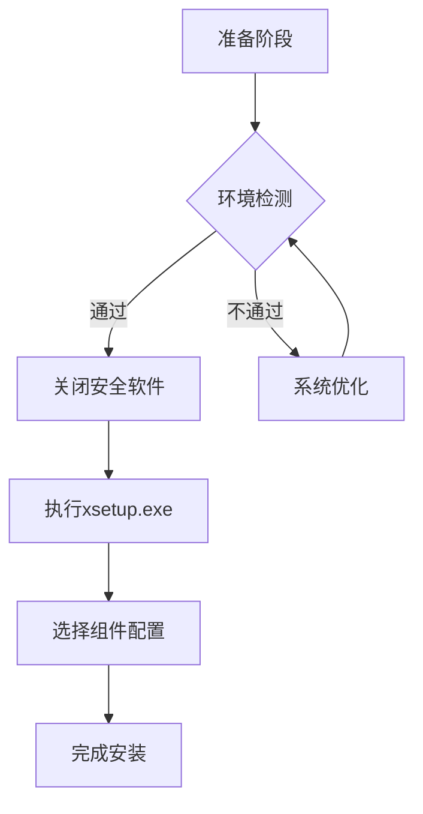

# 实验2：认识Vivado

## Vivado 开发环境演进与部署指南

### 一、Vivado 与 ISE 的演进关系
#### 1.1 工具迭代背景
Xilinx于2012年推出Vivado设计套件，标志着FPGA开发工具进入新时代。作为ISE的继任者，Vivado针对28nm及更先进工艺节点进行了深度优化，其核心优势体现在：

- **架构革新**：采用基于IP的设计流程（IP-Centric）
- **性能飞跃**：综合速度提升4倍，实现效率提高15%
- **生态整合**：集成高层次综合（HLS）与系统生成器（System Generator）

> **技术转折点**：2008年启动研发计划，历时4年完成首版发布，持续更新至2017.4版本后进入长期支持阶段。

#### 1.2 开发工具对比矩阵

| 特性                | ISE 14.7          | Vivado 2017.4      |
|--------------------|-------------------|--------------------|
| 最大器件支持         | 7系列             | UltraScale+        |
| 时序收敛周期         | 平均3-5次迭代     | 平均1-2次迭代       |
| Tcl脚本兼容性        | 基础命令集         | 完整命令体系        |
| 功耗分析精度         | ±20%              | ±5%                |


### 二、Vivado 开发环境部署
#### 2.1 版本选择建议
- **推荐版本**：2017.4（本开发板验证版本）
- **获取路径**：
  ```markdown
  [Xilinx官方下载中心](http://china.xilinx.com/support/download.html)
  -> Vivado Design Suite - HLx 2017.4
  ```
- **安装包特性**：
  - 双平台支持（Windows/Linux）
  - 最小存储需求：30GB SSD
  - 强制要求64位操作系统

#### 2.2 安装流程规范


**关键操作节点**：
1. 安装包解压后右键以管理员身份运行`xsetup.exe`
2. 组件选择建议勾选：
   - Vivado HL System Edition
   - Zynq-7000 Device Support
   - SDK Tools
3. 遇到更新提示时选择"Continue Without Updates"


#### 2.3 环境验证方法
```bash
# Windows PowerShell验证命令
vivado -version
# 预期输出
Vivado v2017.4 (64-bit)

# Linux终端验证命令
which vivado
# 预期路径
/opt/Xilinx/Vivado/2017.4/bin/vivado
```

### 三、开发环境最佳实践
#### 3.1 工程配置建议
- **路径规范**：避免中文字符和空格（建议使用`Project_Zynq7020`格式）
- **器件选择**：xc7z020clg400-2
- **预设策略**：选择"Zynq Base System"加速PS-PL配置

#### 3.2 许可证管理
- **免费授权**：申请WebPACK License支持7系列器件
- **网络许可**：配置FlexLM服务器（需升级至11.14.1版本）

> **重要提示**：Solaris系统支持终止于2017.4版本，建议迁移至CentOS 7或Windows 10环境。


### 四、版本迁移策略
针对ISE项目迁移建议采用分阶段方案：
1. **IP核迁移**：使用IP Catalog的Migrate功能
2. **约束文件转换**：通过Tcl脚本自动转换`.ucf`至`.xdc`
3. **时序约束验证**：使用Report Timing Summary交叉验证

## 点亮LED
以下是点亮LED的verilog代码。
新建Verilog文件
```verilog led.v
`timescale 1ns / 1ps
//////////////////////////////////////////////////////////////////////////////////
// Company: 
// Engineer: 
// 
// Create Date: 2025/03/23 20:27:37
// Design Name: 
// Module Name: led
// Project Name: 
// Target Devices: 
// Tool Versions: 
// Description: 
// 
// Dependencies: 
// 
// Revision:
// Revision 0.01 - File Created
// Additional Comments:
// 
//////////////////////////////////////////////////////////////////////////////////


module led(
    input sys_clk,
    input rst_n,
    output reg [3:0] led
    );
    
reg[31:0] timer_cnt;
always @(posedge sys_clk or negedge rst_n)
begin
    if (!rst_n)
    begin
        led <= 4'd0;
        timer_cnt <= 32'd0;
    end
    else if (timer_cnt >= 32'd49_999_999)
    begin
        led <= led + 4'd1;
        timer_cnt <= 32'd0;
    end
    else
    begin
        led <= led;
        timer_cnt <= timer_cnt + 32'd1;
    end
end 

endmodule
```

新建仿真文件
```verilog vtf_led_test.v
`timescale 1ns / 1ps
//////////////////////////////////////////////////////////////////////////////////
// Company: 
// Engineer: 
// 
// Create Date: 2025/03/23 20:44:29
// Design Name: 
// Module Name: vtf_led_test
// Project Name: 
// Target Devices: 
// Tool Versions: 
// Description: 
// 
// Dependencies: 
// 
// Revision:
// Revision 0.01 - File Created
// Additional Comments:
// 
//////////////////////////////////////////////////////////////////////////////////


module vtf_led_test;

reg sys_clk;
reg rst_n;
wire [3:0] led;
led uut(
    .sys_clk(sys_clk),
    .rst_n(rst_n),
    .led(led)
    );
initial
begin
    sys_clk=0;
    rst_n = 0;
    #1000;
    rst_n = 1;
end
always #10 sys_clk = ~sys_clk;

endmodule
```

利用以上代码，利用Vivado进行仿真，并且综合，把把程序烧录到黑金的ZYNQ7020里面。并且记录实验内容，完成实验报告。
