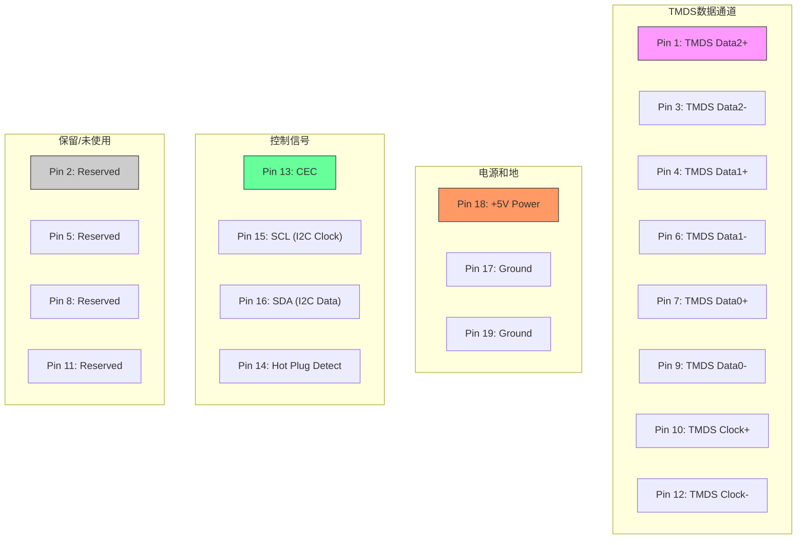

# 实验3：HMDI输出实验

**实验 Vivado 工程：** `hdmi_output_test`  
**责任角色：** FPGA 工程师

## 实验概述
本章通过HDMI彩条输出实验，为后续视频处理奠定基础。实验不涉及PS系统，需掌握FPGA基础知识，重点关注以下要素：
- **像素时钟**：分辨率相关的时序基准（本实验采用720p，74.25MHz）
- **时序参数**：行/场同步信号的有效长度、前后肩周期
- **数据生成**：RGB彩条数据的产生与编码

> **实验特点**：  
> 开发板直接使用FPGA的3.3V差分IO驱动HDMI接口，无需外置编码芯片。

---

## 硬件设计
###  HDMI接口方案



- **信号类型**：TMDS差分信号（FPGA直接输出）
- **分辨率支持**：720p (1280x720@60Hz)
- **关键参数**：

| 参数类型          | 符号     | 值       | 说明                     |
|-------------------|----------|----------|--------------------------|
| **行时序**        | H_ACTIVE | 1280     | 行有效像素周期数         |
|                   | H_FP     | 110      | 行同步前肩长度          |
|                   | H_SYNC   | 40       | 行同步脉冲长度          |
|                   | H_BP     | 220      | 行同步后肩长度          |
| **场时序**        | V_ACTIVE | 720      | 场有效行数              |
|                   | V_FP     | 5        | 场同步前肩长度          |
|                   | V_SYNC   | 5        | 场同步脉冲长度          |
|                   | V_BP     | 20       | 场同步后肩长度          |

---

##  Vivado工程搭建
### 工程初始化
1. **新建工程**  
   - 工程名：`hdmi_output_test`
   - 复制`repo`文件夹至工程目录（包含HDMI编码器IP）

2. **添加第三方IP**  
   ```操作步骤
   IP Catalog → Add Repository → 选择repo文件夹 → 确认添加
   ```
   - **关键IP**：`RGB to DVI Video Encoder`（Digilent提供）

---

###  IP核配置
#### HDMI编码器IP（RGB to DVI）
- **IP名称**：`rgb2dvi_0`  
- **配置参数**：
  - 时钟源：内部生成（由像素时钟驱动）
  - TMDS时钟范围：`<120 MHz`（720p模式）

#### 像素时钟生成模块（PLL）
- **IP名称**：`video_clock`  
- **输入时钟**：50MHz（开发板PL端晶振）  
- **输出时钟**：
  - `clk_out1`：74.25MHz（像素时钟）
  - `clk_out2`：371.25MHz（5倍频，用于TMDS串行化）

---

### 彩条生成模块
#### 模块功能
- 产生720p时序信号（HS/VS/DE）
- 生成水平方向8色渐变彩条（RGB 24-bit）

#### 代码核心逻辑
```verilog
module color_bar(
    input clk,        // 74.25MHz像素时钟
    input rst,        // 高电平复位
    output hs,        // 行同步信号（高有效）
    output vs,        // 场同步信号（高有效）
    output de,        // 数据有效信号
    output [7:0] rgb_r, // R分量
    output [7:0] rgb_g, // G分量
    output [7:0] rgb_b  // B分量
);
    // 时序参数定义（见5.2.1节表格）
    // 彩条生成逻辑...
endmodule
```

---

### 顶层模块设计
#### 模块结构
```verilog
module top(
    input clk_50m,     // 50MHz输入时钟
    input rst_n,       // 复位信号（低有效）
    output [3:0] tmds  // HDMI差分信号
);
    // 时钟模块例化
    video_clock u_clk(
        .clk_in1(clk_50m),
        .clk_out1(pixel_clk),
        .clk_out2(serial_clk)
    );
    
    // 彩条生成模块例化
    color_bar u_color(
        .clk(pixel_clk),
        .rst(~rst_n),
        .hs(hs),
        .vs(vs),
        .de(de),
        .rgb_r(r),
        .rgb_g(g),
        .rgb_b(b)
    );
    
    // HDMI编码器例化
    rgb2dvi_0 u_dvi(
        .PixelClk(pixel_clk),
        .SerialClk(serial_clk),
        .aRst(~rst_n),
        .vid_pData({r,g,b}),
        .vid_pHSync(hs),
        .vid_pVSync(vs),
        .vid_pVDE(de),
        .TMDS_Clk_p(tmds[3]),
        .TMDS_Clk_n(tmds[2]),
        .TMDS_Data_p(tmds[1:0]),
        .TMDS_Data_n(tmds[3:2])
    );
endmodule
```

---

## 关键实现步骤
1. **IP核生成**  
   - 通过IP Catalog添加并配置`rgb2dvi_0`和`video_clock`模块。

2. **代码集成**  
   - 将彩条生成模块`color_bar.v`加入工程，并连接至顶层模块。

3. **约束文件配置**  
   - 指定HDMI接口引脚位置与电平标准（LVDS_33）。

4. **综合与实现**  
   - 运行全流程编译，检查时序收敛性。

---

## 注意事项
1. **时钟精度**  
   - 确保像素时钟误差在±1%以内，避免显示抖动。

2. **差分信号约束**  
   - 需在XDC文件中声明TMDS信号的差分对属性。

3. **复位逻辑**  
   - 编码器IP的复位信号需与像素时钟同步。

---

> **扩展学习**：  
> 可通过修改`color_bar`模块的时序参数，适配其他分辨率（如1080p），需同步调整像素时钟与编码器配置。

