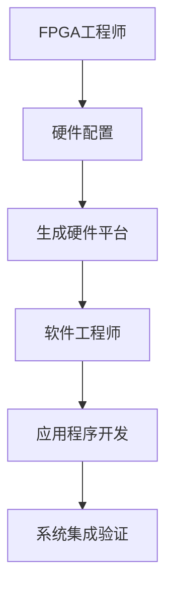
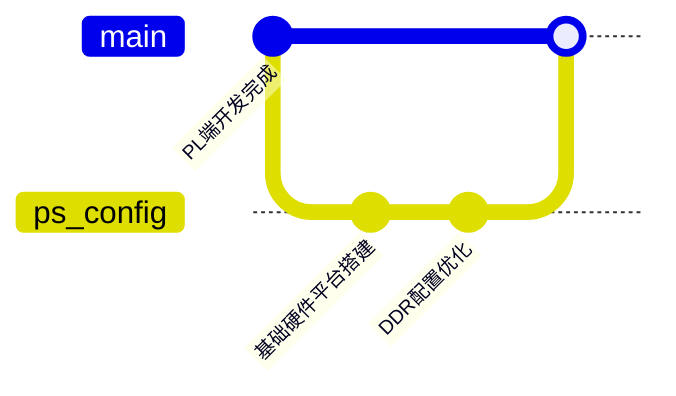

# 实验4：体验 ARM 裸机输出 "Hello World"

实验工程： ps_hello（Vivado工程）
开发模式： FPGA工程师与软件工程师协同开发

## 开发模式转型
### 开发流程转变
阶段	负责人员	工作内容
PL端开发	FPGA工程师	传统FPGA逻辑开发
PS端开发	软硬件协同	FPGA搭建硬件环境 + 软件开发应用程序
### 协同优势


## 硬件平台搭建
### Vivado工程创建流程
工程初始化

工程名称：ps_hello
开发板选择：XC7Z020CLG400-1
Block Design创建


### ZYNQ核配置

#### 关键配置项：

- PS-PL接口配置（AXI总线）
- 外设引脚分配（UART/Ethernet/USB等）
- 时钟树配置
- DDR参数设置

### PS端外设配置规范
UART配置表
参数项	配置值	注意事项
外设选择	UART1	MIO48-49
电平标准	LVCMOS 3.3V	Bank1需配置1.8V
波特率	115200	需与软件设置一致
DDR配置参数
```json
{
  "Memory Type": "DDR3",
  "Part Number": "MT41J256M16 RE-125",
  "Bus Width": "32 Bit",
  "Clock Freq": "533.333 MHz",
  "Timing Profile": "DDR3_1066F"
}
```

### 时钟配置原则
主时钟输入：33.333MHz（板载晶振）
CPU频率：666.666MHz（默认值）
PL时钟供给：保持默认关闭状态
6.3 关键配置验证点
硬件工程师检查清单
 PS端Bank电压配置正确
 UART引脚分配与原理图一致（MIO48-49）
 DDR型号选择兼容列表中的最接近型号
 以太网PHY时钟配置为HSTL 1.8V
软件工程师准备事项
SDK工程建立
FSBL（First Stage Bootloader）配置
串口打印驱动验证
## 版本控制建议


附录：常用命令速查
功能	Vivado命令

- 生成HDL封装器	generate_target all [get_files *.bd]
- 验证设计完整性	validate_bd_design
- 生成比特流文件	launch_runs impl_1 -to_step write_bitstream
