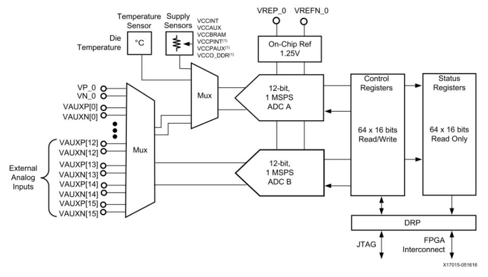
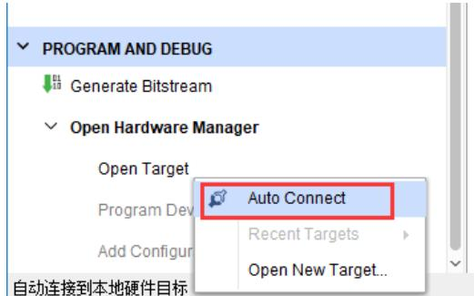
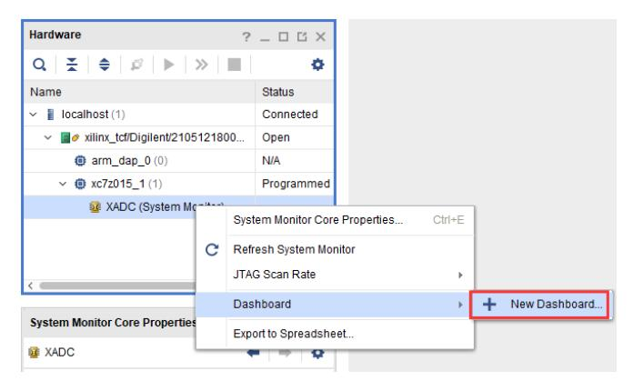
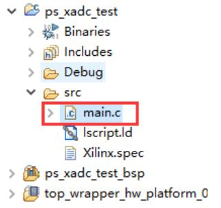

# XADC 的使用

本实验介绍 XADC 的基本功能与常用访问方法，目标是让读者掌握在硬件工具、PS 软件以及通过 AXI/PL 三种不同方式下读取与监测 XADC 数据的实用流程与用途，并理解何种场景适合事件驱动（中断）监测或轮询式读取。

## XADC 概述与能力
XADC 嵌入于器件内部，允许 PS 或其他主机直接访问而无需通过 PL，其最大采样率为 1 MSPS，分辨率为 12 bit，内置温度传感器与多个供电电压传感器，用于监测芯片的电源电压与温度。电压传感器可监测 VCCINT、VCCAUX、VCCBRAM 等；VP_0 与 VN_0 为差分模拟输入端；VAUXP[*] 与 VAUXN[*] 也是模拟输入，可在不作为 ADC 输入时用作普通 IO。在多数示例开发板上，部分 VAUX 引脚可能未对外引出，因此本实验重点演示片内温度传感器与片内供电电压传感器的读取方法，其主要功能是实现对芯片健康状态的实时监测与报警触发。

## 三类读取方法概览
本章将详细介绍三种读取 XADC 数据的方式：硬件仪表盘方式用于交互式与实时观测、软件（PS）轮询方式用于简单周期性采集与打印、以及基于 AXI/PL 的事件驱动（中断）方式用于报警或对 PL 可见的数据流处理。选择何种方式取决于对实时性、可编程性与是否需要在 PL 中访问采样数据的需求。

## 硬件方式读取（Hardware Manager 仪表盘）
硬件方式的流程为将开发板上电并连接 JTAG 下载器，设置设备为 JTAG 模式后在 Vivado 的 Hardware Manager 中执行 Auto Connect 并确认硬件连接成功，然后在 Hardware Manager 中找到 XADC 设备并右键创建仪表盘（Dashboard），按需添加温度或电压显示项；该方法的主要功能是为开发与调试提供直观的实时曲线与界面交互，便于快速定位异常，但不适合批量自动化采集或后续数值统计（无法直接导出结构化的历史数据供程序处理）。

## 软件（PS）方式读取 XADC 信息
软件方式的核心是在 SDK 中创建或导入应用工程并使用 XADC/XSYSMON 提供的 API 在 PS 上轮询读取数据。具体做法是确保系统中包含 XADC/XSYSMON 外设（可在 system.mss 中查看），在应用程序中引用 xadcps.h 与 xadcps_hw.h，使用 XAdcPs_GetAdcData 获取原始 ADC code，并用 XAdcPs_RawToTemperature 或 XAdcPs_RawToVoltage 等转换函数获得可读的温度或电压值，然后按一定周期（例如 1 s）通过串口打印输出。这种方法实现简单、移植方便，主要功能是快速在 PS 上获得传感器数值以用于软件级逻辑或日志记录，但其局限是 XADC 数据不可直接被 PL 逻辑访问，适用于对实时性要求适中且以软件处理为主的场景。

## 基于 AXI/PL 的 XADC 读取与中断监测
当需要在 PL 中访问 ADC 数据或基于事件驱动触发报警时，应将 XADC 以 IP 形式接入 Block Design 并使能中断。一般流程是在 Vivado 中添加 XADC IP、运行 Connection Automation 并将 XADC 的中断线连接到 CPU 的中断接口，启用 Channel Sequencer 并选择需要采样的通道（例如 VP/VN、VAUX1、VAUX9、VAUX12 等），导出这些通道的 IO 并在 IO Ports 中设置电平标准，随后生成 bitstream 并导出包含 bitstream 的硬件平台以便 SDK 使用。在 SDK 中通过 sysmon.h / sysmon_hw.h（或 XSysMon API）配置报警阈值（如温度上限/下限）并启用中断，软件端在中断服务程序中使用 XSysMon_IntrGet_Status 读取中断来源并用 XSysMon_IntrClear 清除中断，从而实现事件驱动的报警与保护策略。该方式的主要功能是将监测逻辑从轮询转为高效的中断响应，适合对实时性和报警响应有较高要求的系统。

在配置报警阈值时，温度与 ADC code 的换算关系为：
Temp upper/lower (°C) = ((16 bit ADC Code) × 503.975) / 65536 − 273.15
因此可以通过设置合适的 ADC code 来定义温度阈值（程序中通常提供换算宏或函数以便设置）。

在具体实现中注意如下要点：XADC 的 ADC 输入范围为 0–1 V，若外部测量对象电压超出此范围（例如直接测量 5 V），需在硬件上采用分压或前置放大进行匹配；若使用分压，程序中需根据分压比进行电压换算（示例中使用分压比 10，将 0–10 V 映射到 ADC 的 0–1 V 范围）。XADC 支持多种报警源（温度、VCCINT、VCCAUX、VCCBRAM、OT 等），可通过相应 Alarm Threshold 寄存器启用或禁用，并结合中断掩码完成更复杂的监测策略。

在配置报警阈值并启用中断后，软件端可在中断服务例程中及时响应（打印、记录或采取保护措施），该机制适合用于温度或电源异常报警场景。

下列寄存器表用于参考（地址与含义请参见官方文档）：

| 寄存器地址 | 描述 |
|---:|---|
| 0x50 | Temperature upper (ALM[0]) |
| 0x51 | VCCINT upper (ALM[1]) |
| 0x52 | VCCAUX upper (ALM[2]) |
| 0x54 | Temperature lower (ALM[0]) |
| 0x58 | VCCBRAM upper (ALM[3]) |
| 0x59 | VCCPINT upper (ALM[4]) |
| 0x5A | VCCPAUX upper (ALM[5]) |
| 0x5B | VCCO_DDR upper (ALM[6]) |
| 0x5C | VCCBRAM lower (ALM[3]) |
| 0x5D | VCCPINT lower (ALM[4]) |
| 0x5E | VCCPAUX lower (ALM[5]) |
| 0x5F | VCCO_DDR lower (ALM[6]) |

## 示例实现流程（概要）
- 在 Vivado 中配置 XADC 通道并导出 IO，引入中断线；  
- 生成比特流并导出包含 bitstream 的硬件平台；  
- 在 SDK 中创建或导入应用，使用 XSysMon API 设置温度/电压阈值并启用中断全局使能；  
- 在中断服务程序中读取并判断中断来源，执行清中断与相应处理逻辑；  
- 通过串口验证采样数值与中断触发情况。

## 验证与结果
实验验证显示系统能够读取片内温度与各路电压，并在超过设置阈值时触发中断，串口输出相应报警信息。测量读数可能存在一定偏差（例如电流约 0.48 A、电压 VAUX12 约 5 V），应结合硬件测量精度、分压误差及采样滤波进行校准以获得更准确的数值。

## 小结与选型建议
本章比较并介绍了三类读取 XADC 的方法：硬件仪表盘（便捷但不便于自动化）、PS 轮询（简单直接）与基于 AXI/中断的事件驱动方法（灵活且适合报警场景）。在选择实现方式时应在精度、实时性、是否需要 PL 可见性与系统复杂度之间权衡，并结合 UG585 与 UG480 的寄存器文档进行具体实现与校准。
