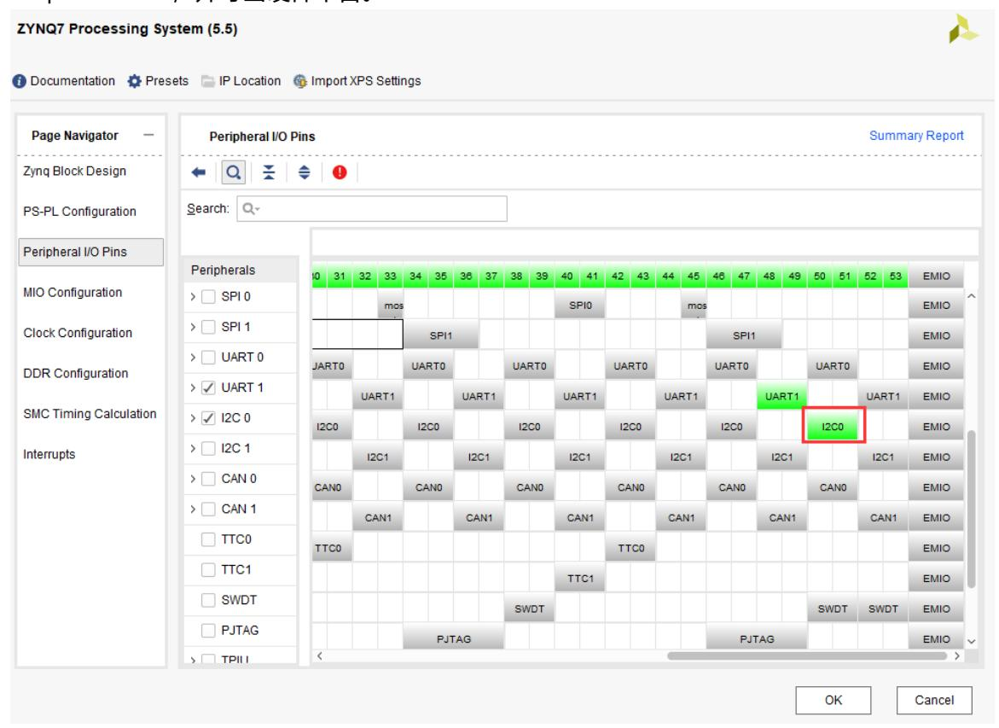
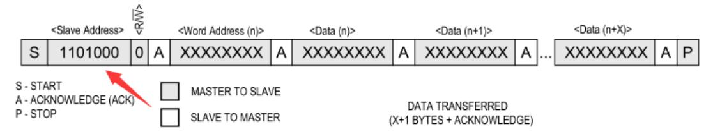
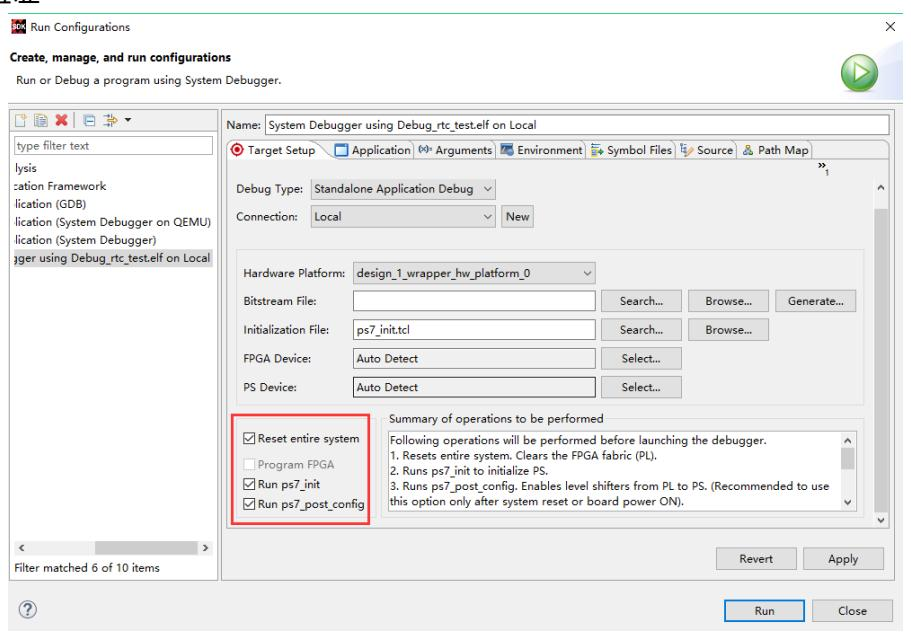
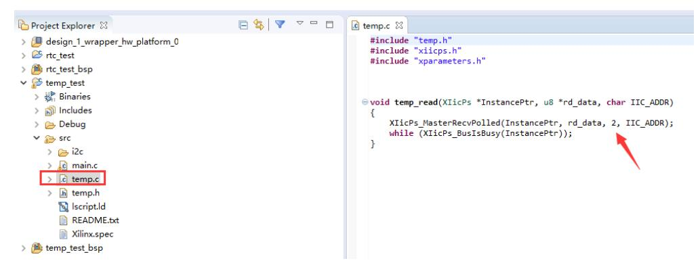
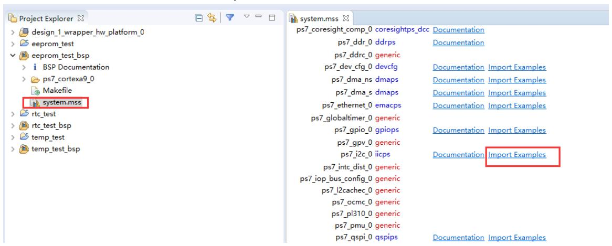

# I2C 的读写

本实验旨在演示如何通过 Zynq PS 端的 I2C 总线访问并控制常见外设（如 RTC、温度传感器、EEPROM），重点在于硬件映射、Vivado 中的引脚配置与导出、以及在 SDK 中实现可靠的读写与错误处理。读者完成本章后应能在目标板上建立 I2C 总线通信、实现寄存器级别的读写并验证设备返回的数据。

## 硬件工程搭建与映射说明

在硬件层面，本实验建议在已存在的 Vivado 工程 ps_hello 基础上另存为 i2c_test，将 I2C0 对应映射到 PS 的 MIO50–MIO51 并根据原理图设置电平与上拉/下拉策略，然后重新生成 Block Design 输出并导出硬件平台（HDF）供 SDK 使用；该步骤的主要功能是确保软件端获得正确的外设地址映射与引脚约束，从而在运行时能直接访问物理 I2C 总线。

## RTC（DS1338）示例与要点

关于 RTC 的测试，示例板采用 DS1338，其寄存器从 00H（秒）到 07H（控制寄存器），设备 7 位地址通常为 0x68。典型的实现流程包括 I2C 外设初始化与通信参数设置、将 RTC 配置为方波输出模式并检查 / 清除停止标志、写入初始时分秒寄存器以及通过串口打印当前时间以便验证；这些步骤的主要功能是让软件定期读取并校准实时时钟，以及在需要时通过方波/中断机制与系统其他模块进行时间同步。完成以上操作后，通过串口观察时间输出以确认读写正确性。

## 温度传感器（LM75）示例与数据处理

LM75 的 I2C 7 位地址通常为 0x48，其温度寄存器为两字节格式：首字节为整数部分，次字节最高位表示 0.5°C。软件端需在 SDK 中实现读取两个字节并按设备手册将原始码转换为摄氏度，定时打印或记录测得温度。该示例的主要功能是展示如何从 I2C 从设备按字节协议读取数据并进行有符号数或半度位的解析，适用于环境监测或热管理策略验证。

## EEPROM 读写示例（流程说明）

针对板载 EEPROM（例如 24LC04），编程流程通常包括准备写缓冲区并向指定地址写入数据、随后从相同地址读取数据到读缓冲区并进行校验以确认写入成功，以及根据需要重复写读操作以验证可靠性；这些步骤的主要功能是验证 I2C 总线的稳定性、EEPROM 的写保护与寻址机制以及读回校验逻辑，从而确保非易失性存储在实际应用中的数据完整性。可直接使用 SDK 中的 xiicps_eeprom_polled_example 快速搭建测试并在运行时观察校验结果。

## 实现要点与注意事项

在实现 I2C 驱动与应用时需注意：从设备地址与寄存器格式必须严格按照器件手册处理（7-bit 与 8-bit 编码差异）；在驱动层切实参照器件时序图（起始/停止/ACK/NACK）以避免传输错误；对于周期性采样外设（RTC、温度传感器）建议在软件中实现重试与错误检测机制以提升鲁棒性；使用 SDK 示例代码可以快速入门，但必须针对实际硬件地址与寄存器映射做相应调整。以上要点的功能在于提高通信可靠性并减少现场调试时间。

## 开发与调试流程概述

在整体开发流程上，先在 Vivado 中完成硬件导出并生成硬件平台（HDF），再在 SDK 中创建对应的应用工程并移植或实现 I2C 读写函数；调试时以串口输出与逻辑分析为主手段，串口用于软件运行态验证，逻辑分析用于电平与时序诊断。此流程的主要功能是建立软硬件联调路子，快速定位协议或电气层面的异常。

## 实验小结

本章系统演示了通过 PS 侧 I2C 接口访问常见外设（RTC、温度传感器、EEPROM）的流程，包含硬件映射、SDK 中的初始化、寄存器读写及结果验证。建议读者结合外设手册与项目需求，针对异常场景补充错误处理与重试逻辑，以提高系统稳定性。

