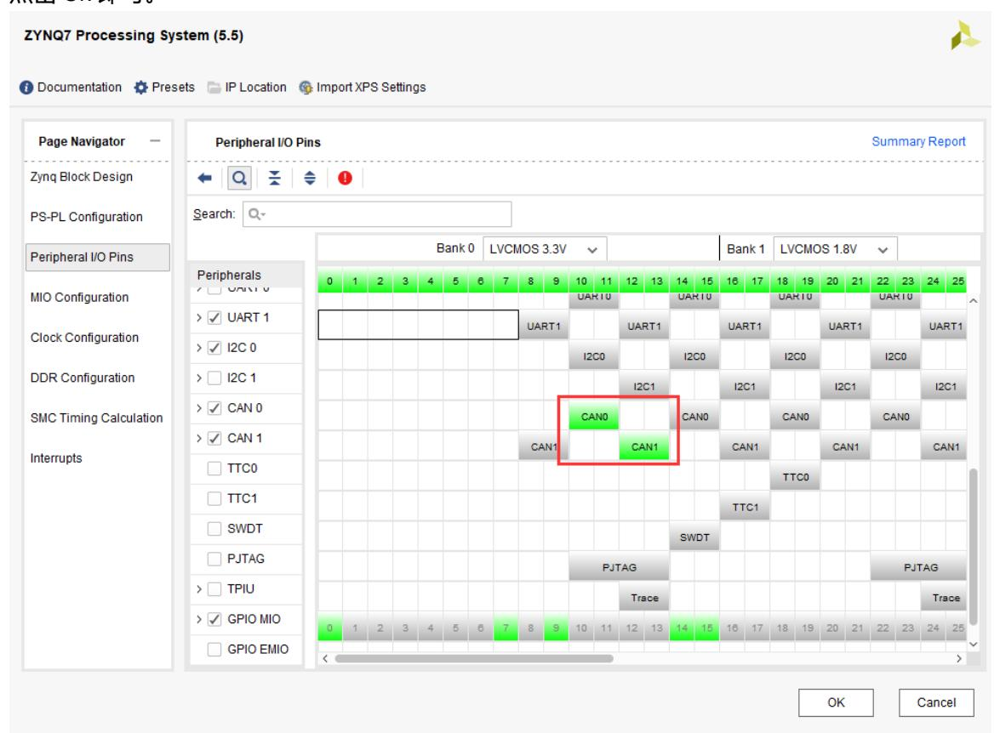
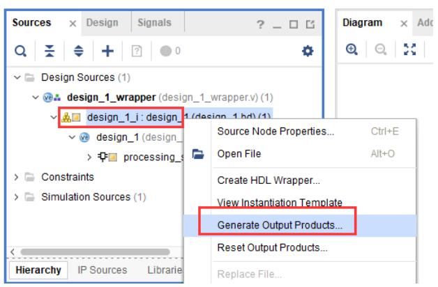
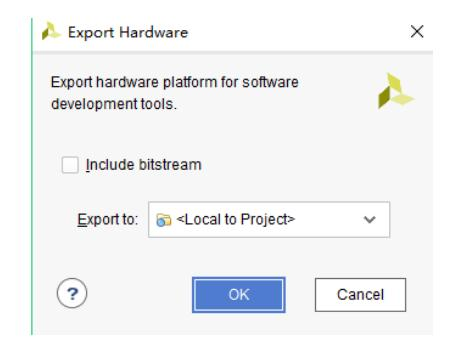
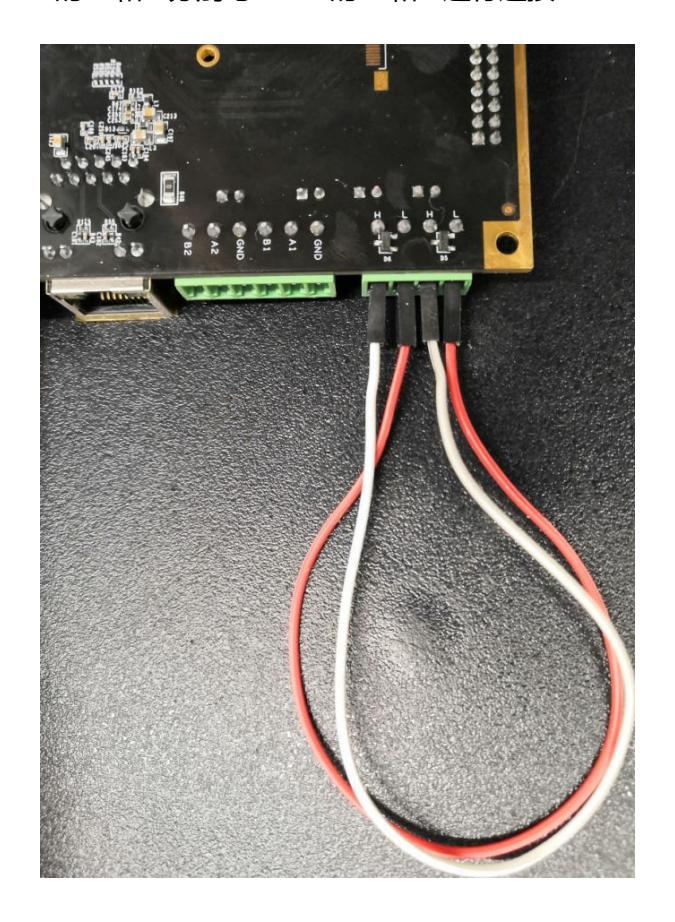
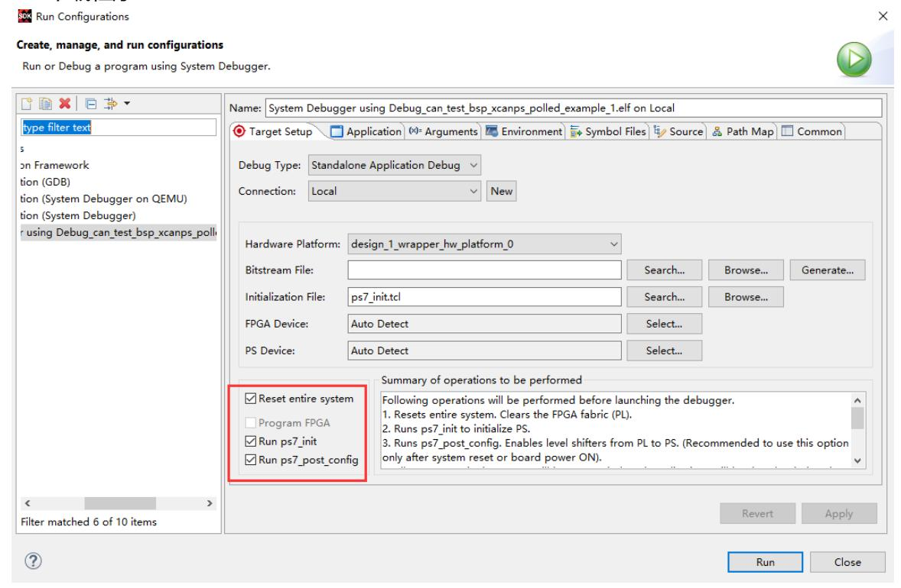
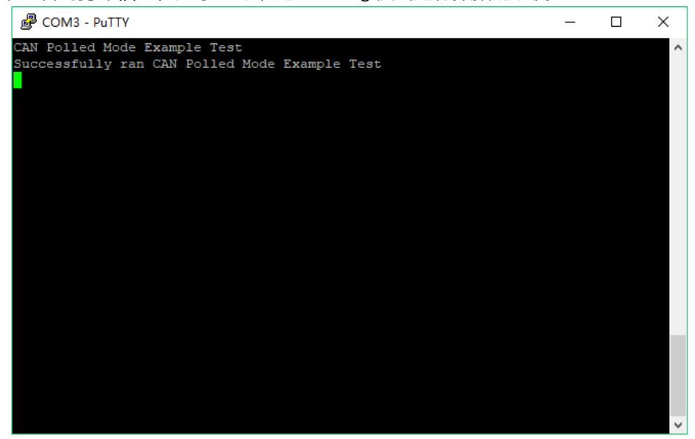

# CAN 总线读写

本实验介绍基于开发板上两路 CAN 接口开展回环测试的方法与流程，包含硬件配置与 SDK 程序开发的关键步骤与注意事项。

## 硬件配置与工程准备

以现有 Vivado 工程 ps\_hello 为基础将工程另存为 ps\_can 并在 Block Design 中打开 Zynq 处理系统配置，启用 CAN0 与 CAN1 外设并确认配置后保存设计，随后运行 Generate Output Products 并导出硬件平台（不包含 bitstream）以便在 SDK 中进行软件开发与调试；此步骤的主要功能是确保软件端获得正确的外设映射与地址资源，从而能够在运行时通过 PS 访问并配置 CAN 控制器。

## SDK 程序开发与测试方法

在 SDK 中创建 can\_test 工程并以示例工程 xcanps\_polled\_example 为起点进行开发和修改，示例默认实现单通道 CAN 的内部 loopback 功能，本实验需要将两路 CAN 都设置为 Normal 模式并在外部物理连线下验证通信。程序设计的要点可表述为两方面：一是完成 CAN0 与 CAN1 的初始化并配置为 Normal 模式，这一部分负责将控制器置于正常收发状态并设置波特率、滤波及时间段参数；二是实现循环测试函数（例如 CanLoopback），该函数的工作流程为：由 CAN0 发送测试数据并由 CAN1 接收并校验其完整性、在接收缓冲清空后反向发送（CAN1 发送、CAN0 接收）并再次校验，最终通过校验结果判断双通道物理连线的通断与数据完整性。以上流程的主要功能是验证两路 CAN 在真实物理条件下的数据收发与帧完整性，并用于检测帧错、丢包和重发逻辑。

## 物理连线与运行验证

在硬件层面，使用跳线将 CAN0 的 H/L 分别与 CAN1 的 H/L 对接以形成物理回环链路，完成连线后在 SDK 中下载并运行 can\_test 程序；运行时通过串口观察打印信息或进入调试模式监测数据帧的发送与接收情况，此阶段的主要功能是进行端到端的通信检验并确认硬件连线、电平匹配与终端电阻配置（若需要）是否正确。

## 结果验证与功能扩展

测试完成后应验证发送帧与接收帧的一致性、统计误码率并检查异常处理逻辑（例如重发机制或错误计数累加）。在通过基本回环测试确认功能后，可按工程需要扩展为多节点拓扑、增加硬件/软件层面的滤波规则或对接更复杂的协议栈（例如 CANopen 或 J1939），这些扩展的主要功能是满足更复杂的网络化通信需求与上层应用协议支持。

## 小结

本文展示了在 Zynq 平台上配置两路 CAN 接口并进行回环测试的完整流程，从硬件工程准备、SDK 示例改造、物理连线到运行验证与结果分析。通过硬件连线与软件示例相结合的方法，可以高效验证 CAN 外设功能并为后续的网络化通信或多节点系统开发提供实践基础与参考。
