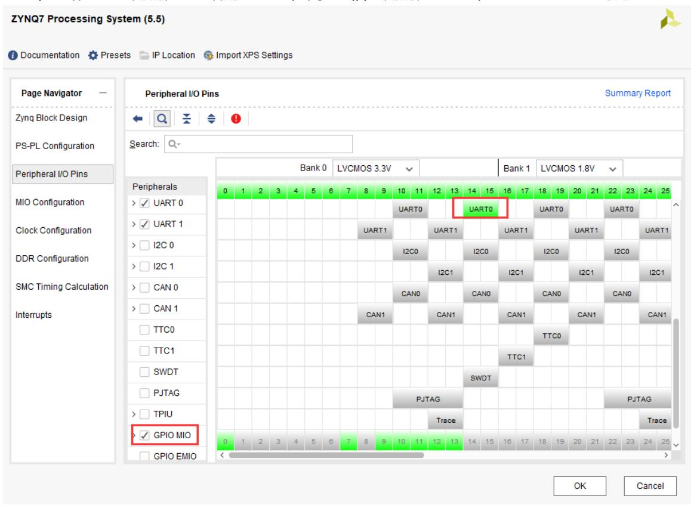
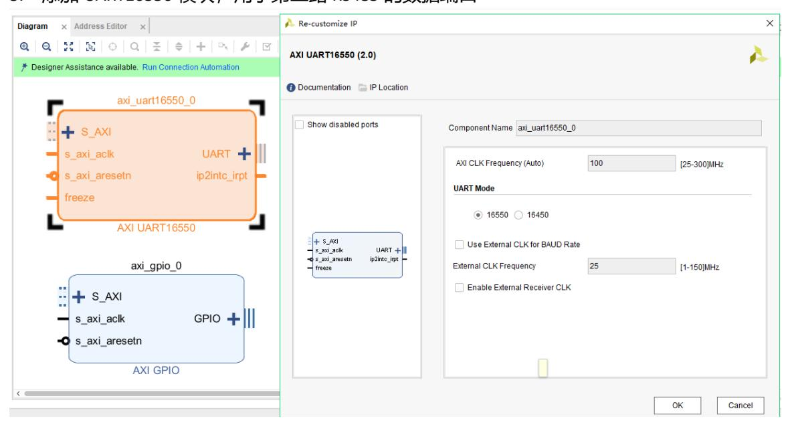
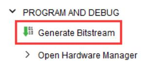
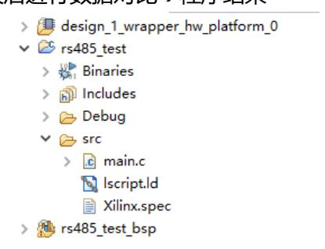
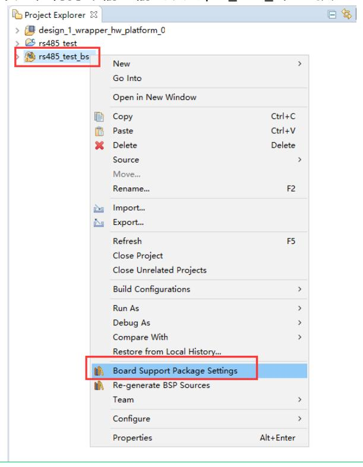
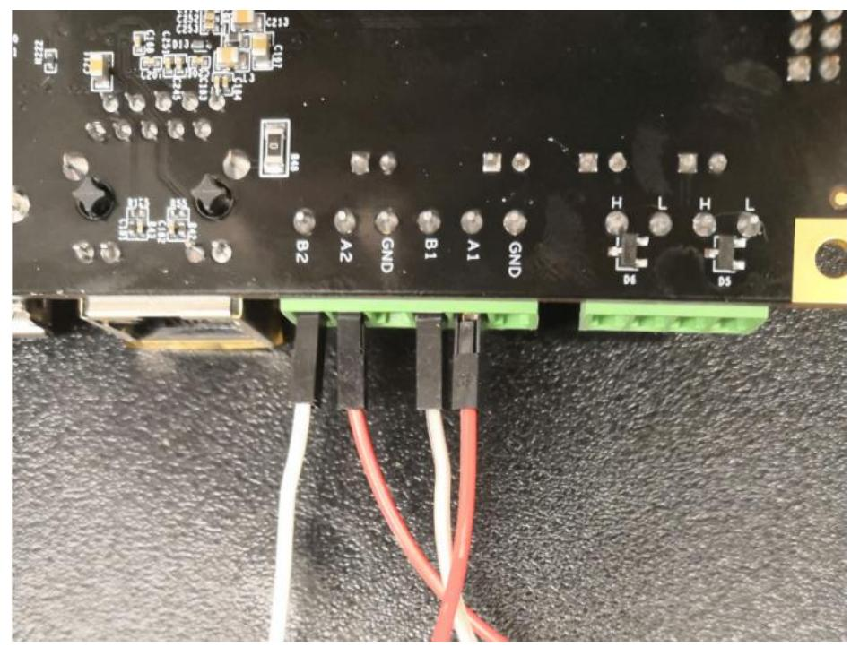
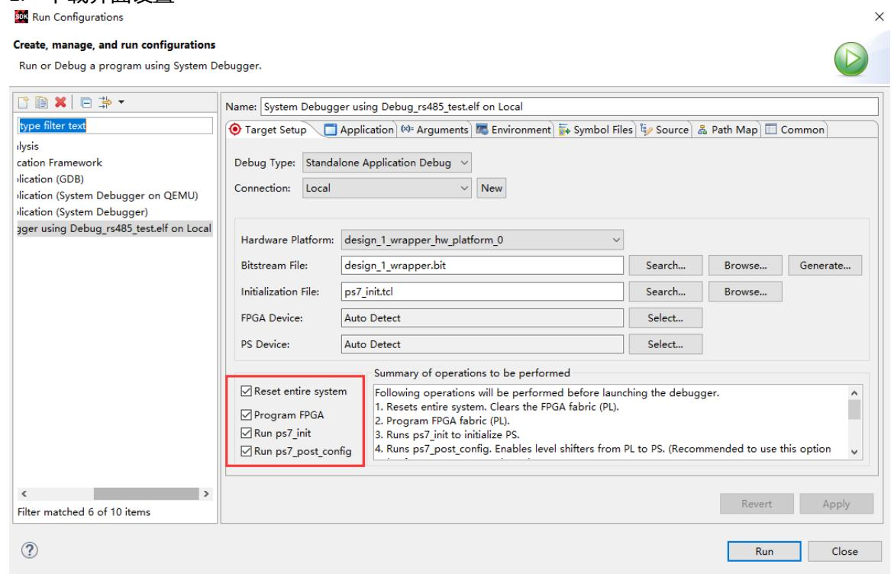

# RS485 测试

本实验通过开发板上两路 RS485 接口的回环测试，演示半双工 RS485 网络中的方向控制（DE）与差分数据传输实现方法，目标是掌握 PS 与 PL 端串口与方向控制的协同设计、数据校验流程以及现场调试验证技巧，从而为后续的工业串口或总线集成提供参考。

## 硬件准备与工程配置

在 Vivado 中以现有工程 ps_hello 为基础另存为 rs485_test，并在工程中根据板级原理图完成资源映射与时钟设置；具体应将 RS485_0 映射到 PS 侧的 UART0 并由 PS 的 MIO9 提供方向控制信号 DE，确保在 Zynq PS 配置中启用对应 MIO/GPIO 并设置合适的电平标准与上拉策略；为第二路 RS485 在 PL 侧增加控制逻辑，包括添加 AXI GPIO（作为第二路 DE 的输出，位宽设为 1）以及 UART16550 作为第二路串口物理接口，并在 block design 中运行 Connection Automation、绑定 UART16550 的引脚与常量 IP 以配置流控信号，最后修改顶层端口名并在 XDC 中完成管脚约束，生成比特流并导出包含 bitstream 的硬件平台。上述硬件准备的主要功能是提供两路可控的半双工物理链路、明确方向控制信号路径并导出供软件使用的地址映射与顶层端口。

## FPGA 端设计与约束要点

在完成 PL 设计后务必确认顶层端口名称与 XDC 中使用的一致，AXI GPIO 用于驱动 DE 信号应保证输出驱动能力与电平兼容，UART16550 的 sin/sout 需导出为顶层引脚并与差分收发器或转换电路正确连接；若 PL 产生中断，应将中断线连接到 Zynq 的 IRQ_F2P 并在约束中注明时序与 io 标准。此部分的功能是确保 PL 侧生成的控制与数据信号在物理上能正确驱动 RS485 总线，并在综合与实现阶段满足时序约束。

## SDK 程序开发与关键步骤

在 SDK 中新建 rs485_test 应用工程，程序结构应包括初始化、方向控制、数据发送/接收与校验逻辑。初始化阶段需分别配置 PS 端 UART0 与 PL 端 UART16550 的串口参数（建议统一为 115200、8N1），并初始化用于方向控制的 GPIO（PS: MIO9，PL: AXI GPIO）。方向控制与回环流程为实验核心：采用轮换发送/接收的方法验证链路可靠性，先将 RS485_0 设为发送端、RS485_1 设为接收端，发送前需等待切换延迟（例如 1 ms）以确保驱动器使能稳定，发送端写入固定长度数据（示例使用 16 字节），接收端读取并校验数据，随后反向切换重复流程；最终根据校验结果判断链路可靠性。BSP 配置方面应将标准输入/输出重定向到 PS 端串口（ps7_uart_1）以便通过主机串口查看日志；若采用中断驱动模式，需要在 SDK 中注册中断服务例程并在 PL/PS 侧正确使能中断。以上软件开发流程的主要功能是实现对方向控制时序的精确管理、保证发送完成后的总线释放以及通过校验逻辑验证链路与数据完整性。

## 运行验证与物理连线方法

物理连线时使用杜邦线将两路差分对对应连接（A1↔A2，B1↔B2），并视需要配置终端电阻以保证信号完整性；连线完成后在 SDK 中选择 Reset entire system（并在包含 PL 设计时勾选 Program FPGA），下载并运行应用，通过主机串口观察打印信息或进入 Debug 模式监测发送/接收缓冲与 GPIO（DE）状态以确认时序是否满足要求。运行验证的主要功能是对端到端数据路径进行实际信号级别的检测，检查 DE 切换时序、数据正确性与异常处理逻辑。

## 实验总结与扩展建议

本实验通过两路 RS485 的互联与轮换发送验证了方向控制与差分数据传输的基本实现，并提供若干后续扩展建议以提升系统性能与适用性，例如引入中断驱动与 DMA 支持以降低 CPU 占用并提高吞吐、在多节点拓扑下测试总线仲裁与冲突处理策略、在硬件端增加终端匹配与隔离电路以改善信号完整性与支持更长线缆长度，以及对接 Modbus 或其他工业协议以实现更复杂的系统通信功能；这些扩展的主要功能是提高系统的鲁棒性、扩展网络层能力并满足工业级通信需求。
