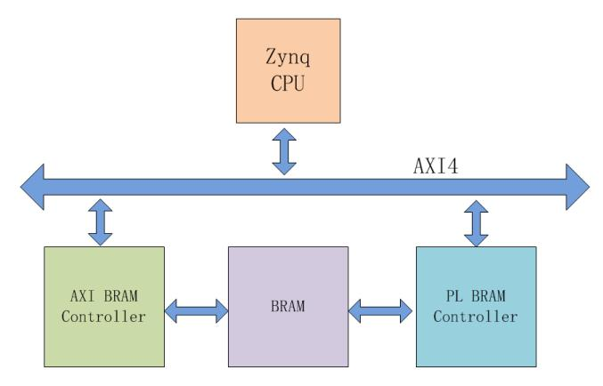

# BRAM 实现 PS 与 PL 的数据交互

本实验旨在展示如何使用 BRAM 作为 PS 与 PL 之间的低延迟共享缓冲区，实现小批量数据交换与中断驱动的同步机制。通过本实验，读者将理解 BRAM 的映射方式、AXI BRAM Controller 的角色、自定义 PL 控制器与 PS 侧中断交互流程，并掌握在 Vivado/SDK 环境下的调试方法与验证流程。

## 系统架构与工作原理

总体原理为：CPU 通过 AXI BRAM Controller 将数据写入 BRAM，CPU 配置并启动 PL 侧的 BRAM 控制器以触发处理，PL 侧读取 BRAM 数据完成处理后写回结果并通过中断通知 CPU，CPU 在中断服务程序（ISR）中读取处理结果并进行后续动作。该架构的主要功能是在 PS 与 PL 之间提供一个低延时、寄存器映射的交换通道，适用于小批量快速交互场景。

## 硬件设计与 BRAM 映射要点

在 Vivado 中以现有工程为基础另存工程并启用 Zynq 的中断支持，然后添加 AXI BRAM Controller 以将 BRAM 映射到 PS 的地址空间。AXI BRAM Controller 在配置时应选择 AXI4 模式与 32-bit 数据宽度，注意 AXI 以字节为寻址单位，因此 BRAM 的映射需按 4 字节对齐。接着添加 BRAM 实例并配置为双口 RAM，使得一侧由 AXI BRAM Controller（PORTA）访问，另一侧由自定义 PL BRAM 控制器（PORTB）并行访问，从而实现 PS 写入、PL 处理、PL 写回、PS 读取的完整数据流。

BRAM 配置与地址映射示例（32-bit 数据宽度）：

| 支持内存大小 / BRAM 配置 | BRAM 原语数 (36k each) | BRAM_Addr 大小 | BRAM_Addr 典型位域（示意） |
|--------------------------:|-----------------------:|---------------:|---------------------------:|
| 4k (1024 x 32)            | 1                      | 10             | BRAM_Addr [11:2]           |
| 8k (2048 x 32)            | 2                      | 11             | BRAM_Addr [12:2]           |
| 16k (4096 x 32)           | 4                      | 12             | BRAM_Addr [13:2]           |
| 32k (8192 x 32)           | 8                      | 13             | BRAM_Addr [14:2]           |
| 64k (16384 x 32)          | 16                     | 14             | BRAM_Addr [15:2]           |
| 128k (32768 x 32)         | 32                     | 15             | BRAM_Addr [16:2]           |

## 自定义 PL BRAM 控制器与 IP 管理（说明）

自定义的 PL BRAM 控制器（例如 pl_ram_ctrl）应作为独立 IP 集成到工程中，其运行流程为启动后从 BRAM 读取 CPU 写入的数据，完成处理并写回新数据，最后通过 intr 信号触发中断通知 PS。若需在 Vivado IP Catalog 中使用该自定义 IP，可通过 Add Repository 将 IP 目录添加至 Vivado 仓库并在 IP Catalog 中实例化。系统集成时需将 AXI BRAM Controller 的 PORTA 与 BRAM 的 PORTA 相连，pl_ram_ctrl 的 BRAM_PORT 连接到 BRAM 的 PORTB，并将 pl_ram_ctrl 的 intr 连接至 Zynq 的中断输入，完成自动连线与地址分配；这些步骤的主要功能是保证 IP 能被地址映射并由 PS 正确访问与中断驱动。

## 调试与逻辑分析（方法与用途）

为便于分析 BRAM 事务与中断序列，应在 Block Design 中对 BRAM 总线与 intr 信号启用 Debug，Vivado 将自动插入 ILA。通过 ILA 可以实时捕获 PL 侧对 BRAM 的读写数据流以及中断脉冲，便于定位时序、对齐或数据一致性问题。在生成比特流前还应保存设计并运行综合/实现的设计检查（Design Rule Check），以确保地址映射、时钟与复位域配置正确；这些调试手段的主要功能是加速问题定位、确认事务握手正确性与数据完整性。

## SDK 端程序设计思路（流程说明）

PS 侧程序的典型流程为：接受用户输入的起始地址与长度，使用 AXI BRAM Controller 向 BRAM 写入初始数据（起始值可由宏定义或用户输入指定），随后配置并启动 PL BRAM 控制器（写入起始地址、长度与启动标志），等待 PL 完成写回并触发中断，最後在中断服务程序中通过 BRAM 控制器读取处理后数据并打印或进一步处理。程序需对用户输入进行边界检查以避免越界访问，并在写入前对缓冲区与计数器进行初始化。中断服务程序应读取并清除中断源以保证后续中断能正常触发；示例程序通常将 BRAM 写入的初始数据设置为连续递增序列（例如 TEST_START_VAL），PL 读取后写回另一序列以便通过 ILA 与串口输出进行比对验证。这些设计要点的主要功能是保证数据安全、避免越界并实现可靠的中断同步机制。

## 调试现象与运行观察

在 SDK 中下载并运行程序时请勾选 Program FPGA，确保 PL 的比特流已加载。运行时使用串口工具（如 PuTTY）观察程序交互与输出信息，并在 Hardware Manager 的 Logic Analyzer 中将中断信号设置为触发条件（上升沿触发）后捕获波形。通常能观察到 PL 控制器先从 BRAM 读取 CPU 写入的数据，完成处理后写回结果并产生中断，随后 CPU 在 ISR 中读取并打印处理后的数据；若用户输入超出 BRAM 寻址范围，程序应打印错误提示并要求重新输入。这些观察的主要功能是验证事务完整性、时序符合性以及中断的正确响应。

## 示例操作步骤（简述）

- 在 Vivado 中完成硬件设计并生成 bitstream；  
- 导出硬件平台并在 SDK 中创建/打开应用工程；  
- 在终端输入起始地址与长度并确认（地址与长度以 BRAM 映射单位为准，通常为 0~(depth-1)）；  
- 观察 ILA 捕获的 BRAM 读写波形，以及串口打印的比对结果，确认数据一致性。

## 结论与扩展建议

通过本实验可以掌握使用 BRAM 作为 PS 与 PL 之间低带宽共享缓冲区的完整流程，内容涵盖 IP 集成、自定义 PL 控制器、BRAM 地址映射、PS 侧 BRAM 控制器访问與中断驱动的数据同步机制。该方法适用于小批量、低延迟的数据交互场景；若需更高带宽或大量数据传输，应采用基于 AXI DMA/VDMA 的方案。实践中建议结合 ILA 与系统日志进行充分验证，以确保数据一致性与中断处理的鲁棒性。
