# 认识ZYNQ7020开发板

## ZYNQ7020简介

本实验旨在熟悉Zynq7020开发板的基本功能。
Zynq 系列器件的主要特点在于将高性能的 ARM 处理子系统（PS）与可编程逻辑（PL）集成于同一芯片内。每颗 Zynq 器件均包含基于 Cortex-A9 的处理器内核，且处理器子系统集成了内存控制器和多种外设，使得 Cortex-A9 子系统可以在不依赖可编程逻辑的情况下独立运行。与传统 FPGA 相比，Zynq 更侧重于以处理器为中心的系统级设计。

ZYNQ7020 是赛灵思（Xilinx）公司推出的一款集成了ARM Cortex-A9双核处理器和FPGA的可编程SoC（System on Chip）。它将处理系统的灵活性与FPGA的可编程逻辑相结合，广泛应用于嵌入式系统、工业控制、通信和消费电子等领域。

## 主要特性

1. **处理系统 (PS)**

处理系统（PS）集成了双核 ARM Cortex‑A9 处理器，最高可达约 766MHz，支持对称多处理（SMP）与非对称多处理（AMP）。PS 提供多种内存接口（如 DDR3、DDR2、LPDDR2）以及丰富的外设接口（USB 2.0、千兆以太网、CAN、SPI、I2C、UART 等），并能运行嵌入式操作系统（如 Linux、FreeRTOS）。在系统中，PS 负责运行操作系统、驱动和高层应用，适合处理顺序控制、协议栈与系统管理等任务。

2. **可编程逻辑 (PL)**

可编程逻辑（PL）部分拥有大规模的逻辑资源（约 85,000 个逻辑单元）、约 220 个 DSP 切片和约 4.9Mb 的块 RAM，并支持多种 IO 标准（例如 LVDS、LVCMOS）。PL 适用于并行数据流和高性能信号处理的硬件实现，可以用 Verilog/VHDL 或 HLS 开发定制加速器，以获得低延迟、高吞吐的处理能力。

3. **互联架构**

PS 与 PL 之间通过 AXI 总线进行高速数据传输，支持 AXI4、AXI4‑Lite 与 AXI4‑Stream 等协议；实际系统中会使用不同的物理接口（例如 AXI‑HP、AXI‑GP、ACP）来满足带宽与一致性要求。为减轻 CPU负载并提高大块数据搬运效率，通常配合 DMA 控制器来完成高吞吐的数据传输任务。

4. **开发工具**

开发流程依赖于赛灵思提供的工具链：Vivado Design Suite 用于硬件架构设计、IP 集成、综合与比特流生成；而 SDK / Vitis 则用于基于 ARM 处理器的软件开发与调试。两端工具配合可实现软硬件协同开发与验证。

## 应用场景

- **嵌入式系统**：ZYNQ7020广泛应用于嵌入式系统，如工业自动化、智能家居等。
- **通信设备**：由于其高性能处理能力，常用于通信基站、路由器等设备。
- **图像处理**：FPGA部分适用于实时图像处理，如视频监控、医疗影像等。

### PS 与 PL 结构与功能
Zynq 由处理系统（PS）和可编程逻辑（PL）两部分组成。PS 集成了双核 ARM Cortex-A9 处理器、AMBA 互连、内部存储器、外部存储器接口及常见外设（如 USB、以太网、SD/SDIO、I2C、CAN、UART、GPIO 等），而 PL 部分则是 FPGA 的逻辑资源。

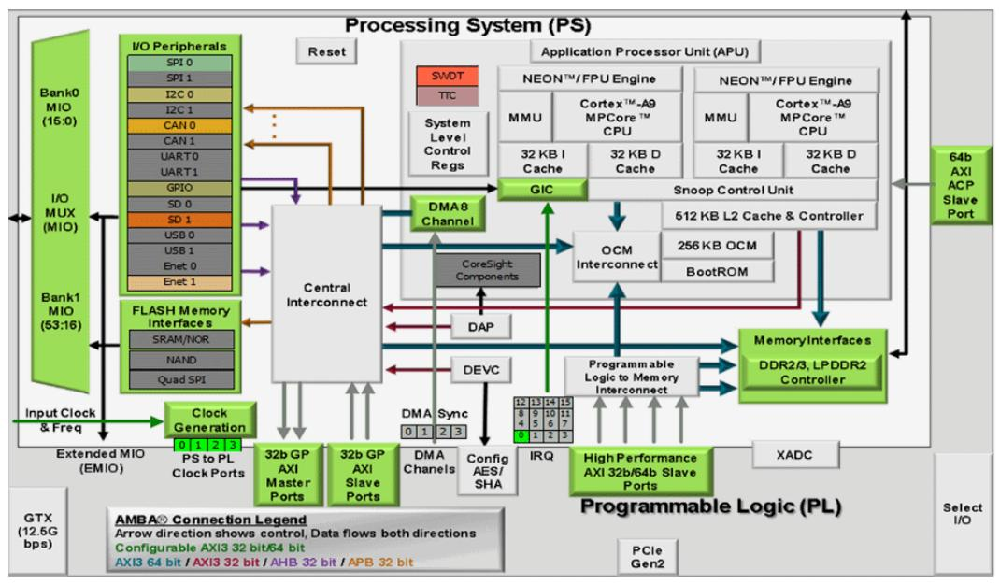

上图为 ZYNQ 芯片总体框图。
处理系统（PS）在 Zynq 中扮演通用计算与系统管控的角色，通常包含双核 ARM Cortex‑A9（或更高核）处理器、缓存子系统、外设控制器和外部存储接口。PS 以软件为中心，适合运行操作系统（如 Linux）、驱动、中间件及复杂控制逻辑，擅长顺序执行、条件分支和对外设的大量协议处理。PS 的开发流以 C/C++、操作系统配置和驱动开发为主，调试工具为 gdb、JTAG 与系统日志等，优点是开发速度快、生态成熟、易于维护。

可编程逻辑（PL）则是面向硬件的并行计算资源，即 FPGA 逻辑矩阵及其租用的 DSP、BRAM、IO 等资源。PL 以并行数据流与定制流水线为强项，适合实现低延迟、高吞吐的信号处理、视频处理、定制加速器或时间确定性逻辑。PL 的开发通常使用 Verilog/VHDL 或 HLS（高层次综合），验证与调试依赖于仿真、逻辑分析器（ILA）与时序约束，优点是可以按需定制数据通路并获得高性能/低延迟。

在性能和时序语义上，PS 与 PL 也有明显差异：PS 提供丰富的高级特性（缓存、分支预测、线程）但面临不可预测的操作系统抖动，不适合严格的实时要求；PL 提供确定性的硬件时序和并行吞吐，适合严格实时与高带宽的处理任务。通常设计模式是将控制、协议栈和用户接口放在 PS 上运行，而将数据密集或实时敏感的内核算法下放到 PL 中加速，从而发挥二者互补优势。

在存储与互联方面，PS 使用 DDR 控制器和缓存体系，PL 通过 AXI 接口（如 HP、GP、ACP）与 PS 和 DDR 交互。AXI‑HP 适用于大块高带宽数据搬运（配合 DMA），ACP 提供与处理器缓存一致性的访问路径，AXI‑GP 适合控制/寄存器映射。设计时需关注缓存一致性与数据传输机制（是否需要显式刷新或使用 DMA/ACP），以避免软件与硬件之间的数据不一致。

开发与调试的工具链与思路也不同：PS 侧常用 Vivado 导出的硬件描述配合 Xilinx SDK / Vitis、PetaLinux 构建运行环境；PL 侧使用 Vivado IP Integrator、RTL 编辑、综合/实现和时序约束。调试中 PS 可用 printf、串口、远程调试器，PL 则依赖仿真与片上逻辑分析器；系统级联调时需同时考虑软硬件接口（寄存器映射、AXI 协议、IRQ、复位与时钟域跨越）。

在可重配置性与部署方面，PL 支持下载比特流（全量或部分重配置），可以在运行时更换或升级硬件加速模块；PS 则负责启动流程、加载比特流（通过 FSBL/Boot）并提供高层控制。典型应用划分是：把网络/视频/信号处理等需要并行处理的任务放在 PL，把协议、文件系统、用户界面和策略决策放在 PS，从而实现性能与开发效率的平衡。

### PL 说明
关于 PL 部分，其构架与 Xilinx 7 系列 FPGA 相似，详见官方文档（例如 DS190）中对应的 7 系列产品说明。

| Device Name                                         | Z-7007S          | Z-7012S         | Z-7014S         | Z-7010          | Z-7015          | Z-7020          | Z-7030            | Z-7035           | Z-7045           | Z-7100           |
|-----------------------------------------------------|------------------|-----------------|-----------------|-----------------|-----------------|-----------------|-------------------|------------------|------------------|------------------|
| Part Number                                         | XC7Z007S         | XC7Z012S        | XC7Z014S        | XC7Z010         | XC7Z015         | XC7Z020         | XC7Z030           | XC7Z035          | XC7Z045          | XC7Z100          |
| Xilinx 7 Series 等效                                 | Artix-7 FPGA     | Artix-7 FPGA    | Artix-7 FPGA    | Artix-7 FPGA    | Artix-7 FPGA    | Artix-7 FPGA    | Kintex-7 FPGA     | Kintex-7 FPGA    | Kintex-7 FPGA    | Kintex-7 FPGA    |
| 可编程逻辑单元数 (Cells)                             | 23K              | 55K             | 65K             | 28K             | 74K             | 85K             | 125K              | 275K             | 350K             | 444K             |

### AXI 总线与互联（概述）
为了在片内实现 ARM 处理器与 FPGA 之间的高性能通信，Zynq 采用了高效的内部互联机制，主要基于 AXI 总线协议。良好的 PS–PL 互联对于发挥两者性能、实现高带宽低延迟数据传输至关重要。本节将概述 PS 与 PL 之间的互联方式与常见接口类型。

在设计流程上，通常通过在 Vivado 中集成 IP 时自动使用 AXI 接口将自定义 IP 与处理器连接；用户只需完成必要的参数配置即可。

### AXI 协议与握手机制
AXI（Advanced eXtensible Interface）为 AMBA 规范的一部分，用于主从设备之间的高性能片内总线传输。Zynq 中常见的版本为 AXI4，在器件内普遍用于外设和自定义 IP 的互联。AXI 协议通过 VALID/READY 握手信号实现可靠传输：当从设备准备好接收数据时发出 READY；当主设备数据准备好时维持 VALID；仅在二者同时有效时发生数据传输。

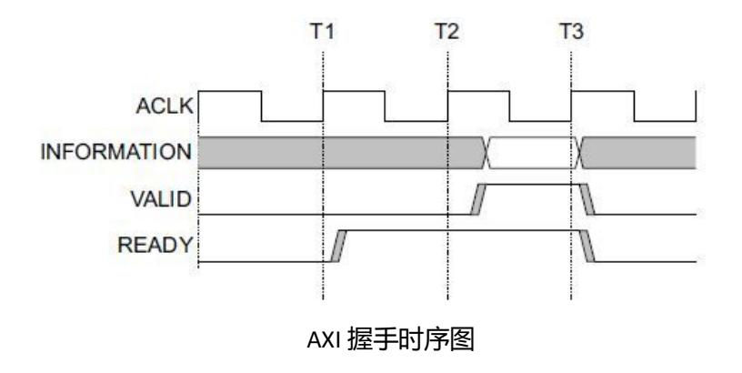

### AXI 接口类型与适用场景
Zynq 支持三类 AXI 接口：AXI4-Lite、AXI4 与 AXI4-Stream，各自适用于不同的应用场景：  

| 接口协议        | 特性                 | 适用场合               |
|----------------|----------------------|------------------------|
| AXI4-Lite      | 地址/单字数据传输      | 低速外设的寄存器访问     |
| AXI4           | 地址/突发数据传输      | 内存映射的大量数据传输   |
| AXI4-Stream    | 仅数据流传输（支持突发）| 媒体流、实时数据通道     |

AXI4-Lite 以其简单结构适用于对控制寄存器的单次读写操作（32 bit），不支持突发传输；AXI4 在此基础上增加了 burst（突发）传输能力，适合批量内存映射传输。两者采用内存映射方式，编程接口对软件友好但在信号线上占用较多资源。

AXI4-Stream 则是一种无地址的连续流接口，常用于视频、音频、通信及 DSP 场景。由于缺乏地址语义，需要诸如 AXI-DMA 的桥接模块将内存映射访问与流式接口转换，实现数据源（如 DDR）与流处理模块之间的高效传输。

### AXI 通道结构
AXI4 与 AXI4-Lite 包含五个通道：读地址、写地址、读数据、写数据、写响应，每一通道独立进行握手协议。下图示意读写通道模型及其时序关系：

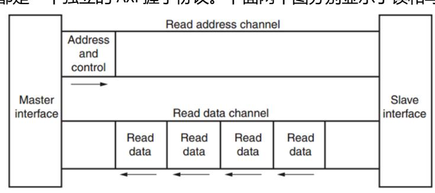
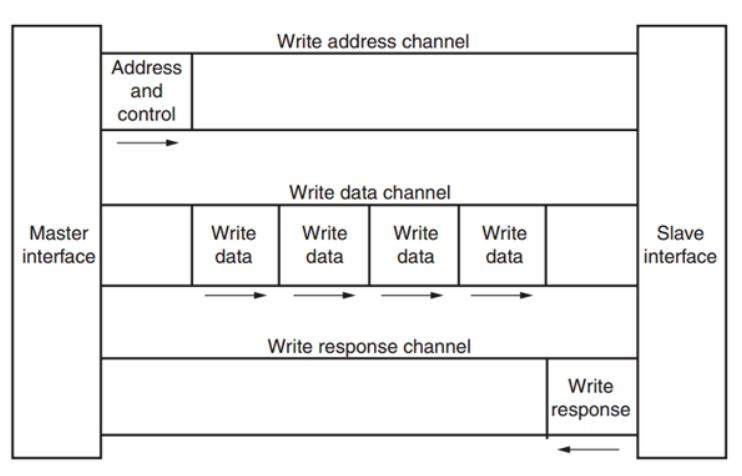

### 物理 AXI 接口（GP / HP / ACP）
在 Zynq 内部，硬件实现了若干物理 AXI 接口，包括 AXI-GP（通用）、AXI-HP（高性能）与 AXI-ACP（加速器一致性端口）。具体说明如下：AXI-ACP（Accelerator Coherency Port）用于加速器或 DMA 与处理器缓存之间的一致性访问，主要功能是允许 PL 侧的外设在访问内存时与 PS 的缓存保持一致性，从而避免软件层面的显式缓存刷新或失效操作；AXI-HP（High Performance）为 64 位高带宽接口，主要用于由 PL 发起的高吞吐量内存访问（例如从 DDR 读取或写入大块数据），常用于视频流、DMA 大数据搬运等场景以减轻 CPU 负担；AXI-GP（General Purpose）为 32 位通用接口，提供主从双向端口，主要用于控制寄存器访问、低带宽数据传输与命令/状态交换等，适合作为控制路径或低速外设的寄存器映射通道。 

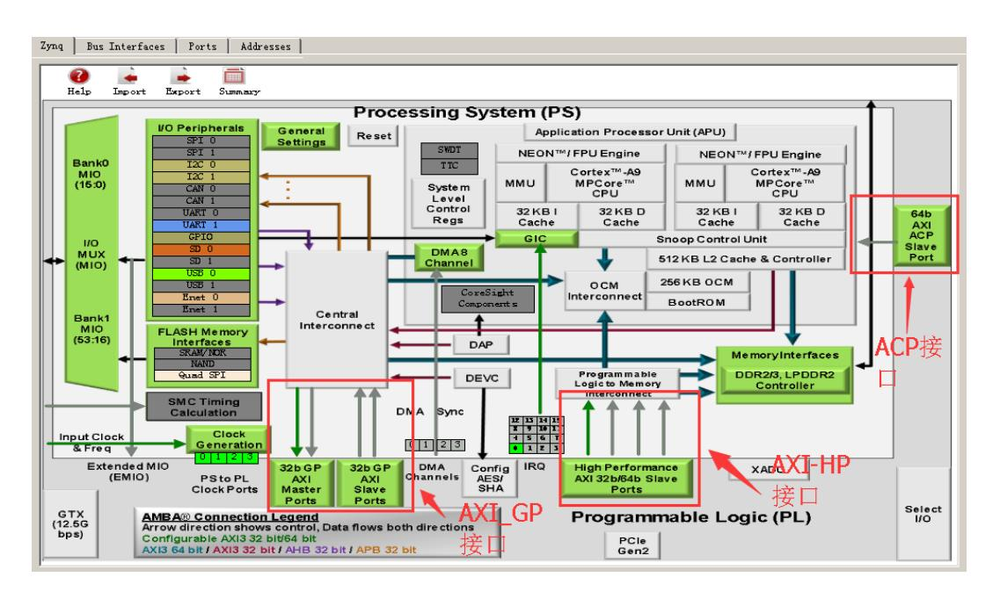

在 Zynq 中，只有部分 AXI-GP 端口为 Master（可主动发起访问），其余多数为 Slave（被动响应）。不同接口的理论带宽也不同：GP 接口为 32 位、相对低带宽（约 600 MB/s），而 HP 与 ACP 为 64 位高带宽（约 1200 MB/s）。高带宽传输通常由 PL 侧的 DMA 控制器承担数据搬运，而非由 CPU 直接负责。

### 常用 AXI IP 与功能概述
Vivado 中提供了多种现成的 AXI IP（如 AXI-DMA、AXI-GPIO、AXI-FIFO、AXI-VDMA 等），便于将 PL 模块与 PS 内存或流式通道高效连接。部分常用 IP 功能概述如下：

- AXI-DMA：实现 PS 内存与 PL 上的 AXI-Stream 通道之间的高速数据传输（HP <-> Stream）。  
- AXI-FIFO-MM2S：实现 GP 接口与 AXI-Stream 之间的数据流转换。  
- AXI-Datamover：PL 主动控制的高性能内存到流转换解决方案。  
- AXI-VDMA：专为视频/图像（二维数据）设计的高效内存到流传输 IP。  
- AXI-CDMA：由 PL 在内存内部实现数据块拷贝，无需 CPU 干预。

关于自定义 IP 与 PS 通信：通过 Vivado 的向导可以生成具有 AXI4-Lite、AXI4 或 AXI-Stream 等接口的自定义 IP，从而简化驱动开发与系统集成。对于大多数常见场景，Xilinx 已在 IP 层封装了 AXI 时序细节，用户主要关注自身逻辑功能实现即可。

### AXI 互联（Interconnect）
当系统中存在多个主从设备需要互联時，需使用 AXI Interconnect（互联矩阵）以提供多对多的交换机制。AXI Interconnect 支持多种基本连接模式（如 N-to-1、1-to-N、N-to-M Crossbar、N-to-M Shared Access），在 Vivado 中对应的 IP 为 axi_interconnect，可直接调用实现复杂系统的互连需求。

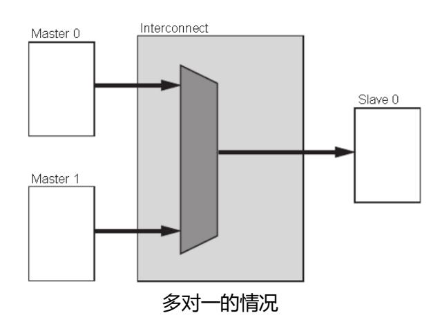
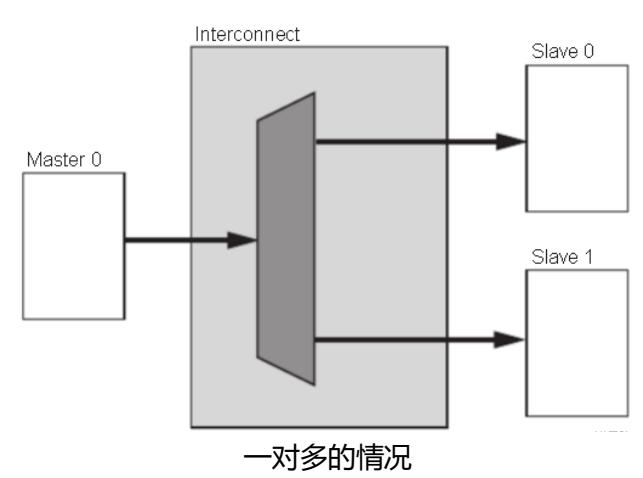
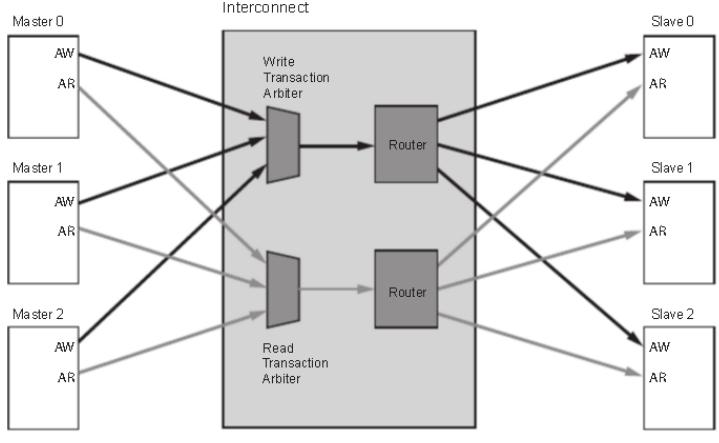
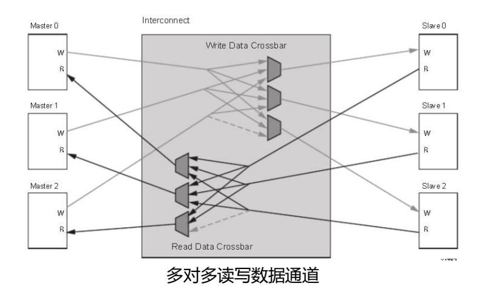
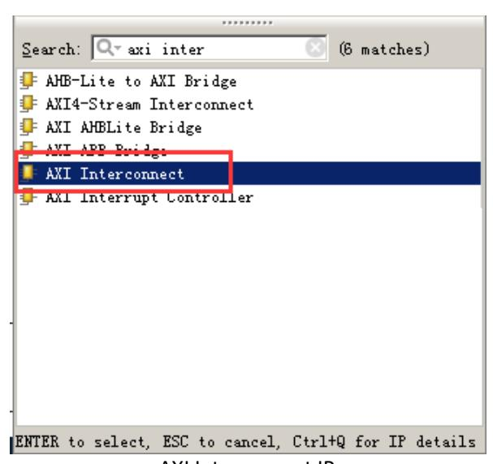

<!-- 插入：AX7Z020 开发板（具体平台示例） -->
## AX7Z020 开发板

芯驿电子科技（上海）有限公司正式推出基于Xilinx Zynq-7000 SoC架构的AX7Z020专业级开发平台（2019版）。本手册旨在帮助开发者快速掌握该平台的技术特性与功能优势。

### 系统架构

#### 模块化设计

采用核心板+扩展板架构，支持快速二次开发：
- **核心板**：集成XC7Z020 SoC芯片（ARM+FPGA）
  - 双核ARM Cortex-A9处理器系统（PS）
  - 可编程逻辑单元（PL）
  - 存储配置：1GB DDR3（32位总线） + 256Mb QSPI Flash
  - 33.333MHz精密时钟源
- **扩展板**：提供丰富工业级接口

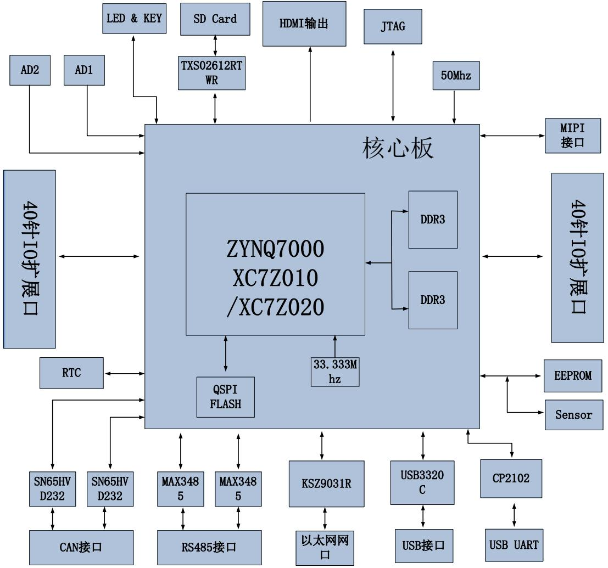

### 核心功能特性

- 通信接口

开发板提供高速以太网接口（10/100/1000Mbps，采用 KSZ9031 PHY 芯片），可满足网络通信与大型数据传输需求；在工业现场通信方面，板载支持两路 CAN 总线（使用 SN65HVD232 收发器）和两路 RS485 接口（采用 MAX3485 芯片），便于与各类工业设备互联。此外，预留的无线扩展接口可用于连接蓝牙或 WiFi 模块，方便实现无线数据传输与远程访问。

- 多媒体与存储

多媒体与存储方面，板卡支持 HDMI 1.4a 输出，可在 1080P@60fps 下显示图像，适用于视频与显示应用；同时提供 USB 2.0 Host 接口以扩展外设和存储设备，板载 Micro SD 卡槽用于系统镜像与数据存储。对于摄像头输入，开发板提供 MIPI CSI-2 接口，兼容常见的 OV5640 摄像模组，便于构建图像处理与视觉应用原型。

- 开发调试

开发与调试接口包括 USB‑UART（基于 CP2102GM 芯片）用于串口调试与控制台访问，以及标准 JTAG 调试端口用于下载与在线调试。板上还配备多组状态指示与交互元件：核心板上有 6 个 LED（包含电源与 DONE 指示灯），另外还有 4 个用户可编程 LED 与 4 个功能按键，便于运行时状态指示和简单交互诊断。

### 扩展能力

- 模拟采集

板卡支持双通道 XADC 输入，能够接收 0–10V 范围的模拟信号并通过 SMA 接口引出，适合进行模拟量采集与前端信号监测。

- 扩展接口

硬件扩展方面提供 2×40pin 的 GPIO 接口，包含 5V 与 3.3V 供电，并暴露约 34 路可编程 I/O，方便连接各类外设模块，诸如高速 AD/DA 模块、TFT‑LCD 显示屏或双目摄像头等，便于进行功能拓展与二次开发。

- 环境监测

板上集成基础环境监测器件，包括 LM75 温度传感器与通过 I²C 总线连接的 24LC04 EEPROM，用于记录配置或校准数据。

- 应用

该开发平台适合用于工业控制系统开发、高速以太网通信验证、机器视觉与视频处理、边缘计算原型设计以及嵌入式教学与科研等多种应用场景，满足从原型到产品验证的需求。

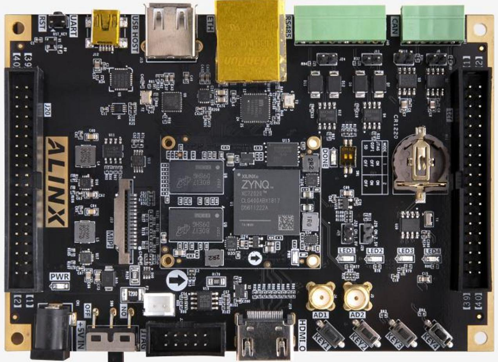

### 技术参数

| 类别        | 规格说明                     |
|-------------|----------------------------|
| SoC芯片      | XC7Z020-2CLG400I          |
| 存储容量     | DDR3 1GB + QSPI 256Mb     |
| 工作温度     | 工业级 -40℃ ~ +85℃        |
| 供电要求     | 5V/2A直流输入              |

本平台通过模块化设计与工业级硬件配置，为开发者提供从原型验证到产品部署的全流程支持，是Zynq-7000系列开发的理想选择。

<!-- 插入：调试准备与串口通信指南，放在系统开发流程之前以便读者实操参考 -->
## 调试准备与串口通信指南

关于驱动安装与硬件连接，建议从项目提供的路径（软件/CP210x_Windows_Drivers.zip）获取驱动包，解压后运行 CP210xVCPInstaller.exe 完成安装。安装完成后使用红色 Type‑A 转 Mini‑USB 数据线将主机与开发板的 J7 接口连接，打开设备管理器确认设备显示为 "Silicon Labs CP210x USB to UART Bridge (COMx)"。若出现驱动异常，可尝试使用驱动人生或 Driver Booster 等工具进行自动修复或回滚到已知兼容版本。

在终端配置上，常用的串口终端软件包括便携版 PuTTY（软件/putty.exe）或 TeraTerm 等。使用串口连接时选择 Serial 模式，填写实际的串口号（如 COM3）并将波特率设置为 115200，流控设为 None，即可打开会话并观察开发板的串口输出。

硬件操作方面，请确认 BOOT 跳线帽已设置为 SD 模式并插入预装系统的 Micro SD 卡（FAT32 格式）。电源连接建议按顺序完成：先连接供电与外设（显示器、网络等），再打开电源，以便上电后能够直接观察 HDMI 输出与网络状态。

系统交互方面，通过串口终端登录的默认账号为 root，密码为 root（输入密码时终端通常不显示字符），首次登录建议使用 passwd 修改默认密码以提高安全性。若使用 HDMI 输出，则系统应自动加载 Debian 的 X11 桌面环境，默认支持 1920x1080@60Hz，推荐保持默认面板布局以便快速开始图形化调试。

常见问题的快速排查思路包括：若驱动安装失败，可在 Windows 上临时禁用驱动签名强制或尝试旧版驱动；若无串口响应，请检查 USB 线质量并测量 J7 接口的 5V 供电（正常范围 4.75–5.25V）；若系统无法启动，确认板上 SW1 电源开关处于 ON，并检测核心板的主要供电轨（如 1.0V、1.8V）是否正常。工程实践提示：建议在静电防护工作台上操作以避免对 PL 芯片造成静电损伤，并在进行 FPGA 配置时确保 JTAG 链路稳定且无干扰。

### 学习 Zynq 所需的知识背景
掌握 Zynq 开发通常要求软硬件协同的能力，以下为典型的知识要点，供学习路径参考。

软件开发方向的建议技能：

- 计算机组成原理  
- C / C++ 语言编程  
- 操作系统原理（尤其嵌入式 Linux）  
- Tcl 脚本（用于 Vivado 自动化）  
- 良好的英语阅读能力

逻辑（硬件）开发方向的建议技能：

- 计算机组成原理  
- C 语言基础（用于驱动与嵌入式开发）  
- 数字电路与时序分析基础  
- 硬件描述语言（Verilog / VHDL）  
- 良好的英语阅读能力

## 参考资料

- [Xilinx ZYNQ-7000 产品页面](https://www.xilinx.com/products/silicon-devices/soc/zynq-7000.html)
- [Vivado Design Suite 用户指南](https://www.xilinx.com/support/documentation/sw_manuals/vivado2021.1/ug910-vivado-getting-started.pdf)