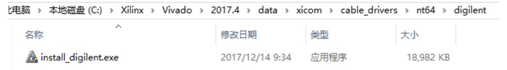
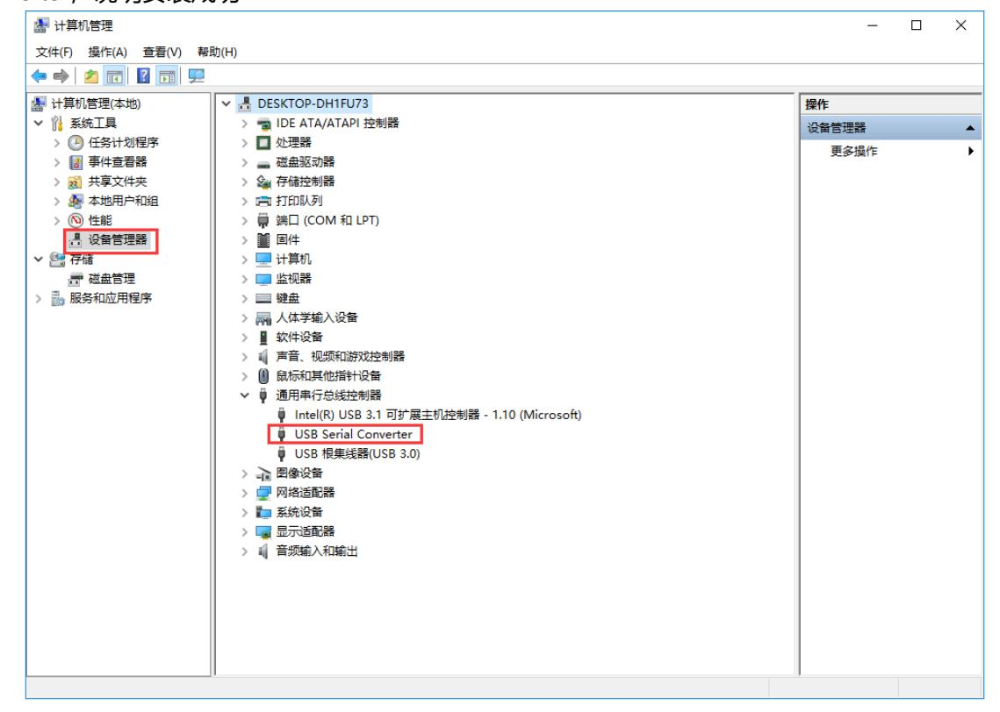

# 认识Vivado

## Vivado 开发环境

本实验提到 Xilinx 的开发环境，许多人首先想到 ISE，而对 Vivado 的了解相对有限。Vivado 是 Xilinx 于 2012 年推出的新一代集成设计环境，面向更先进的制程与更复杂的系统级设计需求。Vivado 的设计目标在于提升设计效率，特别是在 28nm 及更先进制程下实现更高的综合与实现性能。相较于 ISE，Vivado 引入了面向大型设计的流水和工具链优化，是 Xilinx 在软件层面的重要进化。

Xilinx 于 2012 年推出的 Vivado 设计套件标志着 FPGA 开发工具进入了新时代。作为长期服役的 ISE 的继任者，Vivado 针对 28nm 及更先进的工艺节点进行了深度设计优化，其核心优势体现在基于 IP 的设计流程架构变革中。该工具实现了综合速度约 4 倍的提升，并将实现效率提高了 15%，同时整合了高层次综合（HLS）与系统生成器等多功能生态环境。从 2008 年启动研发计划到 2012 年首版发布，工具链持续更新至 2017.4 版本后进入了长期支持阶段，成为目前工业界应用非常广泛的稳定版本。

在两者的技术对比中，Vivado 相较于 ISE 14.7 表现出了显著的进步。ISE 最高仅支持至 7 系列器件，而 Vivado 能够支持更先进的 UltraScale+ 系列。典型的时序收敛周期从 ISE 的平均 3 到 5 次迭代缩短至 Vivado 的 1 到 2 次。此外，Vivado 提供了完整的 Tcl 命令体系，其功耗分析精度也从原来的 ±20% 提升至 ±5%，这使得开发者能够更精准地进行系统评估。

### Vivado 软件版本

Vivado 持续迭代更新。本教材及配套示例基于 Vivado 2017.4 版本完成。为减少因版本差异导致的问题，建议学习与实验过程中使用相同版本。Vivado 提供 Windows 与 Linux 64 位版本，以及二合一安装包。

针对本开发板，推荐使用的验证版本为 2017.4，开发者可前往 Xilinx 官方下载中心的 HLx 2017.4 专栏进行获取。该版本的安装包同时支持双平台，但要求系统必须为 64 位。由于安装完成后占用的存储空间较大，建议预留至少 30GB 的 SSD 空间以保证工具运行的流畅性。

### Vivado 在 Windows 下的安装流程

在 Windows 平台上安装 Vivado 时，请事先关闭防病毒软件和系统安全类工具，并避免使用包含中文或空格的系统用户名与安装路径。安装过程较耗时，建议预留充足磁盘空间（≈33 GB）。

- 下载并解压 Vivado 安装包，运行 xsetup.exe 开始安装。若遇版本更新提示，可选择忽略以继续当前安装。

在具体的安装操作规范中，建议解压安装包后右键点击 xsetup.exe 以管理员身份运行。在组件选择界面，推荐勾选 Vivado HL System Edition、Zynq‑7000 Device Support 以及 SDK Tools 以满足全栈开发的需求。如果安装程序提示有新版本更新，务必选择“Continue Without Updates”以保持环境的一致性。

安装完成后，可以通过命令行验证环境是否就绪。在 Windows PowerShell 中输入 `vivado -version`，预期应输出 "Vivado v2017.4 (64-bit)"；而在 Linux 终端中执行 `which vivado`，则应指向 `/opt/Xilinx/Vivado/2017.4/bin/vivado` 等对应的安装目录。

### 驱动安装与调试器识别

Vivado 安装包通常包含下载器（JTAG）驱动。若需要单独重新安装下载器驱动，可在 Vivado 安装目录下执行相应安装程序（例如 data\xicom\cable_drivers\nt64\digilent\install_digilent.exe）。安装或识别异常时，应先关闭 Vivado、禁用防火墙及杀毒软件，并确保未同时并行运行多个版本的 Vivado 或 ISE。

完成驱动安装并连接下载器后，在设备管理器的通用串行总线控制器中出现 USB Serial Converter 表示驱动安装成功。




## 开发最佳实践与迁移策略

在进行工程配置时，路径命名规范至关重要，开发者应严格避免在安装路径或工程路径中使用中文字符和空格，建议采用如 Project_Zynq7020 的下划线命名格式。本实验对应的器件型号精确选择为 xc7z020clg400-2，在配置 PS‑PL 模块时，可以选用 “Zynq Base System” 预设策略来加速开发流程。

关于许可证管理，开发者可以申请免费的 WebPACK License 以获得对 7 系列器件的支持，若在企业级环境中使用网络许可，需确保 FlexLM 服务器升级至 11.14.1 及以上版本。另外需注意，2017.4 是支持 Solaris 系统的最后一个版本，后续建议迁移至 Windows 10 或 CentOS 7 环境。对于从 ISE 迁移的项目，建议分阶段实施：先利用 IP Catalog 的功能进行 IP 核迁移，再通过 Tcl 脚本将旧有的 .ucf 约束转换为 .xdc 格式，最后利用 Report Timing Summary 报告对时序约束进行交叉验证。

## 点亮 LED

以下是点亮 LED 的 Verilog 代码实现。开发者需要在 Vivado 中建立新的工程，并按照后续要求完成实验。

新建 Verilog 源文件 `led.v`：

```verilog
// filepath: d:\Github\FPGA-course\src\experiment\led.v
`timescale 1ns / 1ps

module led(
    input sys_clk,
    input rst_n,
    output reg [3:0] led
    );
    
reg[31:0] timer_cnt;
always @(posedge sys_clk or negedge rst_n)
begin
    if (!rst_n)
    begin
        led <= 4'd0;
        timer_cnt <= 32'd0;
    end
    else if (timer_cnt >= 32'd49_999_999)
    begin
        led <= led + 4'd1;
        timer_cnt <= 32'd0;
    end
    else
    begin
        led <= led;
        timer_cnt <= timer_cnt + 32'd1;
    end
end 

endmodule
```

新建仿真测试文件 `vtf_led_test.v`：

```verilog
// filepath: d:\Github\FPGA-course\src\experiment\vtf_led_test.v
`timescale 1ns / 1ps

module vtf_led_test;

reg sys_clk;
reg rst_n;
wire [3:0] led;

led uut(
    .sys_clk(sys_clk),
    .rst_n(rst_n),
    .led(led)
    );

initial
begin
    sys_clk = 0;
    rst_n = 0;
    #1000;
    rst_n = 1;
end

always #10 sys_clk = ~sys_clk;

endmodule
```

利用以上提供的代码，在 Vivado 环境中进行仿真验证，确保逻辑时序正确。随后进行综合、实现并生成比特流，最后将程序烧录至黑金 ZYNQ7020 开发板中观察 LED 灯的状态变化。请务必记录实验现象，截取仿真波形和综合报告的相关内容，据此完成实验报告。
