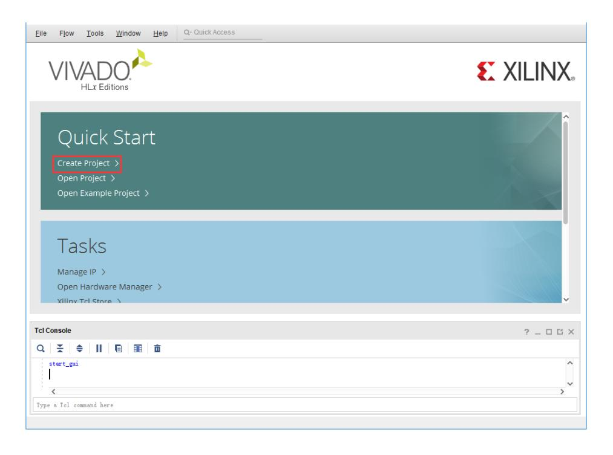
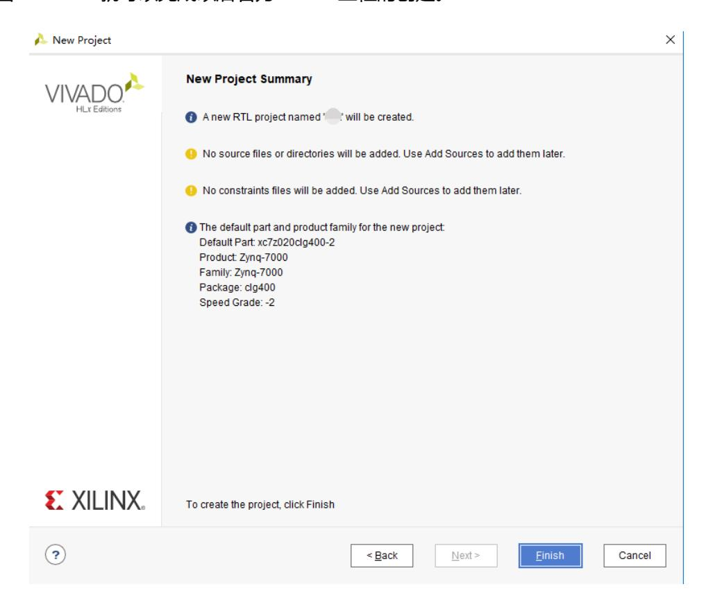
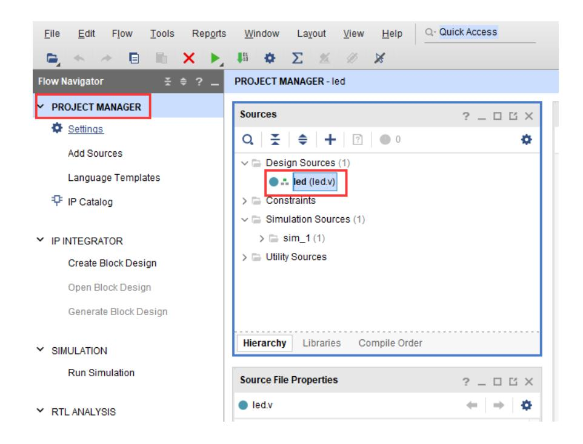

# PL端的跑马灯实验

本实验以 Vivado 工程 led 为示例，演示仅在 PL（FPGA）端实现的 LED 翻转实验。本章内容主要由 FPGA 工程师负责实现，旨在帮助读者熟悉 Vivado 的基本操作流程，包括工程创建、HDL 编写、管脚与时序约束、仿真、生成比特流以及在线调试等步骤。实验目标是在开发板上实现每秒翻转一次的四灯 LED 控制。

## 硬件平台与管脚定义

开发板的 PL 区域连接了四个用户红色 LED，且这些 LED 完全由 PL（FPGA 逻辑）控制；这些 LED 的主要功能是作为硬件层面的视觉指示器，用于验证 PL 逻辑是否正常运行、观察状态变化以及进行简单的人机交互测试。相关图片展示了 LED 的物理位置与外观，可用于现场定位和验收。请参考原理图以确认 LED 与 PL 管脚的对应关系与约束信息，原理图不仅给出物理管脚编号，还提供连接电路（如限流电阻）与电源域信息，这些信息在生成 XDC 时用于正确映射端口并指定电平标准。需要特别注意的是，原理图中以 PS_MIO 开头的 IO 属于 PS 端并由处理系统管脚复用管理，这些管脚不应在 PL 设计中绑定；将 PS_MIO 管脚误绑定到 PL 会导致管脚冲突或系统启动失败，因此在约束编写与管脚分配阶段必须严格区分 PS/PL 的 IO 归属并以原理图为准。 

## 项目创建与工程配置

- 启动 Vivado 并选择创建新工程（Create New Project）。  
- 在工程向导中填写工程名称与存放路径（示例工程名：led），注意路径与用户名避免中文与空格。  
- 选择 RTL Project，目标语言可选 Verilog（亦支持 VHDL 或混合）。  
- 在器件选择中设置 Family 为 Zynq-7000，并选择对应器件型号（例如 xc7z020clg400-2 或 xc7z010clg400-1）。  
- 完成向导后即可进入项目工作区并查看 Vivado 界面。  
  
  
  

## HDL 实现与代码说明

在 Project Manager 中添加或创建设计源文件（Add Sources -> Create File），新建 led.v 并确认模块名；该源文件的主要功能是实现基于系统时钟的计数与翻转逻辑，将时间基准转换为可见的 LED 翻转脉冲，从而在硬件上直观验证时钟与复位配置是否正确。led.v 中通常实现一个宽计数器，以 50 MHz 为例计数到 49,999,999 后翻转 LED 输出寄存器，从而实现每秒翻转一次的效果；该模块同时包含复位响应逻辑以保证上电与复位态的一致性。保存代码后应继续进行管脚与时序约束配置，以确保 HDL 信号正确映射到物理引脚并满足时序要求。

示例代码如下（保留原有实现）：

```verilog
// filepath: d:\gdut\2026-1-FPGA\实验手册\exp\led.v
module led(
 input sys_clk,
 input rst_n,
 output reg [3:0] led
 );
reg[31:0] timer_cnt;
always@(posedge sys_clk or negedge rst_n)
begin
 if (!rst_n)
 begin
 led <= 4'd0 ;
 timer_cnt <= 32'd0 ;
 end
 else if(timer_cnt >= 32'd49_999_999)
 begin
 led <= ~led;
 timer_cnt <= 32'd0;
 end
 else
 begin
 led <= led;
 timer_cnt <= timer_cnt + 32'd1;
 end
end
endmodule
```

- 保存代码并继续进行管脚与时序约束配置。  
  

## 约束设置与电平标准

使用 Vivado 的 I/O Ports 界面将顶层端口映射到实际 FPGA 管脚，并为每组 IO 指定适当的 IOSTANDARD（例如若 LED 所在 BANK 工作在 3.3V，则使用 LVCMOS33）；这一步的主要功能是确保 FPGA 引脚电平与外设电气特性匹配，避免损坏器件或导致逻辑电平不兼容。复位信号 rst_n 通常绑定到 PL 端的按键或相应输入端口，并在 XDC 中写明约束，复位绑定的功能是为设计提供稳定的初始状态并支持手动或外部复位操作。编写约束时需注意端口名称必须与 HDL 源中的名称一致，数组端口需采用花括号括起，且 XDC 对大小写敏感，错误的名称或格式会导致约束未生效或综合/实现阶段出现映射错误。

## 时序约束与闭合策略

运行综合以便 Vivado 检测设计中的时钟信号并据此生成时序约束草案，随后使用 Constraints Wizard 或手工添加时序约束将 sys_clk 指定为实际外部时钟频率（例如 50 MHz），这一步的功能是为实现阶段提供时序目标以进行时序分析和优化，只有正确声明时钟与相关输入输出延迟才能帮助工具进行约束驱动的优化并提高时序闭合成功率。时序约束在复杂设计中还应包括输入、输出与内部时钟域之间的跨时钟域约束与多周期路径说明。

## 比特流生成与下载准备

在实现完成并满足约束后选择 Generate Bitstream 生成比特流文件；生成比特流的功能是将综合与实现后的逻辑映射到 FPGA 配置位流，便于最终下載到器件並進行現場驗證。生成过程中可根据 CPU 核心数设置并行任务数以加速编译，并注意防病毒软件或系统工具可能对流程造成干扰。比特流生成完成后可打开 Hardware Manager 进行下载与在线调试。

## 仿真验证流程

配置仿真设置并创建 testbench，用于在仿真环境中验证计数器、复位及 LED 翻转行为的正确性；仿真阶段的主要功能是通过无风险的软件验证捕获设计逻辑错误、确定性问题或计时逻辑异常，从而在进入综合前修正问题。通常需要新建仿真文件（如 vtf_led_test.v），定义时钟与复位信号并实例化 DUT，然后运行 Behavioral Simulation 并在波形中观察 timer_cnt 与 led 的变化；由于真实翻转周期可能较长，可通过缩短计数阈值或直接观察计数器以验证功能。注意仿真时间越长生成的波形文件越大，应平衡验证深度与资源占用。

## 在线调试与逻辑分析

将开发板通过 JTAG 连接至主机并上电，在 Hardware Manager 中 Auto Connect 扫描并连接设备并编程（Program Device）；下载比特流的功能是将已生成的配置写入 FPGA 以进行现场功能验证，成功下载后可直接观察四个 LED 每秒翻转一次的实际行为。Vivado 提供在线逻辑分析仪 ILA，用于观测内部信号（例如 timer_cnt 与 led），ILA 的主要功能是实现片上信号采样与触发捕获，便于定位运行时逻辑问题；通过 IP Catalog 添加 ILA、配置探针并在设计中例化后即可在 Hardware Manager 中触发与捕获波形。另一种在线调试方式是使用综合属性 MARK_DEBUG，将需要观察的信号标记为调试信号，综合后通过 Set Up Debug 向导生成相应 ILA 约束与例化，随后生成比特流并进行在线采样；该方法的功能是简化调试信号的暴露流程并减少手工修改 RTL 的工作量。

## 实验总结与后续工作

本章系统介绍了在 PL 端完成从工程创建、HDL 编写、管脚与时序约束、仿真验证、比特流生成到在线调试的完整流程。通过本实验，读者应能够独立完成一个基于 PL 的简单外设实现，并掌握 Vivado 中常用的验证与调试手段。后续章节将进一步讨论如何结合 PS 进行系统引导、将设计固化到闪存，以及在 ARM 系统下协同开发的相关内容。
