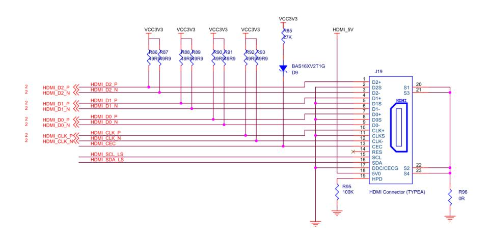
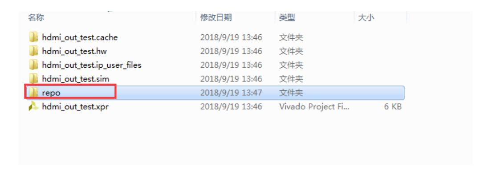
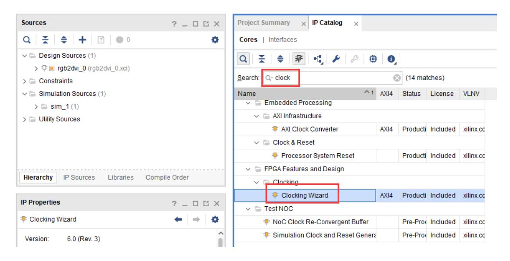
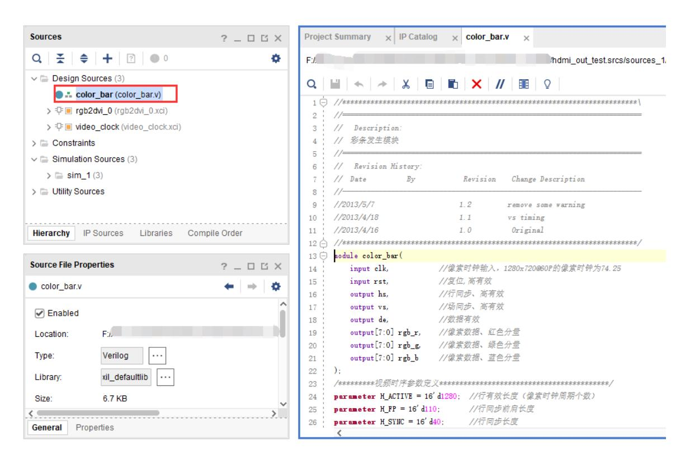
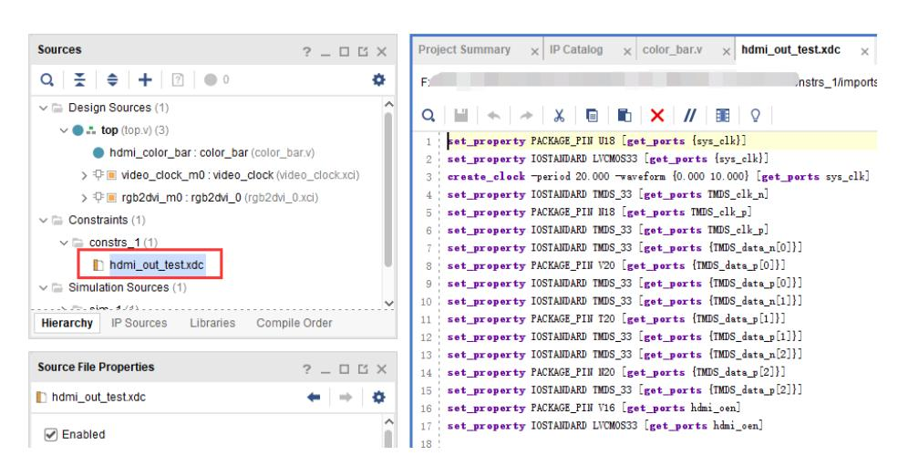
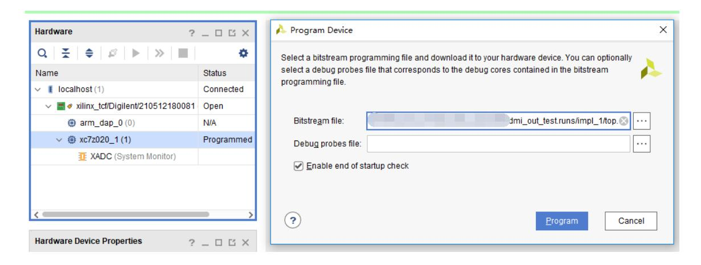
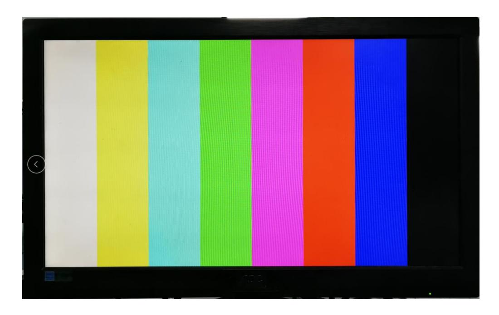

# HMDI输出实验

本实验工程命名为 hdmi_output_test。实验侧重于在 PL（FPGA）端实现 HDMI 彩条输出，旨在为后续的显示与视频处理学习提供基础。实验不涉及 PS 系统，主要考察 FPGA 在视频信号生成与 TMDS 编码中的应用，适合具备 FPGA 基础知识的读者开展。

本实验旨在通过直接在 FPGA 上实现 HDMI 彩条输出，帮助读者掌握视频信号生成、TMDS 编码及其在 FPGA 中的实现方法，为后续更复杂的视频处理任务奠定基础。实验将引导读者完成从工程创建、IP 集成，到时钟与管脚约束的完整流程。

实验 Vivado 工程命名为 hdmi_output_test，由 FPGA 工程师负责实施。本章通过 HDMI 彩条输出实验为后续视频处理奠定基础，实验不涉及 PS 系统，因此要求参与者具备基本的 FPGA 知识并重点关注像素时钟、时序参数与数据生成三大要素。像素时钟是分辨率相关的时序基准，本实验采用 720p 对应的 74.25 MHz；时序参数涉及行/场同步信号的有效长度以及前后肩周期，它们共同决定了每一帧和每一行的数据窗口；数据生成则指 RGB 彩条数据的产生与后续的 TMDS 编码。实验的一个显著特点是开发板直接使用 FPGA 的 3.3V 差分 IO 驱动 HDMI 接口，无需外置编码芯片，这在原理与布线上对差分信号完整性和管脚约束提出了更高要求。

## 硬件设计

本开发板未使用独立的 HDMI 编码芯片，而是将 FPGA 的 3.3V 差分 IO 直接连接至 HDMI 接口，由 FPGA 输出 24 位 RGB 并完成 TMDS 差分编码。实现 HDMI 图像输出需明确三要素：像素时钟、视频时序与像素数据。不同分辨率对应不同的时钟与时序参数，本实验提供 1280×720@60（720p）的时序参数（详见 color_bar.v 示例）。



关于 HDMI 接口的硬件设计，HDMI 接口包含三路 TMDS 差分数据通道、差分时钟对、若干供电与控制引脚（如 +5V、GND、HPD 以及 I²C 的 SCL/SDA），在本开发实践中主要关注 TMDS 差分对的正确映射与电平标准、以及供电与地的可靠连接。下图展示了 TMDS 数据通道、电源地以及控制信号的逻辑关系与管脚分配示意，便于在设计约束中正确标注差分对并校验电气特性。

具体到本实验采用的 720p 时序，行时序与场时序参数可用于在 color_bar 模块中生成 HS/VS/DE 信号并同步像素数据，表格中列出了 H_ACTIVE、H_FP、H_SYNC、H_BP 以及 V_ACTIVE、V_FP、V_SYNC、V_BP 等数值，这些参数需与像素时钟严格匹配以免引起显示器无法识别或图像撕裂。为保证差分输出可靠性，XDC 中必须为每组 TMDS 差分对声明 TMDS_33 或相应差分 IOSTANDARD，并在布局时参考开发板原理图与差分对长度匹配原则。

### 工程创建与 IP 组织

创建工程并命名为 hdmi_output_test。工程创建流程与常规 Vivado 项目相同，需确保工程路径中无中文或空格。

在实现 HDMI 功能时，主要包含 RGB 到 TMDS 的视频编码、像素时钟与其倍频时钟生成、彩条发生器及顶层封装等模块。若使用第三方或自定义 IP，应将相应 repo 文件夹拷贝到工程目录，并通过 IP Catalog 的 Add Repository 将其加入 Vivado 的 IP 搜索路径，随后生成 Output Products 以便在工程中实例化使用。



## Vivado 工程搭建

工程初始化时需新建名为 hdmi_output_test 的 Vivado 工程，并将包含 HDMI 编码器等第三方 IP 的 repo 文件夹复制到工程目录以便后续通过 IP Catalog 引入。添加第三方 IP 的操作可在 IP Catalog 中通过“Add Repository”指向 repo 文件夹并确认添加，本实验常用的核心 IP 为 Digilent 提供的 RGB to DVI Video Encoder（在工程中命名为 rgb2dvi_0），该 IP 负责将并行的像素数据与时序信号转换为 TMDS 差分输出。像素时钟的生成通常采用 Clocking Wizard（示例 IP 名称为 video_clock），将开发板 PL 侧的 50 MHz 晶振作为输入并生成 74.25 MHz 的像素时钟与 5 倍频的串行时钟（约 371.25 MHz）以支持 TMDS 串行化。

彩条生成模块 color_bar 的功能是在像素时钟下产生完整的 720p 视频时序（HS/VS/DE）并输出 24-bit RGB 数据，模块内部根据行列计数器与预设时序参数划分水平方向的 8 段区域以生成标准彩条。顶层模块需要例化 video_clock、color_bar 与 rgb2dvi_0 等模块，完成时钟与复位的连线、将像素数据拼接为 vid_pData，并将 TMDS 差分对连接到板级 HDMI 管脚。完成代码集成后，应在 XDC 约束文件中为系统时钟与 TMDS 差分对指定合适的 PACKAGE_PIN 和 IOSTANDARD（TMDS_33 或板上要求的差分电平），并为系统时钟创建 create_clock 约束以便时序分析使用。

### IP 核配置与整合

在 IP 配置方面，HDMI 编码器 IP 的时钟源设置为内部像素时钟驱动，且 TMDS 时钟范围需匹配 720p 模式的要求，Clocking Wizard 的参数应确保输出频率与相应抖动/相位约束满足编码器输入规范。完成 IP 生成后，将 color_bar 模块和顶层 top 模块加入工程并通过 Design Hierarchy 进行连线检查，然后运行合成、实现并观察时序报告，如有必要根据 Report Timing Summary 调整约束或布线层级。

### 像素时钟与倍频方案

对于像素时钟，需使用 Clocking Wizard 生成两个输出时钟：像素时钟（例如 74.25 MHz 对应 1280×720@60）与 5 倍像素时钟（用于 10:1 串行化，如 371.25 MHz）。配置时应以开发板 PL 侧晶振频率为输入参考（例如 50 MHz）。



### 彩条生成与顶层集成

彩条发生器为产生标准视频时序与水平方向 8 段彩条的逻辑模块，可直接使用提供的示例代码或参考实现自行编写。



顶层模块需例化彩条发生器、RGB-to-DVI 编码器和视频时钟生成模块，完成内部总线与信号的连线后进行约束与综合。

### 管脚映射与 XDC 约束

在项目中添加 XDC 约束文件以映射实际硬件管脚并定义时钟。示例约束如下（请根据所用开发板型号调整引脚编号）：

```
set_property PACKAGE_PIN U18 [get_ports {sys_clk}]
set_property IOSTANDARD LVCMOS33 [get_ports {sys_clk}]
create_clock -period 20.000 -waveform {0.000 10.000} [get_ports sys_clk]
set_property IOSTANDARD TMDS_33 [get_ports TMDS_clk_n]
set_property PACKAGE_PIN U13 [get_ports TMDS_clk_p]
set_property IOSTANDARD TMDS_33 [get_ports TMDS_clk_p]
set_property IOSTANDARD TMDS_33 [get_ports {TMDS_data_n[0]}]
set_property PACKAGE_PIN W14 [get_ports {TMDS_data_p[0]}]
set_property IOSTANDARD TMDS_33 [get_ports {TMDS_data_p[0]}]
set_property IOSTANDARD TMDS_33 [get_ports {TMDS_data_n[1]}]
set_property PACKAGE_PIN Y18 [get_ports {TMDS_data_p[1]}]
set_property IOSTANDARD TMDS_33 [get_ports {TMDS_data_p[1]}]
set_property IOSTANDARD TMDS_33 [get_ports {TMDS_data_n[2]}]
set_property PACKAGE_PIN Y16 [get_ports {TMDS_data_p[2]}]
set_property IOSTANDARD TMDS_33 [get_ports {TMDS_data_p[2]}]
set_property PACKAGE_PIN V16 [get_ports hdmi_oen]
set_property IOSTANDARD LVCMOS33 [get_ports hdmi_oen]
```

在约束中，应为 TMDS 差分对指定 TMDS_33 电平标准，并为系统时钟创建合适的时钟约束，以利于综合与实现过程中时序分析的准确性。



### 比特流生成与下载验证

生成比特流前请确认所有约束、IP 生成和时钟配置正确。完成比特流生成后，将 HDMI 输出线缆连接至支持 1280×720@60 的显示器，并通过 Hardware Manager 下载到设备或通过 JTAG 编程。

下载完成后，若配置与时序正确，显示器应以预期分辨率显示彩条图像。




## 关键实现步骤与注意事项

在关键实现步骤方面，首先应通过 IP Catalog 添加并生成 rgb2dvi_0 与 video_clock 等 IP，然后将 color_bar.v 加入工程并在顶层模块中完成例化与连线。完成代码集成与约束编写后运行综合与实现，重点检查时序收敛性与差分对的布线完整性。时钟精度是实现稳定显示的关键，像素时钟误差应控制在 ±1% 以内以避免显示抖动与识别失败；同时需在 XDC 中声明 TMDS 差分对属性并保证相关复位信号与像素时钟同步。最后在下载并验证显示效果时，若出现花屏或无信号，应优先检查像素时钟与时序参数是否与显示器支持的模式一致，并核对差分对的引脚映射与 IOSTANDARD 设置。

### 实验总结与扩展方向

本实验展示了如何在 PL 端直接驱动 HDMI 输出并生成标准视频信号，涵盖第三方 IP 集成、像素时钟生成、视频时序与 TMDS 编码等关键技术。该实验为后续更复杂的视频处理（如图像缩放、颜色空间转换、帧缓存管理与视频加速）提供基础。若计划在更高精度或更复杂系统中应用，应进一步学习视频标准（如 VESA/CEA 时序）、差分信号完整性、以及在 PS/PL 协同工作下的性能优化方法。
