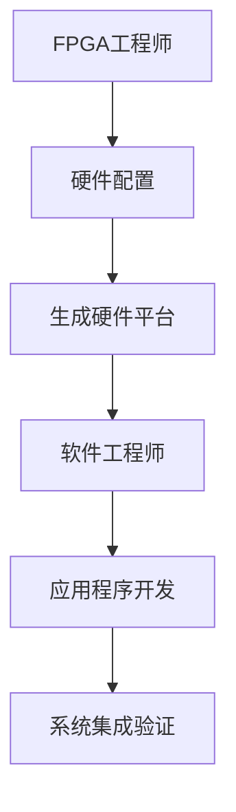
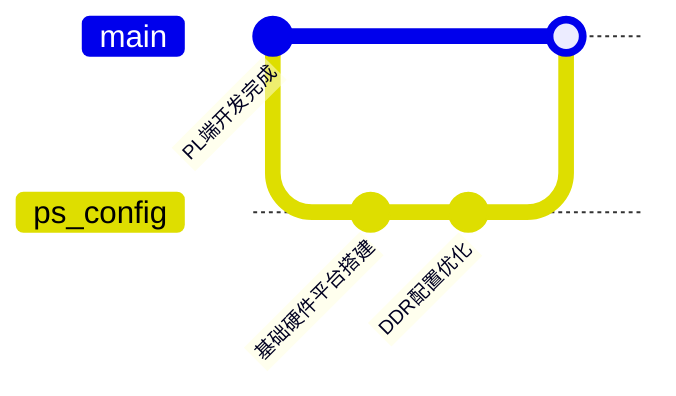
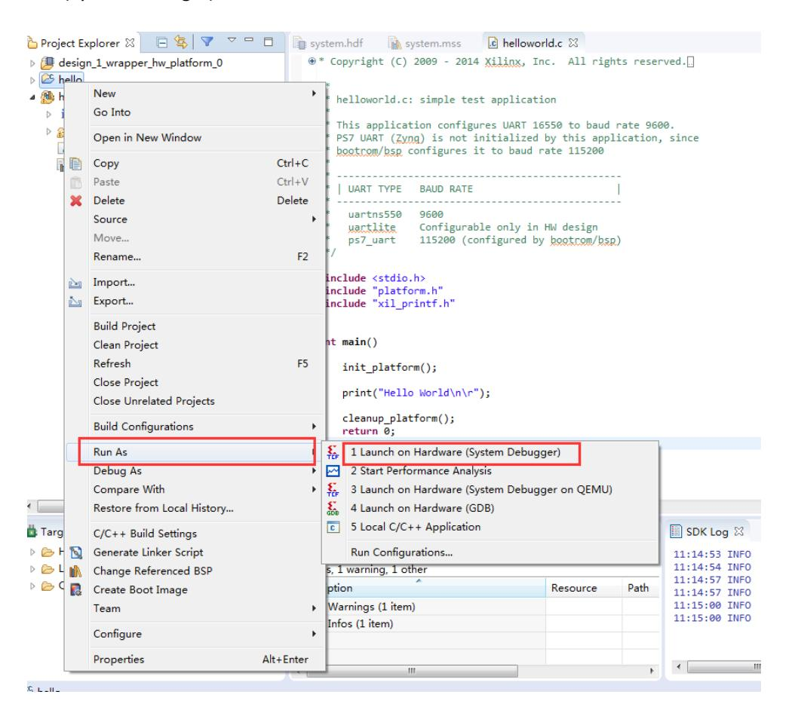
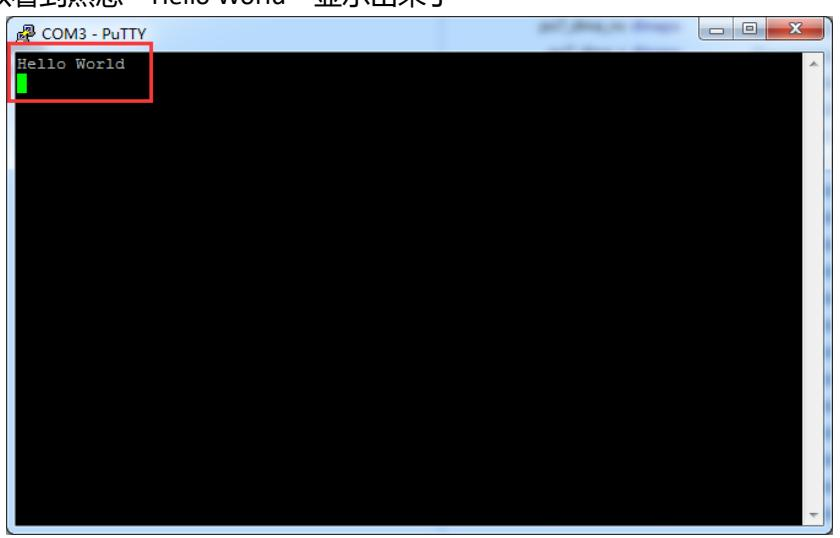
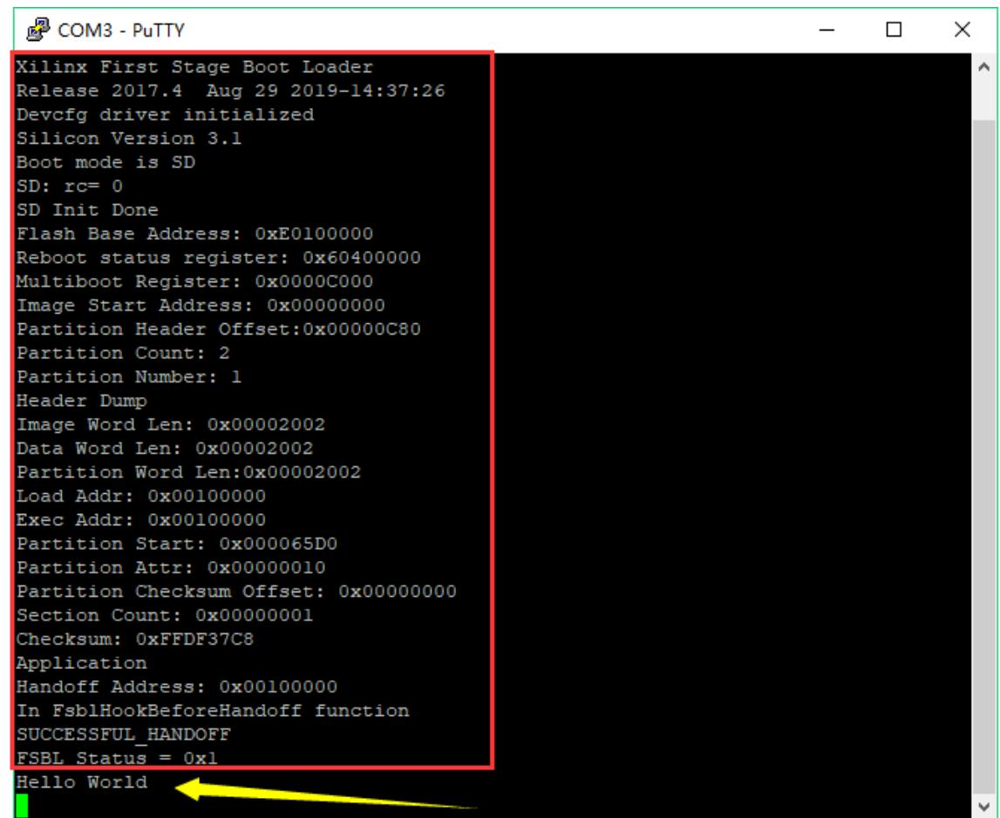

# PS端"Hello World"实验

本实验 Vivado 工程命名为 ps_hello。本章起软件工程师与 FPGA 工程师需协同完成。前述实验均在 PL 端完成，与传统 FPGA 开发流程一致。Zynq 的核心优势在于将 FPGA 与 ARM 处理子系统（PS）整合，因而对协同设计提出了更高要求。本章通过串口打印示例，介绍基于 PS 的裸机（bare-metal）开发流程、Vivado 中的 PS 配置以及在 SDK 中的应用开发与启动镜像制作。

## 职责分工

FPGA 工程师需在 Vivado 中搭建硬件设计，配置 PS，导出硬件描述文件（HDF/HDF），并提供比特流（如需要），以供软件开发使用。软件工程师在 SDK 中基于导出的硬件平台开发应用程序与引导程序（FSBL），并完成启动镜像（BOOT.bin）的生成与部署。两类角色的协作可显著提升开发效率，使硬件与软件在系统层面达到一致的运行状态。

## PS 与 PL 的关系与硬件准备

Zynq 器件包含 PS 与 PL 两大部分。PS 端的 MIO 引脚为固定资源，其功能通过 PS 配置而定；因此 PS 引脚不应在 PL 中重新绑定。尽管本实验以 PS 功能为主，仍需建立 Vivado 工程以配置 PS 并导出硬件平台供软件使用。

## Vivado 中的硬件设计流程（关键步骤摘要）

创建 Vivado 工程并新建 Block Design（示例 design_1），通过图形化方式将 Zynq 处理系统（processing_system7）添加到设计中。配置处理系统：进入 PS 配置界面，按照原理图与开发板实际连线配置 MIO 外设映射（例如 UART、QSPI、Ethernet、USB、SD、GPIO 等）；注意同一组 MIO 可复用多种功能，最终配置应与板级原理图一致。时钟与 DDR 配置：在 Clock Configuration 中检验 PS 时钟设置；在 DDR Configuration 中根据板卡规格选择合适的 DDR 参数与总线宽度。运行 Block Automation 以导出 PS 引脚与固定 I/O（FIXED_IO）、DDR 接口等必要端口，并保存设计。生成 HDL wrapper 与 Generate Output Products，以便生成包含 PS 配置的 XDC 与输出文件。导出硬件（File → Export → Export Hardware），根据需要选择是否包含 bitstream；导出后会生成用于 SDK 的 HDF 文件及相应目录。范例界面与配置说明见文档内插图（原理图与配置界面）。

## 开发模式转型

本实验工程名为 ps_hello，采用 FPGA 工程师与软件工程师协同开发的模式。在传统工作流中，PL 端开发由 FPGA 工程师独立负责，侧重 RTL 设计、综合与实现；而在 Zynq 平台上，开发流程转变为软硬件协同，FPGA 工程师需先搭建并导出硬件平台，软件工程师基于该硬件平台开展裸机或操作系统应用开发与调试。通过并行推进硬件配置与软件实现，团队能够更快速地进行系统集成验证并定位问题，从而提升开发效率与交付质量。



## 硬件平台搭建

在硬件平台搭建方面，Vivado 工程初始化需要明确工程名称和目标器件，本项目建议工程名为 ps_hello，目标开发板选择 XC7Z020CLG400-1。Block Design 的创建流程通常包括将 Zynq IP 添加到设计中、运行 Block Automation 并生成 HDL wrapper。创建流程应与板级原理图保持一致，尤其是 MIO 引脚映射、时钟输入与 DDR 配置等，以保证导出的硬件平台（HDF/HDF）能被软件团队直接使用。


在 Zynq 核配置上，应重点关注 PS‑PL 接口（如 AXI 总线）、外设引脚分配（例如 UART、Ethernet、USB 等）、时钟树设计以及 DDR 参数设置。正确的 PS MIO 复用配置必须与 PCB 原理图一一对应，DDR 的总线宽度和时序参数要与实际器件匹配，避免因配置不当导致启动或存储访问失败。

关于 PS 端外设的规范配置，UART1 常映射到 MIO48–MIO49，使用 115200 波特率并与软件端配置一致；Bank 的电平需依据原理图设定（某些 Bank 可能要求 1.8V），否则会造成外设不可用或硬件损坏。对于 DDR，下面示例 JSON 描述可作为参数参考，用于在 Vivado 的 DDR 配置向导或文档中核对器件型号与时序档案。

```json
{
  "Memory Type": "DDR3",
  "Part Number": "MT41J256M16 RE-125",
  "Bus Width": "32 Bit",
  "Clock Freq": "533.333 MHz",
  "Timing Profile": "DDR3_1066F"
}
```

时钟配置方面，主时钟输入通常为板载 33.333 MHz 晶振，CPU 的目标频率可设为 666.666 MHz（默认值），而 PL 时钟供给可视设计需求由 PS 或 Clocking Wizard 提供。务必在导出硬件平台前完成时钟树校验，确保所有关键时钟源稳定且在时序分析范围内。

在交付给软件团队前的关键验证点包括：硬件工程师需确认 PS 端 Bank 的电压设置正确、UART 引脚分配与原理图一致、所选 DDR 型号在兼容列表中并配置恰当，以及以太网 PHY 的时钟/电平设置（例如 HSTL 1.8V）；软件工程师则需准备 SDK 工程、配置 FSBL 并验证串口打印驱动以便能通过串口观察启动日志。

## 版本控制与协同建议

为了便于团队协同开发，建议在完成 PL 基础开发后建立专门的分支用于 PS 配置与优化工作，软件团队在硬件平台稳定后可基于该分支开展 SDK 开发并在验证通过后合并回主干。下列 git 工作流示意展示了常见的分支与合并流程，有助于保持硬件与软件交付的一致性。



## 附录：常用命令速查

为了便于在命令行或脚本中执行常用操作，下面列出若干 Vivado 快捷命令示例，适合用于流水线脚本或手工执行以提高重复操作效率。示例包括生成 HDL 封装器、验证 Block Design 完整性以及生成比特流的命令，可根据需要嵌入到自动化脚本或文档中。

```bash
# 生成HDL封装器
generate_target all [get_files *.bd]

# 验证设计完整性
validate_bd_design

# 生成比特流文件
launch_runs impl_1 -to_step write_bitstream
```

## PS 外设配置要点（摘要）

根据原理图定位 UART 所在 MIO，例如 UART1 在 MIO48–MIO49，应启用相应串口并为所属 Bank 设置正确的电平标准（例如 3.3V 或 1.8V），否则可能导致外设无法正常工作。配置 QSPI（若用于启动），选择合适的 IO 模式与片选配置；如需 SD 启动，则配置对应 SD 控制器及 Card Detect 引脚。配置以太网、MDIO、USB 与所需的 GPIO，引脚复用需与 PCB/原理图一致。在完成 PS 配置后运行自动化步骤以导出必需接口，并将 FCLK 与 AXI 时钟连接好以供 PL 使用（如需）。

## 软件开发与调试（SDK 流程）

在 Vivado 中选择 File → Launch SDK（或导出硬件后在 SDK 中打开 HDF）。在 SDK 中基于导出的 hardware platform 创建 Application Project。创建 Hello World 应用：New → Application Project，选择 Hello World 模板以快速生成示例应用；BSP（Board Support Package）将随之创建，包含驱动与低层支持库。将目标板通过 JTAG 连接，并使用串口终端（例如 PuTTY，115200，Serial）监听 UART 输出。在 SDK 中运行或调试：通过 Run As → Launch on Hardware(System Debugger) 或 Debug As 进入调试模式；在 Run Configuration 中可选择在运行前重置整个系统并根据需要编程 FPGA 比特流（Program FPGA）。运行示例后，串口终端应显示 Hello World 等输出，表明应用在裸机环境下被正确加载并执行。

 


## 引导流程与 BOOT 镜像制作

Zynq 启动过程可概括为若干阶段（简述）：Stage 0（Boot ROM）：器件上电或热复位后执行不可修改的 Boot ROM 代码，Boot ROM 负责从外设（如 QSPI、SD、NAND、NOR、PCAP 等）读取 Stage 1 引导程序（FSBL）并将其拷贝至 OCM 执行。Stage 1（FSBL）：FSBL（First Stage Boot Loader）完成 PS 初始化（MIO、时钟、DDR 等）、可选的 PL 比特流加载、并将第二阶段引导或应用程序加载到 DDR。FSBL 可输出调试信息以便诊断启动过程。Stage 2（二级引导器/操作系统引导，如 U-Boot）：用于复杂系统引导（如 Linux）；对于裸机或简单应用可直接由 FSBL 跳转至用户程序。

## FSBL 与 BOOT 镜像的生成要点

在 SDK 中创建 FSBL 应用（选择硬件平台为刚导出的 HDF），可启用调试宏以便在启动过程中输出更多信息。FSBL 模板会包含 ps7_init 等初始化代码。使用 Create Boot Image 向导生成 BOOT.bin。BOOT 镜像的分区顺序关键：首项为 FSBL（fsbl.elf），随后为 bitstream（system.bit，如需）、最后为应用程序（hello.elf）。正确的顺序有助于按预期加载 PL 与 PS 内容。将 BOOT.bin 写入 FAT32 格式的 SD 卡根目录以进行 SD 启动测试；亦可通过 SDK/Vivado 将 BOOT.bin 烧写至 QSPI 以实现 Flash 启动。示例：将 BOOT.bin 与必要文件写入 SD 卡并切换启动模式后，上电即可观察串口输出的启动日志与应用打印信息。



## QSPI 编程与自动化脚本

可在 SDK 中通过 Xilinx → Program Flash 进行图形化烧写；亦可在 Hardware Manager 中添加 Configuration Memory Device 并选择相应 Winbond 型号进行编程。为提高效率，可编写批处理（.bat）脚本调用 SDK 的 program_flash 工具实现自动烧写与校验（在脚本中设置显示 u-boot 信息的环境变量、指定 BOOT.bin 与 FSBL 等参数）。示例脚本（请根据安装路径调整）：

```
set XIL_CSE_ZYNQ_DISPLAY_UBOOT_MESSAGES=1
call C:\Xilinx\SDK\2017.4\bin\program_flash -f BOOT.bin -fsbl fsbl.elf -offset 0 -flash_type qspi_single -blank_check -verify
pause
```

## 常见问题与注意事项

启动 SDK 失败：确保在安装 Vivado 时包含 SDK 组件；若已有旧的 sdk 目录请先删除再尝试重新启动。仅有 PL 逻辑的固化：Zynq 的固化通常由 PS 主导，若仅需固化 PL 逻辑，应在 Vivado 中将 PL 逻辑与 PS 配置合并，并在生成 BOOT.bin 时包含 bitstream（BOOT 分区顺序：FSBL → bitstream → 应用）。引脚与电平：PS MIO 的电平与复用必须与原理图匹配，尤其是 DDR、Ethernet、QSPI、UART 等外设的 Bank 电平，否则会导致外设不可用或损坏。

## 本章小结

本章演示了 Zynq 系统的典型协同开发流程，阐明了 FPGA 工程师与软件工程师的分工与协作：前者搭建硬件平台并导出硬件描述文件，后者基于该平台开发引导程序与应用。通过本章学习，读者应掌握 PS 的基本配置方法、SDK 中裸机应用的创建与调试、FSBL 与 BOOT 镜像的生成以及常见的启动与固化方式。后续章节将继续探讨 PS 与 PL 的联合调试、设备驱动与更复杂的系统集成问题。
