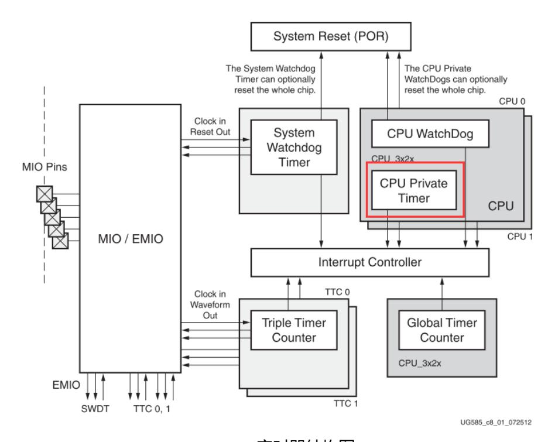
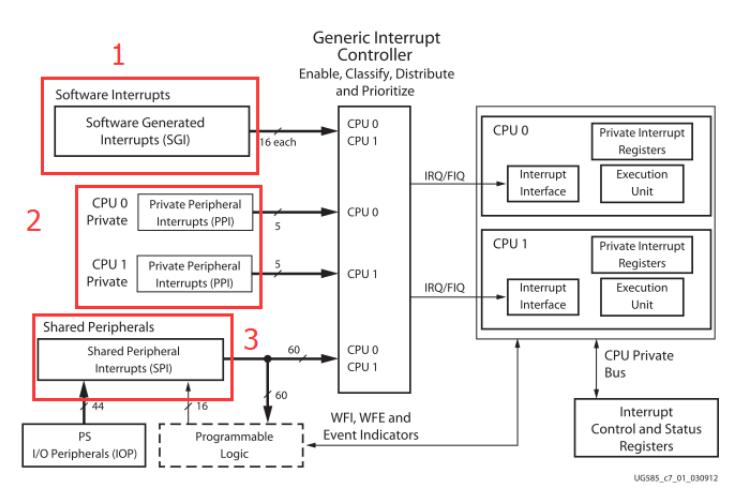
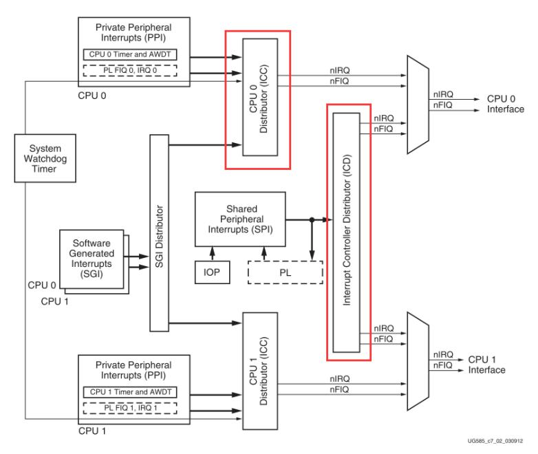
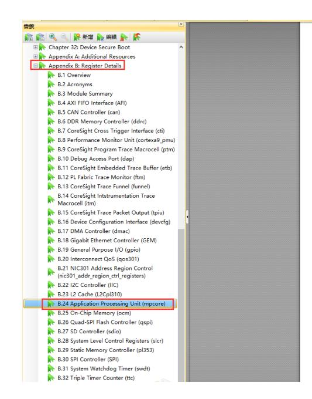
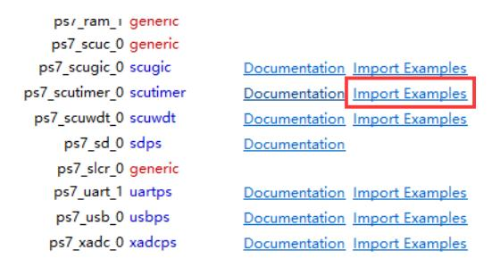

# PS定时器中断实验

本实验的 Vivado 工程为 ps_timer。

很多 SoC 内部都集成了定时器，Zynq 的 PS 也不例外。理解 Zynq 的外设及其特性是系统开发者的基本功，建议参考 Xilinx 文档 UG585 以获得详尽资料。本章实验以 CPU 私有定时器（CPU Private Timer）为对象，演示定时器中断的配置与使用。

Zynq 定时器结构示意

在现有工程 ps_hello 基础上另存为 ps_timer 以开始本实验。

## 中断体系与 GIC 概述

参阅 UG585，Zynq 的中断体系可分为三类：软件生成中断（SGI）、CPU 私有中断（PPI）与共享外设中断（SPI）。中断由 GIC（中断控制器）进行管理，GIC 负责中断的使能、屏蔽、优先级设置与分发等功能。

下图为中断控制器框图，关键组件为 ICC（CPU 接口）与 ICD（分配器）。ICD 连接 SGI / PPI / SPI，通过相应寄存器进行配置与控制。

说明性摘要：

软件生成中断（SGI）为软件在 CPU 之间触发中断的机制，拥有 16 个通道（IRQ ID 0–15），其主要功能是支持多核协作场景下的软件触发与协调（如一个核请求另一核执行特定动作或同步事件）；CPU 私有中断（PPI）则为每个 CPU 保留若干专用中断通道（包括全局定时器、私有定时器等），这些中断通常与单核内部资源绑定，提供低延迟的计时与本地事件响应能力；共享外设中断（SPI）来自 PS 端的大多数外设以及映射到 PL 的中断，SPI 的主要功能是将外设事件（如网络、存储或外设完成中断）集中交由 GIC 分发，适用于外设驱动与系统级事件通知。上层软件通过配置 GIC 可对上述三类中断进行使能、屏蔽与优先级管理，以实现对中断源的集中调度与策略控制。

## 中断类型与用途说明

通过 Xilinx 提供的 API 可以方便地配置与管理中断，深入理解底层寄存器有助于问题诊断。主要寄存器包括 CPU 端的 ICC 系列（例如 ICCICR、ICCPMR、ICCIAR、ICCEIOR 等）以及 Distributor（ICD）相关寄存器（例如 ICDISER、ICDICER、ICDIPR、ICDICFR 等）。其中 ICDICFR 用于配置触发类型（电平/边沿），ICDIPR 用于设置中断优先级，ICDIPTR 用于指定中断目标 CPU。

ICDICFR 寄存器范围覆盖所有中断号（通过 6 个 32-bit 寄存器，每两位配置一个中断的触发类型），ICDISER/ICDICER 用于使能/禁用中断位图，详细寄存器描述请参考 UG585。

下表选取性列示 SCU 及相关寄存器以便参考（文档中保留完整寄存器列表）：

| Module Name              | Application Pro | cessing i | Juit (mp | core)            |         |
|--------------------------|-----------------|-----------|----------|------------------|---------|
| Software Name            | XSCU            |           |          |                  |         |
| Base Address             | 0xF8F00000 mp   | core      |          |                  |         |
| Description              | Mpcore - SCU,   | Interrupt | controll | er, Counters and | Timers  |
| Version                  | r2p2            |           |          |                  |         |
| Doc Version              | 1.3             |           |          |                  |         |
| Vendor Info              | ARM             |           |          |                  |         |
| Regi                     | ster Summa      | ry        |          |                  |         |
| Register Name            | Address         | Width     | Type     | Reset Value      |         |
| SCU_CONTROL_REGI STER | 0x00000000      | 32        | rw       | 0x00000002       | SCU Con |
| SCU_CONFIGURATIO         | 0x00000004      | 32        | ro       | 0x00000501       | SCU Con |

| Register Name                                        | Address    | Width | Type | Reset Value | Description                                     |
|------------------------------------------------------|------------|-------|------|-------------|-------------------------------------------------|
| SCU_CONTROL_REGI STER                             | 0x00000000 | 32    | rw   | 0x00000002  | SCU Control Register                            |
| SCU_CONFIGURATIO N_REGISTER                       | 0x00000004 | 32    | ro   | 0x00000501  | SCU Configuration Register                      |
| SCU_CPU_Power_Stat us_Register                    | 0x00000008 | 32    | rw   | 0x00000000  | SCU CPU Power Status Register                   |
| SCU_Invalidate_All_R egisters_in_Secure_Stat e | 0x0000000C | 32    | rw   | 0x00000000  | SCU Invalidate All Registers in Secure State |
| Filtering_Start_Addres s_Register                 | 0x00000040 | 32    | rw   | 0x00100000  | Filtering Start Address Register                |
| Filtering_End_Address _Register                   | 0x00000044 | 32    | rw   | 0x00000000  | Defined by FILTEREND input                      |
| SCU_Access_Control_ Register_SAC                  | 0x00000050 | 32    | rw   | 0x0000000F  | SCU Access Control (SAC) Register            |
| SCU_Non_secure_Acce ss_Control_Register           | 0x00000054 | 32    | ro   | 0x00000000  | SCU Non-secure Access Control Register       |

## 软件开发总体流程

在完成 Vivado 的硬件设计并导出 HDF 后，软件工程师的工作以在 SDK 中建立与硬件平台一致的软件工程为核心，首先创建应用工程并导入硬件平台信息以获得正确的外设地址映射和 BSP 支持，其主要功能是为应用提供与硬件匹配的运行时环境；随后查阅并利用 BSP 与示例代码来了解可用驱动与外设 API，这一步的作用是缩短驱动移植和应用开发时间并保证对裸机/驱动接口的正确使用；最后基于示例或模板编写中断处理程序与定时器配置代码并在 SDK 中编译、下载和测试，测试阶段的主要功能是验证中断向量、GIC 配置、定时器时钟源与 ISR 行为在目标硬件上的正确性。

## SDK 中的实现要点与实验步骤

启动 SDK 并基于导出的硬件平台新建应用工程（例如 ps_timer_test），通常会采用 Hello World 或相关模板快速生成工程结构以节省初始化工作，这一步的主要作用是建立带有正确地址映射与 BSP 的开发环境。浏览 SDK 中的示例以定位与定时器和中断相关的参考实现（示例名称中常包含 "intr"、"timer" 等关键词），示例代码的作用是提供可直接修改的实现框架以便验证中断注册、GIC 初始化与外设驱动。修改示例代码以设置定时器中断周期时需注意时钟源的实际频率（例如 Zynq 私有定时器时钟通常为 CPU 频率的一半），因此在设定计数阈值与中断周期时应参照 xparameters.h 中的宏定义以获得精确时序。

在代码层面，实验需要完成的关键步骤为：

- 初始化 GIC（中断控制器）并注册中断服务例程（ISR）；  
- 在 GIC 中根据中断号使能相应中断位；  
- 在定时器外设中开启其中断使能位；  
- 在 ISR 中处理定时事件并进行相应的业务（本实验为每秒打印一条信息，持续若干秒后退出或停止计时）。  

示例工程经修改后可实现每秒一次的定时器中断，并在串口输出提示信息。

## 调试方法与验证流程

使用串口终端（例如 PuTTY，115200）连接目标板以观察应用输出并用于验证 ISR 执行与调试信息打印；串口输出的主要功能是提供易于读取的运行时反馈与诊断信息。建议在 SDK 的 Run/Debug 配置中选择在运行前重置系统（Reset entire system），并在必要时勾选 Program FPGA 以确保比特流已正确加载；这些设置的作用是保证测试的系统状态一致、PL/PS 配置同步，从而避免由未加载比特流或残留状态引起的误判。启动应用后，应在终端中观察到预期输出（如每秒一行信息），以此确认 GIC、定时器与 ISR 在实际硬件上的协同工作正常。

## 实验总结与学习要点

本实验通过修改 SDK 示例并结合 GIC 与定时器外设的正确配置，演示了私有定时器中断的配置与使用流程。该过程涉及中断控制器初始化、外设中断使能、ISR 注册与中断处理等关键环节。理解定时器与中断的原理、掌握中断寄存器与 API 的使用，是深入掌握 Zynq 系统软件开发的基础。
