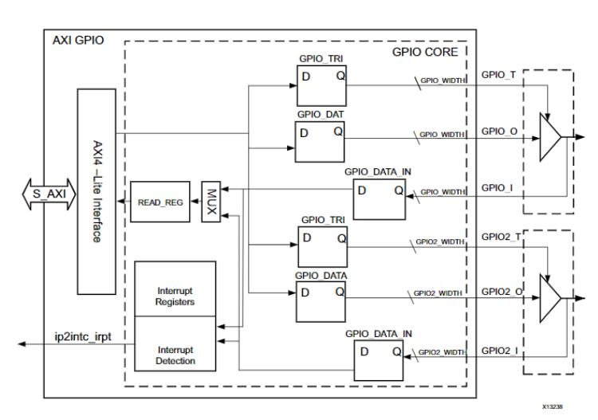
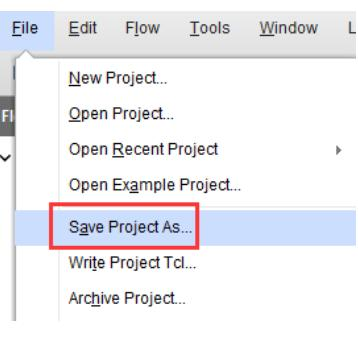
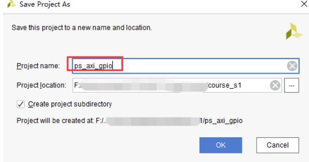
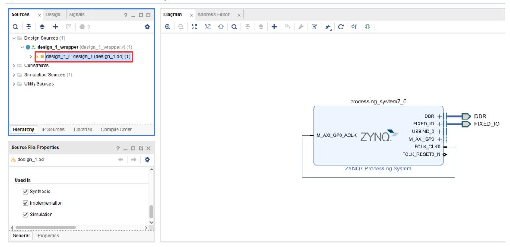
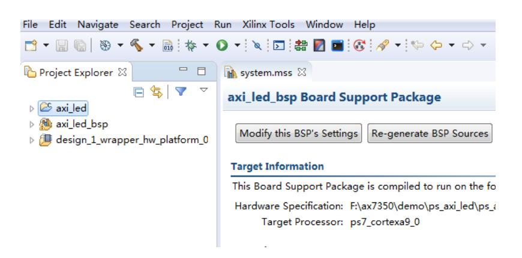
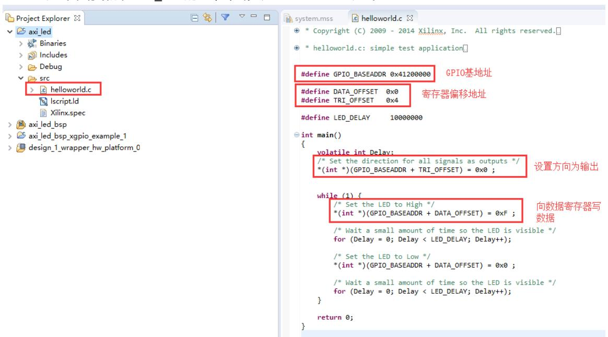
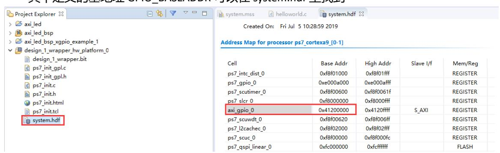
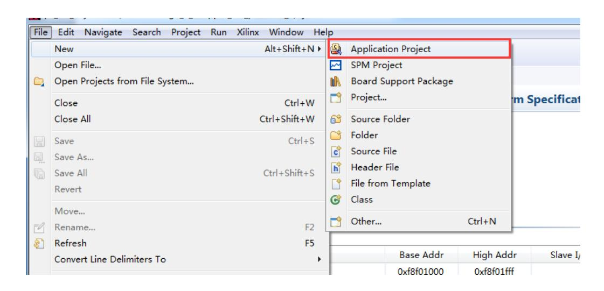
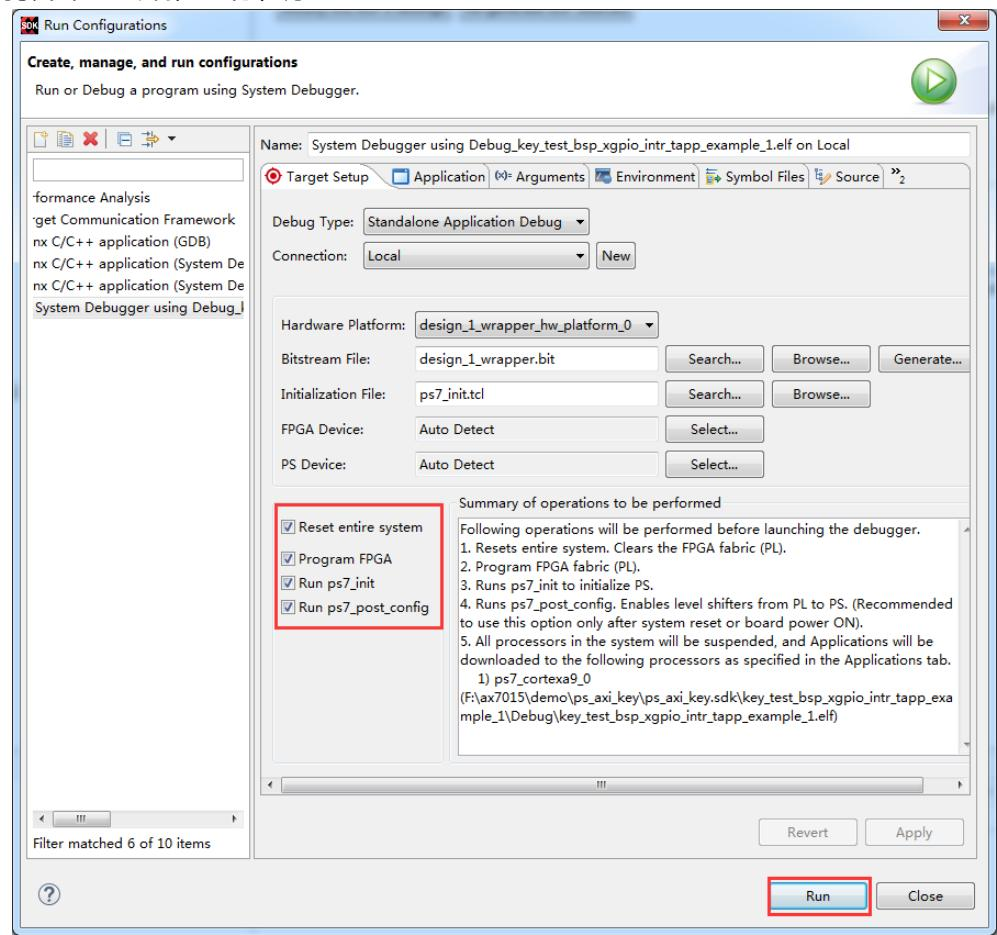
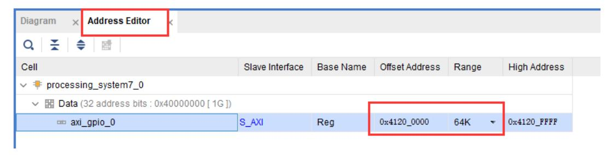

# PL 端 AXI GPIO 的使用

本实验示例工程为 ps_axi_gpio。尽管多次提到 GPIO 与 LED，GPIO 在 Zynq 平台的学习中属于基础且必要的内容。本文旨在展示 PS 与 PL 两端控制 GPIO 的多种实现方式：包括 PS 端 MIO、EMIO，以及 PL 端的 AXI GPIO（包括输入、输出和中断处理），以便理解 PS 与 PL 的协同工作机制。

在此前章节我们已使用 EMIO 从 PS 端控制 PL 侧 LED，本章演示一种替代方法：在 PL 中使用 AXI GPIO IP，通过 AXI 总线由 PS 端访问 PL 侧外设寄存器，从而控制 LED 并响应按键中断。该方法能体现 PS 与 PL 之间基于总线的交互方式，为复杂系统扩展提供可重复的设计模式。

## AXI GPIO 原理与用途

AXI GPIO IP 通常包含两个通道（channel1 和 channel2），每个通道可配置为输入或输出并提供数据寄存器、方向寄存器及中断相关寄存器，其主要功能是在 PL 侧以寄存器映射的方式向 PS 暴露 GPIO，使 PS 能通过 AXI 总线读写 PL 侧的外设状态、控制 LED 或接收按键触发，从而实现基于总线的软硬件协同设计模式。



## 硬件设计与 Vivado 配置要点

在 Vivado 中以 ps_hello 工程另存为 ps_axi_gpio 并打开 block design 添加 AXI GPIO IP，配置第一个 AXI GPIO 为输出（All Outputs）并将 GPIO Width 设为 4 以控制四个 LED，如需双通道可启用 Dual Channel；运行 Connection Automation 自动连线并进行路由优化，工具会自动加入 Processor System Reset 与 AXI Interconnect；为按键输入添加第二个 AXI GPIO 并启用 IP 中断（若需响应按键），若 PL 产生中断则在 Zynq PS 中启用 IRQ_F2P 并将 AXI GPIO 的 ip2intc_irpt 连接到 IRQ_F2P；保存并生成输出文件后在顶层文件中确认端口名（例如 leds_tri_o、keys_tri_i），并以这些端口名在 XDC 中进行管脚约束。

相关界面与操作示例见文档截图。





## 管脚约束与比特流导出

在生成的顶层端口名确认后，新建 XDC 文件（例如 led.xdc），并按实际开发板引脚进行管脚约束。示例如下（务必保证端口名与顶层文件一致；引脚号按目标板调整）：

```verilog
set_property IOSTANDARD LVCMOS33 [get_ports {leds_tri_o[3]}]
set_property IOSTANDARD LVCMOS33 [get_ports {leds_tri_o[2]}]
set_property IOSTANDARD LVCMOS33 [get_ports {leds_tri_o[1]}]
set_property IOSTANDARD LVCMOS33 [get_ports {leds_tri_o[0]}]
set_property PACKAGE_PIN J14 [get_ports {leds_tri_o[0]}]
set_property PACKAGE_PIN K14 [get_ports {leds_tri_o[1]}]
set_property PACKAGE_PIN J18 [get_ports {leds_tri_o[2]}]
set_property PACKAGE_PIN H18 [get_ports {leds_tri_o[3]}]
set_property IOSTANDARD LVCMOS33 [get_ports {keys_tri_i[0]}]
set_property PACKAGE_PIN M15 [get_ports {keys_tri_i[0]}]
```

约束完成后生成比特流并导出包含 bitstream 的硬件平台（Export Hardware，Include bitstream）。


## 软件开发（SDK）与驱动使用说明

导出硬件后进入 SDK 创建应用以访问 AXI GPIO。常见实践包括使用 SDK 的示例（如 xgpio_example、xgpio_intr_tapp_example）来熟悉 API 调用与中断流程，AXI GPIO 的核心寄存器包括 GPIO_DATA（数据寄存器）、GPIO_TRI（方向/三态寄存器）、GIER（全局中断使能）、IP_IER（IP 中断使能）与 ISR（中断状态寄存器），这些寄存器的组合用于实现数据读写、方向配置及中断管理。通常建议优先使用 Xilinx 的驱动 API（如 xgpio.h）以获得良好的可移植性与可读性；在需要高性能或特定控制时可直接依据 system.hdf 中的 GPIO_BASEADDR 做寄存器偏移访问。

示例：创建名为 axi_led 的工程并导入 xgpio_example 示例，即可通过简单几行代码完成 LED 的点亮与翻转。若发现运行异常，注意 Run 配置中选择 Reset entire system，并勾选 Program FPGA（以确保比特流与硬件平台一致）。



## 寄存器直接操作说明与用途

对于简单单通道场景，直接操作寄存器更为高效明了。常用偏移示例为 0x0000 对应 GPIO_DATA（Channel1 数据寄存器，可读写），0x0004 对应 GPIO_TRI（Channel1 方向寄存器，用于设置输入/输出方向）；GPIO_BASEADDR 可在 system.hdf 或 xparameters.h 中找到。直接寄存器访问的主要功能是提供最低开销的控制路径，适用于对延迟和开销敏感的场景，但会牺牲代码抽象与可维护性，建议在性能调优或低层驱动开发时使用。




## PL 端按键中断与 ISR 处理要点

PL 向 PS 发送中断通常通过 IRQ_F2P 实现，流程包括在 Vivado 中为产生中断的 IP（如 AXI GPIO）启用中断输出并连接到 IRQ_F2P，在 SDK 中根据 xparameters.h 中定义的 device id 注册并使能中断、在 ISR 中读取并清除 IP 的中断状态寄存器以避免重复触发、以及在主程序中处理按键逻辑和响应。该流程的主要功能是将 PL 的物理事件（如按键按下）可靠地传递到 PS 的中断体系，实现低延迟响应与统一的软件处理框架。

示例：创建 key_test 工程，导入 xgpio_intr_tapp_example，并修改为实际的 device id 与中断号后，即可运行并在串口或调试控制台观察按键触发结果。




## 实验总结与扩展建议

本实验展示了通过 AXI 总线在 PS 侧以软件方式控制 PL 侧外设的典型流程，包括 IP 集成、地址映射、寄存器访问與中断处理，AXI GPIO 提供结构化的寄存器接口便于软件管理 PL 外设。在更复杂或高吞吐场景下，建议结合 AXI DMA、FIFO 或在 PL 侧实现特定数据通路以提升性能，设计时也应关注地址规划与 Address Editor 中的分配规则。

## 知识扩展与参考

在设计完成后，可使用 Address Editor 查看 AXI 外设地址分配并根据需要调整偏移（注意修改受限规则，详细见 UG585 的 System Address 章节）；使用 IP 时应查阅相应的 Product Guide 以获取寄存器定义、使用范例和调优建议，DocNav 等文档工具可用于在线或离线查阅资料以便开发期间参考。


