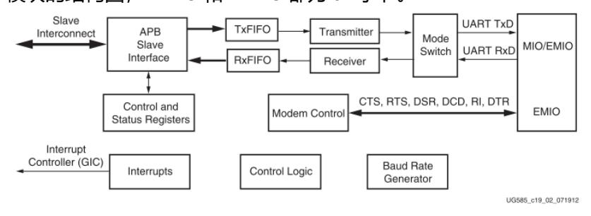
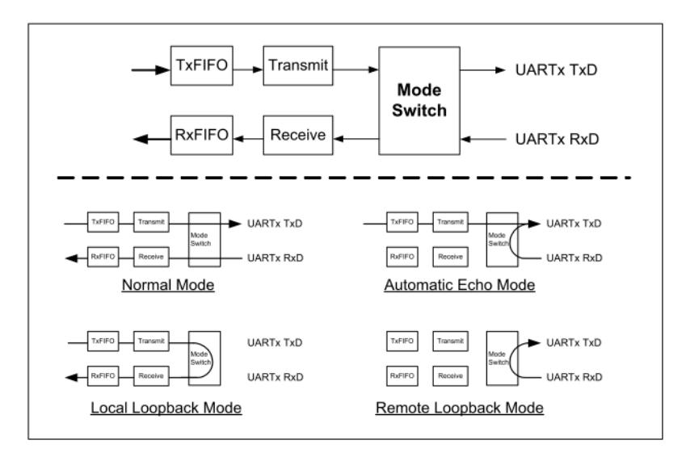
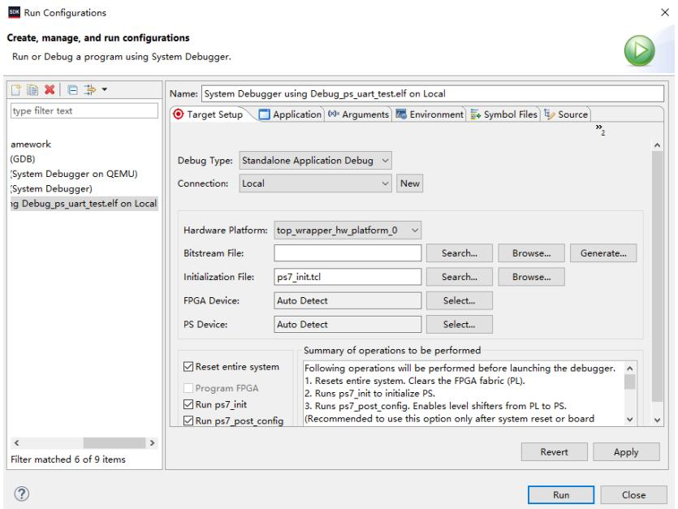
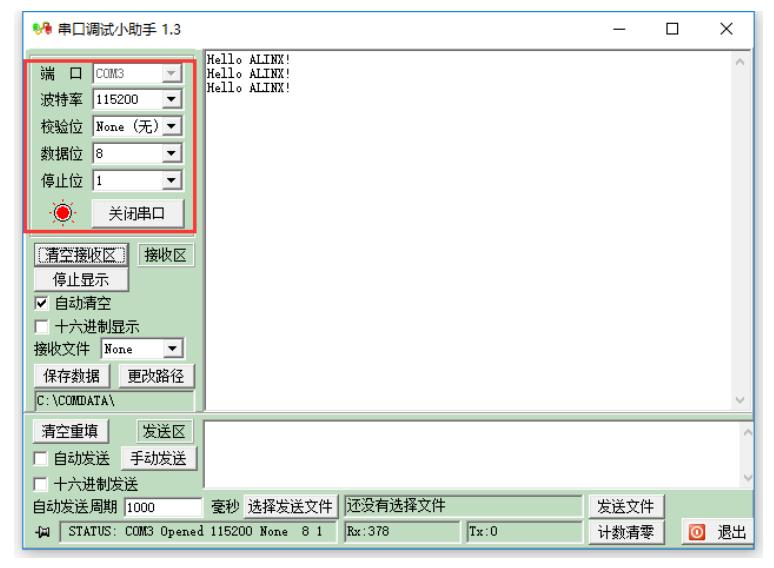
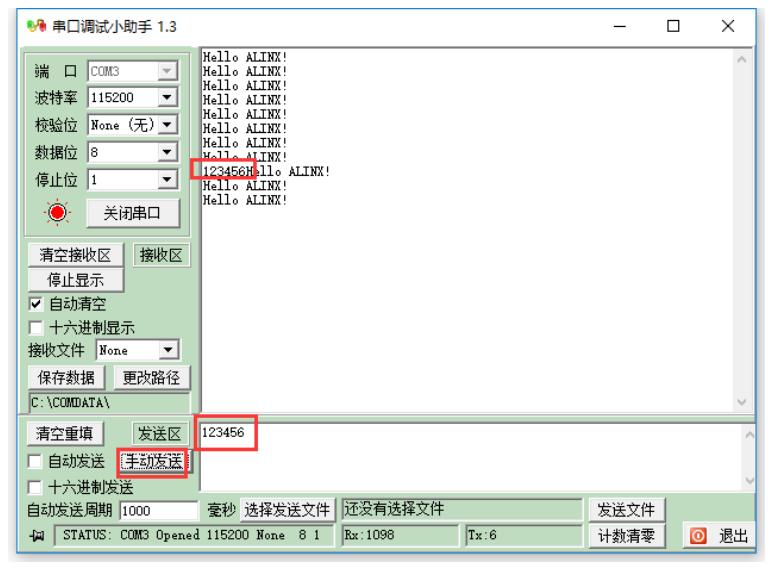

# PS 端 UART 读写控制

本实验目标是系统介绍 Zynq PS 端 UART 的读写控制与中断处理，并通过示例实现一个典型应用：每隔一秒发送一串字符，当接收到数据时触发中断并将接收的数据回发。示例基于 Vivado 工程 ps_hello，旨在让读者掌握 UART 的初始化、发送/接收逻辑、中断配置与在裸机环境中调试验证的方法。

## UART 模块结构与工作模式

UART 模块通常包含发送与接收的 FIFO（本平台为 64 字节深度），并支持多种工作模式以适应不同通信需求。模块的主要组成包括 TxFIFO、RxFIFO、控制/状态寄存器及中断生成逻辑；这些模块的功能分别为缓存发送/接收数据以降低 CPU 负担、配置数据格式与波特率、以及在特定事件（如 FIFO 达到阈值或超时）时通知处理器。UART 既可用于传统点对点串口调试，也支持远程回环（remote loopback）用于硬件链路自检，可通过 API（如 XUartPs_SetOperMode）配置工作模式以满足测试或生产需求。

## 软件任务与实现流程

整体软件任务包括在主程序中完成 UART 的初始化、设置数据格式与波特率、配置接收相关中断并实现周期性发送与接收回发逻辑；具体流程是先初始化接收缓冲与状态标志，然后配置并使能接收中断（例如基于 FIFO 触发或接收超时），接着在主循环中周期性发送数据（例如每 1 秒发送一串字符），并在中断服务程序中读取接收 FIFO、处理接收数据并在需要时回发。每一步的主要功能：初始化确保硬件在已知状态运行，波特率与格式设置保证双方通信兼容，中断配置提供低延迟响应，主循环与 ISR 协同实现发送与接收的数据流控制。

## UART 寄存器与中断细节

UART 的寄存器分为配置寄存器（用于设置模式与波特率）、中断使能/状态寄存器以及发送/接收数据寄存器，其主要功能是分别提供对设备行为的控制、事件检测与数据通道访问。接收触发阈值（Rcvr_FIFO_trigger_level）为 1–63 的 6 位值，通常设置为 1 以获得最小延迟的单字节触发；在中断处理中应关注 REMPTY（接收 FIFO 为空）与 RTRIG（接收 FIFO 达到触发阈值）两类状态，它们的功能分别是指示 FIFO 已无数据和指示数据已到达可读阈值。中断服务例程需先读取 Channel Status 寄存器分辨触发类型，随后循环读取 RX FIFO 并处理数据（或写回 TX FIFO），最后清除相应的中断位以避免重复触发。表格中列出的关键寄存器（如 Control_reg0 / mode_reg0 / Baud_rate_* 等）用于配置和查询设备状态，是实现精细控制与诊断的依据。

| 功能类别 | 关键寄存器 | 说明 |
|---|---:|---|
| 配置 | Control_reg0 / mode_reg0 / Baud_rate_gen_reg0 / Baud_rate_divider_reg0 | 配置模式與波特率 |
| 中断处理 | Intrpt_en_reg0 / Intrpt_dis_reg0 / Intrpt_mask_reg0 / Chnl_int_sts_reg0 / Channel_sts_reg0 | 中断使能/屏蔽/状态读取（覆盖 Tx/Rx 各类中断） |
| 接收 | Rcvr_timeout_reg0 / Rcvr_FIFO_trigger_level0 | 接收超时与 FIFO 触发阈值 |
| 发送 | Tx_FIFO_trigger_level0 | 发送 FIFO 触发阈值 |
| 数据 | TX_RX_FIFO0 | 发送写入 / 接收读取 |

## 实现建议与注意要点

建议采用常见的串口参数（例如 115200 波特率、8 数据位、无校验、1 停止位）以便与主流终端工具兼容；在主程序中应初始化接收缓冲区、计数器與接收标志（ReceivedFlag），并在 ISR 中累积接收数据至缓冲区，当 FIFO 清空或达到预期字节数时置位 ReceivedFlag 以通知主循环后续处理。发送函数需先检测 TxFIFO 是否已满并循环写入以保证数据完整发送，接收函数应循环读取 RxFIFO 直到所需字节数到达或 FIFO 为空。若使用 Xilinx 提供的高级 API（如 XUartPs_Send / XUartPs_Recv），需注意这些函数可能會影响某些中断配置；若需要更细粒度的控制，可参考示例实现并按需裁剪或直接实现基于寄存器的收发函数以获得最大的可控性。

## 调试方法与板上验证

在验证阶段，建议在 SDK 中配置 Run Configurations 选择 Reset entire system 以确保干净的测试环境，并在需要時勾选 Program FPGA 以保证比特流与软件一致；启动串口终端（如 PuTTY）并配置与程序一致的串口参数（例如 COM 端口、115200 8N1）以观察周期性发送的字符串以及在终端发送数据時设备回发的行为。调试的主要功能是通过串口输出和交互验证 UART 初始化、波特率设置、中断触发以及 ISR 行为是否符合预期，同时也便于捕获边界条件（如 FIFO 满/空、超时）并调整触发阈值与中断优先级。

## 实验总结与扩展建议

本章全面介绍了 PS 端 UART 的寄存器结构、触发与中断配置、发送/接收逻辑实现与 SDK 中的调试流程。掌握 UART 的 FIFO 行为、触发阈值设置和中断清理机制能显著提升串口通信的可靠性。建议结合 UG585 与板级原理图进行反复练习，并在此基础上扩展到更复杂的通信场景（如 DMA 驱动的高吞吐率 UART、协议解析或多通道串口管理），以满足实际嵌入式系统的需求。
