# ZYNQ7020 图像处理课程设计安排

本文件是 `zynq7020-image-processing` 的课程设计总 README，只用于说明课程目标、实验路线、时间安排、提交物和评分要求。

各实验的详细操作步骤、验收现象、常见问题和可选扩展，写在对应实验目录的 README 中。阅读时先看本文件了解整体安排，再进入具体实验目录完成操作。

## 0. 图像处理算法理论介绍

数字图像可以看作二维像素矩阵。彩色图像中的每个像素通常由 `R`、`G`、`B` 三个颜色分量组成，每个分量用 8 bit 表示时，一个像素就是 24 bit RGB 数据。在 FPGA 中处理图像时，算法本质上是在像素流上进行运算：输入端按照行、列顺序送入像素，处理模块根据当前像素及其邻域像素计算输出像素，再按照显示时序或存储地址写出结果。

本课程设计重点使用灰度转换和 Sobel 边缘检测。灰度转换的目标是把 RGB 图像压缩成单通道亮度图，常用近似公式为：

```text
Gray = 0.299R + 0.587G + 0.114B
```

硬件实现时通常会把小数系数转换成整数乘加和移位运算，例如使用 `Gray = (77R + 150G + 29B) >> 8` 近似完成，既能保留较好的视觉效果，也能减少浮点运算带来的资源开销。

边缘检测用于找出图像中亮度变化明显的位置。Sobel 算法通过 `3 x 3` 邻域卷积分别估计水平方向和垂直方向的灰度梯度：

```text
Gx = [-1  0  1]      Gy = [ 1  2  1]
     [-2  0  2]           [ 0  0  0]
     [-1  0  1]           [-1 -2 -1]
```

其中 `Gx` 对垂直边缘更敏感，`Gy` 对水平边缘更敏感。实际输出边缘强度可以使用 `|Gx| + |Gy|` 近似，避免平方和开方运算。再将边缘强度与阈值比较，大于阈值的位置输出为边缘点，小于阈值的位置输出为背景。阈值越低，检测出的边缘越多，但噪声也更明显；阈值越高，边缘更干净，但细节可能丢失。

在硬件图像处理中，卷积类算法一般需要同时访问多行相邻像素，因此会使用行缓存和窗口生成逻辑。以 `3 x 3` Sobel 为例，模块需要缓存前两行像素，并在像素流推进时形成当前计算窗口。由于图像边界处缺少完整邻域，常见处理方式包括输出黑色、复制边界像素或跳过边界。本课程实验采用的实现方式会在各实验 README 和 RTL 代码中具体说明。

除 Sobel 外，图像处理还常见以下基础算法，可作为后续扩展方向：

1. 均值滤波和高斯滤波：通过邻域加权平均抑制噪声，使图像更平滑。
2. Prewitt 和 Laplacian 边缘检测：使用不同卷积核提取灰度突变区域。
3. 图像锐化：增强高频细节，使边缘和纹理更明显。
4. 二值化分割：根据阈值把图像划分为前景和背景。
5. 腐蚀和膨胀：基于邻域最小值或最大值改变目标区域形状，常用于去噪、补洞和轮廓处理。

将这些算法映射到 FPGA 时，需要特别关注数据位宽、缓存资源、流水线延迟和显示时序。软件算法通常可以随机访问整幅图像，而 FPGA 更适合把图像组织成连续像素流，在每个时钟周期处理一个或少量像素。因此，本课程中的实验不仅要求看到图像效果，也要求理解算法公式如何变成可综合的 Verilog 模块，以及模块输出如何与 BRAM、UART、AXI 和 HDMI 显示链路连接起来。

## 1. 课程设计目标

本课程设计以黑金 ZYNQ7020 开发板为平台，完成一个由浅入深的图像处理系统：

```mermaid
flowchart LR
    sim["RTL 仿真"] --> hdmi["HDMI 固定图片显示"]
    hdmi --> sobel["PL Sobel 边缘检测"]
    sobel --> pc["PC 串口发送图像"]
    pc --> ps["PS 接收并写入 AXI BRAM"]
    ps --> bram["PL 读取 BRAM 并 HDMI 显示"]
    bram --> uart_sobel["UART 输入图像的 PL Sobel 显示"]
    uart_sobel --> control["上位机命令控制 HDMI 显示模式"]

    classDef sim fill:#e0f2fe,stroke:#0284c7,color:#0f172a,stroke-width:2px;
    classDef display fill:#fae8ff,stroke:#c026d3,color:#0f172a,stroke-width:2px;
    classDef pl fill:#fef3c7,stroke:#d97706,color:#0f172a,stroke-width:2px;
    classDef pc fill:#dcfce7,stroke:#16a34a,color:#0f172a,stroke-width:2px;
    classDef mem fill:#ede9fe,stroke:#7c3aed,color:#0f172a,stroke-width:2px;
    classDef ctrl fill:#fee2e2,stroke:#dc2626,color:#0f172a,stroke-width:2px;
    class sim sim;
    class hdmi,bram display;
    class sobel,uart_sobel pl;
    class pc pc;
    class ps mem;
    class bram display;
    class control ctrl;
```



最终希望学生能够理解：

1. RGB 图像数据在 Verilog、BRAM 和串口协议中的表示方式。
2. HDMI 显示时序、像素坐标和图像缩放关系。
3. RGB 转灰度和 Sobel 边缘检测的硬件实现流程。
4. ZYNQ PS 与 PL 之间通过 AXI BRAM 共享图像数据的方式。
5. 上位机命令如何影响 PS 端控制寄存器和 PL 端显示逻辑。
6. FPGA 图像处理实验中仿真、综合、上板和报告之间的对应关系。

## 2. 实验路线

| 序号 | 实验目录 | 实验定位 | 学生需要完成的基础结果 |
| --- | --- | --- | --- |
| 0 | `sobel_00_rtl_sim` | 纯 RTL 仿真 | 跑通 Sobel 仿真，得到输入图、输出边缘图和关键波形 |
| 1 | `sobel_01_hdmi_pattern` | HDMI 输出基础实验 | 在 HDMI 显示器上显示固定 `128 x 72` 图片放大后的画面 |
| 2 | `sobel_02_hdmi_sobel` | 固定图片 Sobel 实验 | 在 PL 中完成灰度转换和 Sobel 运算，HDMI 显示边缘图 |
| 3 | `sobel_03_uart_hdmi` | UART 传图显示实验 | PC 通过串口发送图像，PS 写 BRAM，PL HDMI 显示原图 |
| 4 | `sobel_04_uart_sobel_hdmi` | 综合实验 | PC 串口输入图像，PL 完成 Sobel，HDMI 显示边缘结果 |
| 5 | `sobel_05_pc_control_display` | 上位机控制显示实验 | PC 控制 Sobel 阈值、彩色边缘叠加和 HDMI 显示模式 |

PC 端图像发送工具位于 `host_camera_uart`。基础实验中直接使用即可；选择综合扩展任务1（上位机与输入规格扩展）的学生可以修改该目录中的脚本。

`hdmi_common` 是 Vivado 工程共用 HDMI 依赖目录，不能删除。

## 3. 目录说明

```mermaid
flowchart TB
    root["zynq7020-image-processing/"]
    root --> readme["README.md<br/>课程设计总安排"]
    root --> common["hdmi_common/<br/>HDMI 共用依赖"]
    root --> host["host_camera_uart/<br/>PC 端图像发送工具"]
    root --> sim0["sobel_00_rtl_sim/<br/>实验 0：RTL 仿真"]
    root --> exp1["sobel_01_hdmi_pattern/<br/>实验 1：HDMI 固定图片显示"]
    root --> exp2["sobel_02_hdmi_sobel/<br/>实验 2：HDMI + Sobel 固定图片显示"]
    root --> exp3["sobel_03_uart_hdmi/<br/>实验 3：UART 传图 + HDMI 原图显示"]
    root --> exp4["sobel_04_uart_sobel_hdmi/<br/>实验 4：UART 传图 + PL Sobel + HDMI 显示"]
    root --> exp5["sobel_05_pc_control_display/<br/>实验 5：上位机控制 HDMI 显示模式"]

    classDef root fill:#111827,stroke:#111827,color:#ffffff,stroke-width:2px;
    classDef doc fill:#e0f2fe,stroke:#0284c7,color:#0f172a,stroke-width:2px;
    classDef tool fill:#dcfce7,stroke:#16a34a,color:#0f172a,stroke-width:2px;
    classDef exp fill:#fef3c7,stroke:#d97706,color:#0f172a,stroke-width:2px;
    classDef common fill:#ede9fe,stroke:#7c3aed,color:#0f172a,stroke-width:2px;
    class root root;
    class readme doc;
    class host tool;
    class common common;
    class sim0,exp1,exp2,exp3,exp4,exp5 exp;
```



每个实验目录的 README 应包含：

1. 实验目标和数据流。
2. 工程文件说明。
3. 详细实验步骤。
4. 预期实验现象。
5. 常见问题或注意事项。
6. 本实验对应的基础扩展计划。

## 4. 时间安排

上机时间有限，课程设计分成两个阶段组织。第一周完成基础实验复现，并在实验 0 到实验 4 中选择 1 个小扩展完成；第二周完成实验 5 的上位机控制显示功能，并在 `sobel_05_pc_control_display` 的基础上选择 1 个综合扩展任务，先完成相关仿真，再完成上板验证。

| 时间 | 课堂任务 | 学生提交物 |
| --- | --- | --- |
| 第 15 周周一上午 | 教师说明课程设计任务、实验路线、评分标准和最终提交要求 | 无 |
| 第 15 周周四上午 | 签到 | 无 |
| 第 15 周周四下午 | 复现基础上板实验；在实验 0 到实验 4 中选择 1 个小扩展并开始完成 | HDMI 显示照片或视频、串口截图、小扩展记录 |
| 第 15 周周五至周日 | 端午节放假 | 无 |
| 第 16 周周一 | 整理初步实验报告；开始实验 5 基础控制功能，并规划综合扩展任务的相关仿真 | 初步实验报告草稿、扩展仿真计划 |
| 第 16 周周二上午 | 提交仿真报告和初步实验报告，确认实验 0 到实验 4 的基础实验和小扩展 | 仿真报告、初步实验报告 |
| 第 16 周周二下午 | 继续完成综合扩展仿真，并开始修改工程 | 扩展仿真截图、修改记录 |
| 第 16 周周四上午 | 完成综合扩展主要功能，记录资源利用率和时序结果 | 扩展截图、资源报告 |
| 第 16 周周五上午 | 最终联调和演示验收 | 可运行工程、演示视频或照片 |
| 第 16 周周五下午 | 完成最终课程设计报告 | 最终报告、工程归档 |

## 5. 必做任务

所有学生必须完成以下基础任务：

1. 完成 `sobel_00_rtl_sim` 的 RTL 仿真，能说明输入图像、输出边缘图和关键波形。
2. 完成 `sobel_01_hdmi_pattern` 的 HDMI 固定图片显示，确认 HDMI 输出链路正常。
3. 完成 `sobel_02_hdmi_sobel` 的固定图片 Sobel 显示，能说明灰度转换和 Sobel 数据流。
4. 完成 `sobel_03_uart_hdmi` 的 SDK 程序下载和运行，能通过串口看到 PS 程序启动信息。
5. 使用 `host_camera_uart` 中教师提供的 GUI 或命令行脚本发送图像到 ZYNQ。
6. 完成 `sobel_04_uart_sobel_hdmi` 的综合实验，看到 UART 输入图像的 Sobel HDMI 显示结果。
7. 在实验 0 到实验 4 中选择 1 个该实验 README 中列出的基础扩展完成。
8. 保存每个上板实验的现象照片、串口输出截图、Vivado 资源利用率和时序结果。

## 6. 扩展要求

扩展分为两个层次：

1. **第一周基础扩展**：在实验 0 到实验 4 中选择 1 个对应 README 中的基础扩展完成。
2. **第二周综合扩展**：完成实验 5 的上位机控制显示功能（阈值、彩色叠加和显示模式切换），并在 `sobel_05_pc_control_display` 的基础上选择 1 个综合扩展任务完成。综合扩展允许修改上位机、PS 程序和 PL 逻辑，但必须先完成相关仿真或软件验证，再进行 Vivado 综合、实现和上板验证。

第二周综合扩展任务从以下 3 个方向中选择 1 个完成。

### 综合扩展任务 1：基于 sobel_05 的上位机与输入规格扩展

在 `sobel_05_pc_control_display` 的基础上继续增加功能，重点是修改上位机程序和输入图像规格。

建议完成内容：

1. 修改 `host_camera_uart`，支持更多输入来源，例如单张图片、多张图片、图片目录、USB 摄像头或 MP4 视频。
2. 修改上位机界面或命令行参数，使学生可以选择目标输入尺寸，例如 `128x72` 以及至少 1 种新的处理尺寸。
3. 设计清楚“不同尺寸输入图像如何进入 FPGA”的方案：可以在上位机统一缩放到固定处理尺寸，也可以修改 PS/PL 工程支持新的固定尺寸。
4. 如果修改硬件处理尺寸，需要同步修改 BRAM 地址计算、图像宽高参数、HDMI 放大显示逻辑和相关仿真。修改图像尺寸涉及以下联动参数：

    | 位置 | 文件 | 需修改的参数 |
    | --- | --- | --- |
    | 上位机 | `host_camera_uart/` | GUI 和 CLI 中的 `Width`/`Height` 默认值和可选范围 |
    | PS 程序 | `main.c` | `IMG_WIDTH`、`IMG_HEIGHT` 宏定义，帧校验逻辑 |
    | PS 写入 | `main.c` | BRAM 地址计算公式 `((y * WIDTH + x) << 2)` 中的 `WIDTH` |
    | PL 显示 | `hdmi_bram_sobel_display.v` | `IMG_WIDTH`、`IMG_HEIGHT` 参数，BRAM 读地址计算 |
    | PL 缩放 | `hdmi_bram_sobel_display.v` | `SCALE_X`、`SCALE_Y`（需根据新尺寸和 `1280x720` 重新计算） |
    | 传输协议 | PC 端和 PS 端 | 帧头中的宽高字段需保持一致 |

5. 保持 `sobel_05` 原有显示控制命令可用，包括原图、灰度、边缘、叠加、阈值控制。

仿真或验证要求：

1. 至少使用 2 种不同原始尺寸的图片进行输入测试。
2. 给出上位机缩放、裁剪或填充策略说明。
3. 如果修改 PL 图像尺寸，必须给出 BRAM 地址或显示控制相关仿真截图。
4. 上板演示时至少展示 2 种输入来源或 2 种输入尺寸。

等级评定：

| 等级 | 要求 |
| --- | --- |
| A | 实现 1080P 图像的传输与 HDMI 显示（图像缓冲迁移至 DDR） |
| B | 修改硬件支持 5 种以上新固定尺寸（参考：128×72、160×90、144×108、128×128、192×80），BRAM 可容纳 |
| C | 硬件不变，上位机统一缩放至 3 种以上尺寸（参考：128×72、160×90、144×108）后发送 |
| D | 未完成 C 级要求 |

### 综合扩展任务 2：网络传输与实时视频处理

在 UART 传图的基础上，增加网络传输通道，实现 PC 到 ZYNQ 的实时视频帧传输，并继续使用 PL 图像处理和 HDMI 显示。

建议完成内容：

1. 在 PC 端增加网络发送程序，可以使用 UDP 或 TCP 发送图像帧。
2. 在 ZYNQ PS 端增加网络接收程序，建议基于 lwIP 完成帧接收、组帧和写入 AXI BRAM。
3. 设计网络帧格式，至少包含帧头、帧序号、图像宽高、格式、数据长度和基本错误检查。
4. 处理网络传输中的丢包、乱序或半帧问题，至少能丢弃错误帧并等待下一帧。
5. 记录实际帧率、延迟和稳定性，分析网络传输相比 UART 的改进。

仿真或验证要求：

1. 先完成 PC 端发送和接收的本机回环测试，确认网络帧格式正确。
2. 给出 PS 端组帧流程或关键调试输出。
3. PL 端仍需给出显示或算法链路的仿真结果。
4. 上板演示时连续发送视频帧，观察 HDMI 显示是否稳定，并记录实际 FPS。

该任务难度较高，适合基础实验已经稳定完成、能够独立调试 PS 网络程序的小组。

等级评定：

| 等级 | 要求 |
| --- | --- |
| A | 实现 1080P 图像的实时网络传输与 HDMI 显示，帧率 ≥30 FPS |
| B | 连续多帧网络传输 + HDMI 稳定显示 + 基本错误检测与丢弃 + 帧率记录 |
| C | 单帧网络传输成功 + 本机回环测试通过 + 基本帧格式设计（含帧头、帧序号、错误检查） |
| D | 未完成 C 级要求 |

### 综合扩展任务 3：增加图像处理算法

在 `sobel_05_pc_control_display` 的基础上增加新的 PL 图像处理算法，并通过上位机命令选择显示结果。

可选算法包括：

1. Prewitt 边缘检测。
2. Laplacian 边缘检测。
3. 均值滤波或高斯滤波。
4. 图像锐化。
5. 简单二值化分割。
6. 腐蚀、膨胀等基础形态学处理。

建议完成内容：

1. 至少新增 1 种图像处理算法，并与原 Sobel 结果形成对比。
2. 增加显示模式或算法选择命令，使 PC 可以切换 Sobel 和新增算法。
3. 给出算法的软件参考结果，例如 Python 或 MATLAB 生成的 golden output。
4. 完成 RTL 仿真，对比硬件输出和软件参考结果。
5. 上板演示算法切换效果，并记录资源利用率和时序结果。

等级评定：

| 等级 | 要求 |
| --- | --- |
| A | 新增 3 种以上算法 + 上板演示算法切换 + 与软件 golden 对比 + 资源利用率和时序对比分析 |
| B | 新增 1 种算法 + 上板演示 + 与软件参考对比 |
| C | 新增 1 种算法并上板演示 |
| D | 未完成 C 级要求 |

综合扩展验收时至少需要提交：

1. 实验 5 上位机控制显示效果（HDMI 模式切换、阈值变化、彩色叠加的照片或视频）。
2. 综合扩展任务的效果演示视频或实物现场展示。
3. 综合扩展任务的 PPT 讲解，至少包含以下内容：
   - 综合扩展任务选择与理由。
   - 设计方案和系统框图。
   - 关键代码修改说明。
   - 实验结果和效果对比。
   - 遇到的问题和解决方法。

## 7. 报告要求

### 仿真报告

仿真报告对应第 16 周周二上午提交，只包含 `sobel_00_rtl_sim` 的基础仿真内容，建议包含：

1. `sobel_00_rtl_sim` 的实验目标。
2. 输入图像格式和 UART 帧格式。
3. `rgb_to_gray`、`sobel_core` 的功能说明。
4. 关键波形截图。
5. 输入图和 Sobel 输出图。
6. 仿真中遇到的问题和解决方法。

### 初步实验报告

初步实验报告对应第 16 周周二上午提交（与仿真报告同时），实验 0 的扩展结果也写入本报告，建议包含：

1. 已完成的基础实验列表。
2. 各基础实验和第一周小扩展的实验现象。
3. 系统总体框图和数据流说明。
4. 关键代码或关键模块说明。
5. 当前未解决的问题。
6. 第二周计划选择的综合扩展题目和仿真计划。

### 最终报告

最终报告聚焦第二周工作，第一周内容已在仿真报告和初步实验报告中提交，无需重复。建议包含：

1. 课程设计任务说明。
2. 实验 5 上位机控制显示结果（模式切换、阈值控制和彩色叠加的 HDMI 照片或截图）。
3. 第二周综合扩展的任务选择、设计方案、仿真结果和上板结果。
4. 资源利用率、时序结果和性能分析。
5. 问题记录与总结。

## 8. 评分建议

| 项目 | 分值 |
| --- | ---: |
| 基础实验复现 | 30 |
| 仿真报告 | 15 |
| 初步实验报告 | 15 |
| 扩展功能完成度 | 20 |
| 最终报告质量 | 15 |
| 演示与答辩 | 5 |

## 9. 基础环境

| 类别 | 要求 |
| --- | --- |
| FPGA 工具 | Vivado，Xilinx SDK 或 Vitis |
| PC Python | Anaconda 或 Miniconda，`fpga` 虚拟环境 |
| 仿真工具 | Icarus Verilog，GTKWave 可选 |
| 硬件 | 黑金 ZYNQ7020 开发板、HDMI 显示器、USB 串口线 |
| 图像输入 | USB 摄像头或本地图片 |

PC 端 Python 环境安装和使用见 `host_camera_uart/README.md`。

实验 0 的仿真环境见 `sobel_00_rtl_sim/README.md`。
