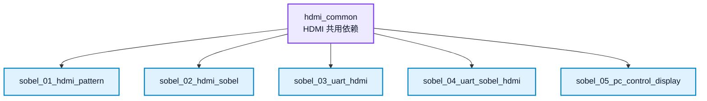

# hdmi_common 说明

本目录是 Sobel 系列 Vivado 工程共用的 HDMI 基础依赖目录，不是独立实验目录，不能删除。

以下工程的 `.xpr` 文件中保留了指向 `../hdmi_common` 的相对路径：

该目录用于保存 HDMI 相关工程依赖路径和 Vivado 缓存来源，例如 `video_clock`、`rgb2dvi_0`、`hdmi_out_test.xdc`、IP repository 路径以及仿真库缓存目录。删除该目录后，Vivado 重新打开工程或重新生成 IP 时可能出现路径缺失，或者重新创建旧的临时目录。

## 使用原则

1. 学生不需要单独打开本目录完成实验。
2. 不要删除、改名或移动本目录。
3. 如果 Vivado 打开工程时提示 HDMI IP、约束或 repository 路径缺失，先检查本目录是否还在原位置。
4. 本目录不设置学生扩展任务，相关扩展写在 `sobel_01` 到 `sobel_05` 的实验 README 中。
