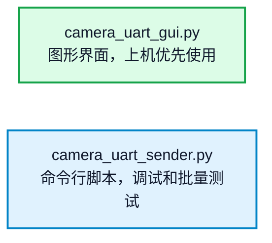
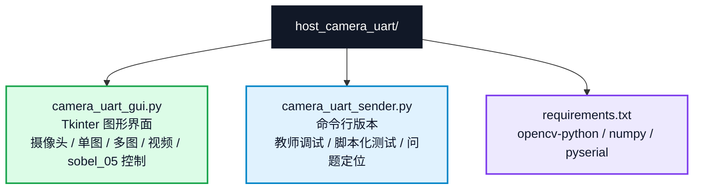
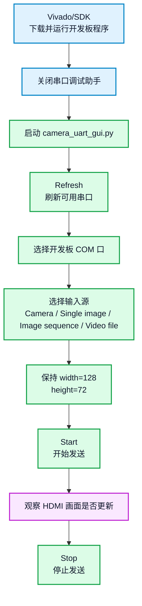
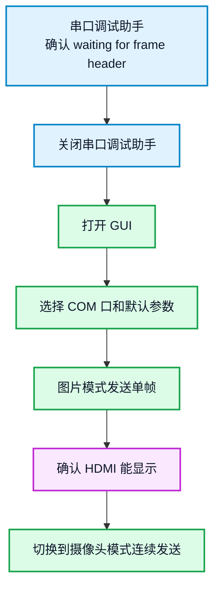

# Host Camera UART Sender

本目录是 `sobel_03_uart_hdmi`、`sobel_04_uart_sobel_hdmi` 和 `sobel_05_pc_control_display` 共用的 PC 端上位机工具。它可以从 USB 摄像头、单张图片、多张图片或 MP4 等视频文件读取画面，将图像缩放为 `128x72`，转换成 `RGB888`，再按照约定帧格式通过串口发送到 ZYNQ PS。

本工具保持向前兼容：`sobel_03` 和 `sobel_04` 只使用图像发送功能；`sobel_05` 在图像发送基础上额外使用显示模式、阈值和彩色叠加控制功能。

本目录是教师提供的配套工具目录。基础实验中，学生只需要会安装、运行和排查基本问题；选择综合扩展任务1（上位机与输入规格扩展）的学生，可以修改 `camera_uart_gui.py` 或 `camera_uart_sender.py`，建议先备份原文件或基于原代码扩展。

推荐课堂上优先使用图形界面：



命令行脚本仍然保留，方便调试和批量测试。

## 1. 文件说明



## 2. 运行前提

运行 PC 端发送工具前，需要满足以下条件：

1. 已安装 Anaconda 或 Miniconda。
2. 已创建并激活 `fpga` 虚拟环境。
3. 已安装 `requirements.txt` 中的 Python 依赖。
4. 开发板已经下载 bitstream。
5. SDK 中的 PS 程序已经运行。
6. 串口调试助手已经关闭，避免占用同一个 COM 口。

PS 程序正常运行时，串口调试助手中通常能看到：

```text
PS UART BRAM HDMI display
BRAM base: 0x40000000, baud: 115200
waiting for frame header
```

看到 `waiting for frame header` 说明开发板端已经准备好接收 PC 发送的图像帧。

## 3. 安装 Anaconda

进入 Anaconda 官网下载安装包：

```text
https://www.anaconda.com/download
```

安装完成后，在 Windows 中打开 **Anaconda Prompt**，检查 `conda` 是否可用：

```bash
conda --version
```

## 4. 创建 fpga 虚拟环境

创建环境：

```bash
conda create -n fpga python=3.13 -y
```

激活环境：

```bash
conda activate fpga
```

进入本目录：

```bash
cd D:\Github\FPGA-course\zynq7020-image-processing\host_camera_uart
```

安装依赖：

```bash
python -m pip install --upgrade pip
pip install -r requirements.txt
```

检查依赖：

```bash
python -c "import cv2, numpy, serial, tkinter; print('ok')"
```

如果输出 `ok`，说明 PC 端环境可用。

每次运行本工具前，都要先激活环境：

```bash
conda activate fpga
```

## 5. GUI 图形界面运行

在 Anaconda Prompt 中运行：

```bash
conda activate fpga
cd D:\Github\FPGA-course\zynq7020-image-processing\host_camera_uart
python camera_uart_gui.py
```

界面启动后，建议第一次实验使用以下参数：

```text
Serial port = 开发板对应的 COM 口，例如 COM7
Baud        = 115200
Input      = Camera、Single image、Image sequence 或 Video file
Width       = 128
Height      = 72
FPS         = 0.2
Line delay  = 0.0
Preview     = 勾选
Send once   = 单张图片模式建议勾选，多图和视频模式通常不勾选
Loop file input = 多图或视频需要循环播放时勾选
```

操作流程：



如果启用了 `Preview`，PC 端预览画面会直接显示在同一个 Tkinter 界面中，不会额外弹出 OpenCV 预览窗口。预览画面会按照界面中的 Preview 区域等比例放大显示，但发送给开发板的图像分辨率仍由 `Width` 和 `Height` 决定，默认保持 `128x72`。

## 6. GUI 控件说明

| 控件 | 说明 |
| --- | --- |
| Serial port | 选择开发板对应的串口号，例如 `COM7`。 |
| Refresh | 重新扫描当前电脑上的串口。 |
| Baud | 串口波特率，必须和 PS 程序一致，默认 `115200`。 |
| Camera | 使用 USB 摄像头作为输入源。 |
| Index | 摄像头编号，通常默认摄像头为 `0`。 |
| Single image | 使用一张本地图片作为输入源。 |
| Image sequence | 使用多张本地图片作为输入源，按选择顺序发送。 |
| Video file | 使用 MP4、AVI、MOV、MKV 或 WMV 视频文件作为输入源。 |
| Browse | 根据当前输入源选择单张图片、多张图片或视频文件。 |
| Width / Height | 发送给开发板的图像分辨率，当前 PS 程序默认只接收 `128x72`。 |
| FPS | 发送帧率，`115200` 波特率下建议 `0.2` 或更低。 |
| Line delay | 每发送一行后的延时，画面不稳定时可设为 `0.001`。 |
| Flip camera | 摄像头画面左右翻转。 |
| Preview | 在 GUI 内嵌区域显示 PC 端本地预览画面，并自动放大适配预览区域。 |
| Send once | 只发送一帧，适合图片测试。 |
| Loop file input | 多图或视频结束后从头继续发送。摄像头模式下不需要勾选。 |
| Mode | `sobel_05` 显示模式：原图、灰度图、边缘图或彩色叠加图。 |
| Threshold | `sobel_05` Sobel 二值化阈值，范围 `0..255`。 |
| Overlay | `sobel_05` 彩色边缘叠加开关。 |
| Send Control | 向 `sobel_05` 发送显示控制命令。`sobel_03`、`sobel_04` 实验不用点击。 |
| Start | 开始发送图像。 |
| Stop | 停止发送图像。 |
| Frames | 已发送帧数。 |
| Log | 显示运行状态、错误信息和发送计数。 |

## 7. 命令行运行

GUI 无法运行或需要快速调试时，可以使用命令行版本。

Windows 摄像头示例：

```bash
conda activate fpga
cd D:\Github\FPGA-course\zynq7020-image-processing\host_camera_uart
python camera_uart_sender.py --port COM7 --baud 115200 --camera 0 --fps 0.2 --preview
```

Linux 摄像头示例：

```bash
python3 camera_uart_sender.py --port /dev/ttyUSB0 --baud 115200 --camera 0 --fps 0.2 --preview
```

发送一张图片：

```bash
python camera_uart_sender.py --port COM7 --baud 115200 --image test.jpg --once --preview
```

按指定顺序发送多张图片：

```bash
python camera_uart_sender.py --port COM7 --baud 115200 --images img1.jpg img2.jpg img3.jpg --fps 0.2 --preview
```

发送一个目录中的所有图片，文件名排序后依次发送：

```bash
python camera_uart_sender.py --port COM7 --baud 115200 --image-dir .\frames --fps 0.2 --preview
```

发送 MP4 视频文件：

```bash
python camera_uart_sender.py --port COM7 --baud 115200 --video demo.mp4 --fps 0.2 --preview
```

多图或视频发送结束后自动从头循环：

```bash
python camera_uart_sender.py --port COM7 --baud 115200 --video demo.mp4 --fps 0.2 --loop --preview
```

如果画面不完整、串口报错或行数据不稳定，可以增加行间延时：

```bash
python camera_uart_sender.py --port COM7 --baud 115200 --camera 0 --fps 0.2 --line-delay 0.001 --preview
```

`sobel_05` 控制命令示例：

```bash
python camera_uart_sender.py --port COM7 --baud 115200 --control-only --mode edge --threshold 80 --overlay off
python camera_uart_sender.py --port COM7 --baud 115200 --control-only --mode overlay --threshold 40 --overlay on
```

也可以在发送图像前同时设置一次控制状态：

```bash
python camera_uart_sender.py --port COM7 --baud 115200 --camera 0 --fps 0.2 --mode overlay --threshold 80 --overlay on
```

## 8. 串口参数

PC 端和开发板 PS 程序必须使用一致的串口参数：

```text
baud      = 115200
data bits = 8
parity    = none
stop bits = 1
flow ctrl = none
```

注意：同一个 COM 口同一时间只能被一个程序打开。运行 GUI 或命令行发送脚本前，必须关闭串口调试助手。

## 9. 传输协议

每一帧图像由一个帧头和若干行数据组成。

帧头格式：

```text
55 aa width_l width_h height_l height_h 18
```

字段说明：

```text
55 aa
    帧同步头

width_l width_h
    图像宽度，小端格式

height_l height_h
    图像高度，小端格式

18
    图像格式，0x18 表示 RGB888
```

每一行数据格式：

```text
33 cc row_l row_h R G B R G B ...
```

字段说明：

```text
33 cc
    行同步头

row_l row_h
    当前行号，小端格式

R G B
    RGB888 像素数据，每个像素 3 字节
```

默认图像格式：

```text
width  = 128
height = 72
format = 0x18, RGB888
```

一帧图像数据量约为：

```text
128 * 72 * 3 = 27648 byte
```

加上帧头和每行行头后，实际发送包长度为：

```text
27943 byte
```

`sobel_05` 额外支持控制帧：

```text
a5 5a cmd value
```

控制命令：

```text
cmd = 01
    value = 0 原图
    value = 1 灰度图
    value = 2 Sobel 二值化边缘图
    value = 3 原图 + 彩色边缘叠加

cmd = 02
    value = 0..255 Sobel 二值化阈值

cmd = 03
    value = 0 关闭彩色叠加
    value = 1 打开彩色叠加
```

`sobel_03`、`sobel_04` 不需要使用控制帧。不发送控制命令时，本工具与原来的图像发送实验兼容。

## 10. 带宽说明

当前默认波特率为 `115200`。UART 8N1 传输时，每个字节实际需要约 10 bit，因此理论有效字节率约为：

```text
115200 / 10 = 11520 byte/s
```

一帧 `128x72 RGB888` 图像约 `27 KB`，所以在 `115200` 波特率下，一帧理论发送时间超过 2 秒。第一次实验建议使用：

```text
FPS = 0.2
```

如果需要提高刷新速度，可以考虑：

```text
提高波特率
降低分辨率
改为灰度图格式
减少协议开销
使用 USB、Ethernet 或 DMA 等更高带宽通道
```

当前课程基础实验为了稳定，默认保持 `115200`。

## 11. 验证命令

在 `fpga` 环境中可以执行以下命令验证脚本是否可用。

语法检查：

```bash
conda run -n fpga python -m py_compile camera_uart_sender.py camera_uart_gui.py
```

依赖导入检查：

```bash
conda run -n fpga python -c "import cv2, numpy, serial, tkinter; import camera_uart_sender, camera_uart_gui; print('ok')"
```

GUI 创建检查：

```bash
conda run -n fpga python -c "from camera_uart_gui import CameraUartGui; app=CameraUartGui(); app.update_idletasks(); print('gui ok'); app.destroy()"
```

协议打包检查：

```bash
conda run -n fpga python -c "import numpy as np; from camera_uart_sender import build_frame_packet; img=np.zeros((72,128,3), dtype=np.uint8); packet=build_frame_packet(img); print(len(packet)); print(packet[:7].hex(' '))"
```

正常输出应包含：

```text
27943
55 aa 80 00 48 00 18
```

## 12. 常见问题

### 12.1 GUI 提示缺少 cv2 或 serial

说明当前 Python 环境没有安装依赖，或者没有进入 `fpga` 环境。

处理方法：

```bash
conda activate fpga
pip install -r requirements.txt
python camera_uart_gui.py
```

### 12.2 找不到 COM 口

检查：

```text
开发板 USB 串口线是否连接
设备管理器中是否能看到对应 COM 口
是否安装了 USB 串口驱动
是否点击了 GUI 中的 Refresh
```

### 12.3 串口被占用

如果出现 `PermissionError` 或 `Access is denied`，通常是串口被其他程序占用。

处理方法：

```text
关闭串口调试助手
关闭另一个正在运行的 GUI 或命令行发送脚本
重新插拔 USB 串口线
```

### 12.4 PS 端一直打印 waiting for frame header

这说明开发板端程序正在等待 PC 发送数据。

检查：

```text
GUI 是否已经点击 Start
COM 口是否选择正确
baud 是否为 115200
串口调试助手是否已经关闭
```

### 12.5 HDMI 画面不更新或更新很慢

检查：

```text
FPS 是否过高
是否使用了 115200 波特率
PC 端是否真的发送了帧，观察 GUI Frames 计数
PS 端是否报 frame error
```

`115200` 波特率下画面本来就会比较慢。建议第一次实验使用 `FPS = 0.2`。

### 12.6 PS 端打印 frame error

常见原因：

```text
PC 端 width / height 和 PS 程序不一致
发送速度过快导致串口丢数据
串口线连接不稳定
line delay 太小
```

处理方法：

```text
保持 width = 128, height = 72
降低 FPS
设置 line delay = 0.001
检查 USB 串口连接
```

### 12.7 多图或视频发送结束后自动停止

这是正常行为。多图和视频默认发送到末尾后停止，如果希望持续播放，需要勾选 GUI 中的 `Loop file input`，或在命令行中增加 `--loop`。

### 12.8 视频文件打不开

检查：

```text
视频路径是否正确
视频文件是否损坏
OpenCV 是否支持当前视频编码
优先使用常见 H.264 MP4 文件
```

### 12.9 摄像头打不开

检查：

```text
摄像头是否被其他软件占用
Camera Index 是否正确
可以尝试 0、1、2
Windows 隐私设置是否允许桌面应用访问摄像头
```

## 13. 教学建议

课堂实验建议优先使用 GUI，减少学生在命令行参数上的错误。教师调试时保留命令行脚本，便于快速复现实验问题。

推荐学生第一次上机流程：


