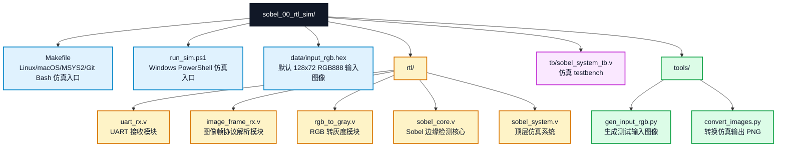

# sobel_00_rtl_sim 实验说明

本实验是课程设计的预备仿真实验。它不依赖 Vivado 工程和开发板，只用纯 Verilog 仿真验证 UART 图像接收、RGB 转灰度、Sobel 边缘检测和视频像素流输出。

## 1. 实验目标

完成本实验后，学生应能说明：

1. `128 x 72 RGB888` 图像如何以字节流方式输入。
2. UART 帧头、行头和像素数据的格式。
3. `rgb_to_gray` 如何把 RGB 转为灰度。
4. `sobel_core` 如何产生边缘强度。
5. 如何根据仿真波形判断一帧图像处理是否完成。

## 2. 数据流

```mermaid
flowchart LR
    input["input_rgb.hex"] --> stream["UART byte stream model"]
    stream --> uart["uart_rx"]
    uart --> frame["image_frame_rx"]
    frame --> gray["rgb_to_gray"]
    gray --> sobel["sobel_core"]
    sobel --> video["video_stream_model"]
    video --> out["sobel_out.pgm / sobel_out.png"]

    classDef data fill:#e0f2fe,stroke:#0284c7,color:#0f172a,stroke-width:2px;
    classDef uart fill:#dcfce7,stroke:#16a34a,color:#0f172a,stroke-width:2px;
    classDef alg fill:#fef3c7,stroke:#d97706,color:#0f172a,stroke-width:2px;
    classDef out fill:#fae8ff,stroke:#c026d3,color:#0f172a,stroke-width:2px;
    class input,out data;
    class stream,uart,frame uart;
    class gray,sobel,video alg;
    class out out;
```



仿真中的 UART 帧格式与后续上板实验保持一致：

```text
frame header: 55 aa width_l width_h height_l height_h 18
line header : 33 cc row_l row_h
pixels      : R G B, repeated 128 times per row
```

其中 `0x18` 表示 RGB888。每个像素 3 个字节，顺序为 `R, G, B`。

## 3. 主要文件



仿真输出写入 `build/` 目录。该目录是生成结果目录，不需要提交到 Git。

## 4. 运行环境要求

完整运行本实验需要以下工具：

1. Icarus Verilog
   - `iverilog`：把 Verilog 源码和 testbench 编译成 `.vvp` 仿真文件。
   - `vvp`：执行 `.vvp` 仿真文件，生成 `sobel_out.pgm` 和 `sobel_system_tb.vcd`。
   - `vvp` 是 Icarus Verilog 的仿真运行器，不依赖 Python。
2. Python 3
   - 用于运行 `tools/gen_input_rgb.py`，生成输入 RGB hex 数据。
   - 用于运行 `tools/convert_images.py`，把仿真输出转换成 PNG 图片。

Windows PowerShell 默认使用原生 Windows 版 Icarus Verilog：

```text
C:\iverilog\bin\iverilog.exe
C:\iverilog\bin\vvp.exe
```

如果 Icarus Verilog 安装在其它位置，可以运行脚本时显式指定：

```powershell
.\run_sim.ps1 -Iverilog "D:\tools\iverilog\bin\iverilog.exe" -Vvp "D:\tools\iverilog\bin\vvp.exe"
```

如果使用 WSL，则需要 WSL 内安装 `make`、`iverilog`、`vvp` 和 `python3`，并通过 `run_sim_wsl.ps1` 启动。

## 5. 实验步骤

### 5.1 检查工具

Windows PowerShell 中检查：

```powershell
C:\iverilog\bin\iverilog.exe -V
C:\iverilog\bin\vvp.exe -V
python --version
```

如果 Windows 没有原生 Icarus Verilog，也可以使用 WSL：

```powershell
.\run_sim_wsl.ps1
```

### 5.2 运行默认仿真

Windows PowerShell：

```powershell
cd D:\Github\FPGA-course\zynq7020-image-processing\sobel_00_rtl_sim
.\run_sim.ps1
```

Linux、macOS、MSYS2 或 Git Bash：

```sh
cd zynq7020-image-processing/sobel_00_rtl_sim
make sim
```

### 5.3 查看仿真结果

默认仿真会生成：

```text
build/input_rgb.png
    输入图像预览

build/sobel_out.pgm
    Sobel 输出灰度图

build/sobel_out.png
    Sobel 输出 PNG 图

build/sobel_system_tb.vcd
    仿真波形文件
```

报告中至少应放入 `input_rgb.png`、`sobel_out.png` 和一张关键波形截图。

### 5.4 查看关键波形

使用 GTKWave 或 Vivado 仿真波形工具打开：

```text
build/sobel_system_tb.vcd
```

重点观察：

```text
frame_start
rgb_valid
gray_valid
edge_valid
edge_frame_done
```

能够看到 `edge_frame_done` 说明一帧 Sobel 处理已经结束。

### 5.5 只重新生成图片

如果仿真已经跑过，只想重新生成 PNG：

```sh
make images
```

## 6. 验收标准

基础实验验收时应能提交：

1. `build/input_rgb.png` 输入图。
2. `build/sobel_out.png` Sobel 输出图。
3. 包含 `gray_valid`、`edge_valid`、`edge_frame_done` 的波形截图。
4. 对 UART 帧格式和 Sobel 数据流的简要说明。

## 7. 常见问题

### 7.1 找不到 iverilog

说明 Icarus Verilog 没有安装，或者没有加入 `PATH`。Windows 下可改用 WSL 运行：

```powershell
.\run_sim_wsl.ps1
```

### 7.2 没有生成 PNG

检查 Python 是否可用，以及 `tools/convert_images.py` 是否正常执行。也可以先确认 `build/sobel_out.pgm` 是否已经生成。

### 7.3 仿真时间很长

完整 UART 字节流仿真会比直接像素仿真慢。默认 Makefile 使用较快的仿真参数，板级 RTL 仍保持 `50 MHz` 和 `115200` baud 的默认设置。

## 8. 可选扩展

本实验的扩展只要求在仿真环境中完成，属于第一周基础扩展。基础仿真结果写入仿真报告，扩展结果写入初步实验报告。学生至少完成 1 项。

| 选题 | 修改范围 | 验收标准 |
| --- | --- | --- |
| 更换输入图片并重新仿真 | `data/input_rgb.hex` 或 `tools/gen_input_rgb.py` | 生成新的输入图和 Sobel 输出图，说明输入变化对边缘结果的影响 |
| Sobel 输出阈值对比 | `rtl/sobel_core.v` 或测试脚本参数 | 至少对比 3 个阈值下的输出图，说明边缘数量和噪声变化 |
| UART 行包异常仿真 | `tb/sobel_system_tb.v` | 构造 1 种错误行号或丢失行包场景，截图说明接收逻辑的处理结果 |
| 关键时序波形标注 | 不改 RTL，只分析 `build/sobel_system_tb.vcd` | 标注 `frame_start`、`gray_valid`、`edge_valid`、`edge_frame_done` 等关键信号 |

不建议在本实验中加入复杂视频接口、AXI 总线或 GUI 修改。本实验定位是先把算法和数据流仿真讲清楚。
