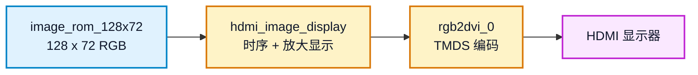
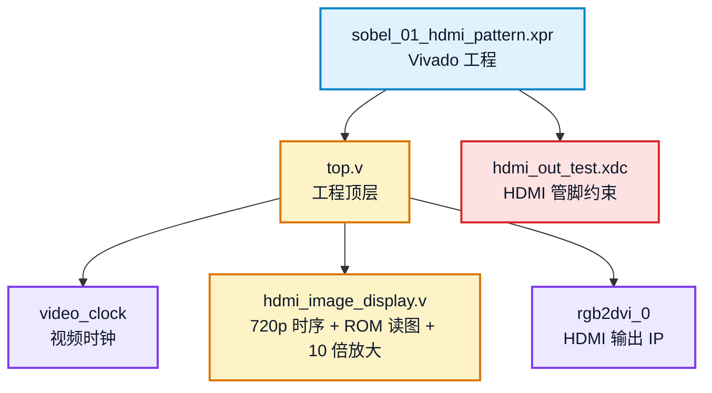
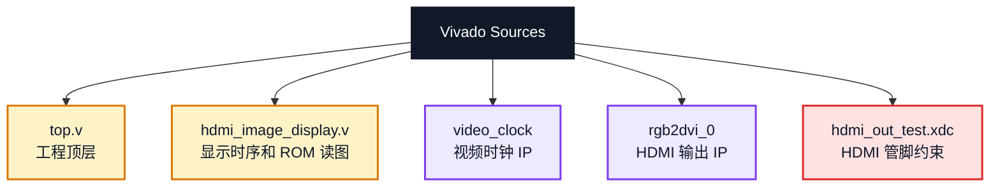

# sobel_01_hdmi_pattern 实验说明

本实验验证 ZYNQ7020 开发板的 HDMI 输出链路。工程把一张 `128 x 72` RGB 图片存放在 Verilog ROM 中，并放大 10 倍显示到 `1280 x 720` HDMI 画面。

## 1. 实验目标

完成本实验后，学生应能说明：

1. HDMI 720p 显示时序的基本参数。
2. `video_clock` 和 `rgb2dvi_0` IP 的作用。
3. `128 x 72` 图片如何映射到 `1280 x 720` 显示区域。
4. Verilog ROM 中 `24'hRRGGBB` 像素数据的含义。

## 2. 数据流



显示关系：

```text
输入图片: 128 x 72
HDMI 输出: 1280 x 720
缩放倍数: 10 x 10
```

## 3. 主要文件



上一级目录中的 `../hdmi_common` 是 Sobel 系列工程共用的 HDMI 基础依赖目录，不能删除。删除后重新打开工程或重新生成 IP 时可能出现 `video_clock`、`rgb2dvi_0` 或 HDMI 约束路径缺失。

## 4. 实验步骤

### 4.1 打开 Vivado 工程

打开工程：

```text
D:\Github\FPGA-course\zynq7020-image-processing\sobel_01_hdmi_pattern\sobel_01_hdmi_pattern.xpr
```

确认 Sources 中包含：



### 4.2 检查顶层模块

确认 Vivado 顶层为：

```text
top
```

如果顶层不正确，在 Sources 中右键 `top.v`，选择 `Set as Top`。

### 4.3 观察显示参数

打开 `hdmi_image_display.v`，重点查看：

```text
H_ACTIVE = 1280
V_ACTIVE = 720
IMG_WIDTH = 128
IMG_HEIGHT = 72
SCALE_X = H_ACTIVE / IMG_WIDTH
SCALE_Y = V_ACTIVE / IMG_HEIGHT
```

报告中应能说明 `SCALE_X = 10`、`SCALE_Y = 10` 的含义。

### 4.4 综合、实现和生成 bitstream

在 Vivado 中依次执行：

```text
Run Synthesis
Run Implementation
Generate Bitstream
```

生成 bitstream 后，查看是否有关键 DRC 错误。如果只有普通 warning，可以先记录后继续上板。

### 4.5 下载到开发板

连接开发板、HDMI 显示器和 JTAG，执行：

```text
Open Hardware Manager
Open Target
Program Device
```

选择本工程生成的 `top.bit`。

### 4.6 记录实验现象

预期现象：

```text
HDMI 显示器识别到 1280x720 输入
屏幕显示 128x72 图片放大后的画面
```

需要保存：

1. HDMI 显示照片。
2. Vivado 综合或实现完成截图。
3. 资源利用率截图。
4. 时序结果截图。

## 5. 验收标准

基础实验验收时应能说明：

1. HDMI 显示链路正常工作。
2. `hdmi_image_display.v` 中行列计数器如何产生有效显示区域。
3. ROM 地址如何由 `image_x` 和 `image_y` 计算。
4. 图片为什么能从 `128 x 72` 放大到 `1280 x 720`。

## 6. 常见问题

### 6.1 HDMI 黑屏

检查：

```text
显示器是否切到正确 HDMI 输入
HDMI 线是否正常
是否已经 Program Device
top.v 是否为顶层
hdmi_out_test.xdc 是否启用
video_clock 和 rgb2dvi_0 是否存在
```

### 6.2 Vivado 提示 IP 缺失

不要删除 `../hdmi_common`。如果工程路径被移动，先确认工程仍能找到 `video_clock` 和 `rgb2dvi_0`。

### 6.3 显示器不识别信号

优先检查时钟 IP、HDMI 管脚约束和开发板 HDMI 接口。确认显示器支持 `1280 x 720` 输入。

## 7. 可选扩展

本实验的扩展只围绕 HDMI 显示位置、背景和固定图片数据，属于第一周基础扩展。学生至少完成 1 项，并把 HDMI 现象写入初步实验报告。

| 选题 | 修改范围 | 验收标准 |
| --- | --- | --- |
| 调整图片显示位置 | `hdmi_image_display.v` 中的坐标映射 | 图片能显示在左上、居中或指定区域，报告说明坐标计算方法 |
| 修改背景颜色 | `hdmi_image_display.v` 的非图片区域 RGB 输出 | HDMI 背景颜色发生变化，图片区域仍正常显示 |
| 更换固定图片 | `hdmi_image_display.v` 中的 `image_rom_128x72` 数据 | HDMI 显示新图片，报告说明 ROM 像素格式为 `24'hRRGGBB` |
| 增加简单边框 | `hdmi_image_display.v` 的有效显示区域判断 | 图片周围出现单色边框，且不影响图片内容 |

不建议在本实验中加入串口、PS 软件或 Sobel 运算。本实验重点是把 HDMI 时序、ROM 读地址和图像缩放关系讲清楚。
