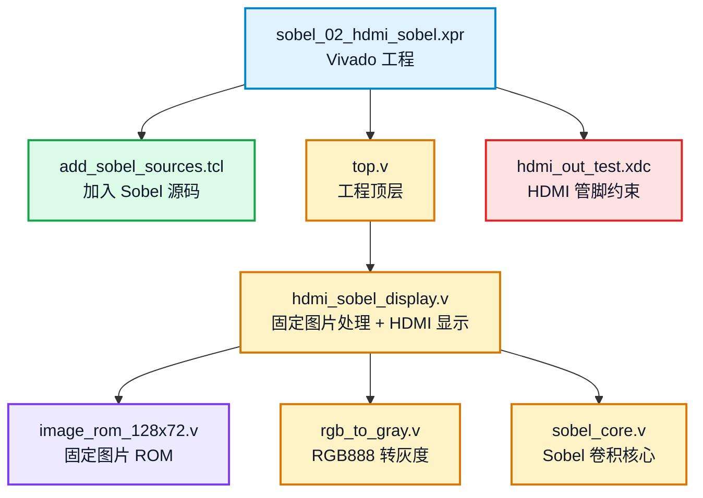
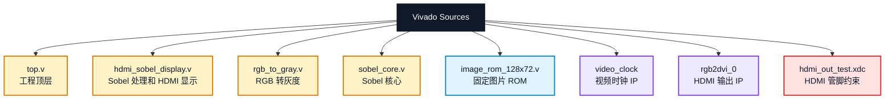
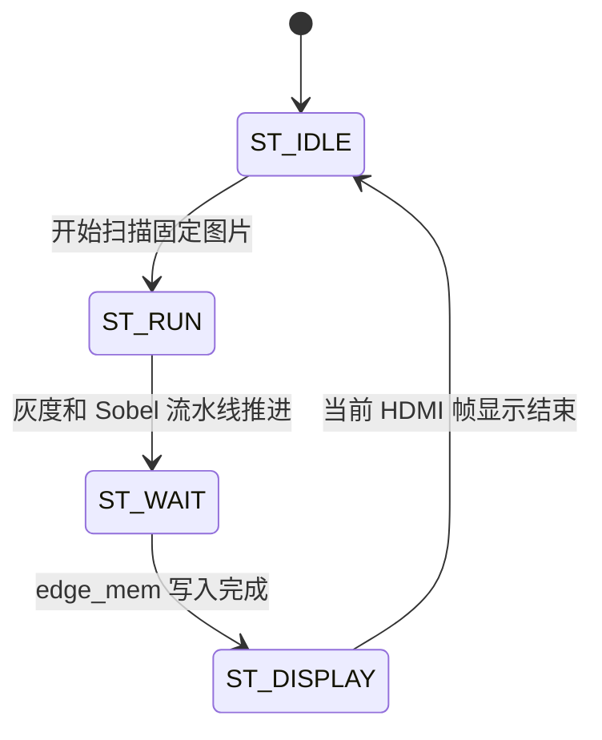
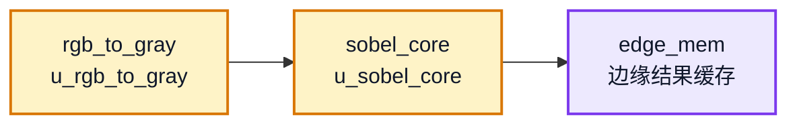

# sobel_02_hdmi_sobel 实验说明

本实验在 `sobel_01_hdmi_pattern` 的 HDMI 固定图片显示基础上，加入灰度转换和 Sobel 边缘检测。输入仍然来自 `128 x 72` 固定图片 ROM，PL 端完成图像处理后把边缘结果放大显示到 `1280 x 720` HDMI 画面。

## 1. 实验目标

完成本实验后，学生应能说明：

1. RGB888 图像如何转换为 8 bit 灰度。
2. Sobel 卷积如何输出边缘强度。
3. `edge_mem` 为什么用于保存一帧边缘结果。
4. 固定图片 Sobel 结果如何通过 HDMI 输出。

## 2. 数据流

```mermaid
flowchart LR
    rom["image_rom_128x72<br/>RGB888"] --> gray["rgb_to_gray<br/>灰度转换"]
    gray --> sobel["sobel_core<br/>Sobel 边缘强度"]
    sobel --> edge["edge_mem<br/>一帧边缘缓存"]
    edge --> display["hdmi_sobel_display<br/>放大显示"]
    display --> dvi["rgb2dvi_0<br/>TMDS 编码"]
    dvi --> hdmi["HDMI 显示器"]

    classDef data fill:#e0f2fe,stroke:#0284c7,color:#0f172a,stroke-width:2px;
    classDef alg fill:#fef3c7,stroke:#d97706,color:#0f172a,stroke-width:2px;
    classDef mem fill:#ede9fe,stroke:#7c3aed,color:#0f172a,stroke-width:2px;
    classDef out fill:#fae8ff,stroke:#c026d3,color:#0f172a,stroke-width:2px;
    class rom data;
    class gray,sobel,display,dvi alg;
    class edge mem;
    class hdmi out;
```



显示关系：

```text
输入图片: 128 x 72 RGB888
Sobel 输出: 128 x 72 8 bit edge
HDMI 输出: 1280 x 720
缩放倍数: 10 x 10
```

## 3. 主要文件



上一级目录中的 `../hdmi_common` 是 Sobel 系列工程共用的 HDMI 基础依赖目录，不能删除。

## 4. 实验步骤

### 4.1 打开 Vivado 工程

打开工程：

```text
D:\Github\FPGA-course\zynq7020-image-processing\sobel_02_hdmi_sobel\sobel_02_hdmi_sobel.xpr
```

确认 Sources 中包含：



如果 Sobel 相关源码没有加入工程，可在 Vivado Tcl Console 中执行：

```tcl
cd D:/Github/FPGA-course/zynq7020-image-processing/sobel_02_hdmi_sobel
source add_sobel_sources.tcl
```

### 4.2 检查顶层模块

确认 Vivado 顶层为：

```text
top
```

如果顶层不正确，在 Sources 中右键 `top.v`，选择 `Set as Top`。

### 4.3 观察关键代码

打开 `hdmi_sobel_display.v`，重点观察：



这几个状态完成固定图片扫描、灰度转换、Sobel 处理和 HDMI 显示。

继续观察：



报告中应说明 `edge_valid` 有效时如何把 `edge_data` 写入 `edge_mem`。

### 4.4 综合、实现和生成 bitstream

在 Vivado 中依次执行：

```text
Run Synthesis
Run Implementation
Generate Bitstream
```

生成 bitstream 后，查看资源利用率和时序结果。

### 4.5 下载到开发板

连接开发板、HDMI 显示器和 JTAG，执行：

```text
Open Hardware Manager
Open Target
Program Device
```

选择本工程生成的 `top.bit`。

### 4.6 记录实验现象

预期现象：

```text
HDMI 显示器输出固定图片的 Sobel 边缘检测结果
画面为黑白灰度边缘图
```

需要保存：

1. HDMI Sobel 显示照片。
2. Vivado 资源利用率截图。
3. Vivado 时序结果截图。
4. `hdmi_sobel_display.v` 中关键数据流说明。

## 5. 验收标准

基础实验验收时应能说明：

1. `rgb_to_gray` 的输入输出信号。
2. `sobel_core` 的输入输出信号。
3. `edge_mem` 的写入和读取时机。
4. Sobel 输出如何映射为 HDMI 的 `R/G/B` 三个通道。

## 6. 常见问题

### 6.1 HDMI 显示全黑

检查：

```text
sobel_done 是否最终置 1
edge_mem 是否有写入
rgb_to_gray.v 和 sobel_core.v 是否已加入工程
是否重新 Generate Bitstream
```

### 6.2 显示器无信号

先回到 `sobel_01_hdmi_pattern` 验证 HDMI 基础链路。如果 `sobel_01` 正常，再检查本工程的顶层和约束。

### 6.3 边缘效果不明显

Sobel 输出取决于输入图片内容。可以对比 `sobel_00_rtl_sim` 的输出图，判断是算法效果问题还是 HDMI 显示问题。

## 7. 可选扩展

本实验的扩展应控制在 1 个 Verilog 文件或 1 个参数实验内，属于第一周基础扩展。学生至少完成 1 项，并把修改说明和 HDMI 现象写入初步实验报告。

| 选题 | 修改范围 | 验收标准 |
| --- | --- | --- |
| 固定阈值二值化边缘显示 | `hdmi_sobel_display.v` 中 Sobel 输出到 RGB 的映射 | HDMI 显示黑白二值边缘图，报告给出所用阈值 |
| 边缘反色显示 | `hdmi_sobel_display.v` 的 RGB 输出映射 | 原黑底白边变成白底黑边，报告说明映射关系 |
| 彩色边缘标记 | `hdmi_sobel_display.v` 的 RGB 输出映射 | 边缘使用红色、绿色或蓝色突出显示 |
| Sobel 阈值参数对比 | `hdmi_sobel_display.v` 或 `sobel_core.v` 中的固定阈值常量 | 至少对比 3 个阈值下的 HDMI 显示效果 |

不建议在本实验中加入 UART、PS 软件、网络传输或 GUI 修改。本实验重点是固定图片条件下的 PL 图像处理链路。
